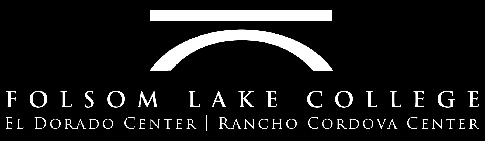
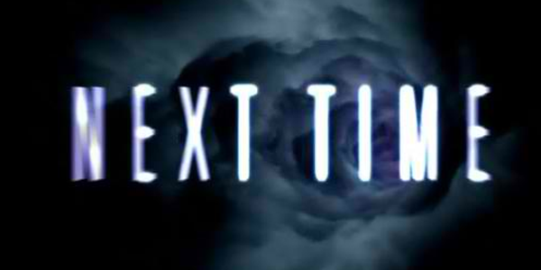

# CISP 400

Object Oriented Programming in C++

Dr. Fowler

{fig-align="center" width="76%" style="filter: invert(1); mix-blend-mode: multiply;"}

<!-- Slide 1 -->

# Agenda

**CISP 400 — Class Introduction**

:::: {.columns}
::: {.column width="50%"}
+ What’s C++?
+ What do I expect of you in this class?
+ What’s my job?
+ Where does this class fit at FLC?
:::

::: {.column width="50%"}
+ What tools will you need?
+ Why should you learn how to program?
:::
::::

<!-- Slide 2 -->









# What’s This Section About?

{fig-align="right" width="28%"}

<!-- Slide 39 -->

# Agenda

**CISP 400 — Class Introduction**

:::: {.columns}
::: {.column width="50%"}
+ What’s C++?
+ What do I expect of you in this class?
+ What’s my job?
+ Where does this class fit at FLC?
:::

::: {.column width="50%"}
+ What tools will you need?
+ Why should you learn how to program?
:::
::::

<!-- Slide 40 -->

---

<h1 style="display:none">Next Time</h1>

{fig-align="center" width="84%"}

<!-- Slide 41 -->

# Review Material From CISP 360

<!-- Slide 42 -->




# Emergency Plan

+ Evacuation Map

<!-- Slide 52 -->

# References

+ [GW17] Gaddis, Tony. *Starting out with C++. Early objects. Starting out with C++. Early objects.* Pearson, 2017.
+ [Me01] Meyers, Scott. *Effective STL: 50 Specific Ways to Improve Your Use of the Standard Template Library.* Addison-Wesley Professional, 2001.

<!-- Slide 53 -->
