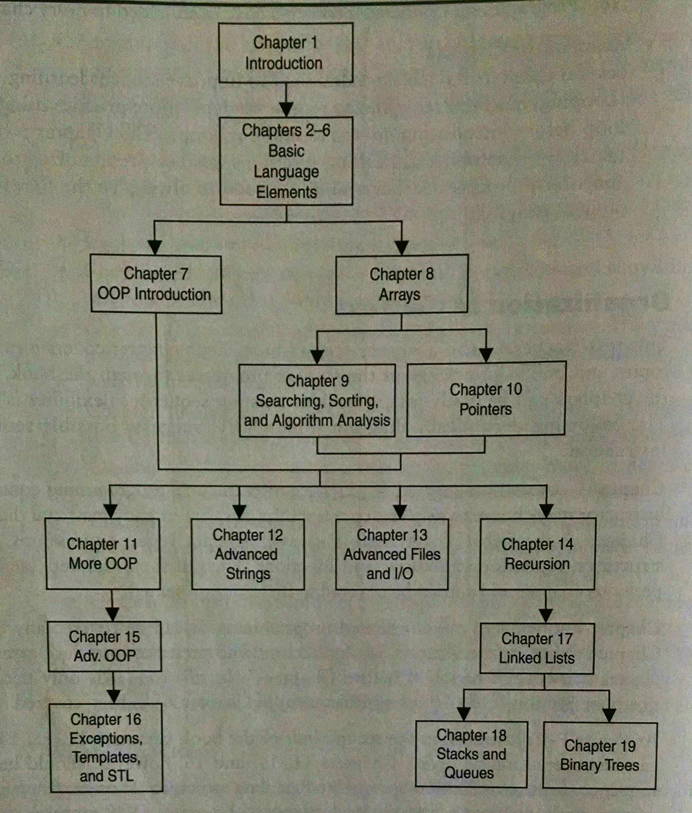

<!-- Topic 1: Course Overview -->
<!-- Slides 3–6 -->

# Goal of This Class

<!-- Slide 3 -->

## Class Goal

+ Continue to broaden your C++ knowledge

::: notes
Slides 3–6
:::

<!-- Slide 4 -->

---

## What Will the Class Cover?

<!-- Slide 5 -->

---

## Where’s This Fit in the Course? {.smaller}

{fig-align="center" width="58%"}

<!-- Slide 6 -->
