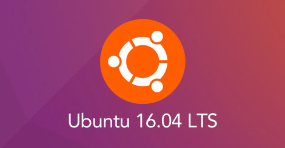
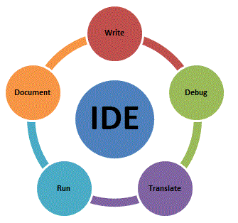

<!-- Topic 2: Toolset -->
<!-- Slides 7–16 -->

# Toolset

What you will need.

<!-- Slide 7 -->

## Operating System

:::: {.columns}
::: {.column width="50%"}
+ [ubuntu.org](https://ubuntu.org)
+ Free download
+ Code MUST compile to this system.
:::

::: {.column width="50%"}
{fig-align="center" width="88%"}
:::
::::

::: notes
Slides 7–16
:::

<!-- Slide 8 -->

---

## Running Ubuntu

+ C++ compiler websites
+ Install at home on computer

<!-- Slide 9 -->

---

## Windows Visual Studio Will NOT Compile on Ubuntu.

<!-- Slide 10 -->

---

## Programmer’s Editors

+ NOT Notepad!
+ **NOT Word**
+ VIM, EMACS
+ Atom, Sublime Text, Notepad++

<!-- Slide 11 -->

---

## Integrated Development Environment (IDE) {.smaller}

:::: {.columns}
::: {.column width="48%"}
+ Programmer’s editor on steroids.
+ Does all sorts of stuff at the click of a button.
+ Can be very efficient.
:::

::: {.column width="52%"}
{fig-align="center" width="72%"}
:::
::::

<!-- Slide 12 -->

---

## Integrated Development Environment (IDE) {.smaller}

:::: {.columns}
::: {.column width="46%"}
+ Overkill
+ Huge learning curve
+ Will not make you more attractive to employers.
+ Makes you stupid.
:::

::: {.column width="54%"}
{fig-align="center" width="90%"}
:::
::::

<!-- Slide 13 -->

---

<h2 style="display:none">IDE and Online Tool Visuals</h2>

:::: {.columns}
::: {.column width="50%"}
{fig-align="center" width="96%"}
:::

::: {.column width="50%"}
{fig-align="center" width="48%"}

{fig-align="center" width="65%"}
:::
::::

<!-- Slide 14 -->

---

## Online Coding Environments

+ Hard to tell if the problem is with your code or the site.
+ Make sure you have a code file, not an HTML file.

<!-- Slide 15 -->

---

## Online IDE

:::: {.columns}
::: {.column width="45%"}
+ Know what you are doing.
:::

::: {.column width="55%"}
{fig-align="center" width="82%"}
:::
::::

<!-- Slide 16 -->
