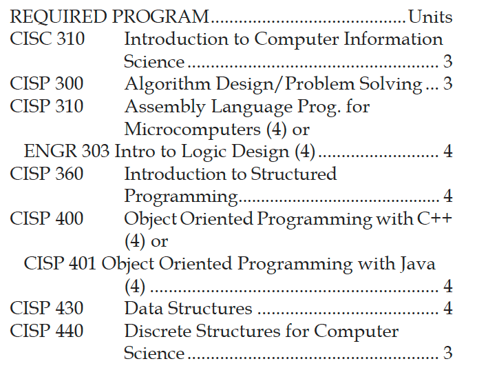
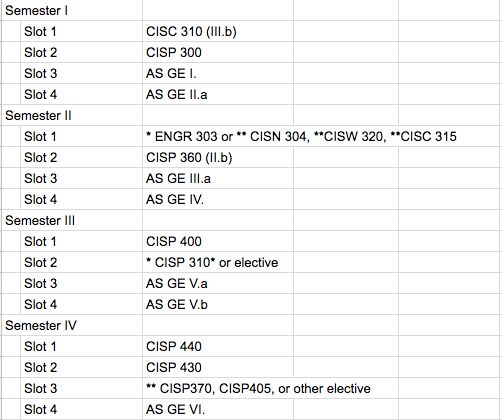
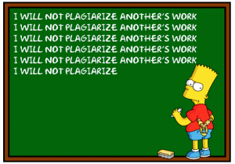

<!-- Topic 6: Course Placement at FLC -->
<!-- Slides 28–34 -->

# Where This Class Fits at FLC

<!-- Slide 28 -->

## CIS AS Degree {.smaller}

:::: {.columns}
::: {.column width="28%"}
+ Gateway
+ CISP 400
:::

::: {.column width="72%"}
{fig-align="center" width="96%"}
:::
::::

::: notes
Slides 28–34
:::

<!-- Slide 29 -->

---

## CIS AS Degree {.smaller}

{fig-align="center" width="64%"}

<!-- Slide 30 -->

---

## Common Questions

<!-- Slide 31 -->

---

<h2 style="display:none">Common Questions List</h2>

+ Does this class have a lab on campus?
+ Can I use a previous edition of the textbook?
+ What happens if I miss 4 classes?
+ What happens if I’m over 30 minutes late to class?
+ Is it OK to use the files the tutoring center gave me for my homework?

<!-- Slide 32 -->

---

## You Are Responsible for Your Code {.smaller}

{fig-align="center" width="36%"}

<!-- Slide 33 -->

---

## FLC++

+ No experience necessary!
+ Get involved!
+ Programming club

<!-- Slide 34 -->
