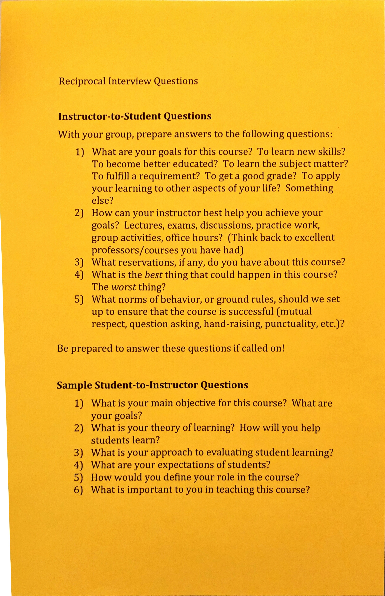

<!-- Topic 7: Reciprocal Interview -->
<!-- Slides 35–38 -->

# Reciprocal Interview

Exercise

<!-- Slide 35 -->

## Exercise Goals

+ Increase your comfort with this class.
+ Increase your comfort asking questions.

::: notes
Slides 35–38
:::

<!-- Slide 36 -->

---

## Procedure

+ Pair up
+ Come up with some answers to questions I may ask you.
+ Come up with some questions you want to ask me.

<!-- Slide 37 -->

---

<h2 style="display:none">Reciprocal Interview Questions</h2>

{fig-align="center" width="40%"}

<!-- Slide 38 -->
