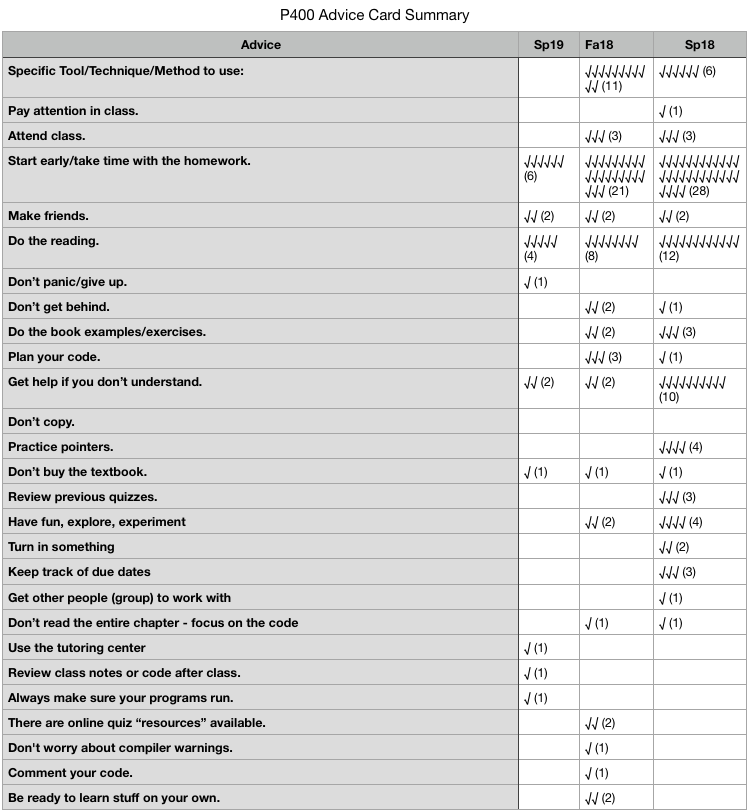

<!-- Topic 9: Advice Cards -->
<!-- Slides 47–51 -->

# Advice Cards

Exercise

<!-- Slide 47 -->

## Exercise Goals

+ Increase topic mastery

::: notes
Slides 47–51
:::

<!-- Slide 48 -->

---

## Advice Cards

You have advice from last semester’s students.

Take a minute to read it.

<!-- Slide 49 -->

---

<h2 style="display:none">P400 Advice Card Summary</h2>

{fig-align="center" width="72%"}

<!-- Slide 50 -->

---

## Debrief

What worked about this exercise?

What could be improved about this exercise?

<!-- Slide 51 -->
