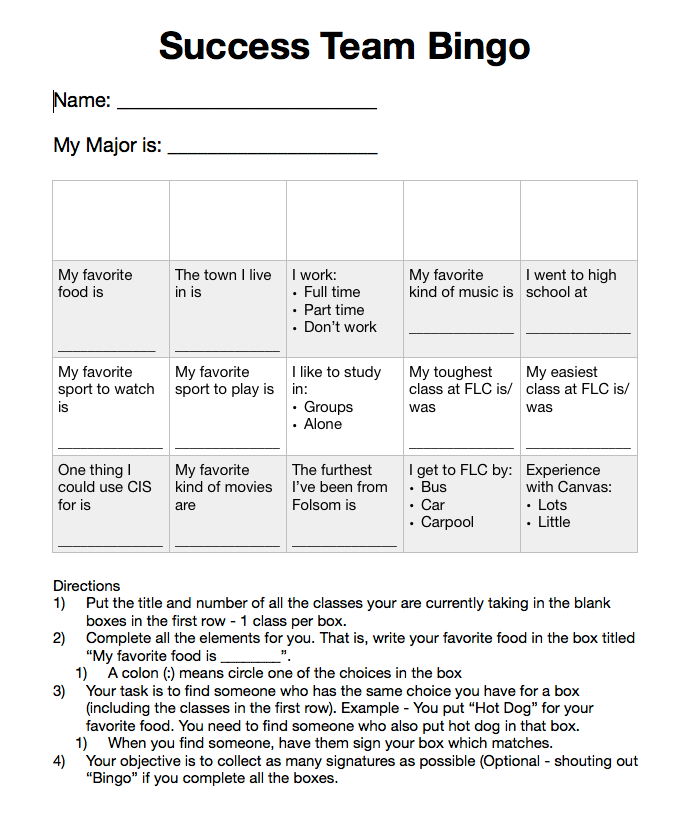

# CISP 400

**Object Oriented Programming in C++**

Dr. Fowler

Folsom Lake College

::: notes
Welcome students to the second lecture and the prerequisite-programming review.
:::

<!-- Slide 1 -->

# Agenda

- Review of CISP 360 Material

::: notes
The agenda reflects the authoritative source PDF.
:::

<!-- Slide 2 -->



# Programming Exercise

*Activity*

<!-- Slide 15 -->

## Exercise Goals

- Give you data to evaluate how well you recall CISP 360.

<!-- Slide 16 -->

---

## Programming Exercise {.smaller}

Write a C++ program that declares an array **Alpha** of 50 elements of type `double`. Initialize the array so that the first 25 elements are equal to the square of the index variable, and the last 25 elements are equal to three times the index variable. Output the array so that 10 elements per line are printed.

::: notes
The later source solutions use the cube of the index rather than three times the index. Preserve that inconsistency for the later completeness review.
:::

<!-- Slide 17 -->

# Programming Exercise Debriefing

*Exercise*

<!-- Slide 18 -->

## Programming Exercise {.smaller}

Write a C++ program that declares an array **Alpha** of 50 elements of type `double`. Initialize the array so that the first 25 elements are equal to the square of the index variable, and the last 25 elements are equal to three times the index variable. Output the array so that 10 elements per line are printed.

<!-- Slide 19 -->

---

<h2 style="display:none">Initial Array Solution</h2>

::: {style="font-size: 55%;"}
```{.cpp}

```
:::

<!-- Slide 20 -->

---

<h2 style="display:none">Program Output</h2>

:::: {.columns}
::: {.column width="58%"}
::: {style="font-size: 43%;"}
```{.cpp}

```
:::
:::

::: {.column width="42%"}
```text
calebfowler@ubuntu:~/Desktop$ ./a.out
0 1 4 9 16 25 36 49 64 81
100 121 144 169 196 225 256 289 324 361
400 441 484 529 576 15625 17576 19683 21952 24389
27000 29791 32768 35937 39304 42875 46656 50653 54872 59319
64000 68921 74088 79507 85184 91125 97336 103823 110592 117649
```
:::
::::

<!-- Slide 21 -->

---

## Programming Exercise {.smaller}

Write a C++ program that declares an array **Alpha** of 50 elements of type `double`. Initialize the array so that the first 25 elements are equal to the square of the index variable, and the last 25 elements are equal to three times the index variable. Output the array so that 10 elements per line are printed.

<!-- Slide 22 -->

---

## Let’s Look at This Problem as if It Were a Homework Assignment … {.smaller}

Write a C++ program that declares an array **Alpha** of 50 elements of type `double`.

- **Specification B1:** Initialize the first 25 elements to the square of the index variable.
- **Specification A1:** Initialize the last 25 elements to three times the index variable.
- **Specification C1:** Output the array with 10 elements per line.

<!-- Slide 23 -->

---

<h2 style="display:none">Solution Organized by Specifications</h2>

::: {style="font-size: 41%;"}
```{.cpp}

```
:::

<!-- Slide 24 -->

---

## Debrief

- What worked about this exercise?
- What could be improved about this exercise?
- Why did I ask you to do this?
- How does the activity connect with course objectives and SLOs?
- How does the activity connect with course readings?

<!-- Slide 25 -->

# What’s This Section About?

{fig-alt="Red review stamp" width="25%"}

<!-- Slide 26 -->

# Agenda

- Review of CISP 360 Material

<!-- Slide 27 -->

---

{fig-alt="Next Time transition" width="90%"}

<!-- Slide 28 -->

# Agenda: Ch 10 - Pointers {.smaller}

::: {.columns}
::: {.column width="50%"}
- 10.1 Pointers and the Address Operator
- 10.2 Pointer Variables
- 10.3 The Relationship between Arrays and Pointers
- 10.4 Pointer Arithmetic
- 10.5 Initializing Pointers
- 10.6 Comparing Pointers
- 10.7 Pointers as Function Parameters
:::

::: {.column width="50%"}
- 10.8 Pointers to Constants and Constant Pointers
- 10.9 Dynamic Memory Allocation
- 10.10 Returning Pointers from Functions
- 10.11 Pointers to Class Objects and Structures
- 10.12 Selecting Members of Objects
- 10.13 Smart Pointers
:::
:::

::: notes
This is a Next Time preview only. Pointers are not a Day 2 inventory topic.
:::

<!-- Slide 29 -->

# Desk Check

*Exercise*

<!-- Slide 30 -->

## Exercise Goals

- Review code syntax.
- Check understanding of syntax.

<!-- Slide 31 -->

---

## Desk Check Exercise

- Pair up.
- Manually determine the output of the following code. **Do not type this in and execute it.**
- We will spend about 10 minutes on this, then go over it.

<!-- Slide 32 -->

---

<h2 style="display:none">What’s the Output?</h2>

::: {style="font-size: 58%;"}
```{.cpp}

```
:::

<!-- Slide 33 -->

---

<h2 style="display:none">What’s the Output?</h2>

::: {.columns}
::: {.column width="72%"}
::: {style="font-size: 50%;"}
```{.cpp}

```
:::
:::

::: {.column width="28%"}
**gcc version 4.6.3**

```text
0 2 6 12 1 2 7 11
```
:::
:::

<!-- Slide 34 -->



# Success Team Bingo

*Activity*

<!-- Slide 37 -->

## Exercise Goals

- Get to know your peers a bit better.
- Practice socializing.

<!-- Slide 38 -->

---

{fig-alt="Success Team Bingo worksheet and directions" width="54%"}

<!-- Slide 39 -->

---

## Debrief

- What worked about this exercise?
- What could be improved about this exercise?
- Why did I ask you to do this?
- How does the activity connect with course objectives and SLOs?
- How does the activity connect with course readings?

<!-- Slide 40 -->

# References

- [GW17] Gaddis, Tony. *Starting out with C++. Early objects. Starting out with C++. Early objects.* Pearson, 2017.
- [Me01] Meyers, Scott. *Effective STL: 50 Specific Ways to Improve Your Use of the Standard Template Library.* Addison-Wesley Professional, 2001.

::: notes
The duplicated Gaddis title appears in the authoritative source PDF and is preserved for later review.
:::

<!-- Slide 41 -->


