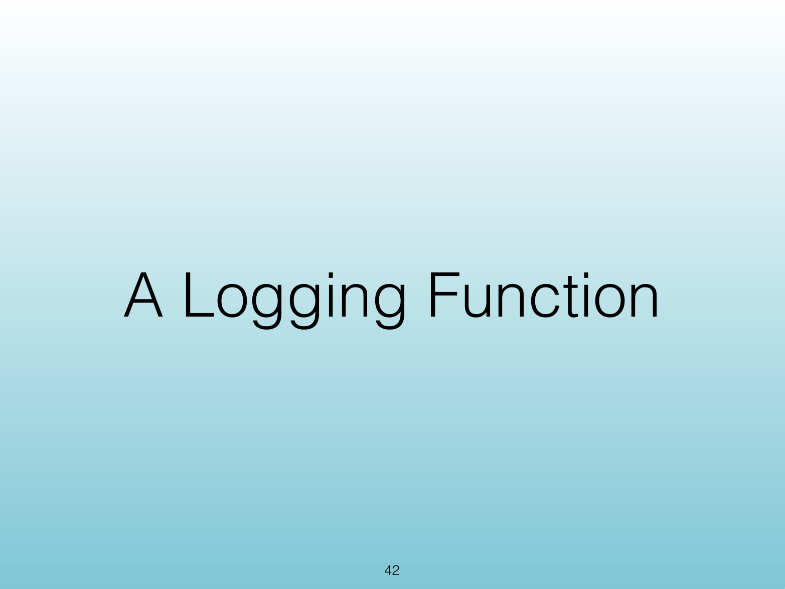
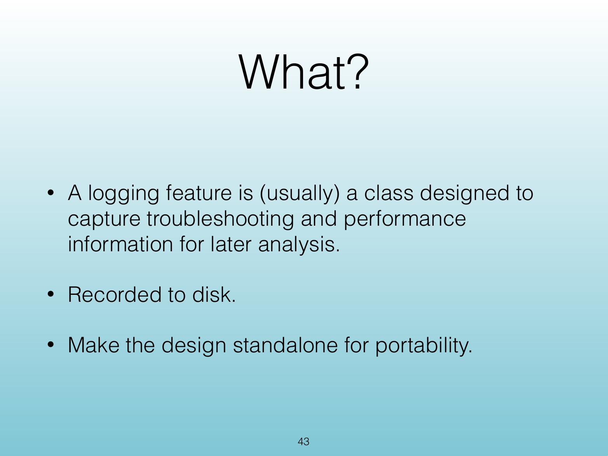
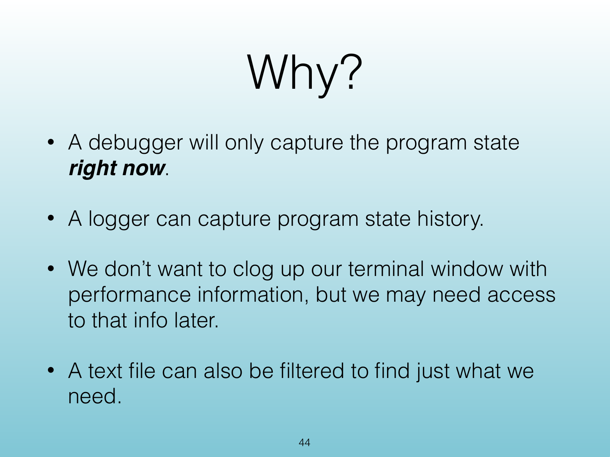
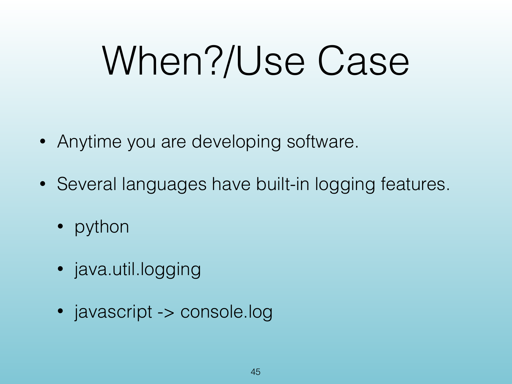
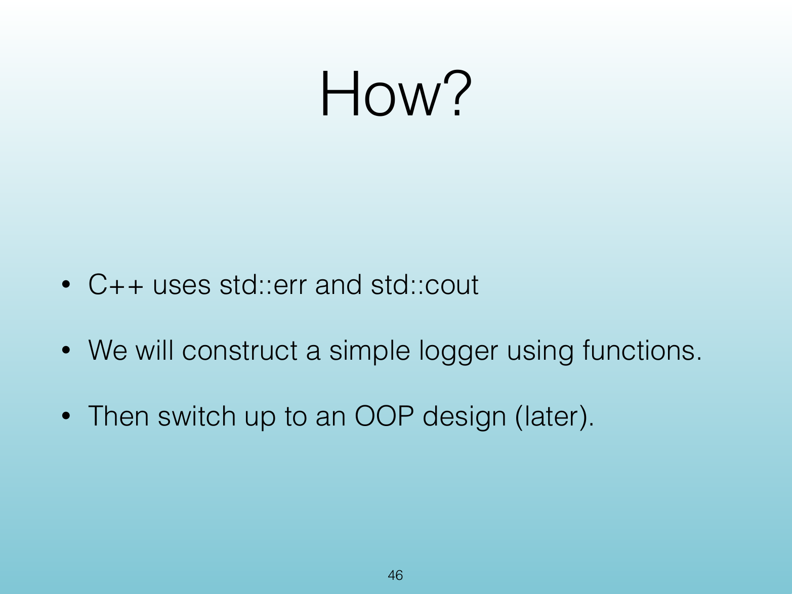
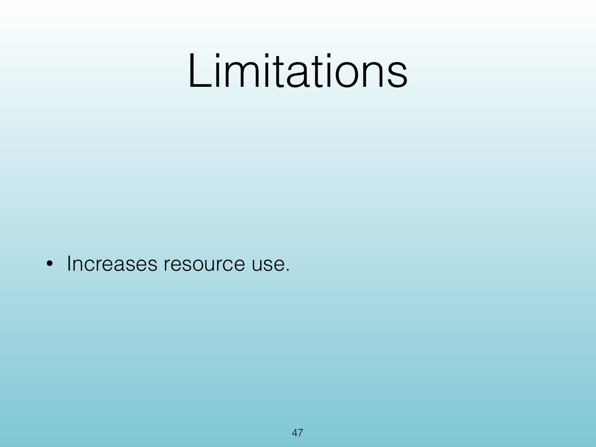
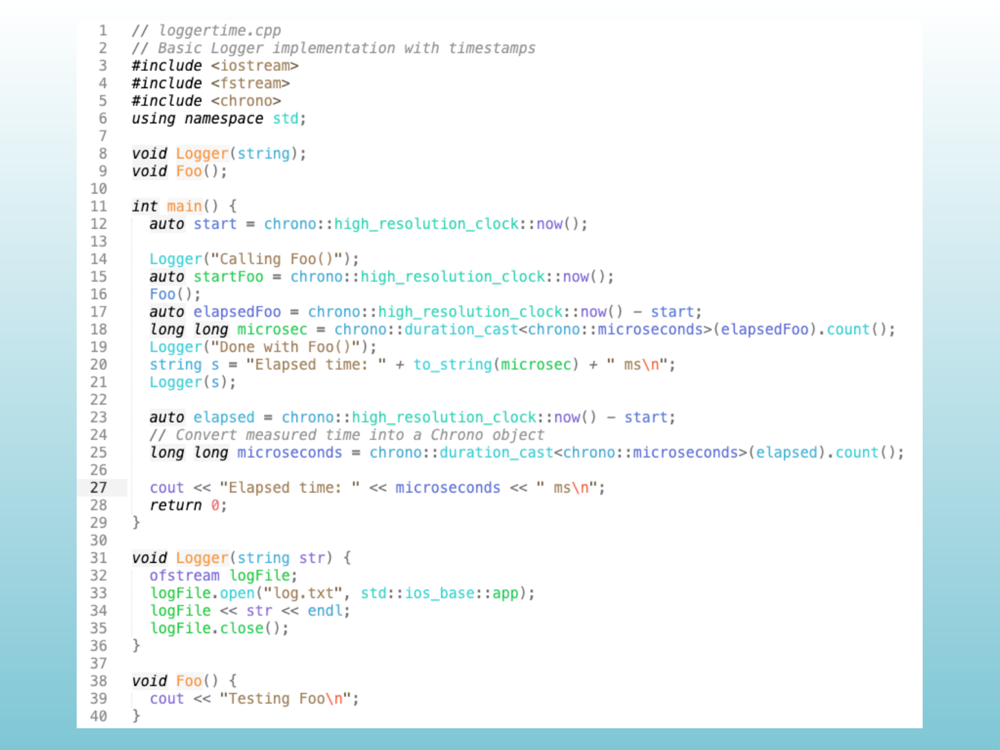

<!-- Topic: Logging Function -->
<!-- Slides 42–48 -->
# Logging Function

## A Logging Function

{width="100%"}

::: notes
Slides 42–48
:::

<!-- Slide 42 -->

---

## What?

{width="100%"}

::: notes

:::

<!-- Slide 43 -->

---

## Why?

{width="100%"}

::: notes

:::

<!-- Slide 44 -->

---

## When? / Use Case

{width="100%"}

::: notes

:::

<!-- Slide 45 -->

---

## How?

{width="100%"}

::: notes

:::

<!-- Slide 46 -->

---

## Limitations

{width="100%"}

::: notes

:::

<!-- Slide 47 -->

---

## <Untitled Slide 48>

{width="100%"}

::: notes

:::

<!-- Slide 48 -->
