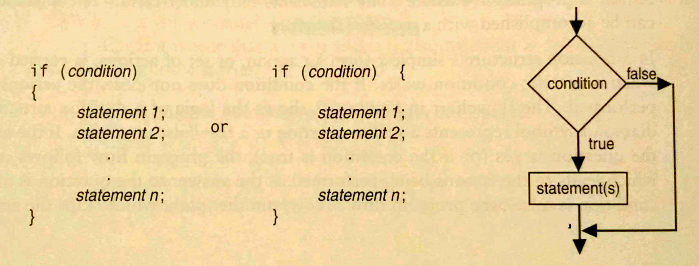
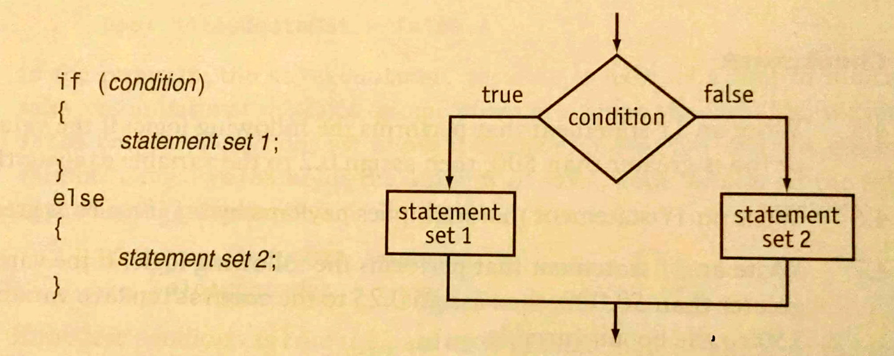
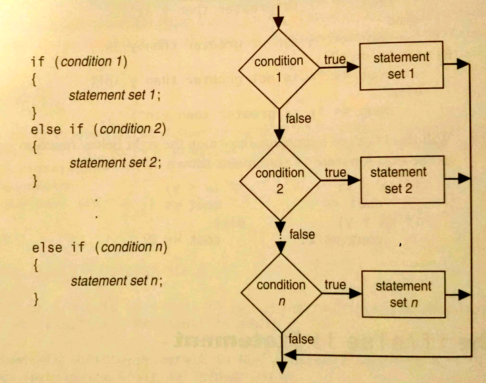
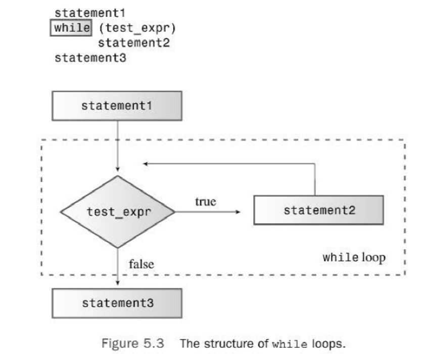
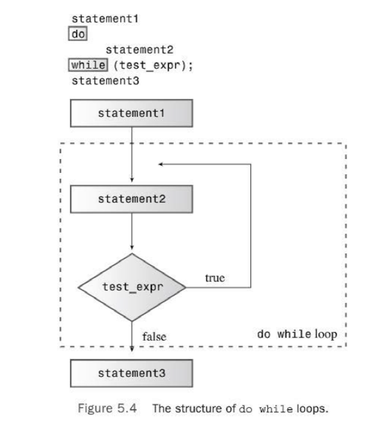
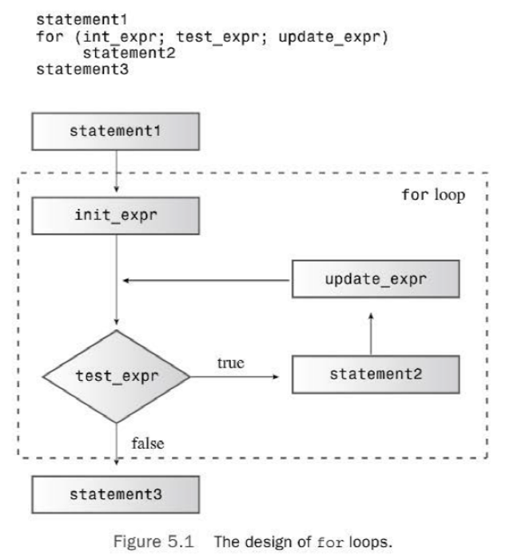

<!-- Topic 1: C++ Programming Review -->
<!-- Slides 3–14 -->

# Old Friends
<!-- Slide 3 -->

## Variables

::: notes
Slides 3–14
Variables are an old friend from CISP 360. Use this slide as a quick verbal recall check.
:::

<!-- Slide 4 -->

---

## 4.2 The `if` statement

::: notes
Transition from stored values to the decisions that act on those values.
:::

<!-- Slide 5 -->

---

## `if` statement

{fig-alt="The syntax and control flow of a one-way if statement" width="95%"}

::: notes
If the condition is true, the statement set runs. If it is false, execution skips the statement set.
:::

<!-- Slide 6 -->

---

## `if/else` statement

{fig-alt="The syntax and control flow of an if else statement" width="95%"}

::: notes
Exactly one of the two statement sets runs.
:::

<!-- Slide 7 -->

---

## `if/else if` statement

{fig-alt="The syntax and control flow of an if else if chain" width="78%"}

::: notes
Conditions are checked from top to bottom. The first true condition selects its statement set.
:::

<!-- Slide 8 -->

---

## Iteration

::: notes
Transition from choosing a path to repeating a path.
:::

<!-- Slide 9 -->

---

{fig-alt="The syntax and pre-test control flow of a while loop" width="72%"}

::: notes
The test occurs before the body, so the body can execute zero times.
:::

<!-- Slide 10 -->

---

{fig-alt="The syntax and post-test control flow of a do while loop" width="62%"}

::: notes
The body occurs before the test, so the body executes at least once.
:::

<!-- Slide 11 -->

---

{fig-alt="The initialization test body and update control flow of a for loop" width="62%"}

::: notes
The source image uses int_expr in its syntax line and init_expr in the flowchart. Preserve that source inconsistency for the later completeness review.
:::

<!-- Slide 12 -->

---

## Functions

::: notes
Functions are the final old friend in this prerequisite review.
:::

<!-- Slide 13 -->

---

<h2 style="display:none">Function Prototypes and Return Type</h2>

:::: {.columns}
::: {.column width="74%"}
::: {style="font-size: 43%;"}
```{.cpp code-line-numbers="8-9|24|34"}

```
:::
:::

::: {.column width="26%"}
**Function Prototypes**

- `double askPrice();`
- `double calcTax(double);`

**Return Type**

- `double` identifies the value sent back to the caller.
:::
::::

::: notes
The prototypes appear above main. The return type appears before each function name in both the prototype and definition.
:::

<!-- Slide 14 -->
