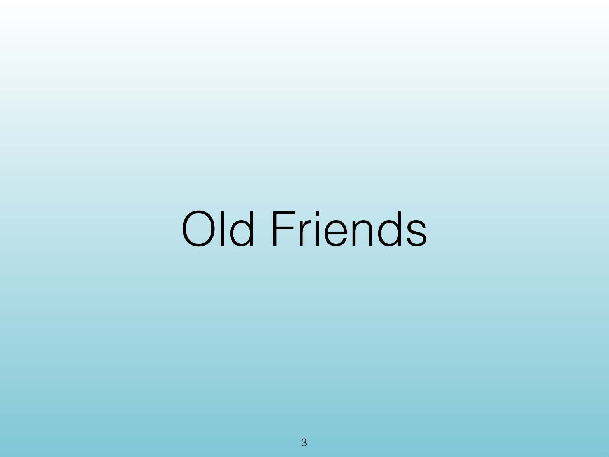
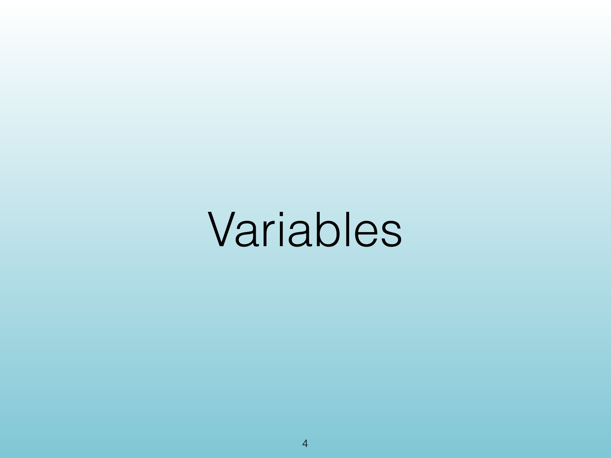
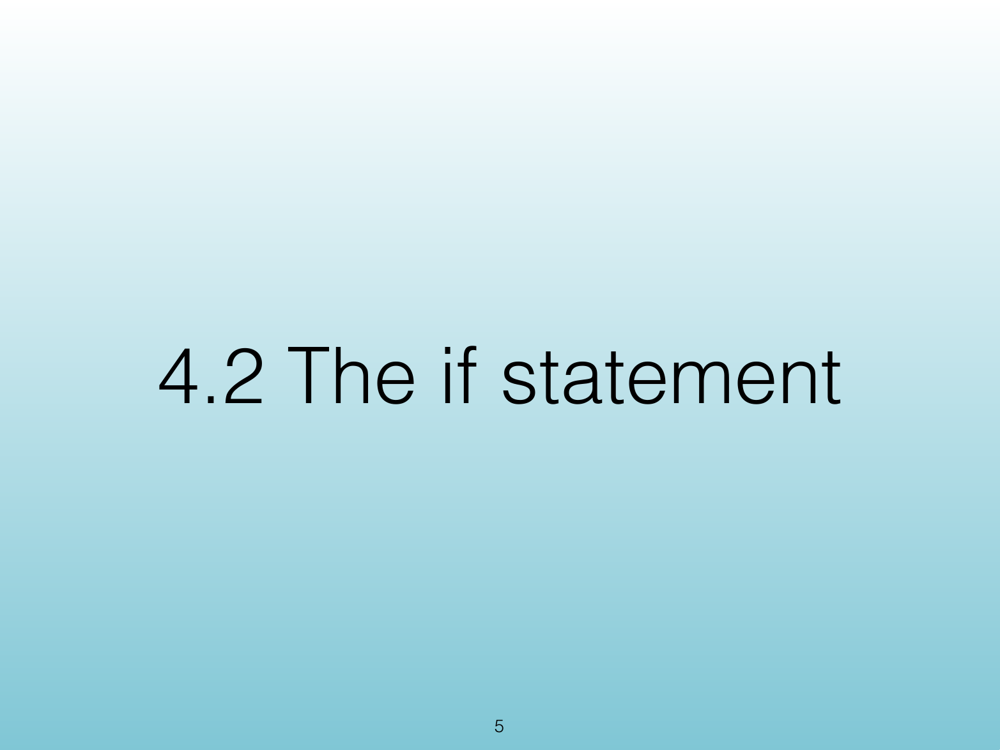
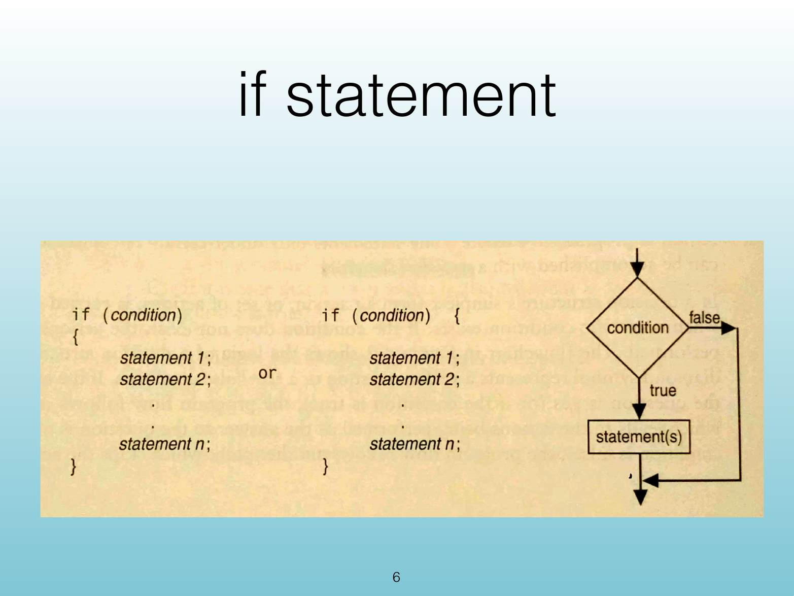
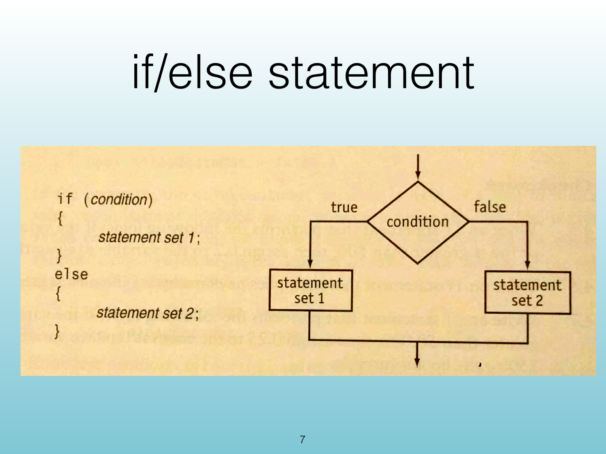
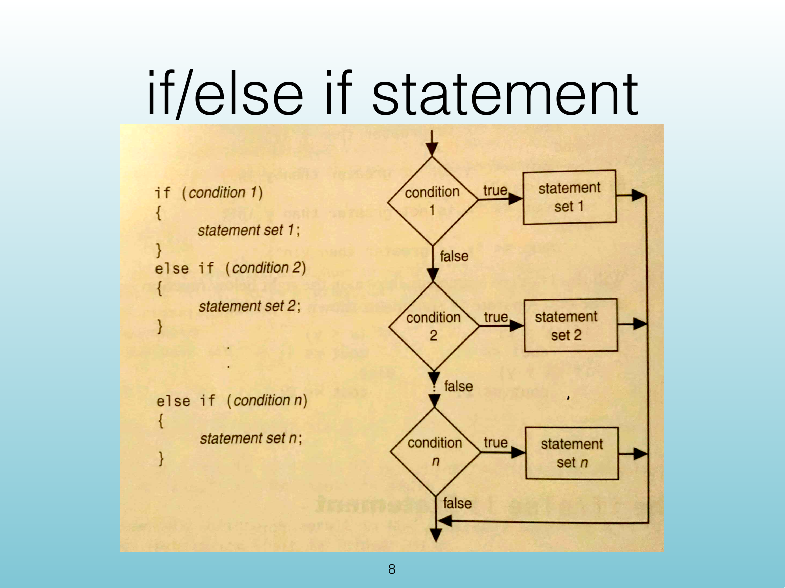

<!-- Topic: CISP 360 Review: Variables and Conditionals -->
<!-- Slides 3–8 -->
# CISP 360 Review: Variables and Conditionals

## Old Friends

{width="100%"}

::: notes
Slides 3–8
:::

<!-- Slide 3 -->

---

## Variables

{width="100%"}

::: notes

:::

<!-- Slide 4 -->

---

## 4.2 The if Statement

{width="100%"}

::: notes

:::

<!-- Slide 5 -->

---

## if Statement

{width="100%"}

::: notes

:::

<!-- Slide 6 -->

---

## if/else Statement

{width="100%"}

::: notes

:::

<!-- Slide 7 -->

---

## if/else if Statement

{width="100%"}

::: notes

:::

<!-- Slide 8 -->
