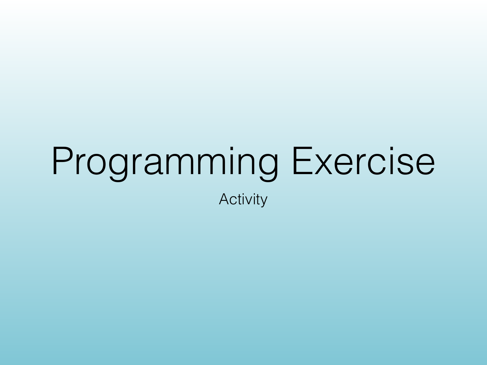
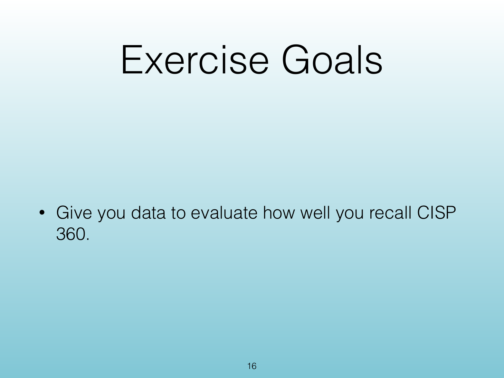
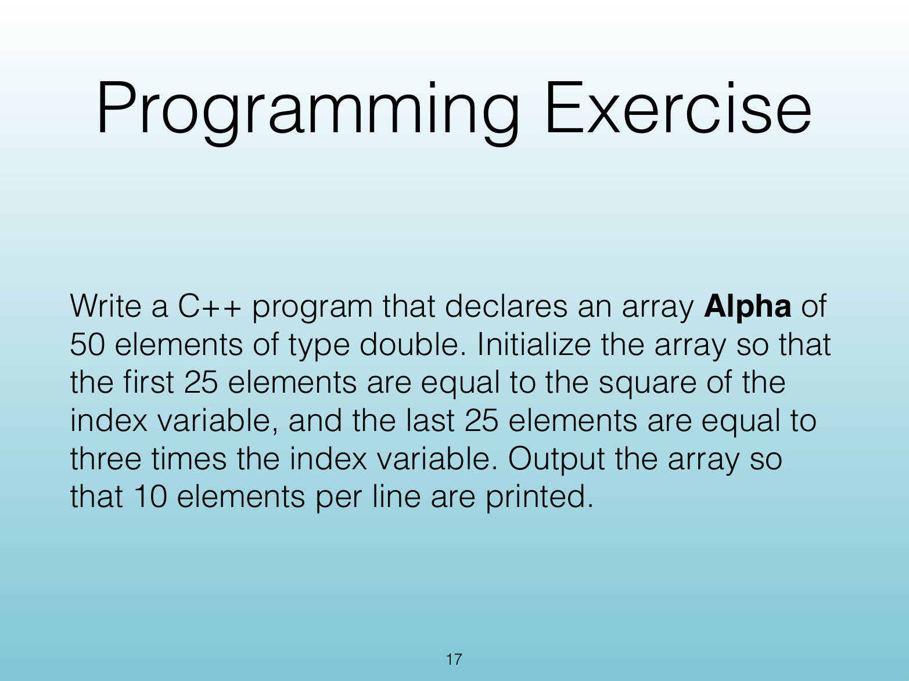
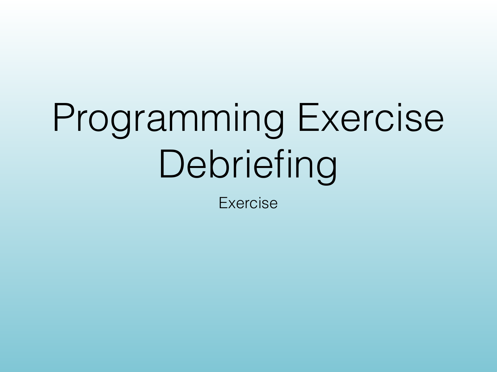
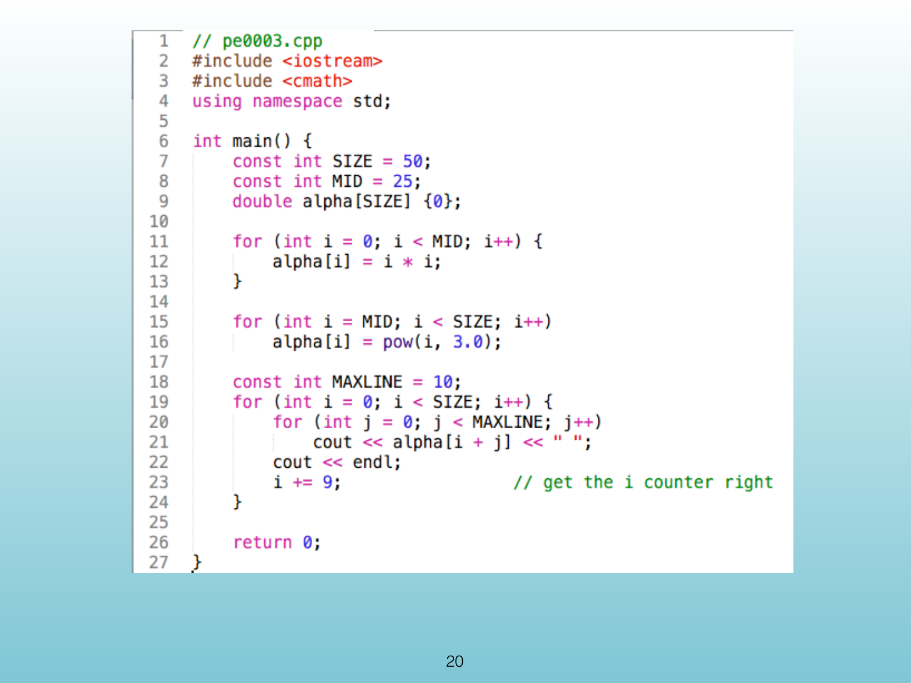
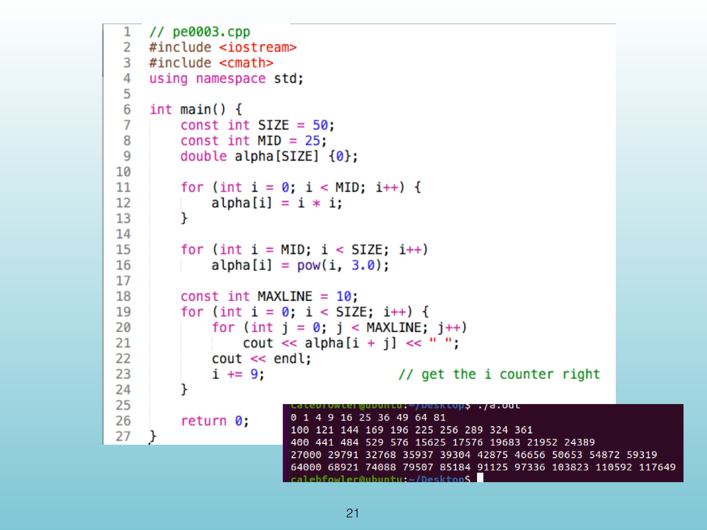
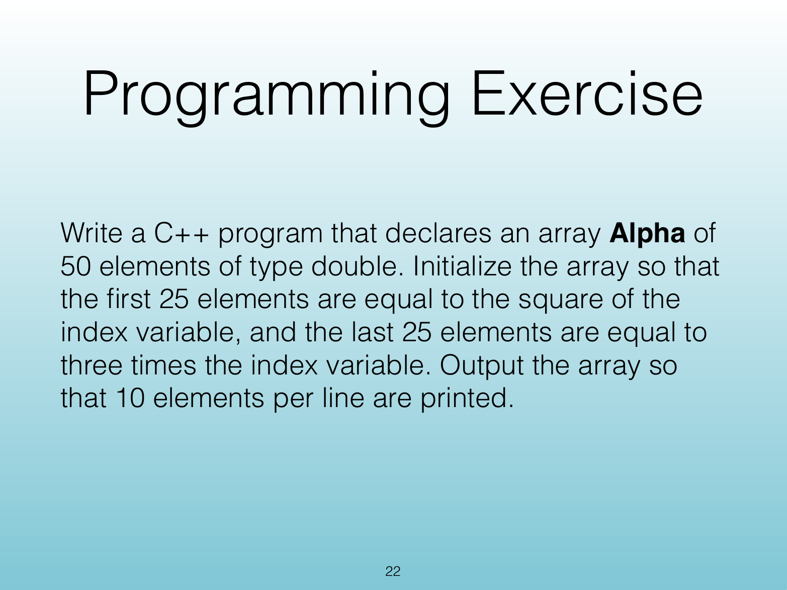
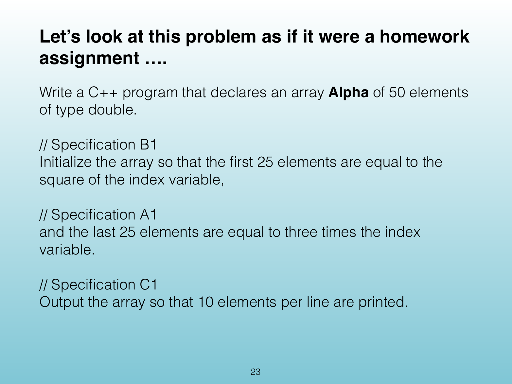
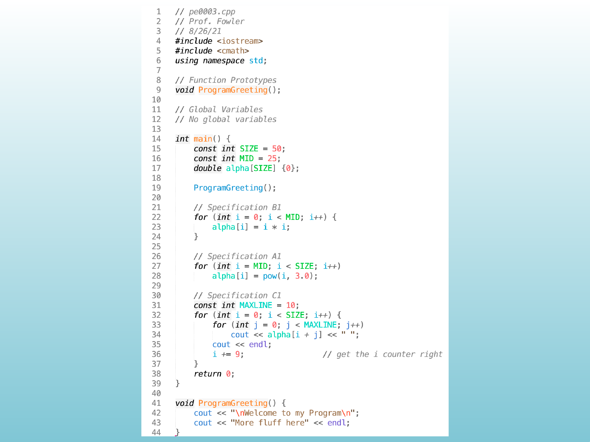
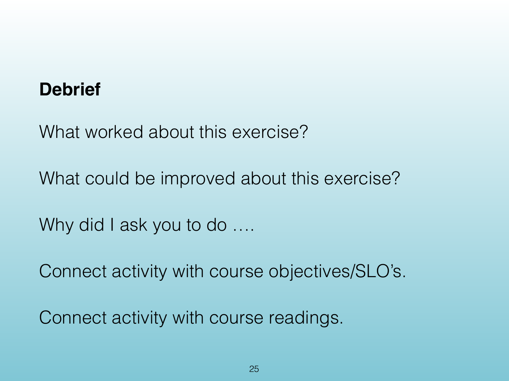

<!-- Topic: Programming Exercise -->
<!-- Slides 15–25 -->
# Programming Exercise

## Programming Exercise

{width="100%"}

::: notes
Slides 15–25
:::

<!-- Slide 15 -->

---

## Exercise Goals

{width="100%"}

::: notes

:::

<!-- Slide 16 -->

---

## Programming Exercise

{width="100%"}

::: notes

:::

<!-- Slide 17 -->

---

## Programming Exercise Debriefing

{width="100%"}

::: notes

:::

<!-- Slide 18 -->

---

## Programming Exercise

{width="100%"}

::: notes

:::

<!-- Slide 19 -->

---

## <Untitled Slide 20>

{width="100%"}

::: notes

:::

<!-- Slide 20 -->

---

## <Untitled Slide 21>

{width="100%"}

::: notes

:::

<!-- Slide 21 -->

---

## Programming Exercise

{width="100%"}

::: notes

:::

<!-- Slide 22 -->

---

## Homework-Style Specification

{width="100%"}

::: notes

:::

<!-- Slide 23 -->

---

## <Untitled Slide 24>

{width="100%"}

::: notes

:::

<!-- Slide 24 -->

---

## Debrief

{width="100%"}

::: notes

:::

<!-- Slide 25 -->
