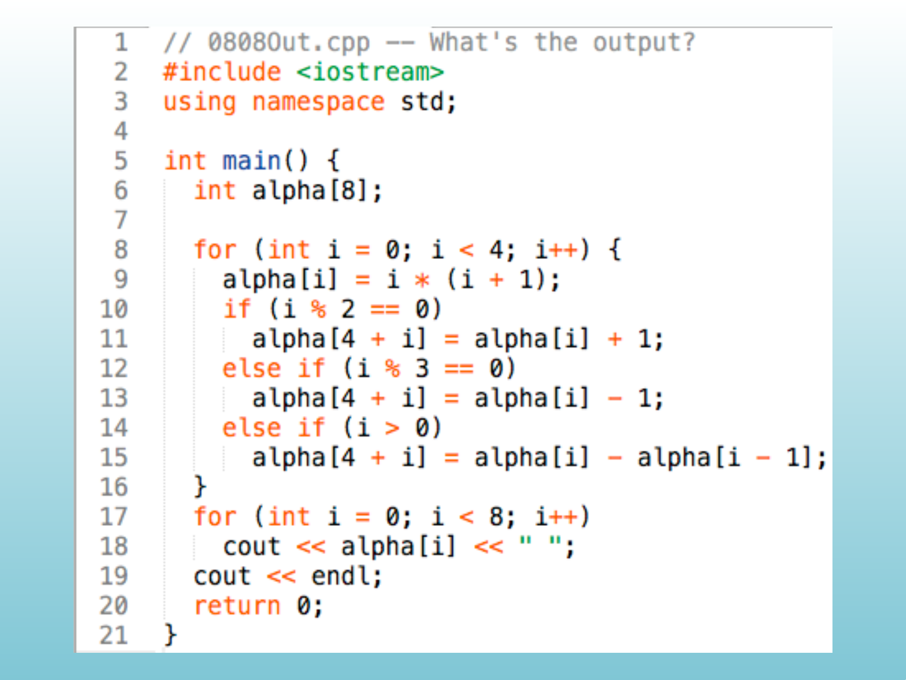
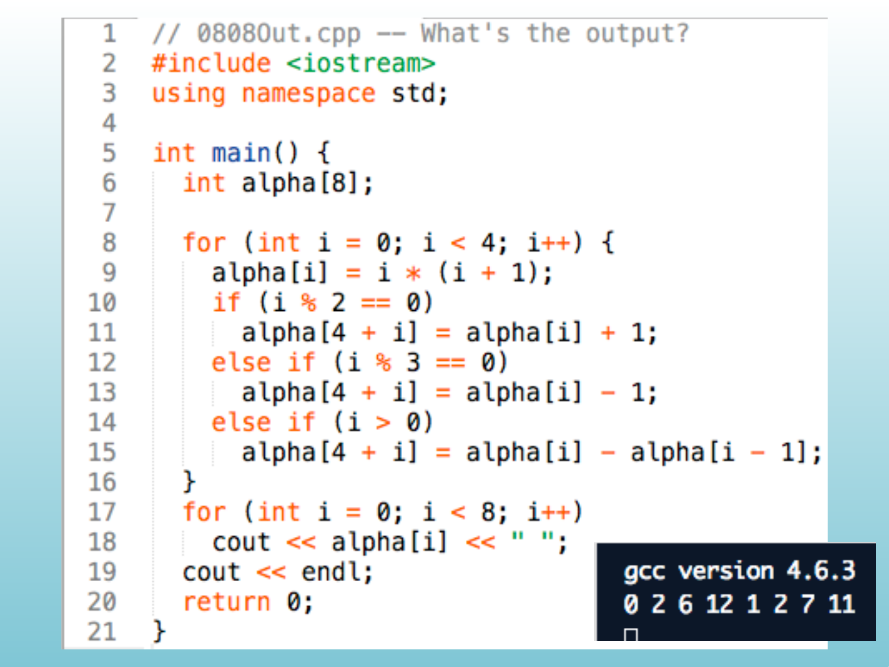
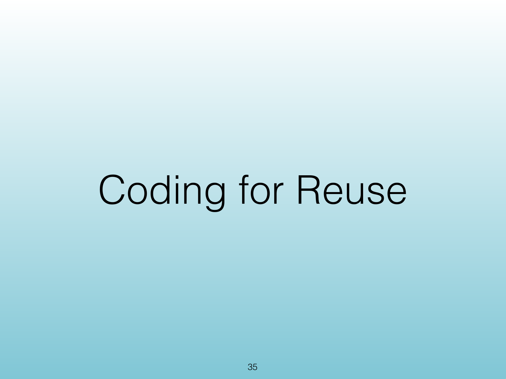
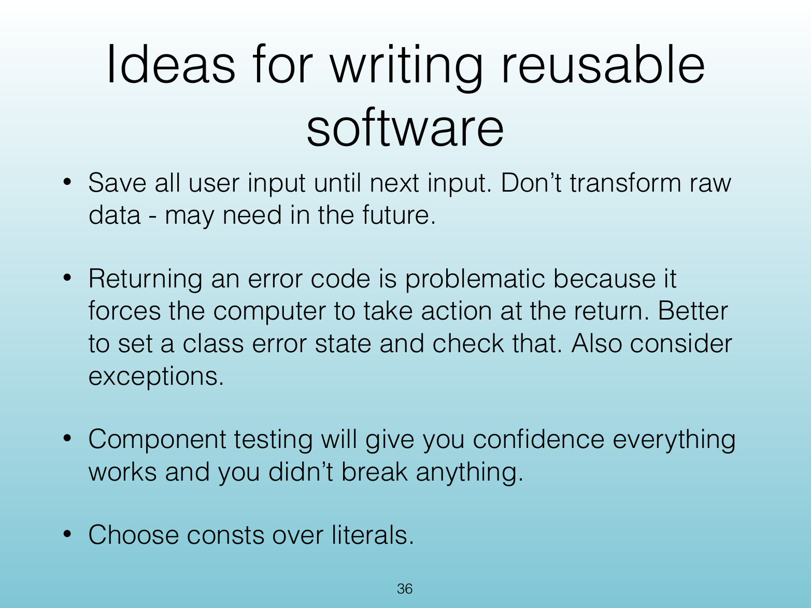

<!-- Topic: Coding for Reuse -->
<!-- Slides 33–36 -->
# Coding for Reuse

## <Untitled Slide 33>

{width="100%"}

::: notes
Slides 33–36
:::

<!-- Slide 33 -->

---

## Coding for Reuse

{width="100%"}

::: notes

:::

<!-- Slide 34 -->

---

## Ideas for Writing Reusable Software

{width="100%"}

::: notes

:::

<!-- Slide 35 -->

---

## Ideas for Writing Reusable Software

{width="100%"}

::: notes

:::

<!-- Slide 36 -->
