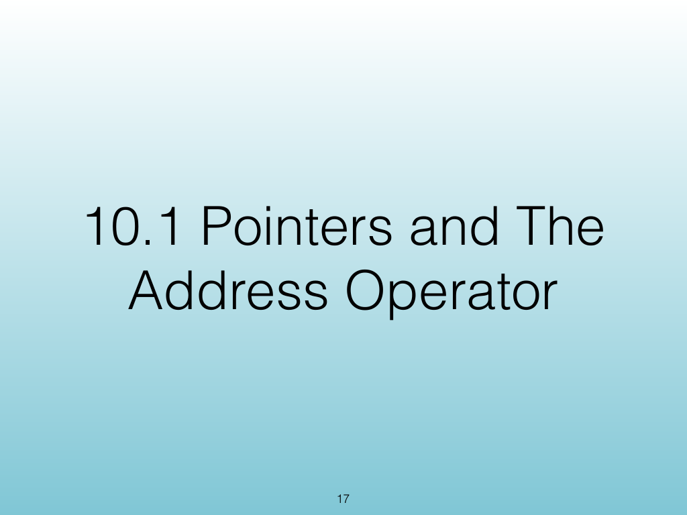
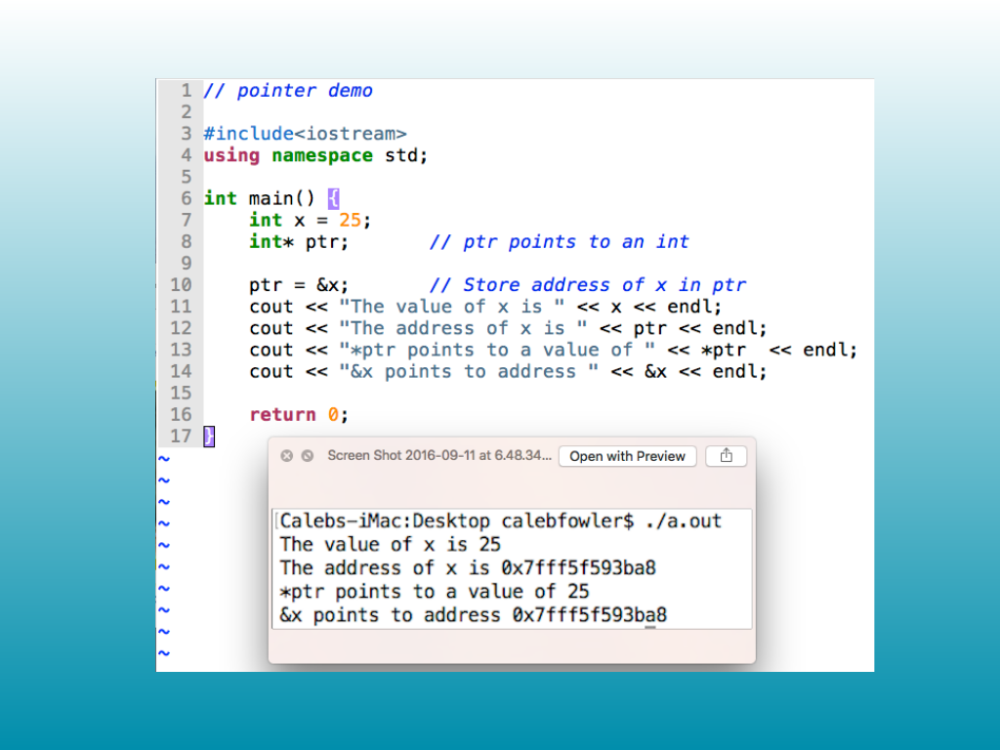
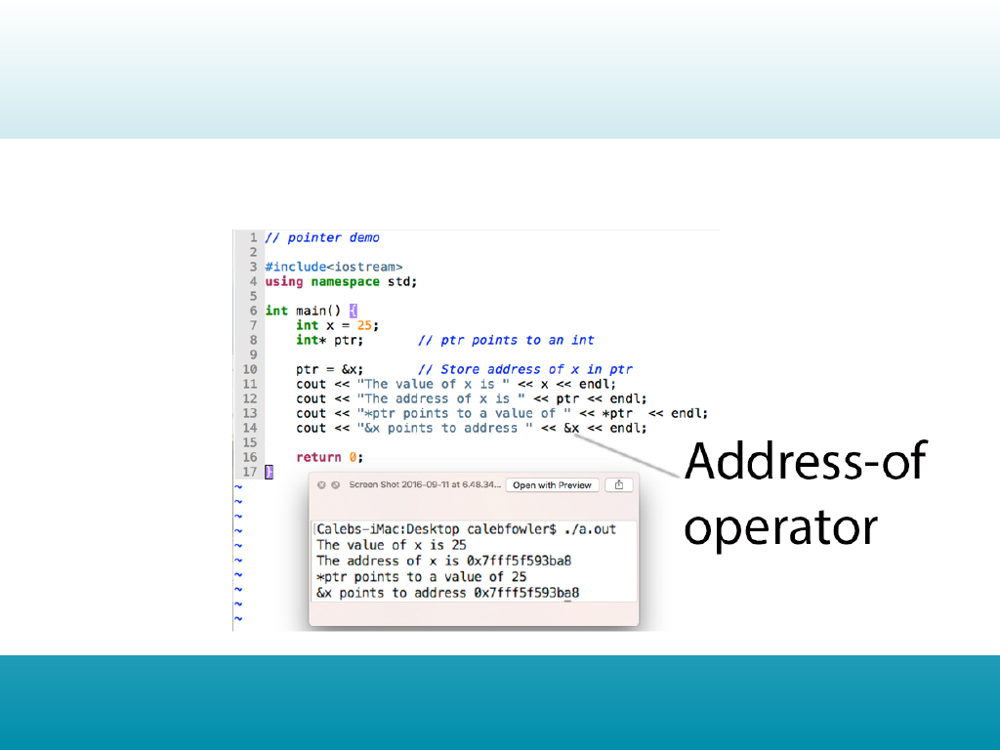

<!-- Topic: Pointers and the Address Operator -->
<!-- Slides 17–19 -->

# Pointers and the Address Operator

{width="100%" fig-alt="Pointers and the Address Operator"}

::: notes
Slides 17–19
Source slide 17 from the authoritative PDF.
:::

<!-- Slide 17 -->

---

## Source Slide 18

{width="100%" fig-alt="Source Slide 18"}

<!-- Slide 18 -->

---

## Source Slide 19

{width="100%" fig-alt="Source Slide 19"}

<!-- Slide 19 -->
