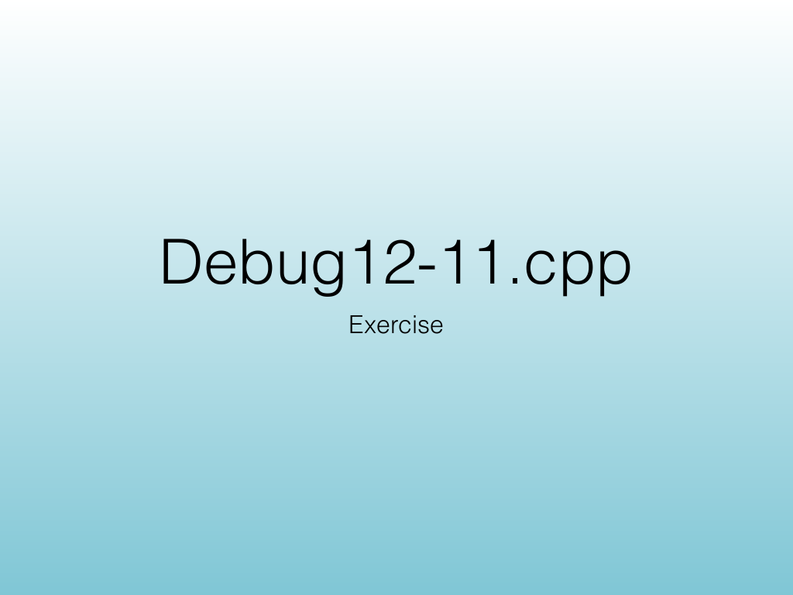
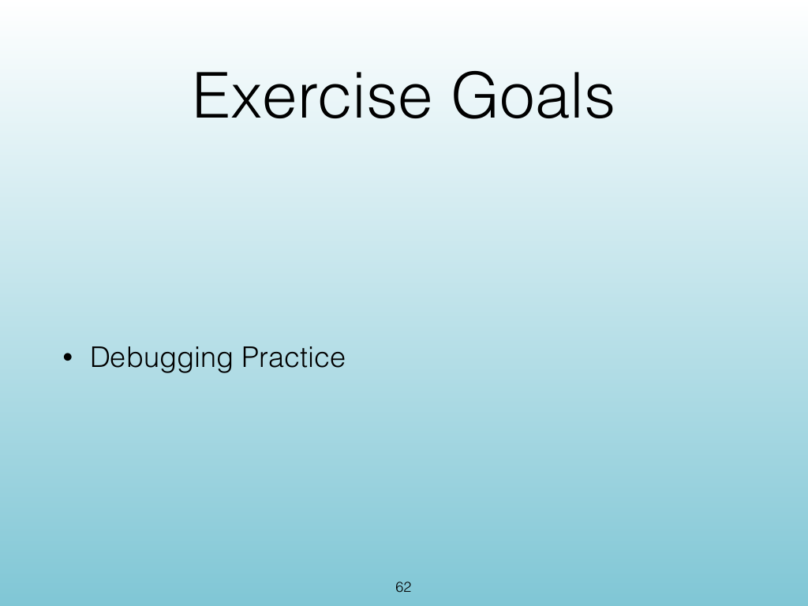
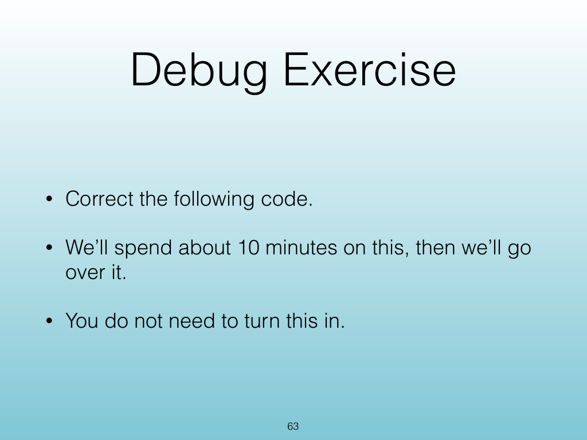
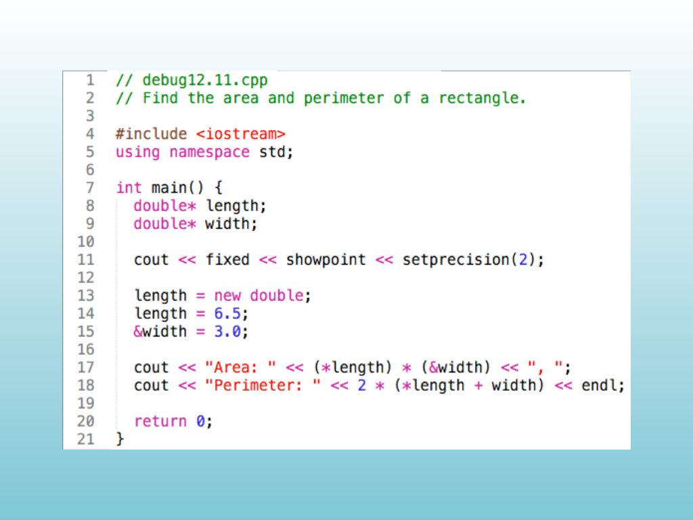
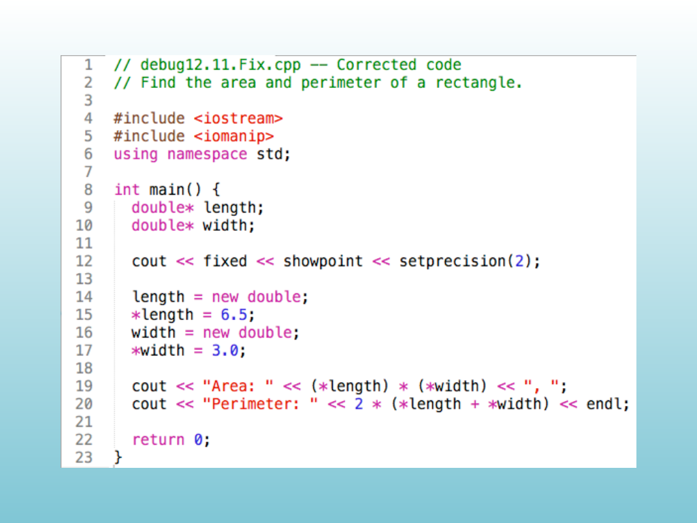

<!-- Topic: Debugging Exercise -->
<!-- Slides 60–65 -->

# Debugging Exercise

{width="100%" fig-alt="Debugging Exercise"}

::: notes
Slides 60–65
Source slide 60 from the authoritative PDF.
:::

<!-- Slide 60 -->

---

## Source Slide 61

{width="100%" fig-alt="Debug12-11.cpp"}

<!-- Slide 61 -->

---

## Source Slide 62

{width="100%" fig-alt="Exercise Goals"}

<!-- Slide 62 -->

---

## Source Slide 63

{width="100%" fig-alt="Debug Exercise"}

<!-- Slide 63 -->

---

## Source Slide 64

{width="100%" fig-alt="Source Slide 64"}

<!-- Slide 64 -->

---

## Source Slide 65

{width="100%" fig-alt="Source Slide 65"}

<!-- Slide 65 -->
