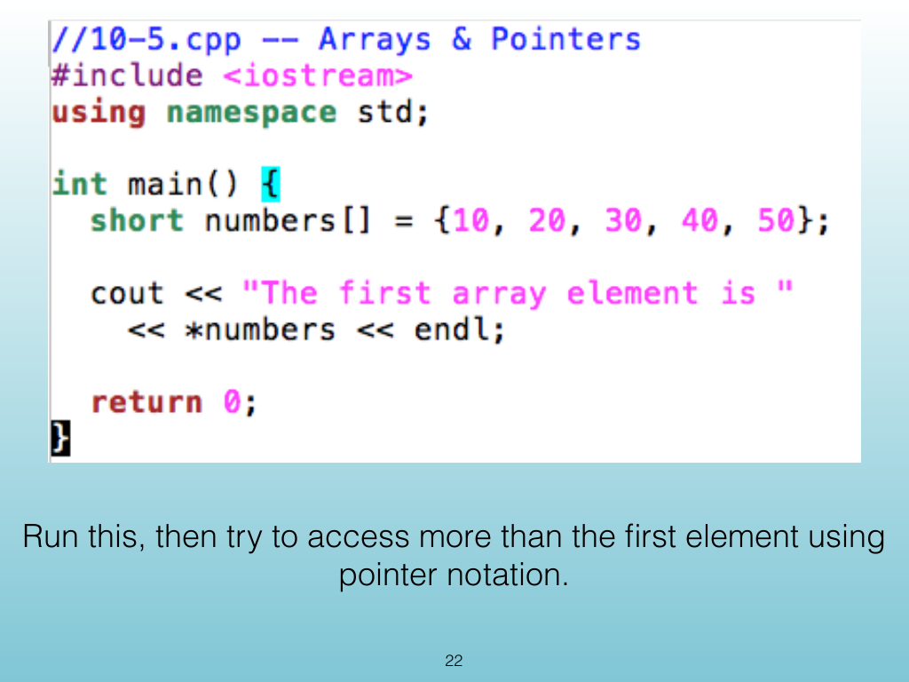
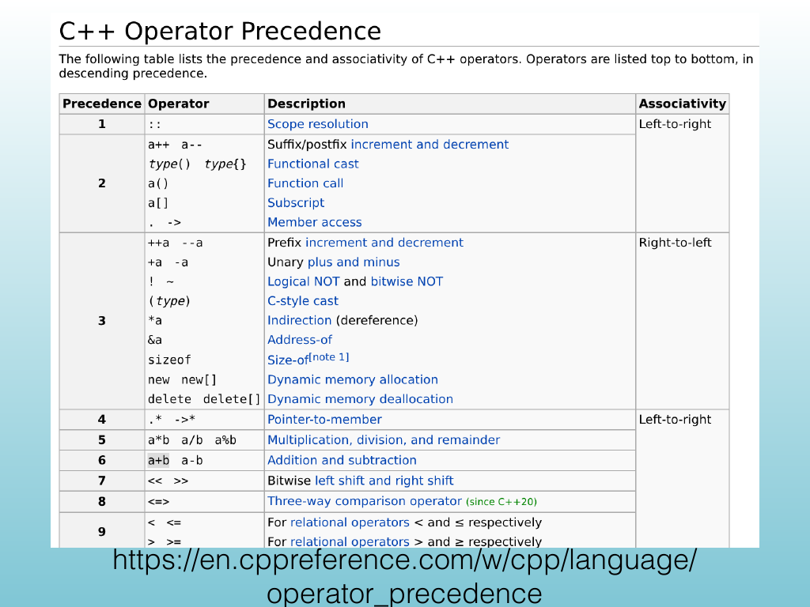
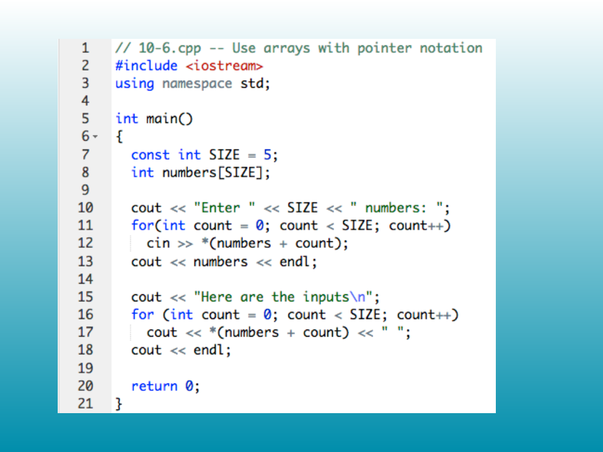

<!-- Topic: Pointer Arithmetic -->
<!-- Slides 22–24 -->

# Pointer Arithmetic

{width="100%" fig-alt="Pointer arithmetic"}

::: notes
Slides 22–24
Source slides 22–24 from the authoritative PDF.
:::

<!-- Slide 22 -->

---

## Source Slide 23

{width="100%" fig-alt="Pointer arithmetic"}

<!-- Slide 23 -->

---

## Source Slide 24

{width="100%" fig-alt="Pointer arithmetic"}

<!-- Slide 24 -->
