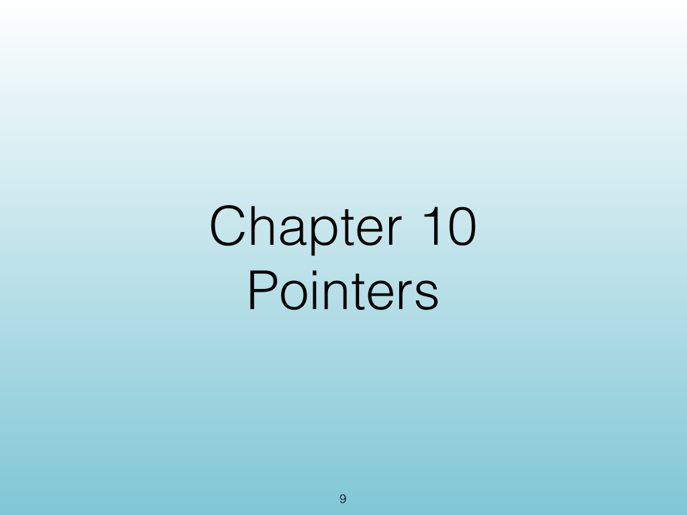
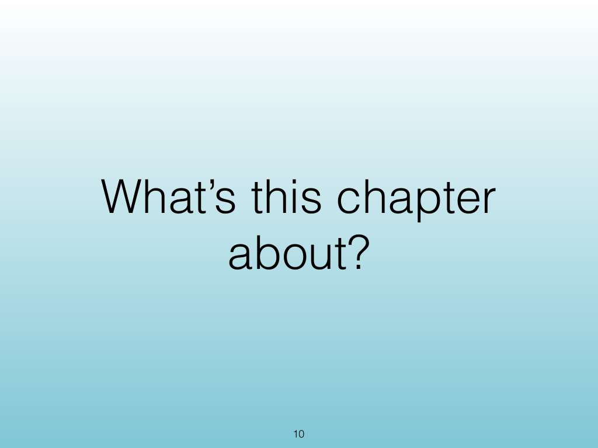
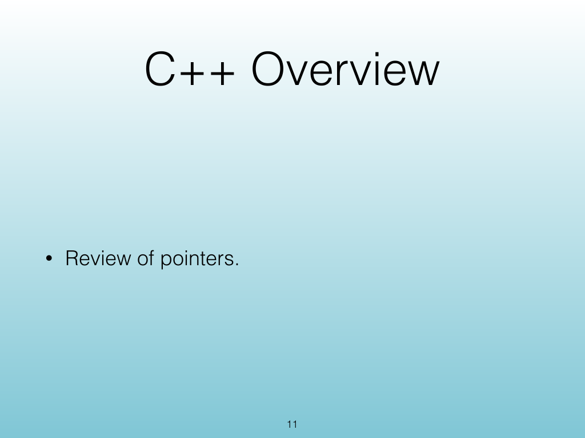
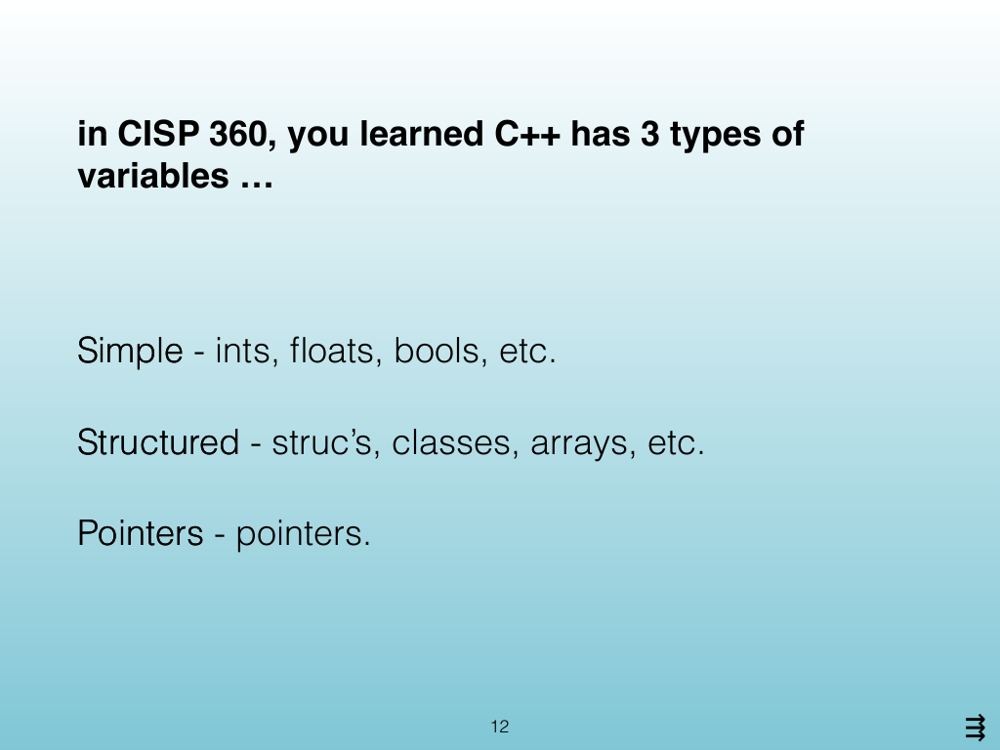
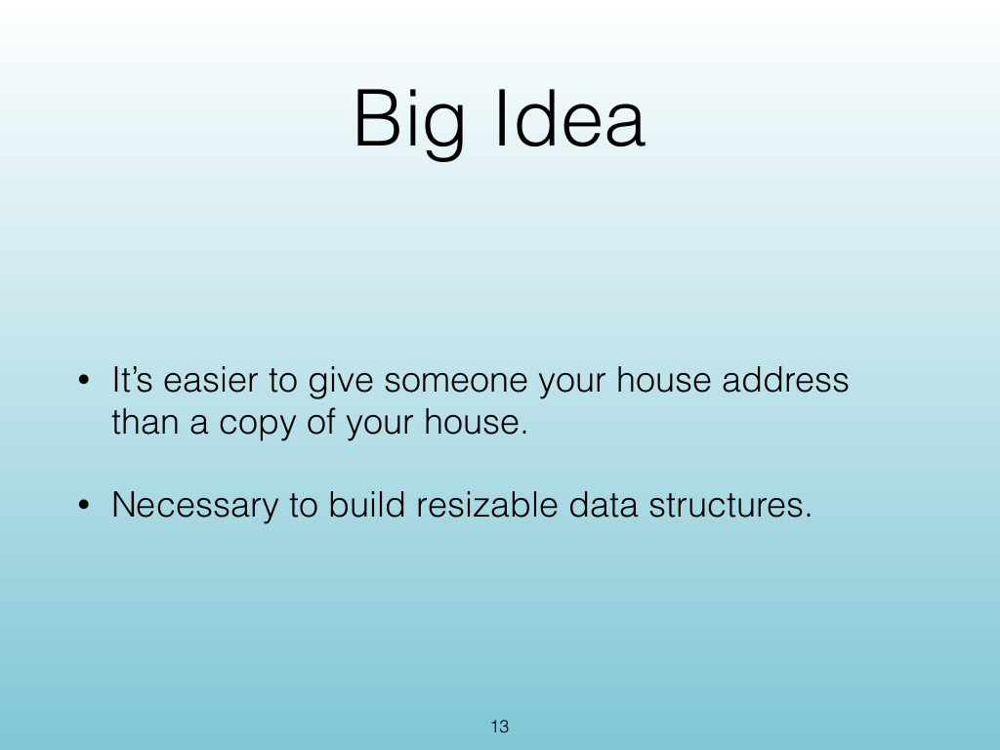
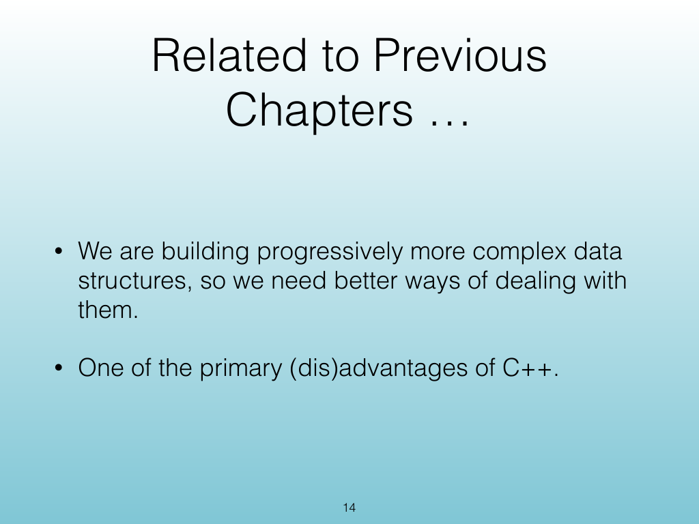
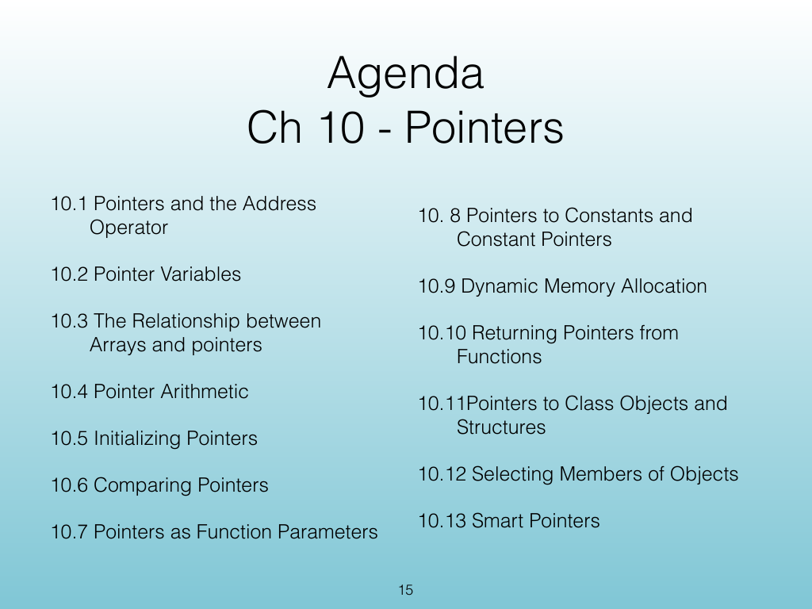
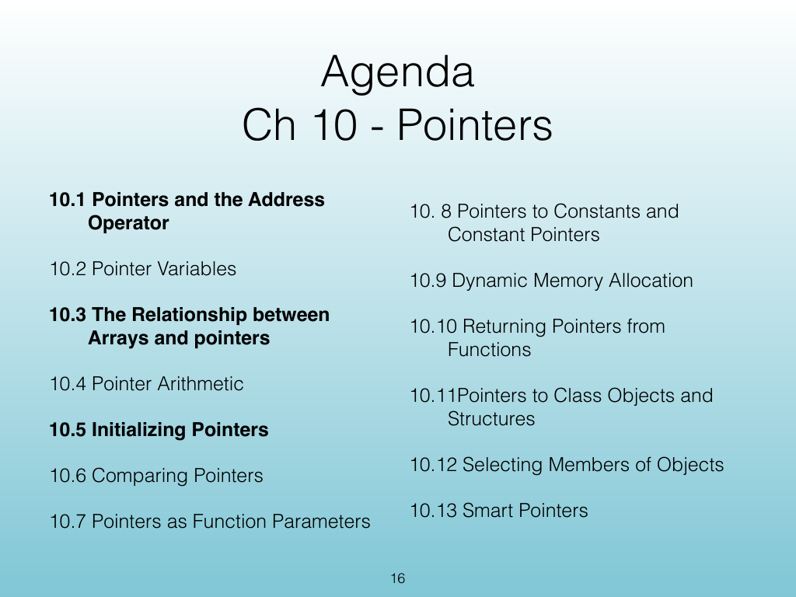

<!-- Topic: Pointer Motivation and Memory Addresses -->
<!-- Slides 9–16 -->

# Pointer Motivation and Memory Addresses

{width="100%" fig-alt="Pointer Motivation and Memory Addresses"}

::: notes
Slides 9–16
Source slide 9 from the authoritative PDF.
:::

<!-- Slide 9 -->

---

## Source Slide 10

{width="100%" fig-alt="What’s this chapter"}

<!-- Slide 10 -->

---

## Source Slide 11

{width="100%" fig-alt="C++ Overview"}

<!-- Slide 11 -->

---

## Source Slide 12

{width="100%" fig-alt="in CISP 360, you learned C++ has 3 types of"}

<!-- Slide 12 -->

---

## Source Slide 13

{width="100%" fig-alt="Big Idea"}

<!-- Slide 13 -->

---

## Source Slide 14

{width="100%" fig-alt="Related to Previous"}

<!-- Slide 14 -->

---

## Source Slide 15

{width="100%" fig-alt="Agenda"}

<!-- Slide 15 -->

---

## Source Slide 16

{width="100%" fig-alt="Agenda"}

<!-- Slide 16 -->
