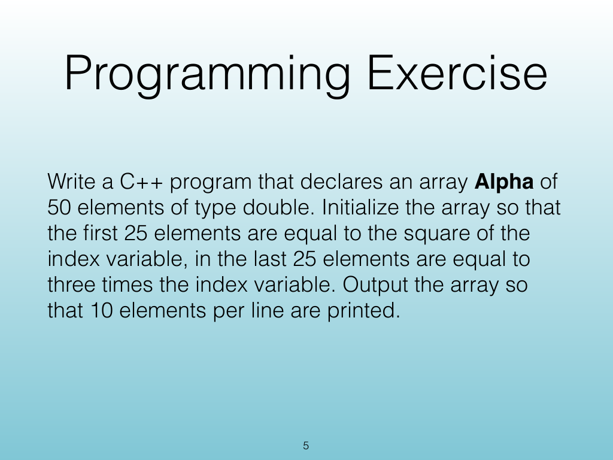
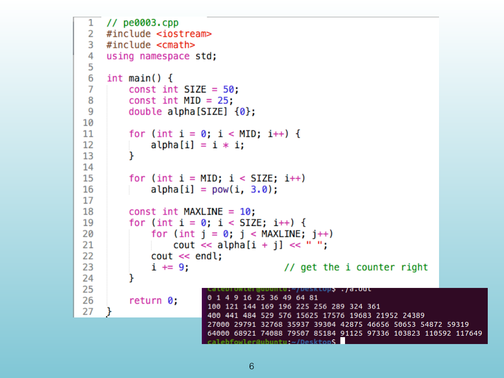
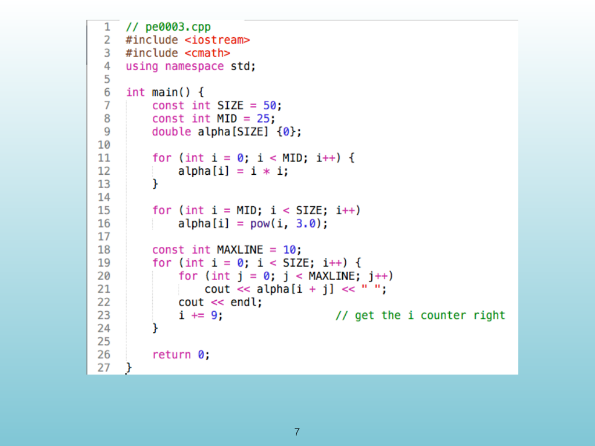
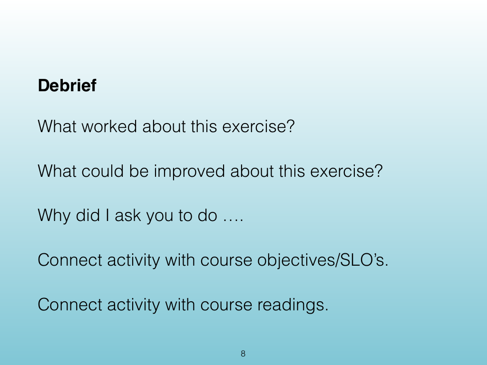

<!-- Topic: Programming Exercise -->
<!-- Slides 4–8 -->

# Programming Exercise

{width="100%" fig-alt="Programming Exercise"}

::: notes
Slides 4–8
Source slide 4 from the authoritative PDF.
:::

<!-- Slide 4 -->

---

## Source Slide 5

{width="100%" fig-alt="Programming Exercise"}

<!-- Slide 5 -->

---

## Source Slide 6

{width="100%" fig-alt="6"}

<!-- Slide 6 -->

---

## Source Slide 7

{width="100%" fig-alt="7"}

<!-- Slide 7 -->

---

## Source Slide 8

{width="100%" fig-alt="Debrief"}

<!-- Slide 8 -->
