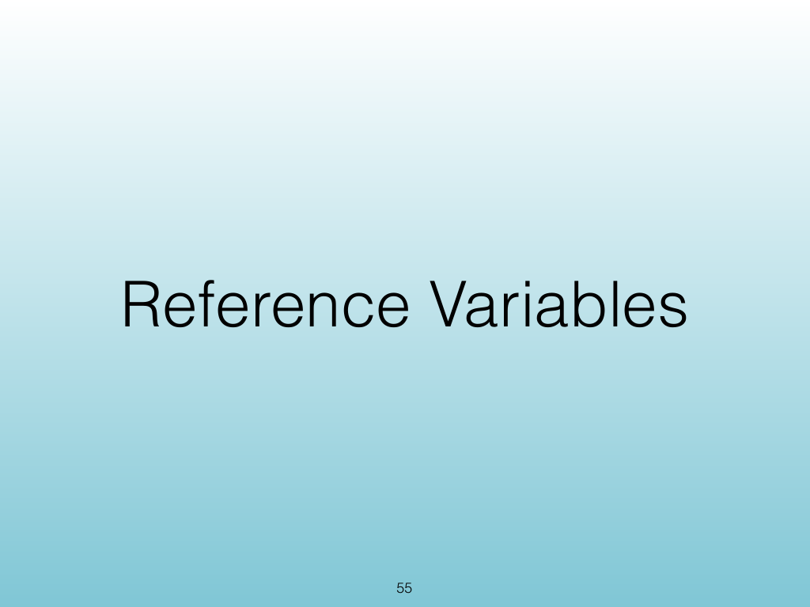
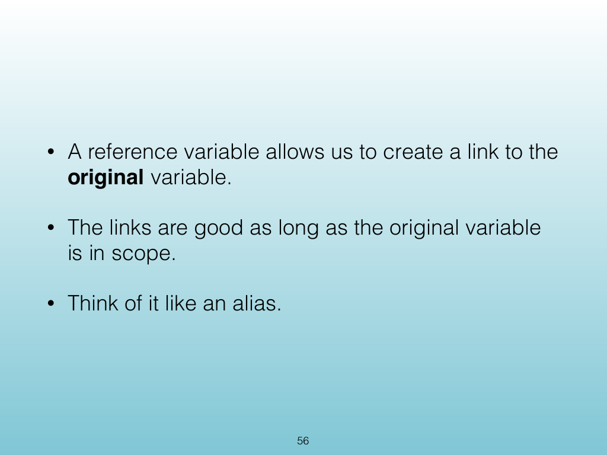
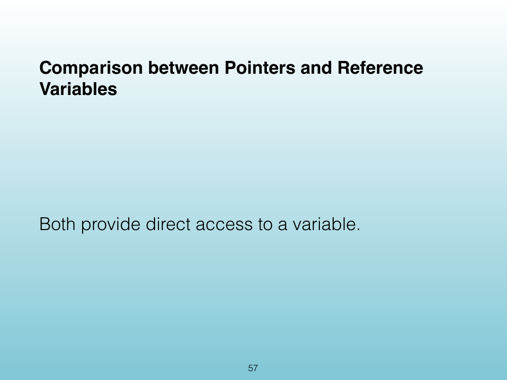
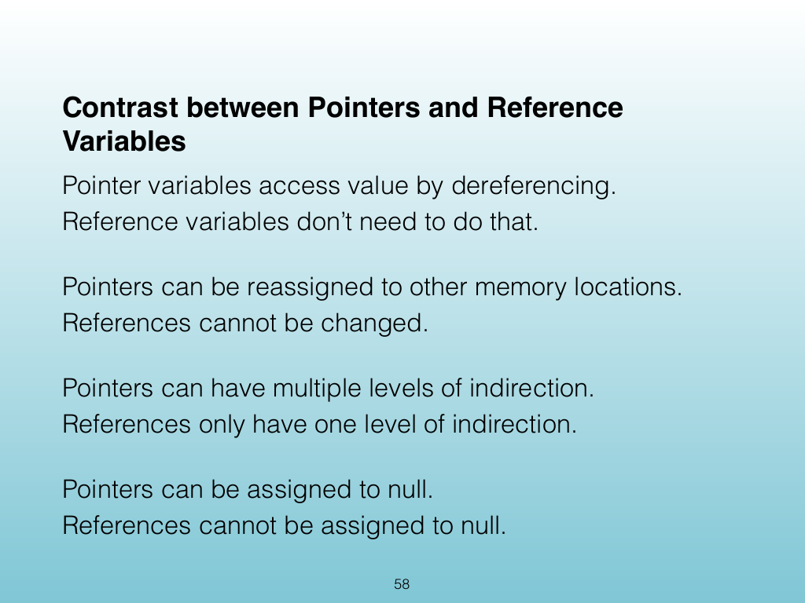
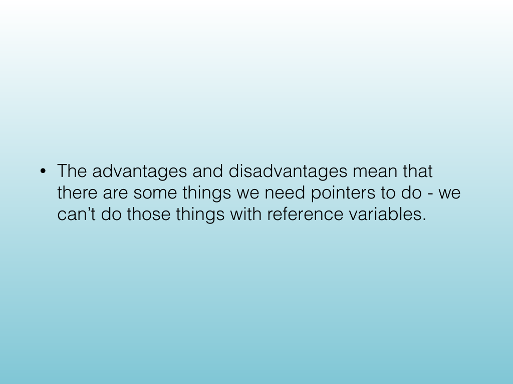

<!-- Topic: Reference Variables -->
<!-- Slides 53–59 -->

# Reference Variables

{width="100%" fig-alt="Reference Variables"}

::: notes
Slides 53–59
Source slide 53 from the authoritative PDF.
:::

<!-- Slide 53 -->

---

## Source Slide 54

{width="100%" fig-alt="Problem: Pointers allow access to anything"}

<!-- Slide 54 -->

---

## Source Slide 55

{width="100%" fig-alt="Reference Variables"}

<!-- Slide 55 -->

---

## Source Slide 56

{width="100%" fig-alt="• A reference variable allows us to create a link to the"}

<!-- Slide 56 -->

---

## Source Slide 57

{width="100%" fig-alt="Comparison between Pointers and Reference"}

<!-- Slide 57 -->

---

## Source Slide 58

{width="100%" fig-alt="Contrast between Pointers and Reference"}

<!-- Slide 58 -->

---

## Source Slide 59

{width="100%" fig-alt="• The advantages and disadvantages mean that"}

<!-- Slide 59 -->
