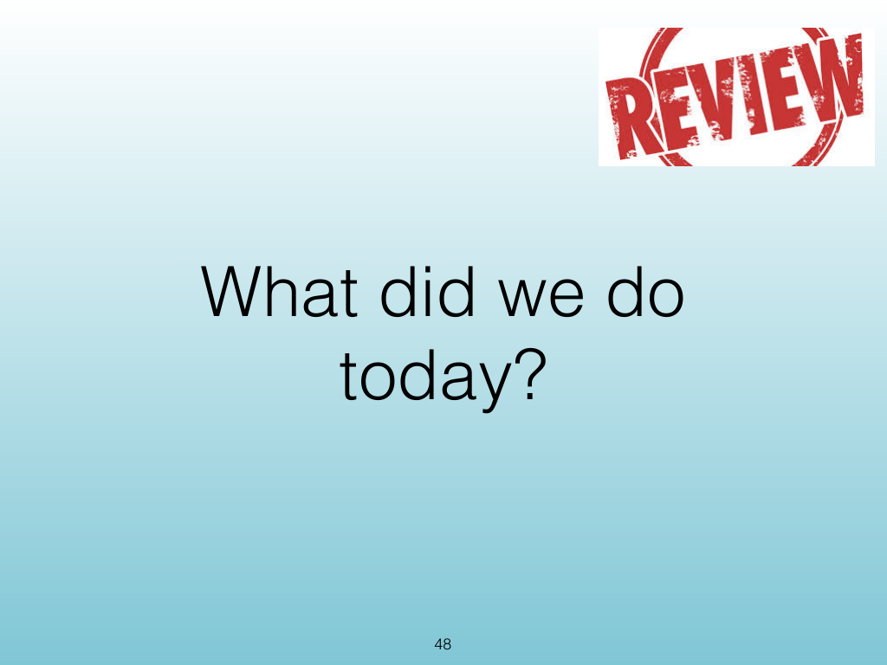
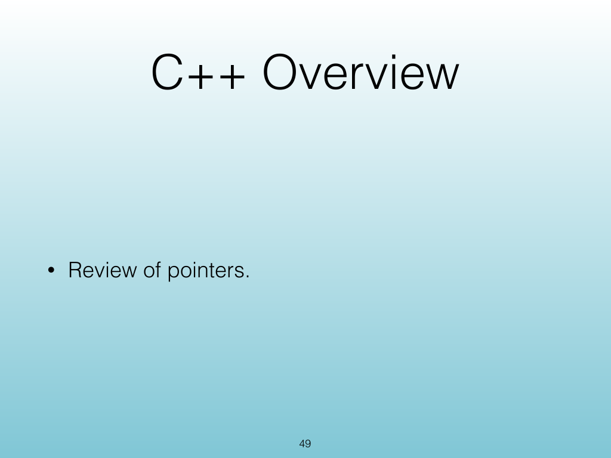
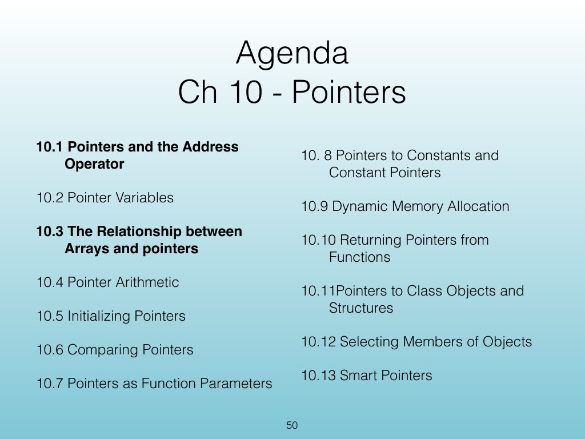
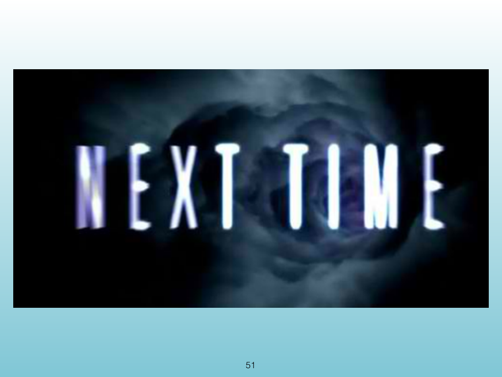
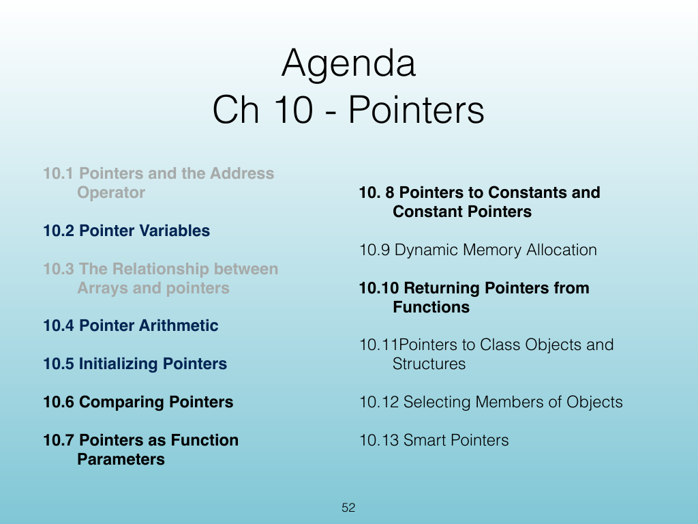

<!-- Topic: Review Wrap-Up -->
<!-- Slides 48–52 -->

# Review Wrap-Up

{width="100%" fig-alt="Review Wrap-Up"}

::: notes
Slides 48–52
Source slide 48 from the authoritative PDF.
:::

<!-- Slide 48 -->

---

## Source Slide 49

{width="100%" fig-alt="C++ Overview"}

<!-- Slide 49 -->

---

## Source Slide 50

{width="100%" fig-alt="Agenda"}

<!-- Slide 50 -->

---

## Source Slide 51

{width="100%" fig-alt="51"}

<!-- Slide 51 -->

---

## Source Slide 52

{width="100%" fig-alt="Agenda"}

<!-- Slide 52 -->
