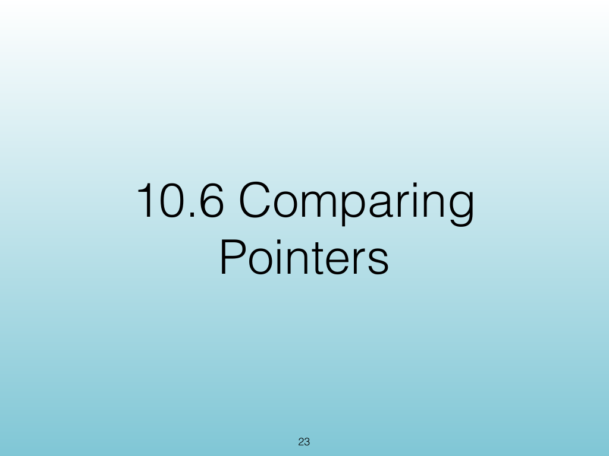
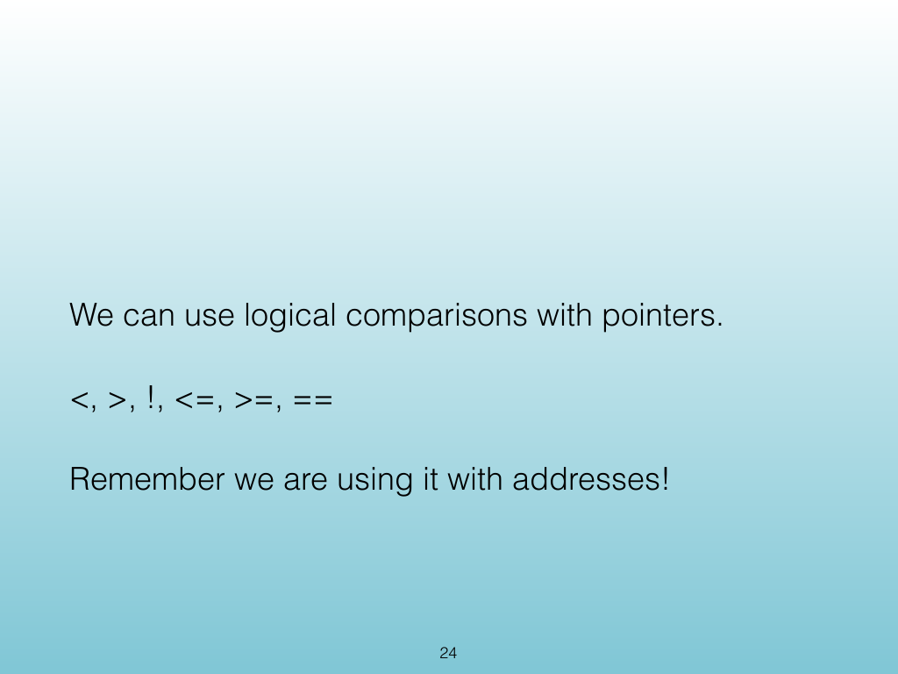
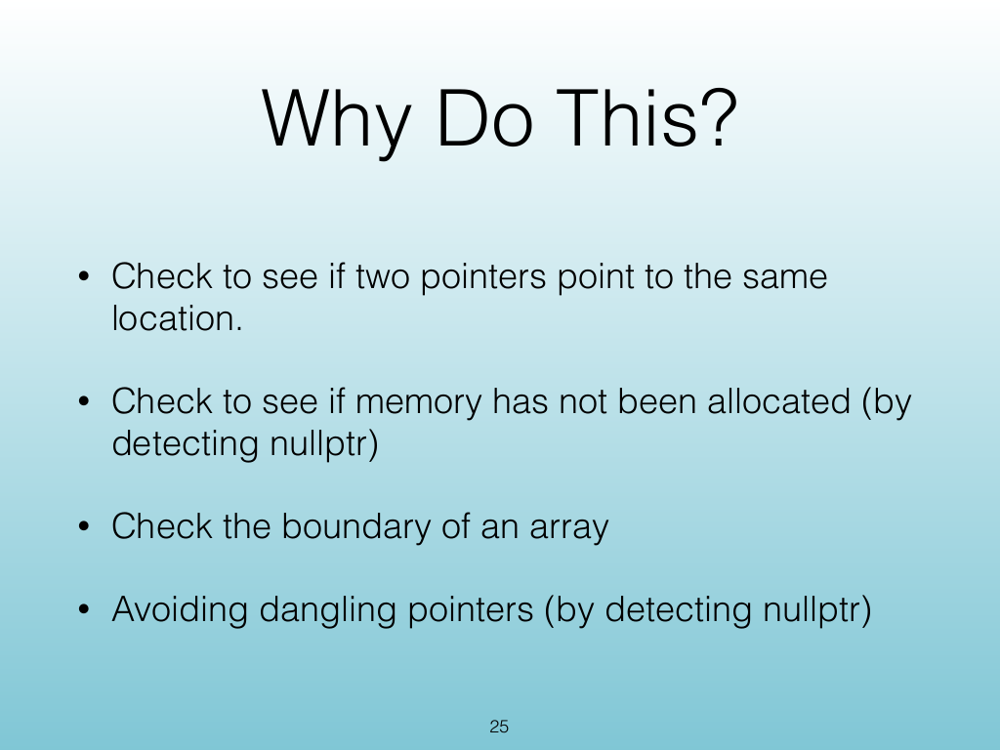
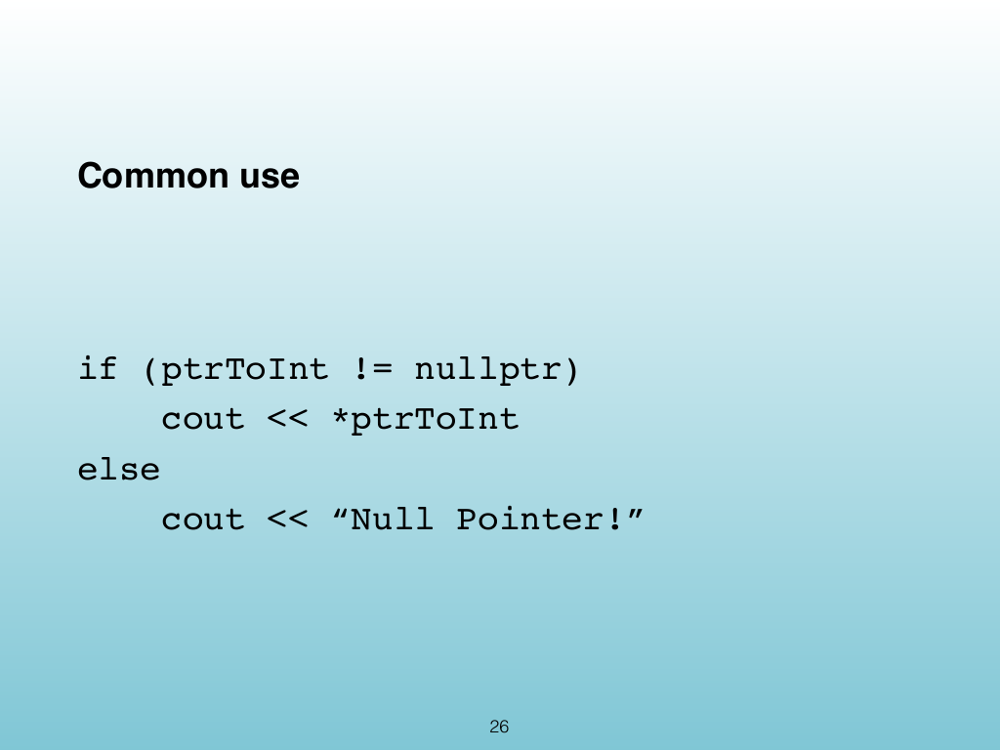

<!-- Topic: Comparing Pointers -->
<!-- Slides 23–26 -->

# Comparing Pointers

{width="100%" fig-alt="Comparing Pointers"}

::: notes
Slides 23–26
Source slide 23 from the authoritative PDF.
:::

<!-- Slide 23 -->

---

## Source Slide 24

{width="100%" fig-alt="We can use logical comparisons with pointers."}

<!-- Slide 24 -->

---

## Source Slide 25

{width="100%" fig-alt="Why Do This?"}

<!-- Slide 25 -->

---

## Source Slide 26

{width="100%" fig-alt="Common use"}

<!-- Slide 26 -->
