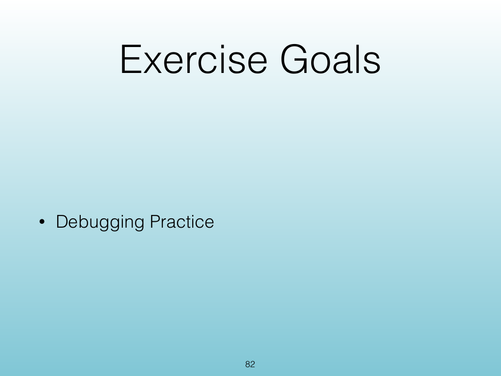
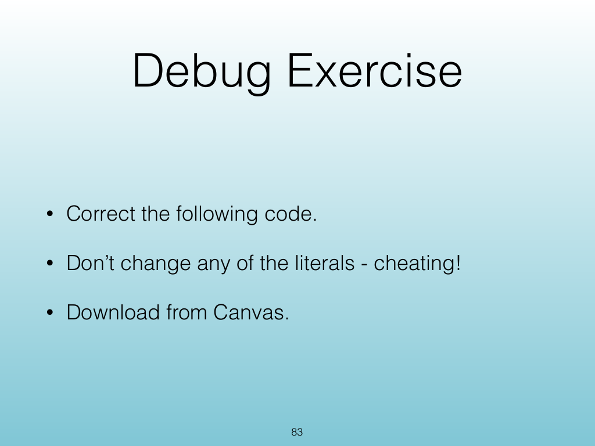
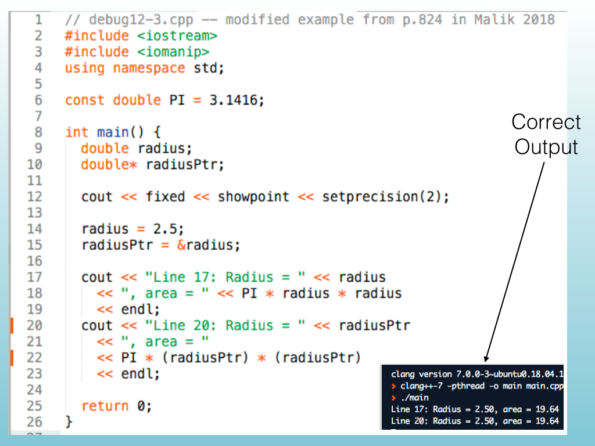
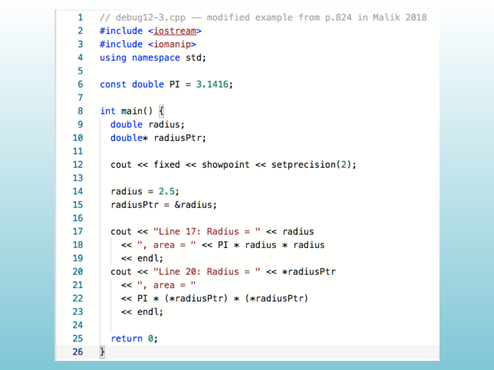
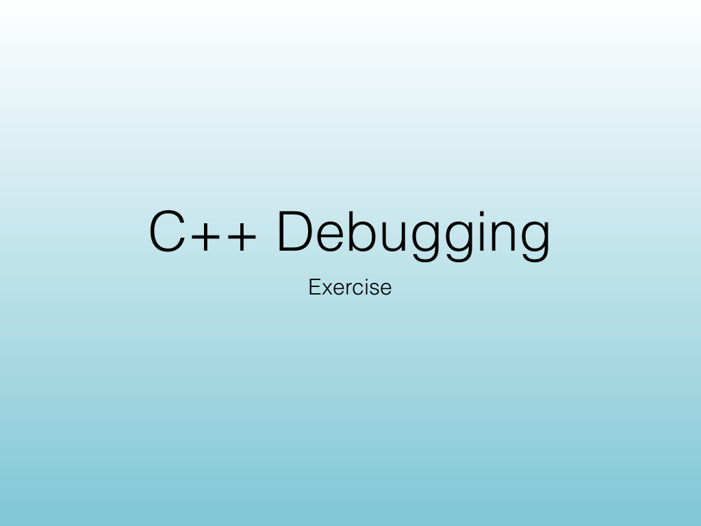
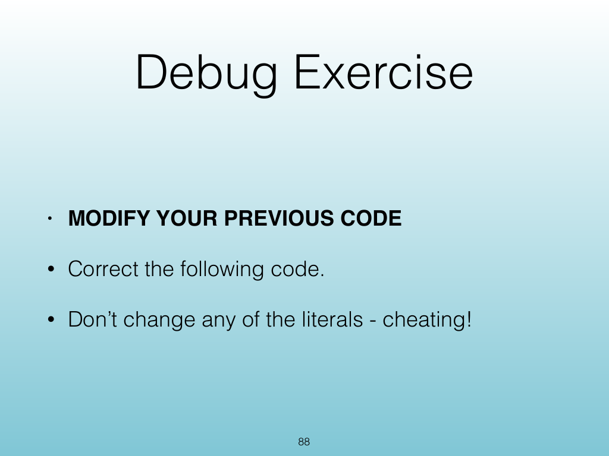
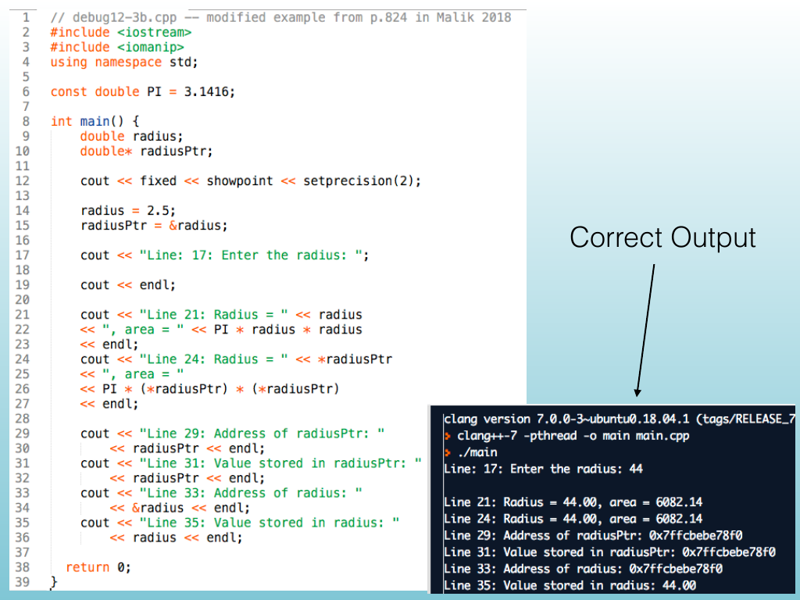
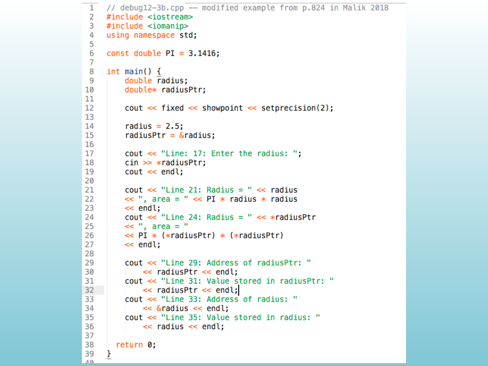

<!-- Topic: Debugging Exercises -->
<!-- Slides 81–90 -->

# Debugging Exercises

{width="100%" fig-alt="Debugging Exercises"}

::: notes
Slides 81–90
Source slide 81 from the authoritative PDF.
:::

<!-- Slide 81 -->

---

## Source Slide 82

{width="100%" fig-alt="Exercise Goals"}

<!-- Slide 82 -->

---

## Source Slide 83

{width="100%" fig-alt="Debug Exercise"}

<!-- Slide 83 -->

---

## Source Slide 84

{width="100%" fig-alt="Correct"}

<!-- Slide 84 -->

---

## Source Slide 85

{width="100%" fig-alt="Source Slide 85"}

<!-- Slide 85 -->

---

## Source Slide 86

{width="100%" fig-alt="C++ Debugging"}

<!-- Slide 86 -->

---

## Source Slide 87

{width="100%" fig-alt="Exercise Goals"}

<!-- Slide 87 -->

---

## Source Slide 88

{width="100%" fig-alt="Debug Exercise"}

<!-- Slide 88 -->

---

## Source Slide 89

{width="100%" fig-alt="Correct Output"}

<!-- Slide 89 -->

---

## Source Slide 90

{width="100%" fig-alt="Source Slide 90"}

<!-- Slide 90 -->
