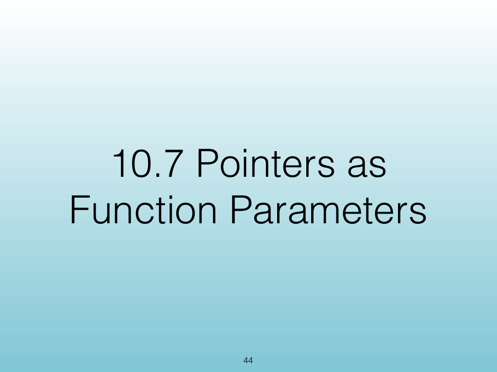
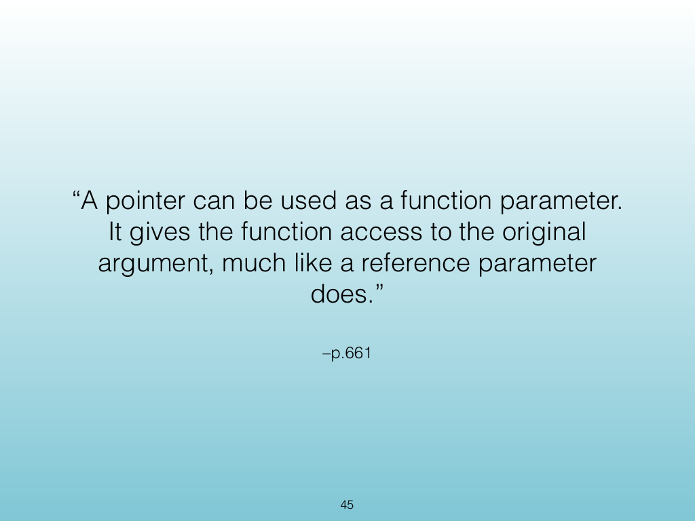
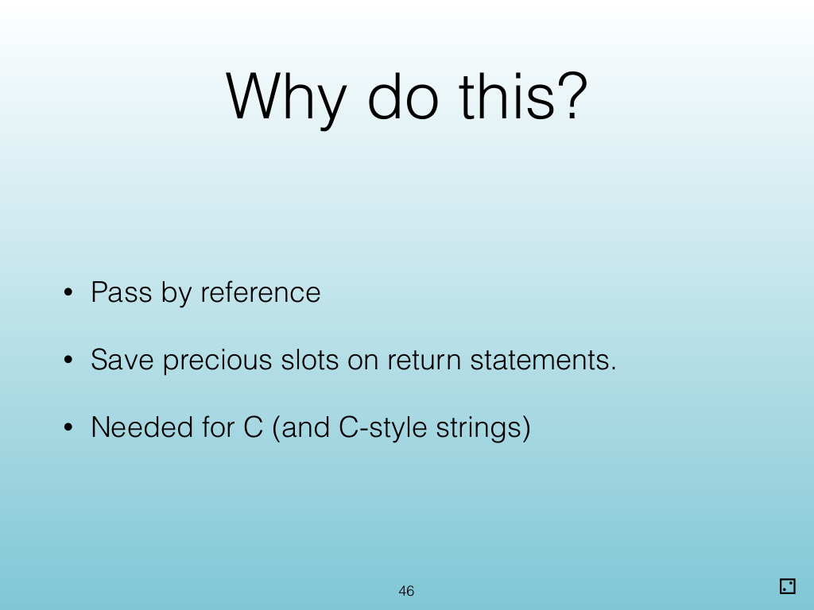
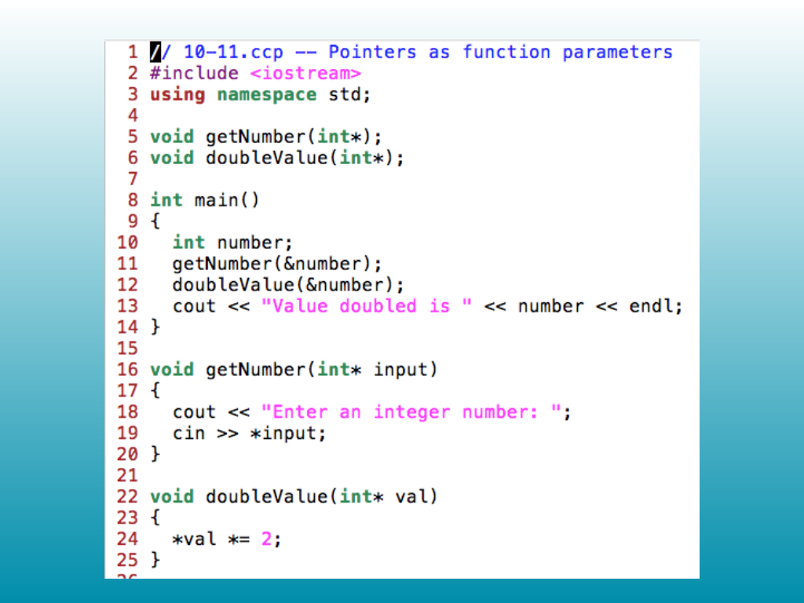
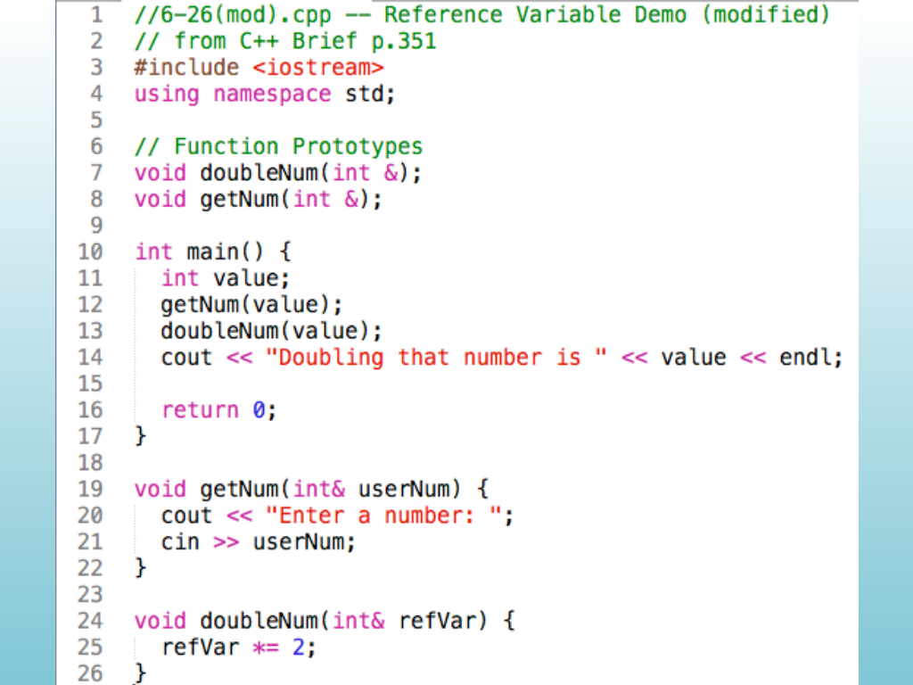
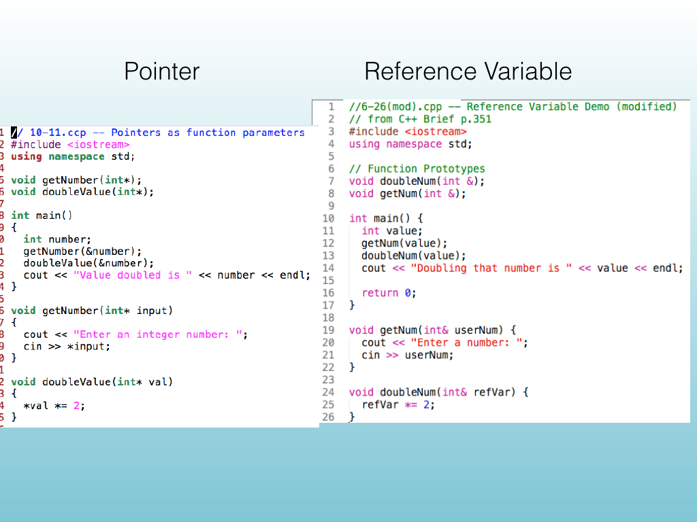

<!-- Topic: Pointers as Function Parameters -->
<!-- Slides 44–49 -->

# Pointers as Function Parameters

{width="100%" fig-alt="Pointers as Function Parameters"}

::: notes
Slides 44–49
Source slide 44 from the authoritative PDF.
:::

<!-- Slide 44 -->

---

## Source Slide 45

{width="100%" fig-alt="“A pointer can be used as a function parameter."}

<!-- Slide 45 -->

---

## Source Slide 46

{width="100%" fig-alt="Why do this?"}

<!-- Slide 46 -->

---

## Source Slide 47

{width="100%" fig-alt="Source Slide 47"}

<!-- Slide 47 -->

---

## Source Slide 48

{width="100%" fig-alt="48"}

<!-- Slide 48 -->

---

## Source Slide 49

{width="100%" fig-alt="Pointer Reference Variable"}

<!-- Slide 49 -->
