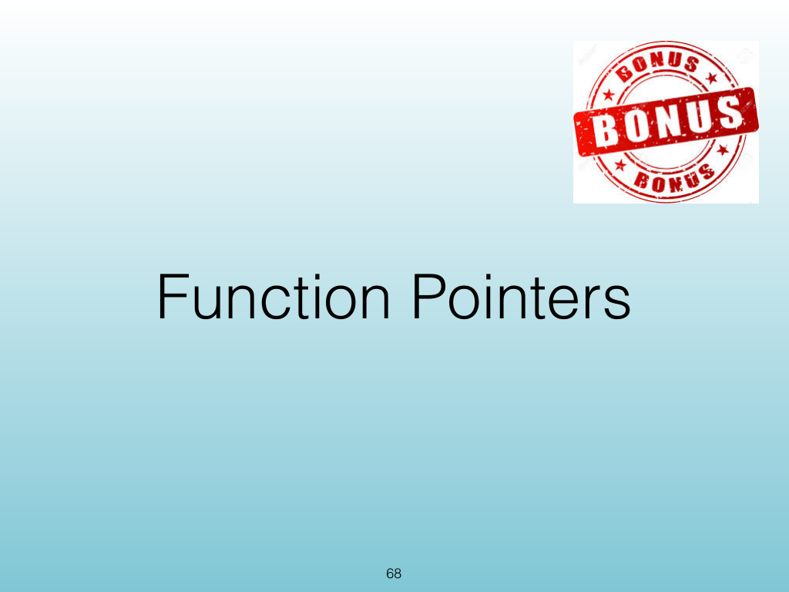
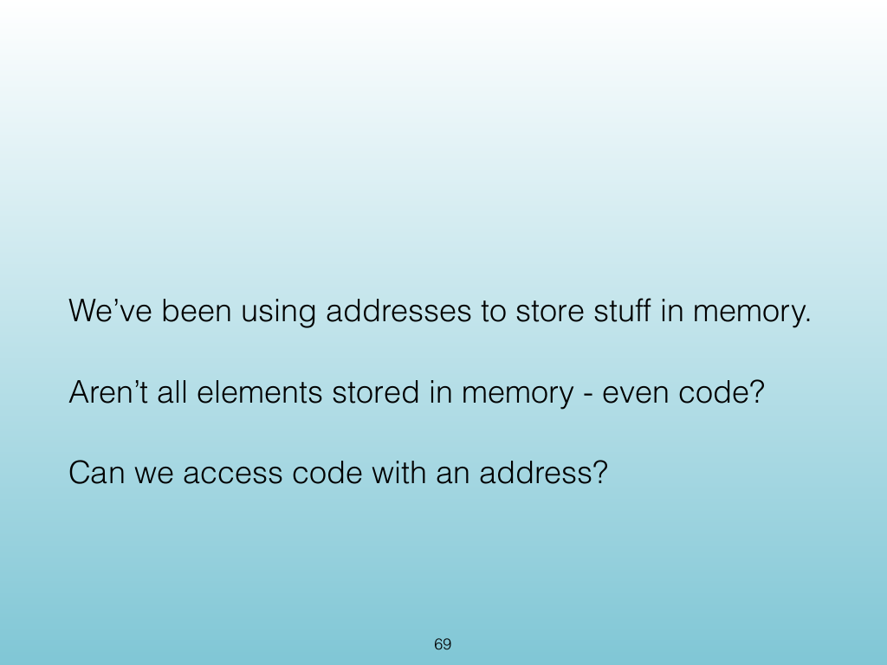
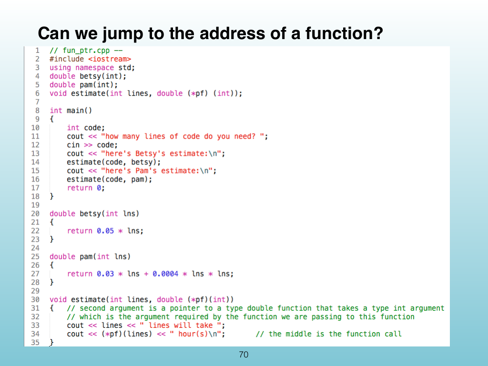
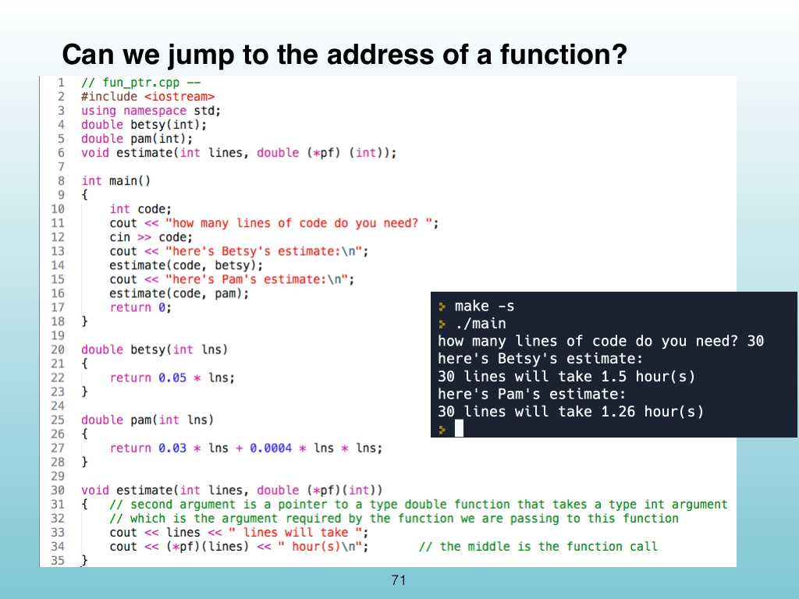

<!-- Topic: Function Pointers -->
<!-- Slides 68–71 -->

# Function Pointers

{width="100%" fig-alt="Function Pointers"}

::: notes
Slides 68–71
Source slide 68 from the authoritative PDF.
:::

<!-- Slide 68 -->

---

## Source Slide 69

{width="100%" fig-alt="We’ve been using addresses to store stuff in memory."}

<!-- Slide 69 -->

---

## Source Slide 70

{width="100%" fig-alt="Can we jump to the address of a function?"}

<!-- Slide 70 -->

---

## Source Slide 71

{width="100%" fig-alt="Can we jump to the address of a function?"}

<!-- Slide 71 -->
