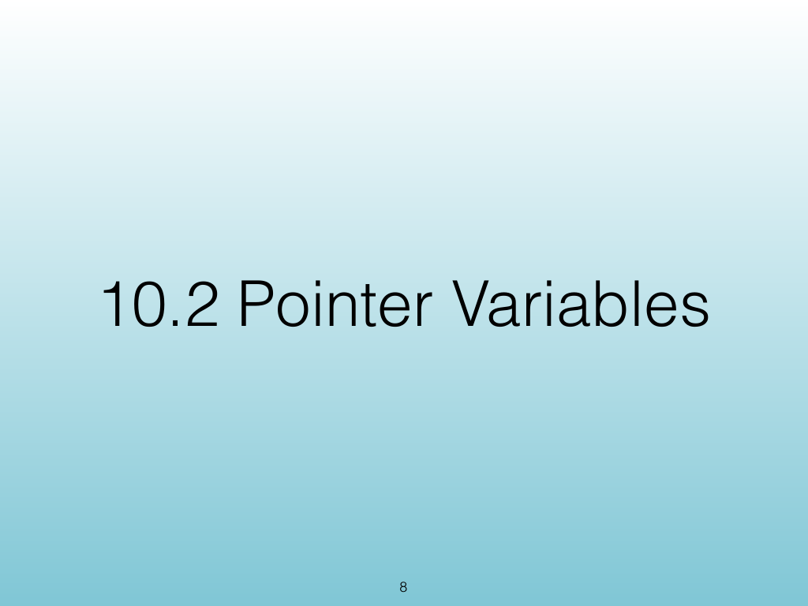
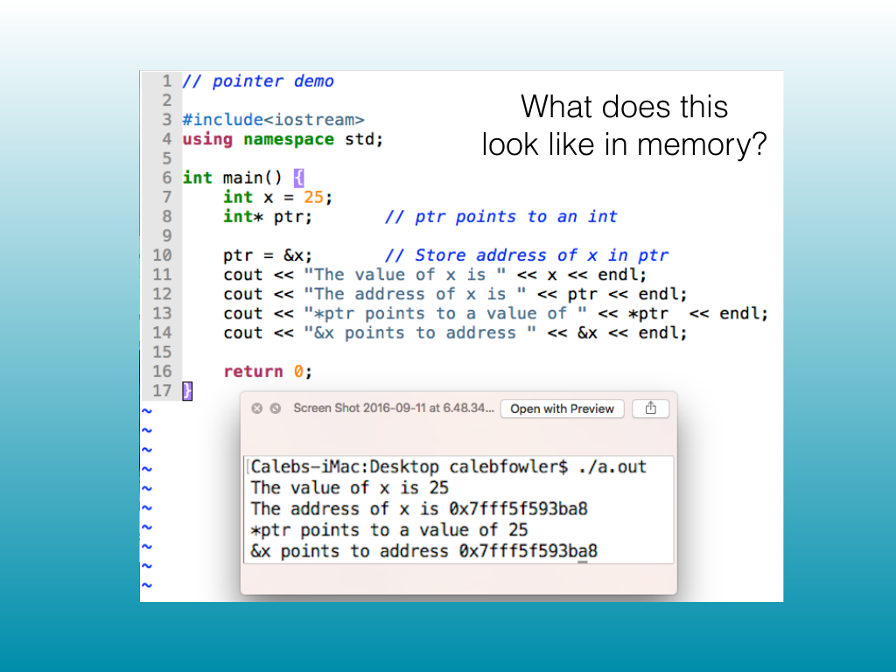
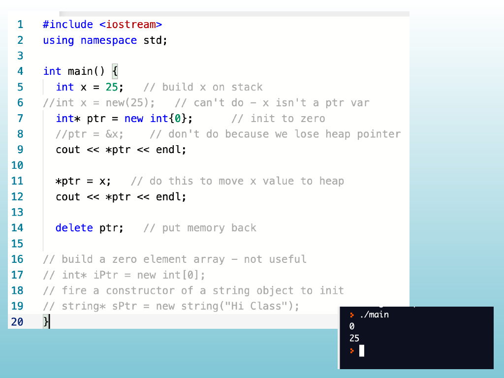
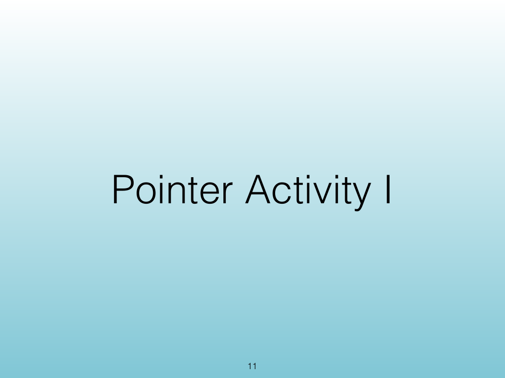
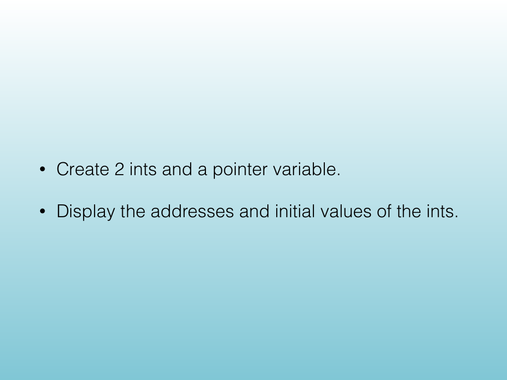
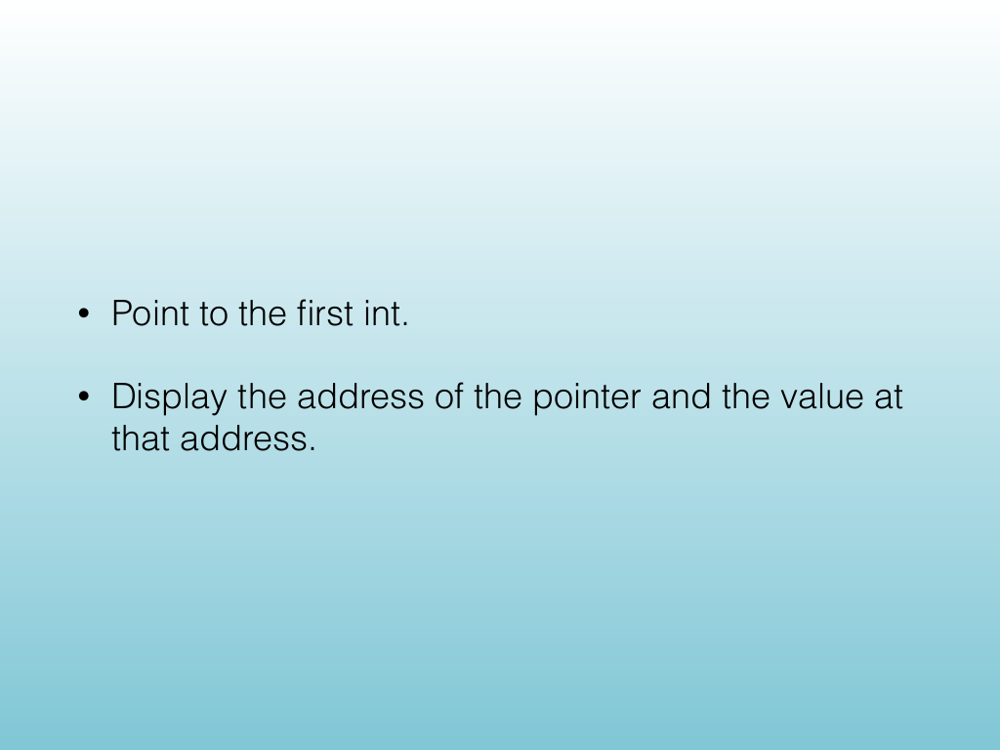
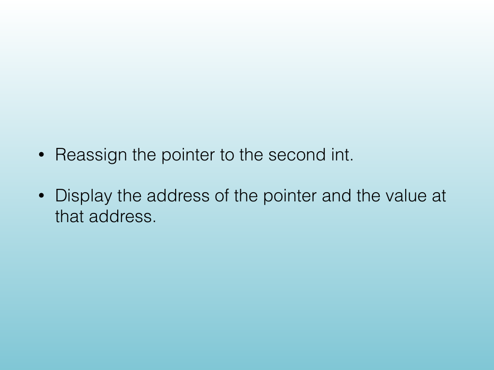
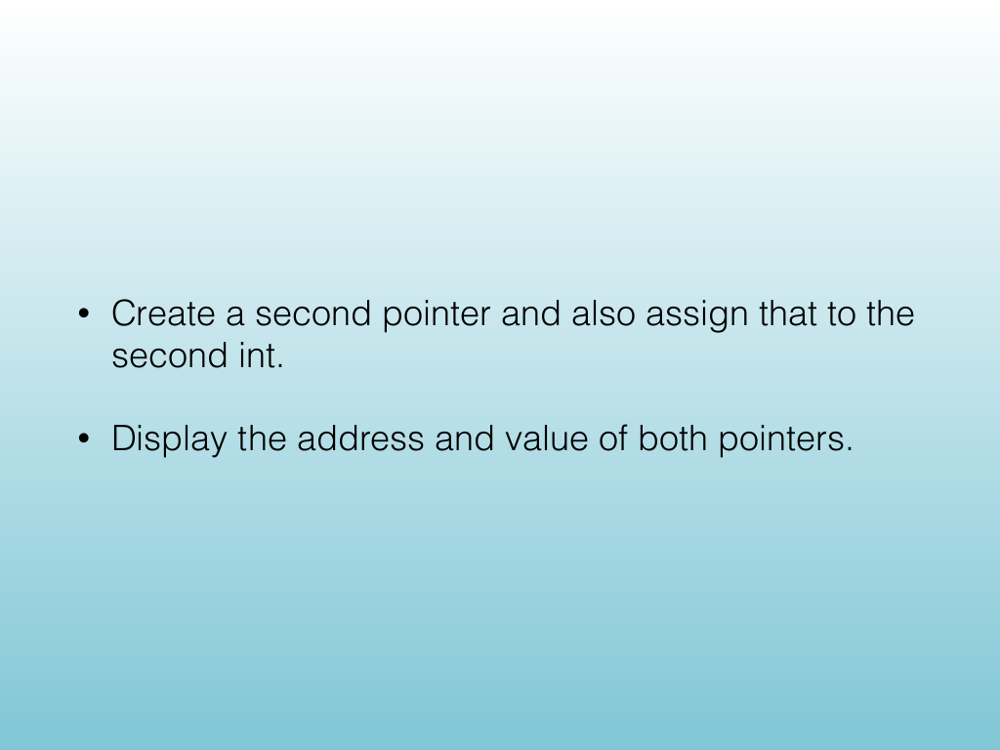
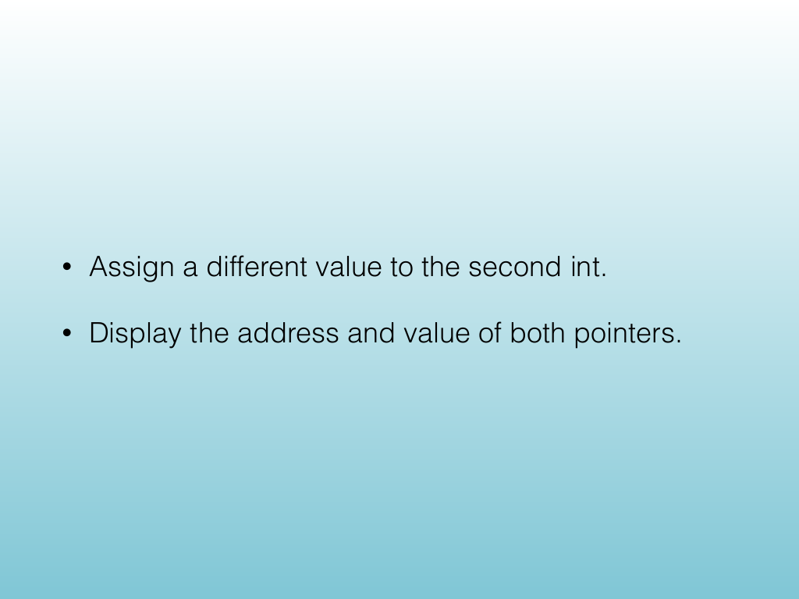
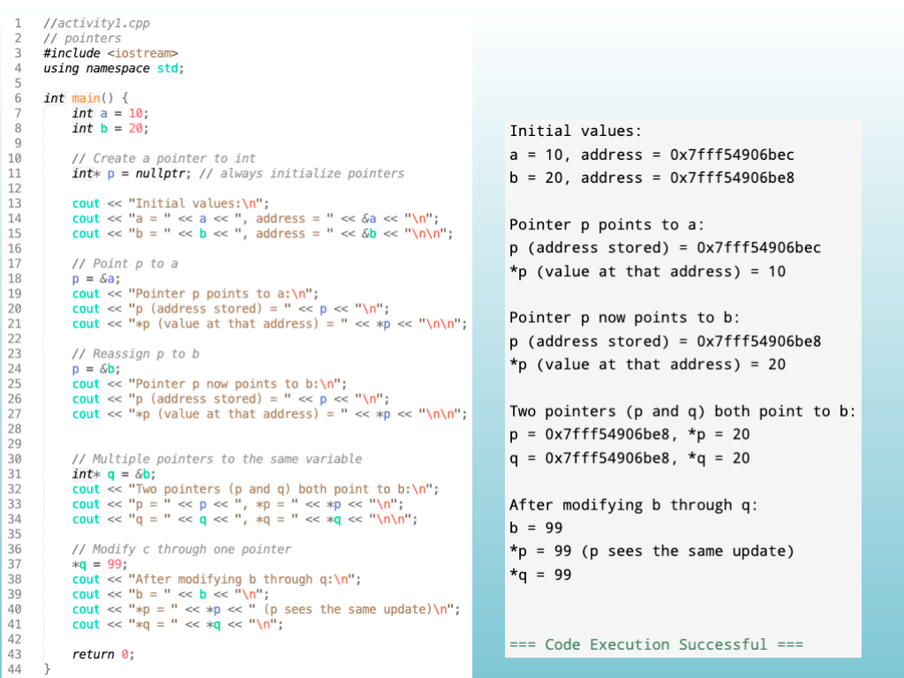

<!-- Topic: Pointer Variables in Memory -->
<!-- Slides 8–17 -->

# Pointer Variables in Memory

{width="100%" fig-alt="Pointer Variables in Memory"}

::: notes
Slides 8–17
Source slide 8 from the authoritative PDF.
:::

<!-- Slide 8 -->

---

## Source Slide 9

{width="100%" fig-alt="What does this"}

<!-- Slide 9 -->

---

## Source Slide 10

{width="100%" fig-alt="Source Slide 10"}

<!-- Slide 10 -->

---

## Source Slide 11

{width="100%" fig-alt="Pointer Activity I"}

<!-- Slide 11 -->

---

## Source Slide 12

{width="100%" fig-alt="• Create 2 ints and a pointer variable."}

<!-- Slide 12 -->

---

## Source Slide 13

{width="100%" fig-alt="• Point to the rst int."}

<!-- Slide 13 -->

---

## Source Slide 14

{width="100%" fig-alt="• Reassign the pointer to the second int."}

<!-- Slide 14 -->

---

## Source Slide 15

{width="100%" fig-alt="• Create a second pointer and also assign that to the"}

<!-- Slide 15 -->

---

## Source Slide 16

{width="100%" fig-alt="• Assign a different value to the second int."}

<!-- Slide 16 -->

---

## Source Slide 17

{width="100%" fig-alt="Source Slide 17"}

<!-- Slide 17 -->
