<!-- Topic: Returning and Reassigning Pointers -->
<!-- Slides 50–62 -->

# Returning and Reassigning Pointers

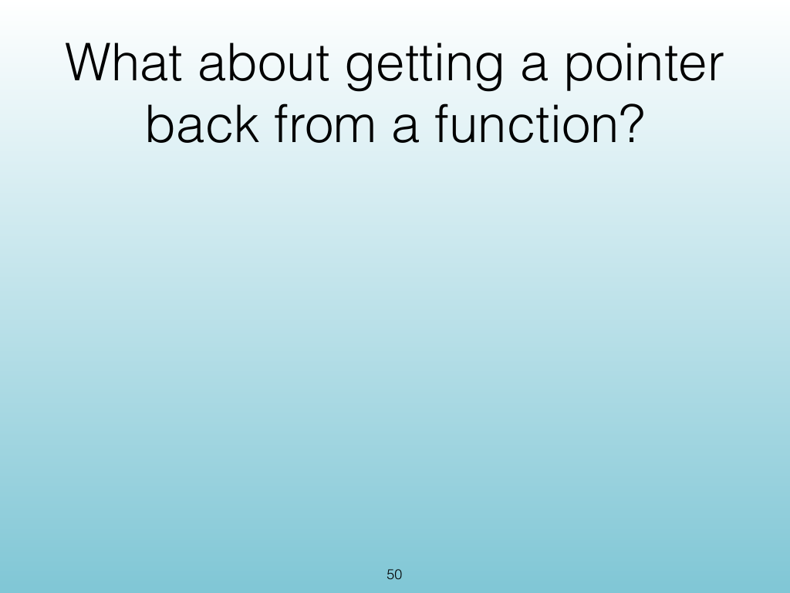{width="100%" fig-alt="Returning and Reassigning Pointers"}

::: notes
Slides 50–62
Source slide 50 from the authoritative PDF.
:::

<!-- Slide 50 -->

---

## Source Slide 51

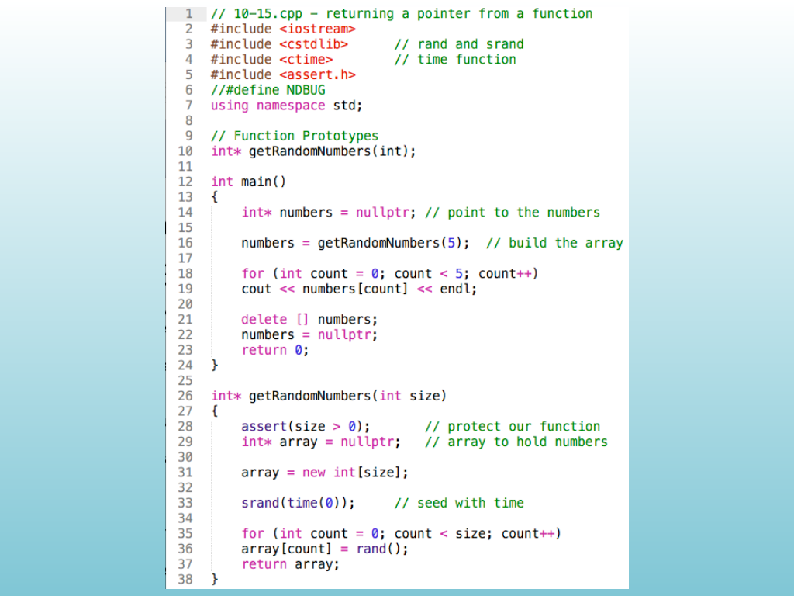{width="100%" fig-alt="Source Slide 51"}

<!-- Slide 51 -->

---

## Source Slide 52

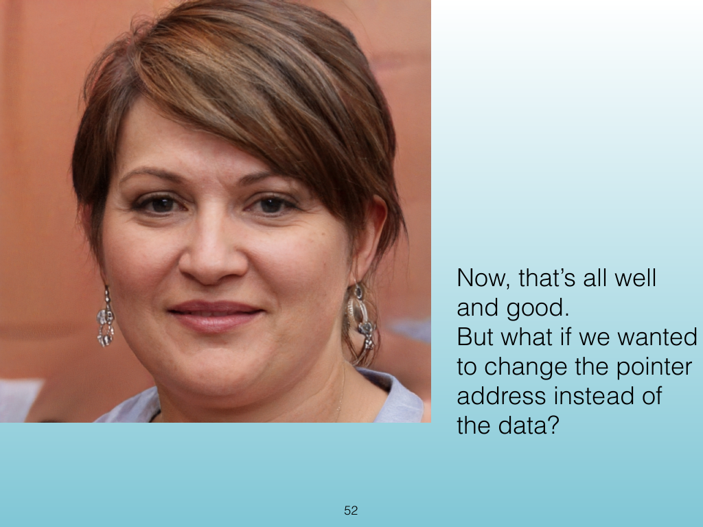{width="100%" fig-alt="Now, that’s all well"}

<!-- Slide 52 -->

---

## Source Slide 53

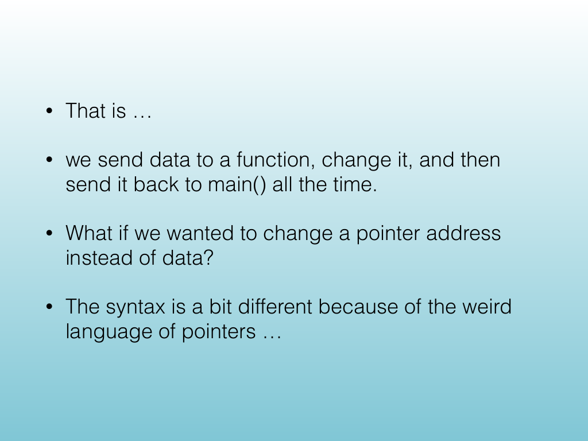{width="100%" fig-alt="• That is …"}

<!-- Slide 53 -->

---

## Source Slide 54

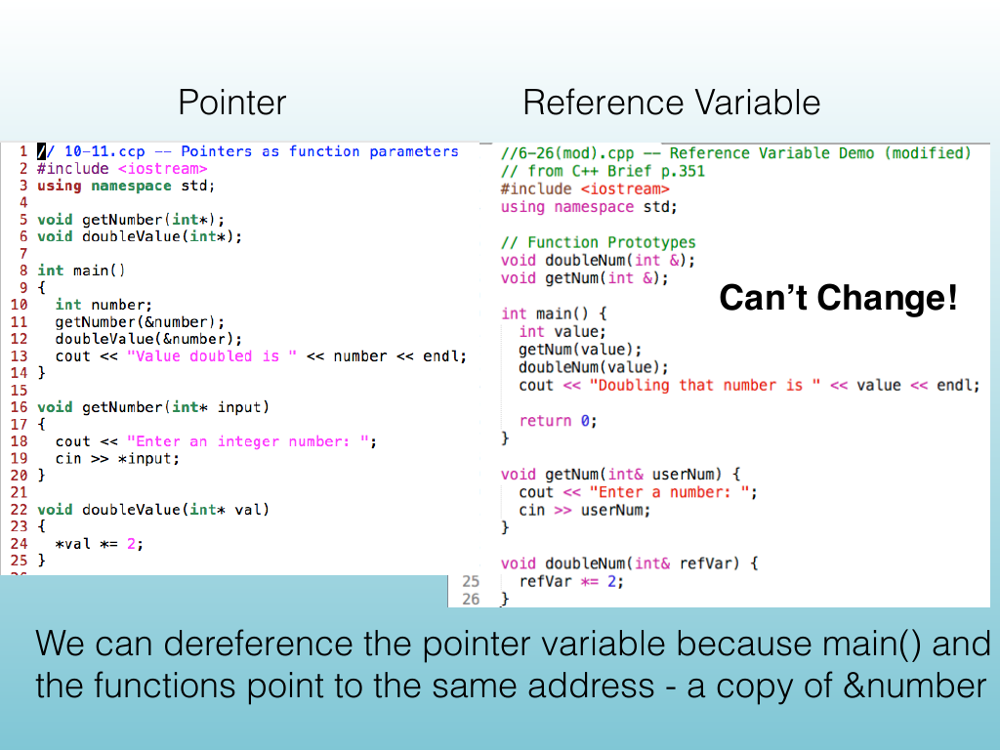{width="100%" fig-alt="Pointer Reference Variable"}

<!-- Slide 54 -->

---

## Source Slide 55

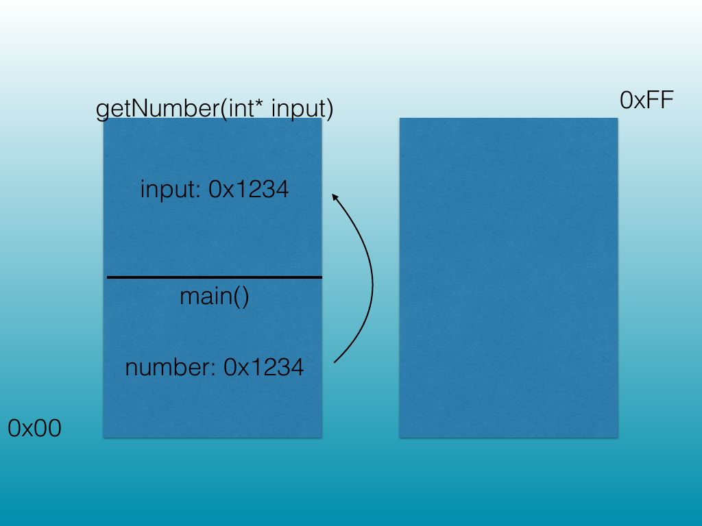{width="100%" fig-alt="getNumber(int* input) 0xFF"}

<!-- Slide 55 -->

---

## Source Slide 56

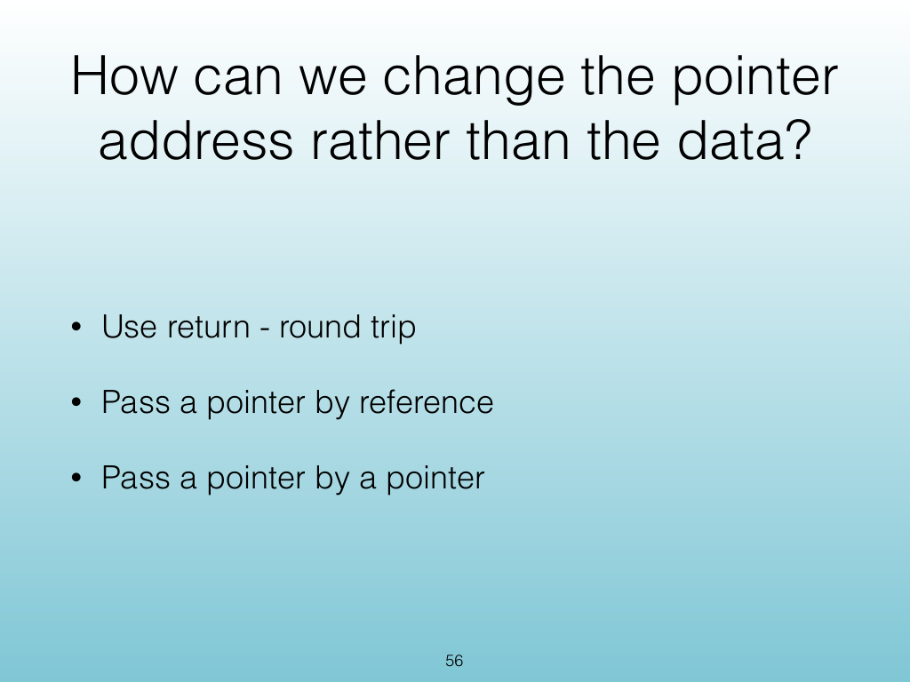{width="100%" fig-alt="How can we change the pointer"}

<!-- Slide 56 -->

---

## Source Slide 57

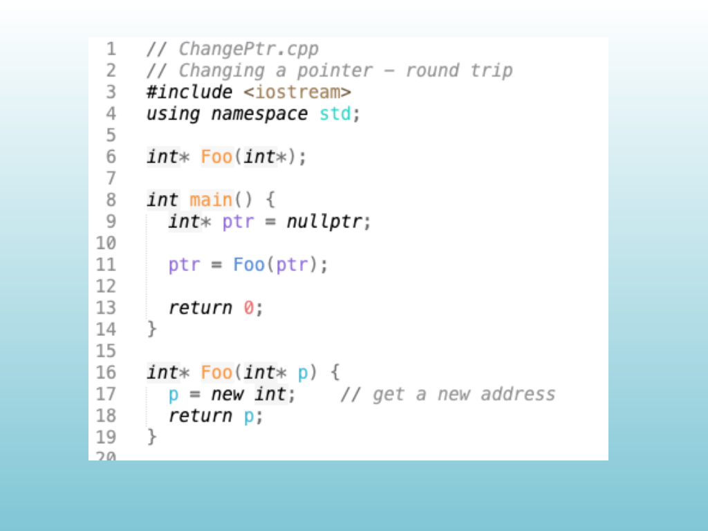{width="100%" fig-alt="Source Slide 57"}

<!-- Slide 57 -->

---

## Source Slide 58

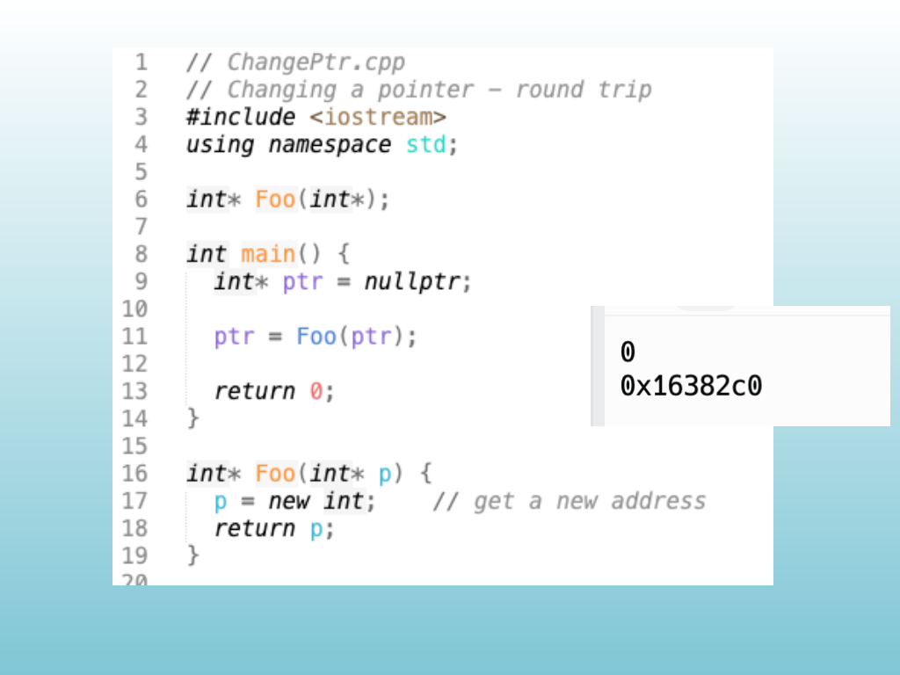{width="100%" fig-alt="Source Slide 58"}

<!-- Slide 58 -->

---

## Source Slide 59

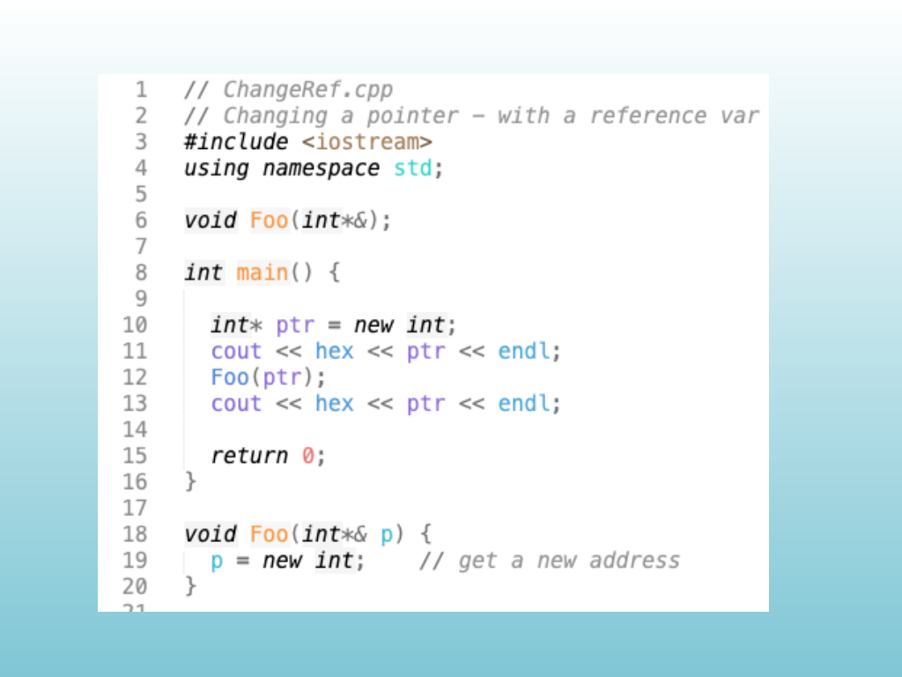{width="100%" fig-alt="Source Slide 59"}

<!-- Slide 59 -->

---

## Source Slide 60

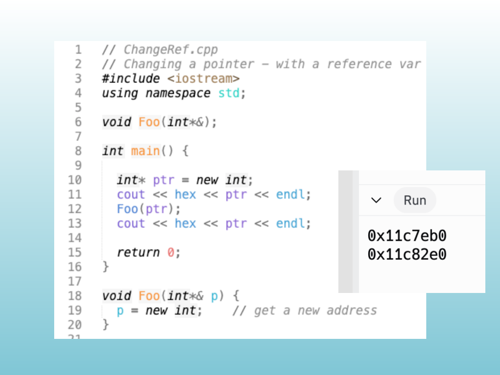{width="100%" fig-alt="Source Slide 60"}

<!-- Slide 60 -->

---

## Source Slide 61

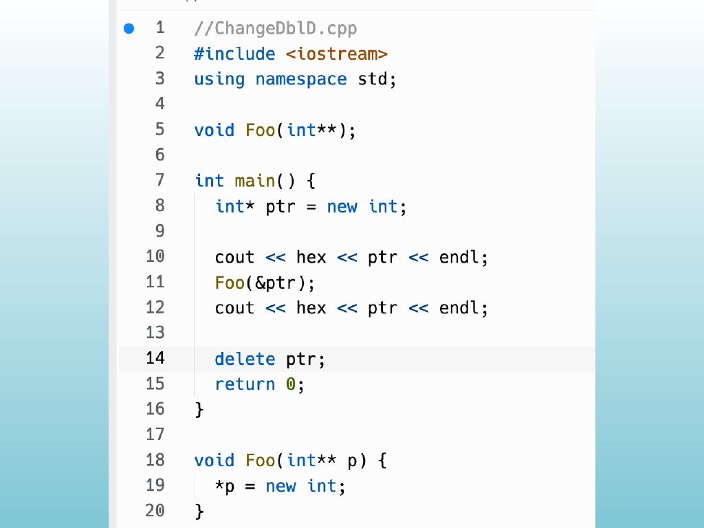{width="100%" fig-alt="Source Slide 61"}

<!-- Slide 61 -->

---

## Source Slide 62

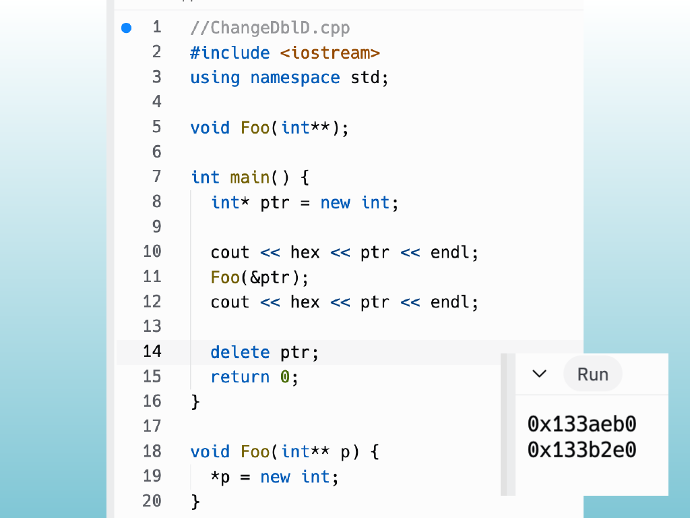{width="100%" fig-alt="Source Slide 62"}

<!-- Slide 62 -->
