<!-- Topic: Dynamic Memory Allocation -->
<!-- Slides 20–31 -->

# Dynamic Memory Allocation

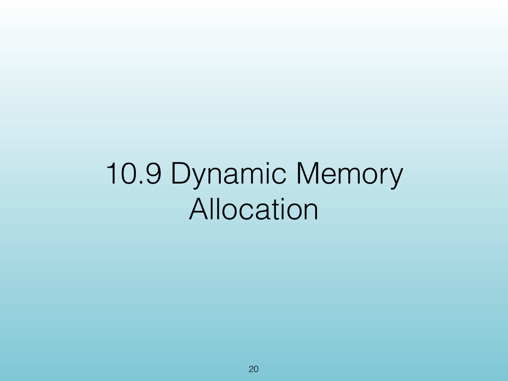{width="100%" fig-alt="Dynamic Memory Allocation"}

::: notes
Slides 20–31
Source slide 20 from the authoritative PDF.
:::

<!-- Slide 20 -->

---

## Source Slide 21

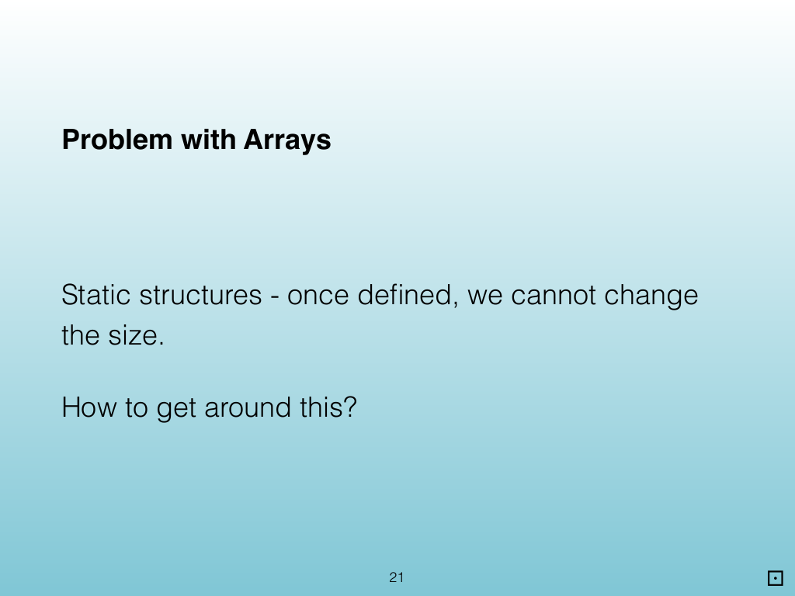{width="100%" fig-alt="Problem with Arrays"}

<!-- Slide 21 -->

---

## Source Slide 22

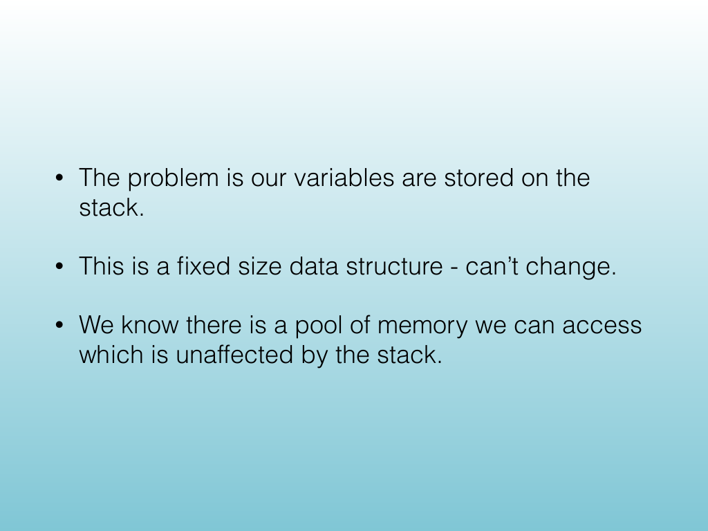{width="100%" fig-alt="• The problem is our variables are stored on the"}

<!-- Slide 22 -->

---

## Source Slide 23

{width="100%" fig-alt="Access to the Heap"}

<!-- Slide 23 -->

---

## Source Slide 24

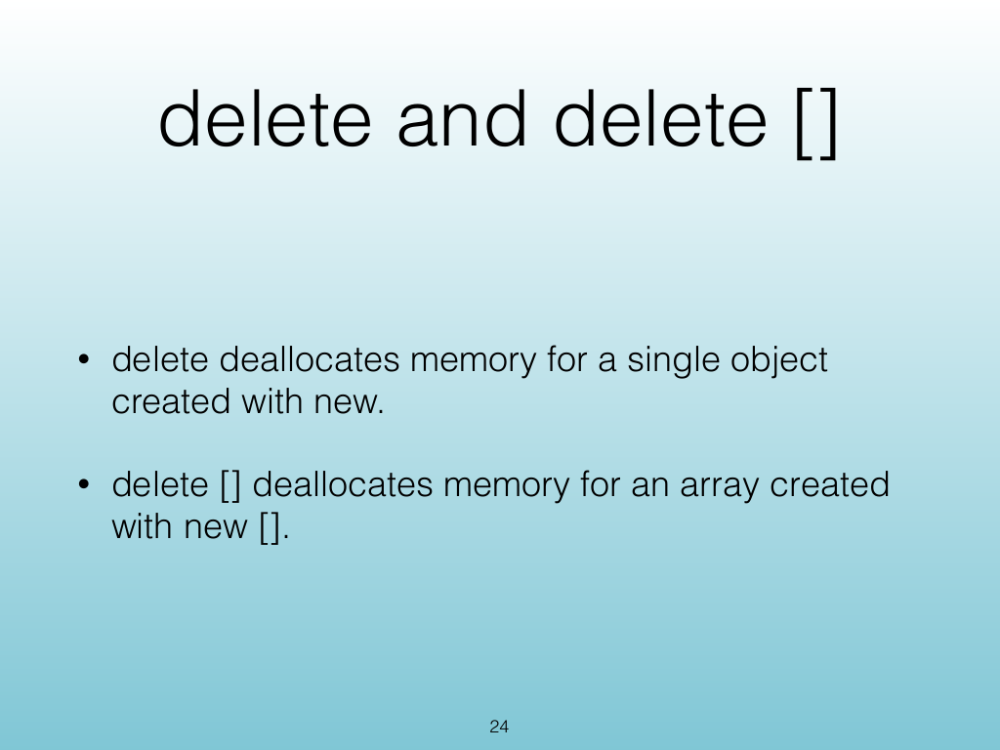{width="100%" fig-alt="delete and delete []"}

<!-- Slide 24 -->

---

## Source Slide 25

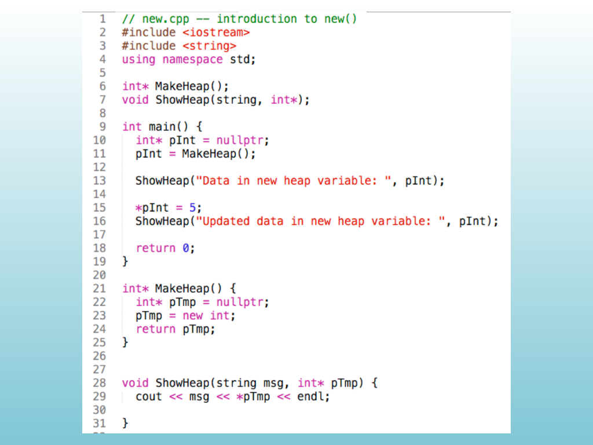{width="100%" fig-alt="Source Slide 25"}

<!-- Slide 25 -->

---

## Source Slide 26

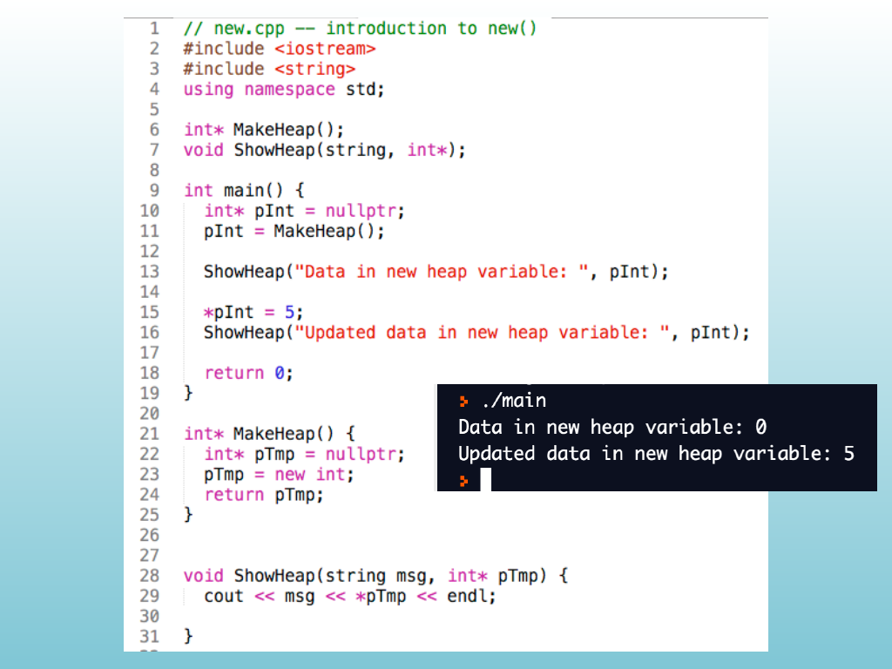{width="100%" fig-alt="Source Slide 26"}

<!-- Slide 26 -->

---

## Source Slide 27

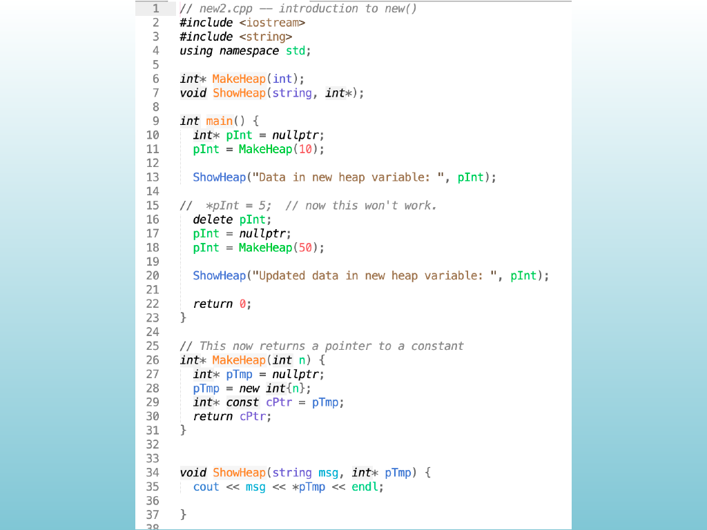{width="100%" fig-alt="Source Slide 27"}

<!-- Slide 27 -->

---

## Source Slide 28

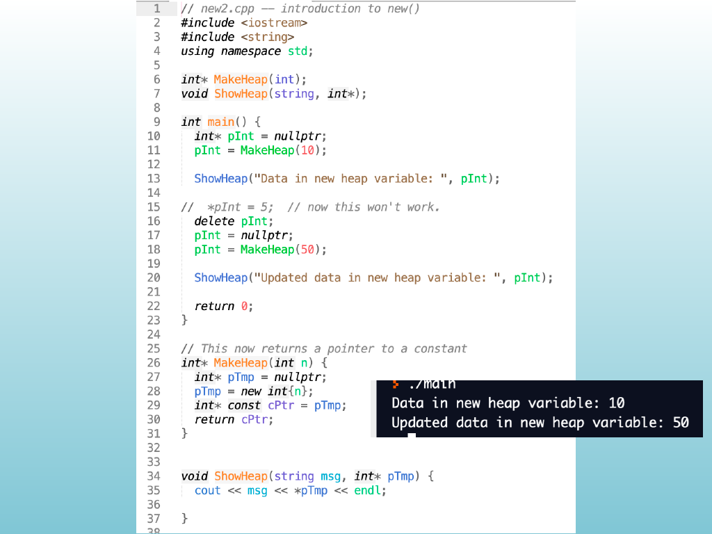{width="100%" fig-alt="Source Slide 28"}

<!-- Slide 28 -->

---

## Source Slide 29

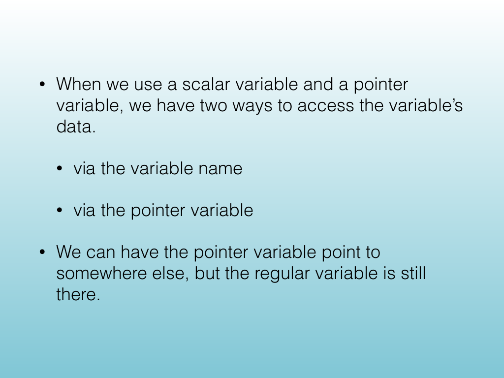{width="100%" fig-alt="• When we use a scalar variable and a pointer"}

<!-- Slide 29 -->

---

## Source Slide 30

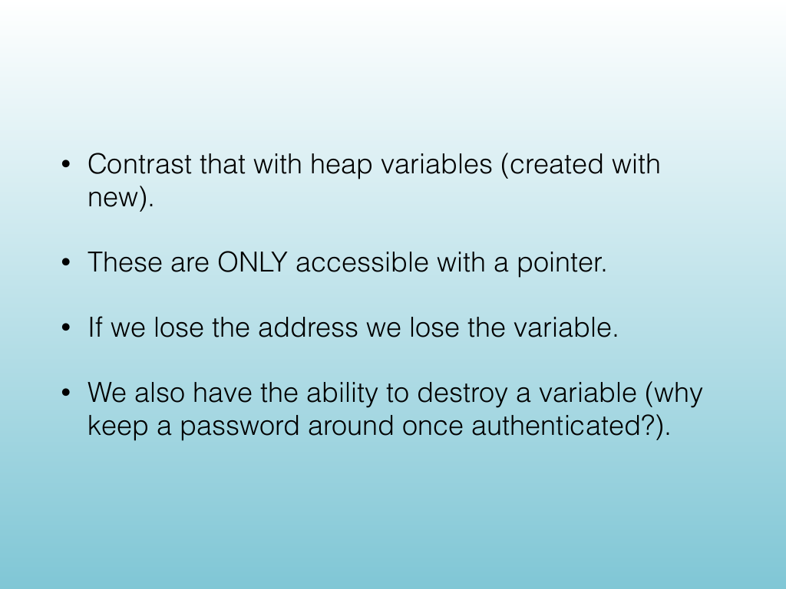{width="100%" fig-alt="• Contrast that with heap variables (created with"}

<!-- Slide 30 -->

---

## Source Slide 31

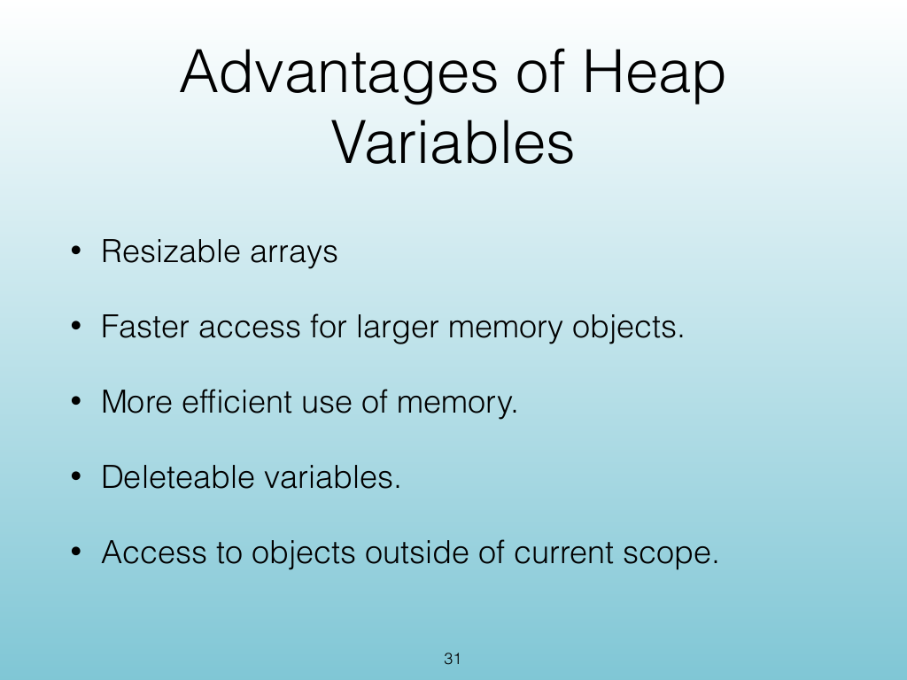{width="100%" fig-alt="Advantages of Heap"}

<!-- Slide 31 -->
