<!-- Topic: C++ Memory Model and Pointer Review -->
<!-- Slides 4–14 -->

# C++ Memory Model and Pointer Review

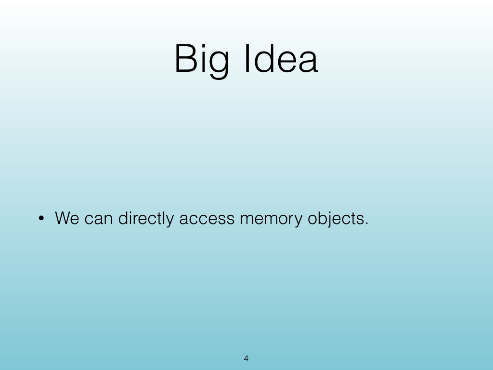{width="100%" fig-alt="C++ Memory Model and Pointer Review"}

::: notes
Slides 4–14
Source slide 4 from the authoritative PDF.
:::

<!-- Slide 4 -->

---

## Source Slide 5

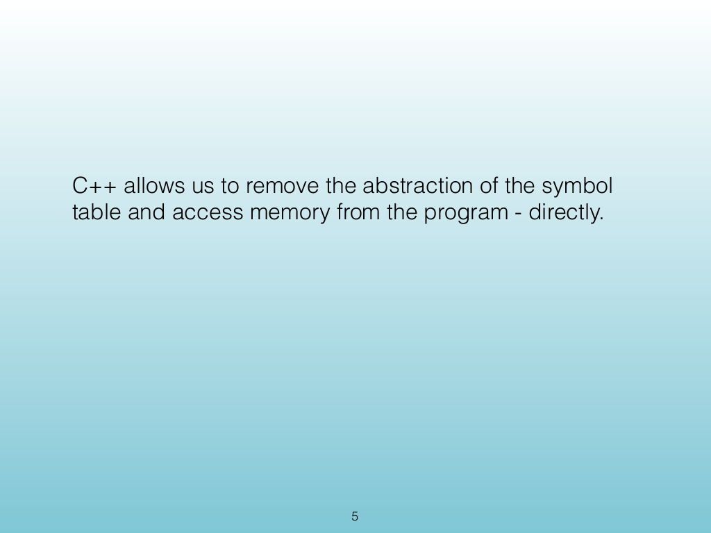{width="100%" fig-alt="C++ allows us to remove the abstraction of the symbol"}

<!-- Slide 5 -->

---

## Source Slide 6

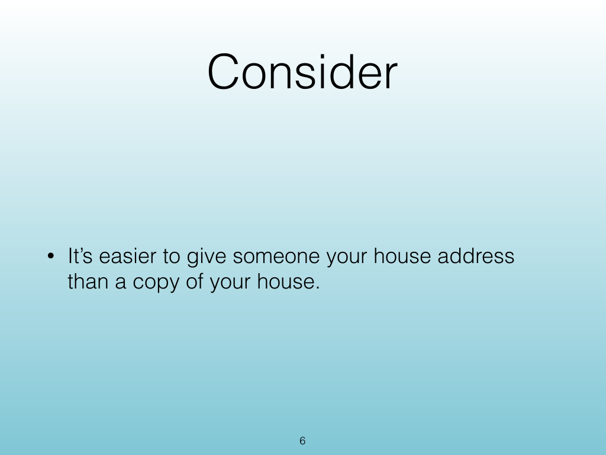{width="100%" fig-alt="Consider"}

<!-- Slide 6 -->

---

## Source Slide 7

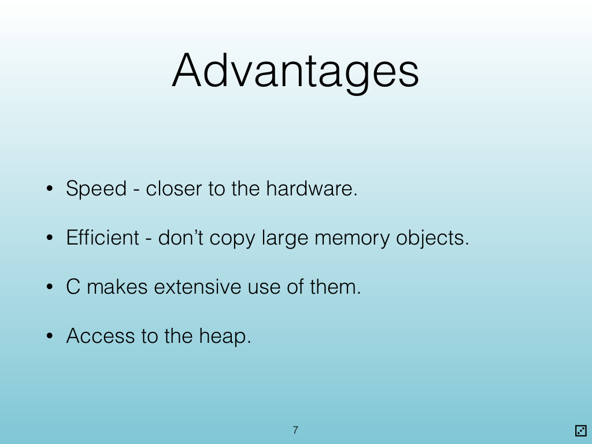{width="100%" fig-alt="Advantages"}

<!-- Slide 7 -->

---

## Source Slide 8

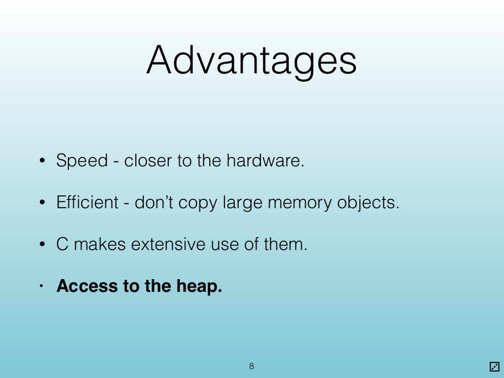{width="100%" fig-alt="Advantages"}

<!-- Slide 8 -->

---

## Source Slide 9

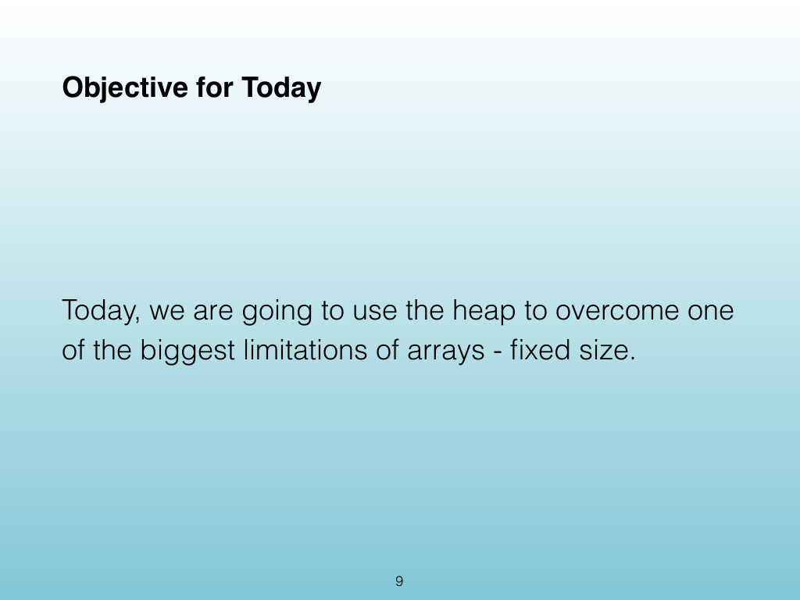{width="100%" fig-alt="Objective for Today"}

<!-- Slide 9 -->

---

## Source Slide 10

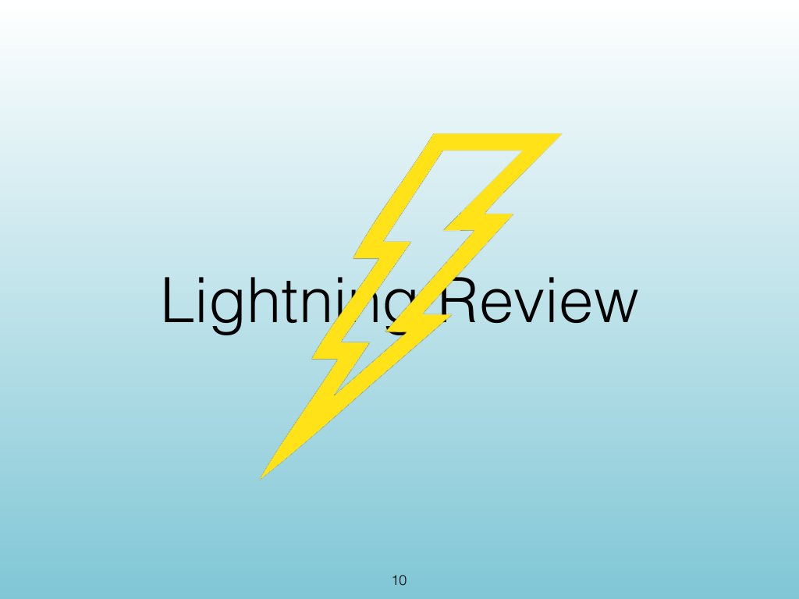{width="100%" fig-alt="Lightning Review"}

<!-- Slide 10 -->

---

## Source Slide 11

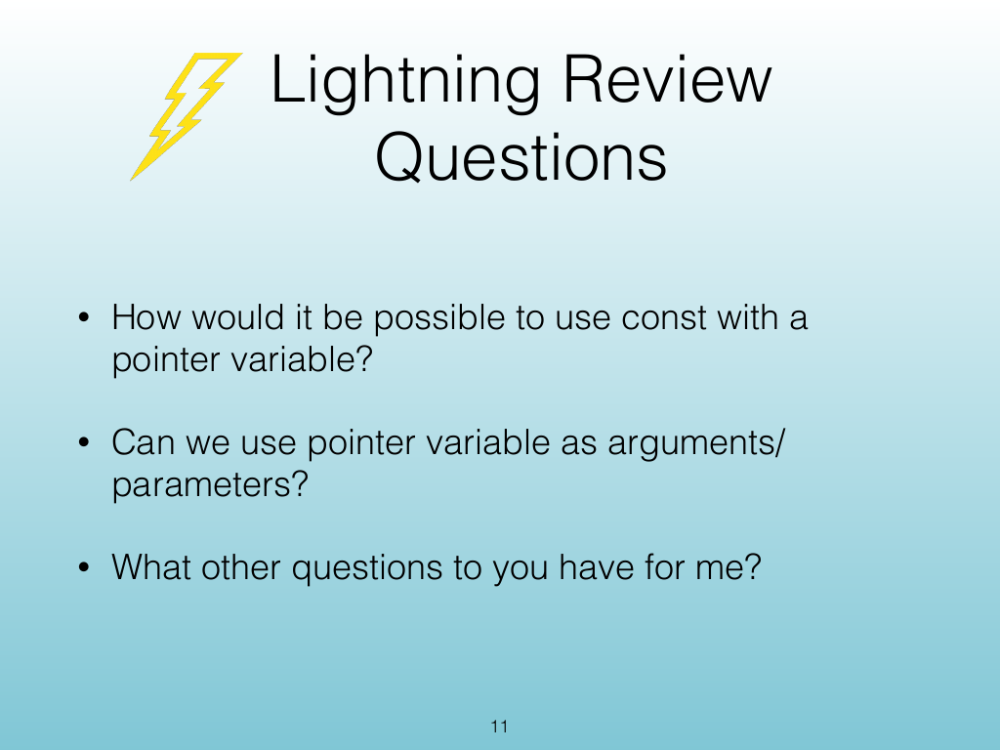{width="100%" fig-alt="Lightning Review"}

<!-- Slide 11 -->

---

## Source Slide 12

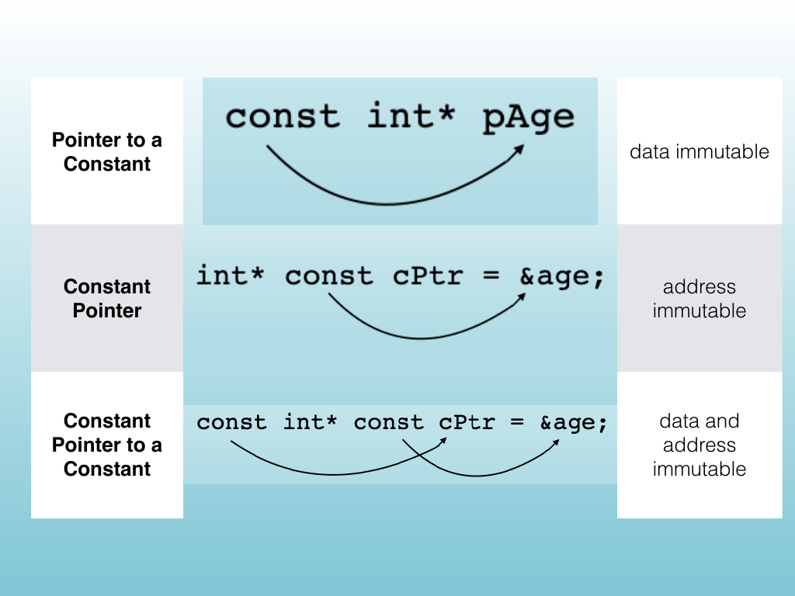{width="100%" fig-alt="Pointer to a"}

<!-- Slide 12 -->

---

## Source Slide 13

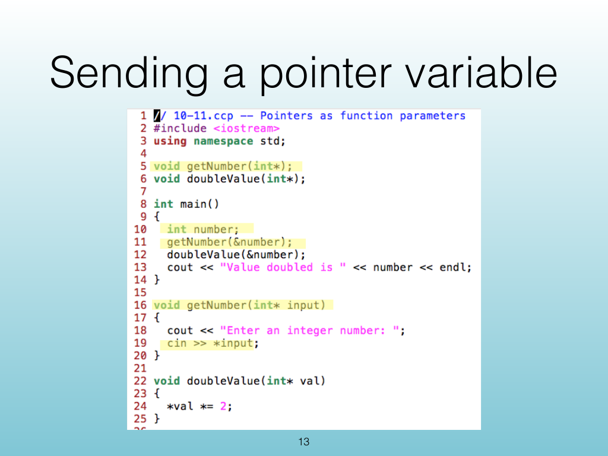{width="100%" fig-alt="Sending a pointer variable"}

<!-- Slide 13 -->

---

## Source Slide 14

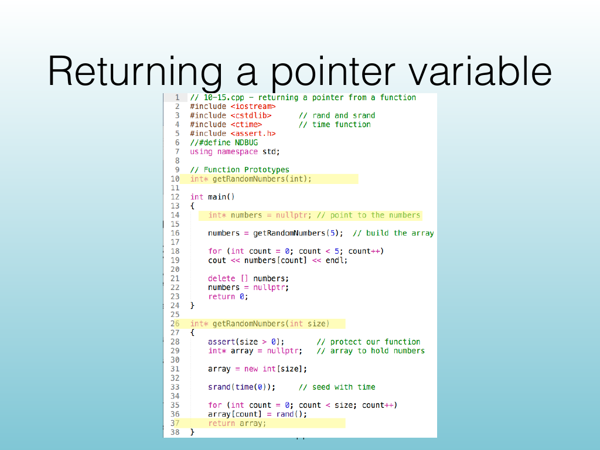{width="100%" fig-alt="Returning a pointer variable"}

<!-- Slide 14 -->
