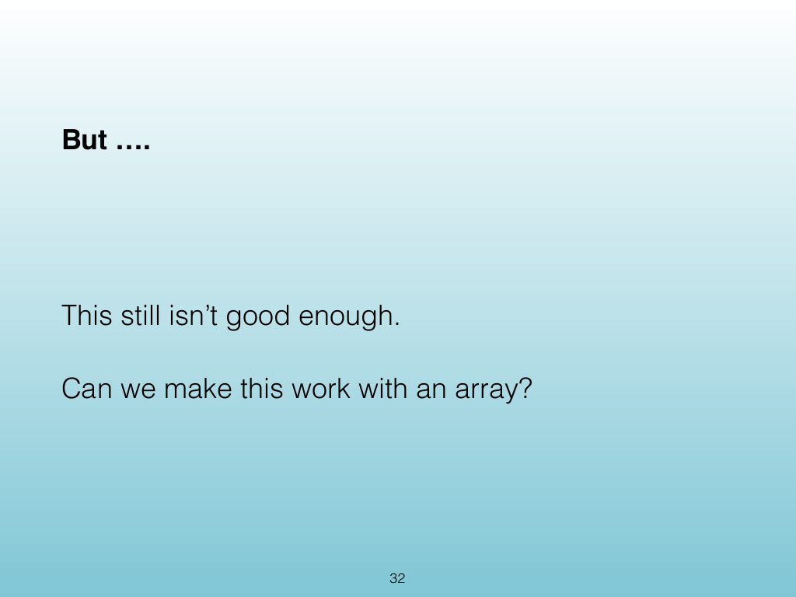
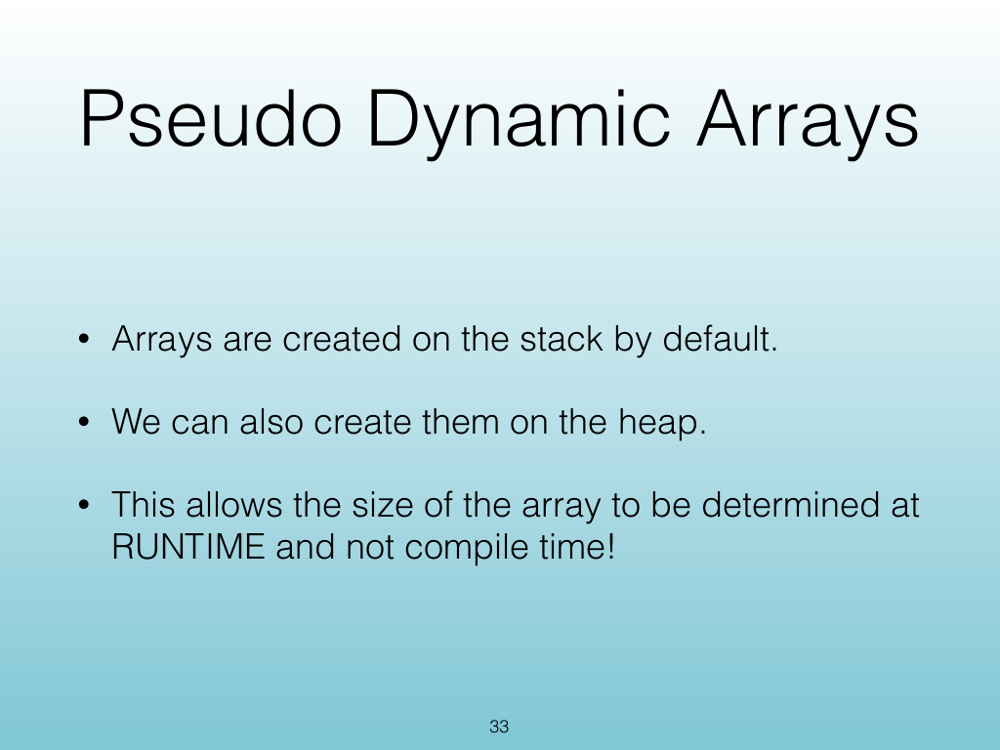
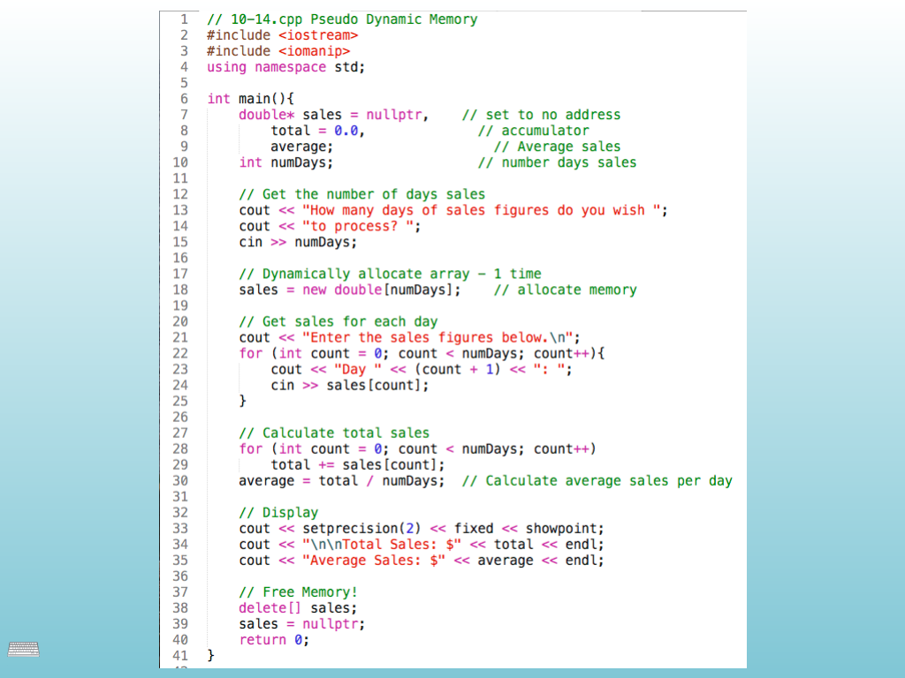
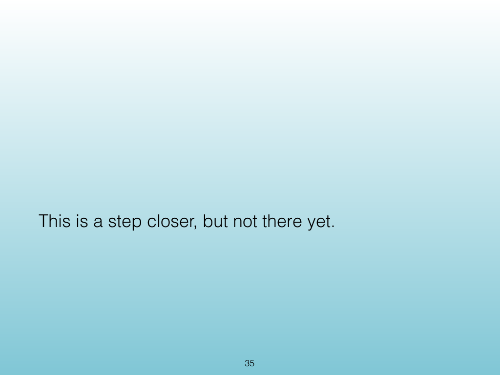
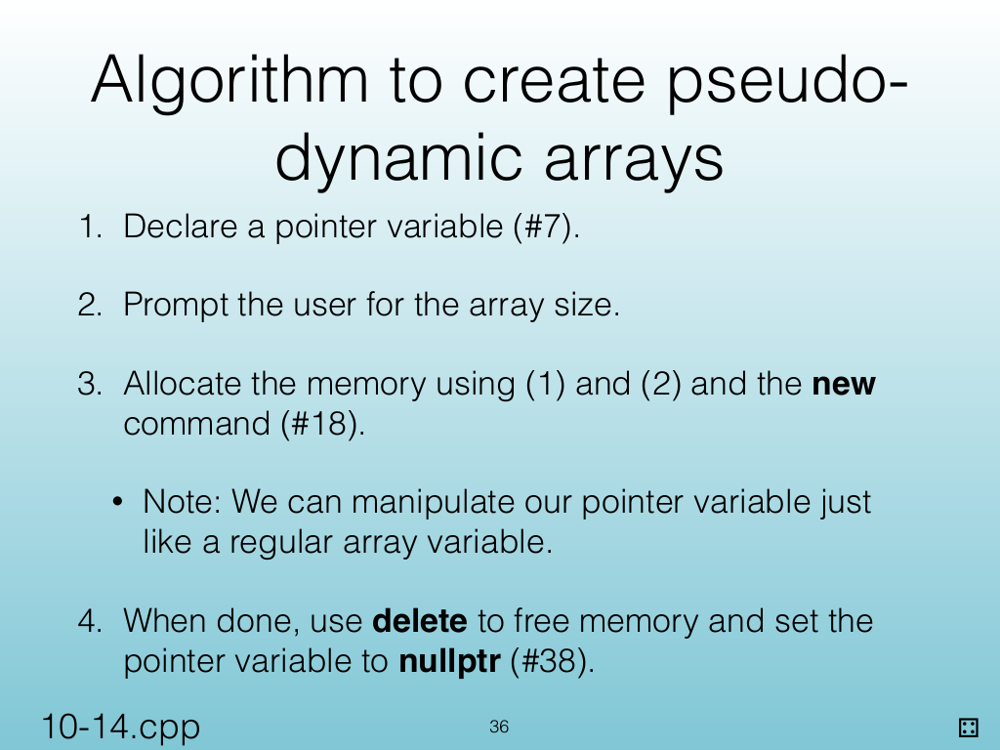
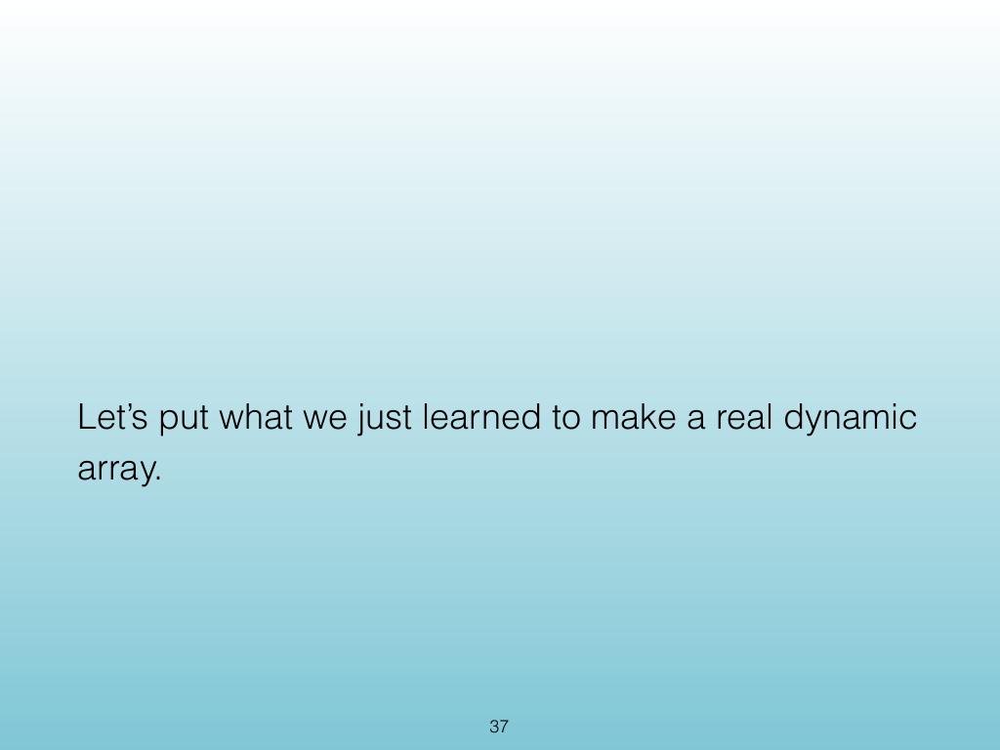
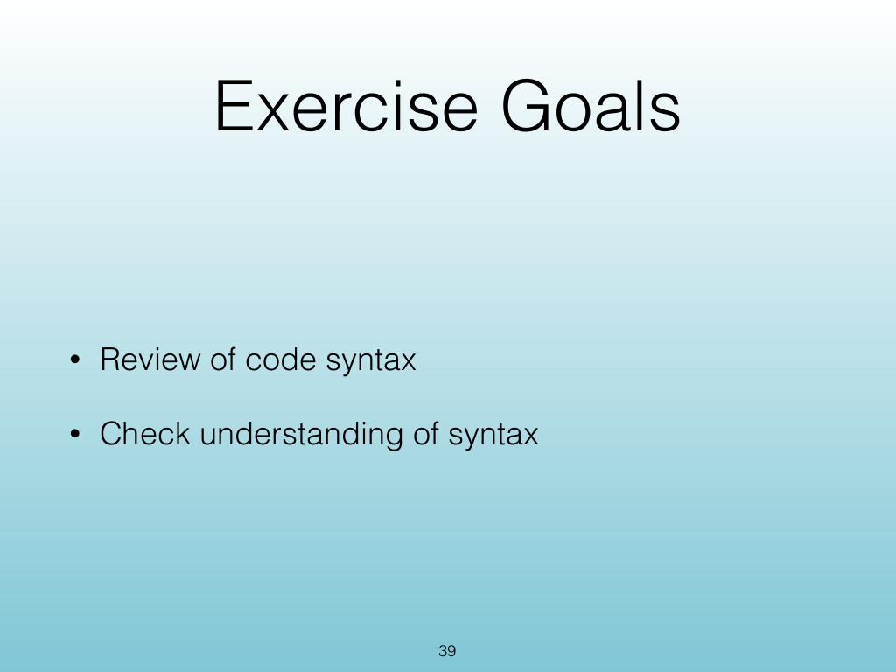
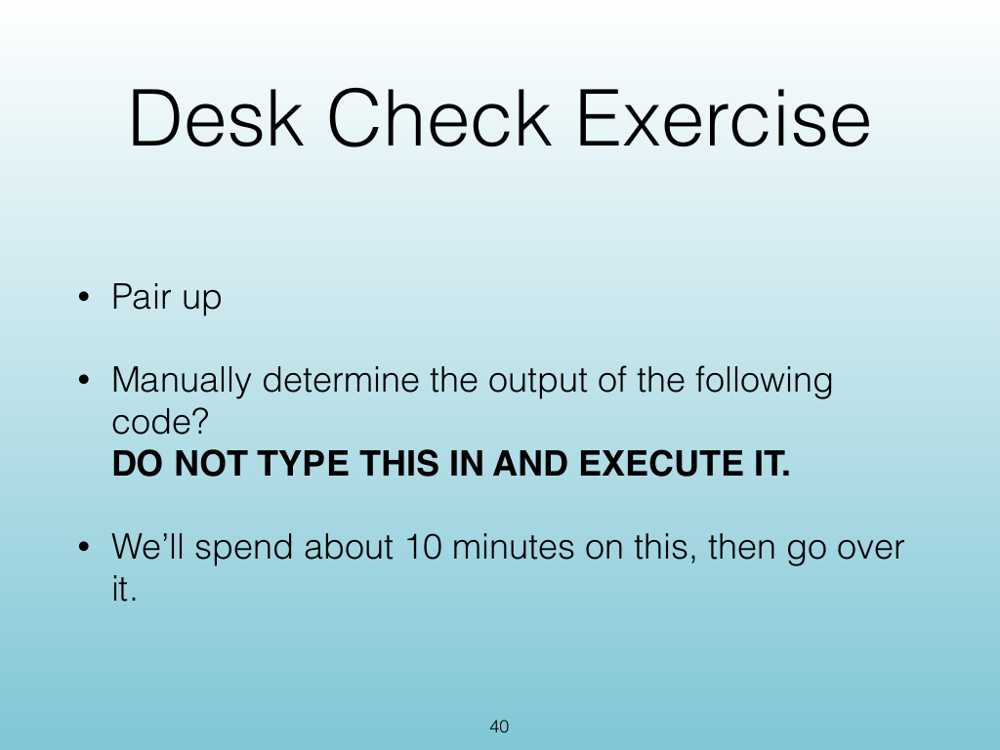
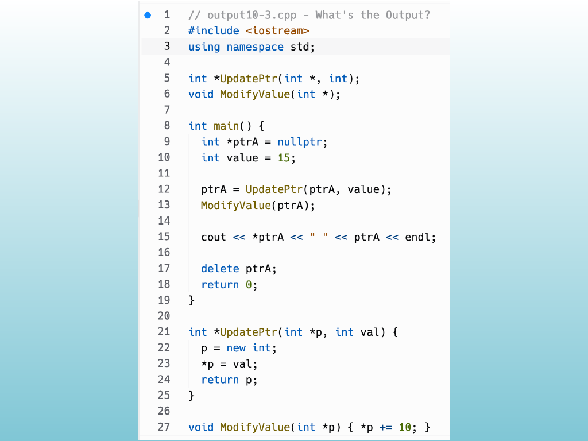
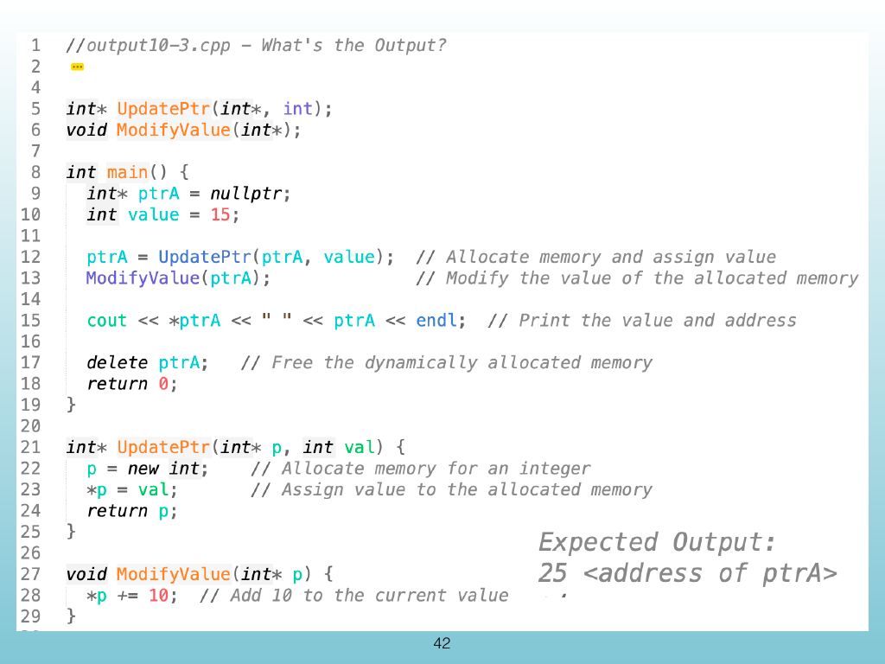

<!-- Topic: Pseudo-Dynamic Arrays -->
<!-- Slides 32–42 -->

# Pseudo-Dynamic Arrays

{width="100%" fig-alt="Pseudo-Dynamic Arrays"}

::: notes
Slides 32–42
Source slide 32 from the authoritative PDF.
:::

<!-- Slide 32 -->

---

## Source Slide 33

{width="100%" fig-alt="Pseudo Dynamic Arrays"}

<!-- Slide 33 -->

---

## Source Slide 34

{width="100%" fig-alt="⌨"}

<!-- Slide 34 -->

---

## Source Slide 35

{width="100%" fig-alt="This is a step closer, but not there yet."}

<!-- Slide 35 -->

---

## Source Slide 36

{width="100%" fig-alt="Algorithm to create pseudo-"}

<!-- Slide 36 -->

---

## Source Slide 37

{width="100%" fig-alt="Let’s put what we just learned to make a real dynamic"}

<!-- Slide 37 -->

---

## Source Slide 38

{width="100%" fig-alt="Exercise"}

<!-- Slide 38 -->

---

## Source Slide 39

{width="100%" fig-alt="Exercise Goals"}

<!-- Slide 39 -->

---

## Source Slide 40

{width="100%" fig-alt="Desk Check Exercise"}

<!-- Slide 40 -->

---

## Source Slide 41

{width="100%" fig-alt="Source Slide 41"}

<!-- Slide 41 -->

---

## Source Slide 42

{width="100%" fig-alt="42"}

<!-- Slide 42 -->
