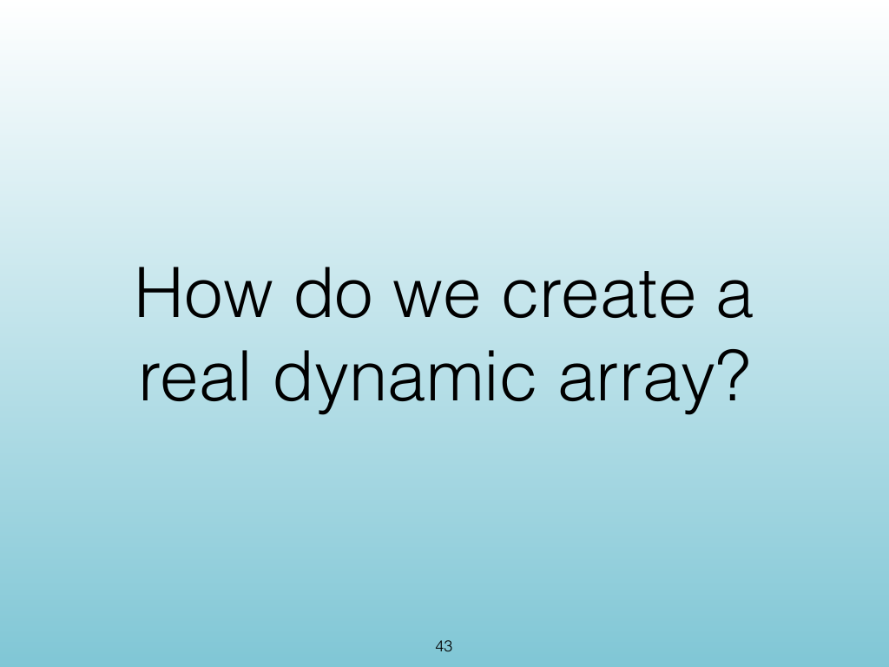
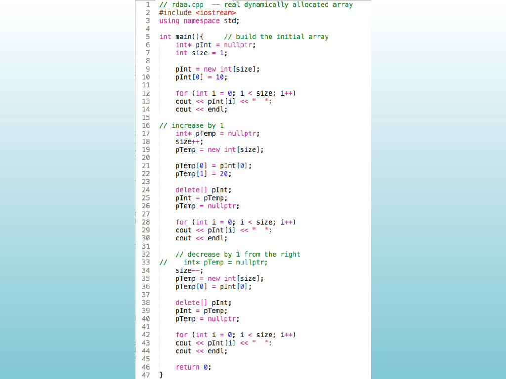
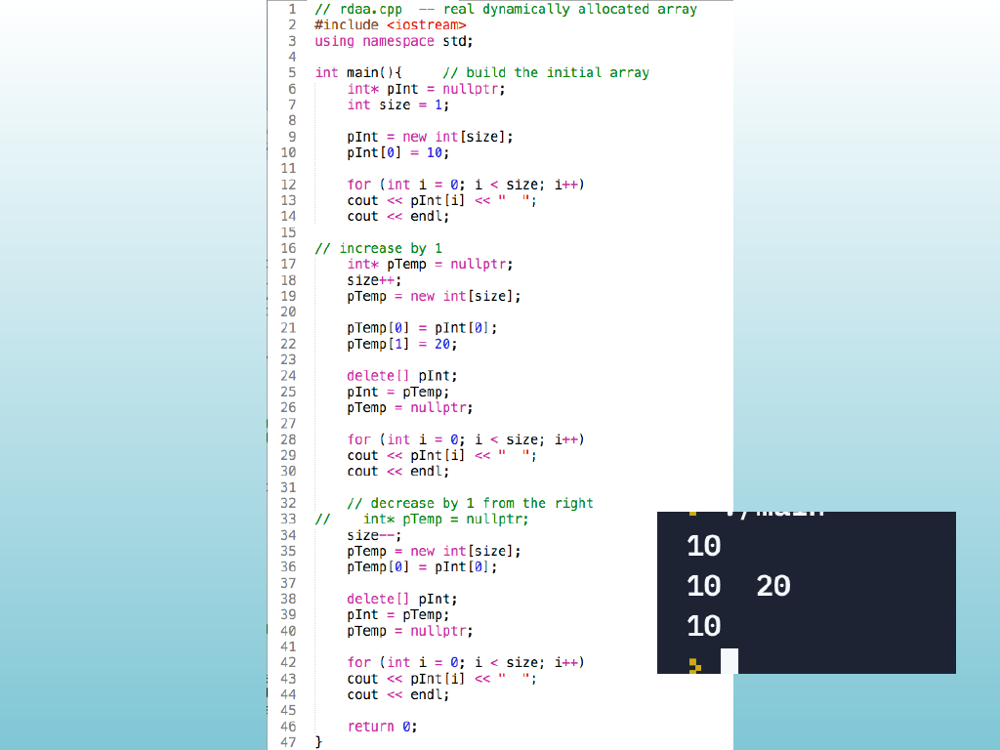
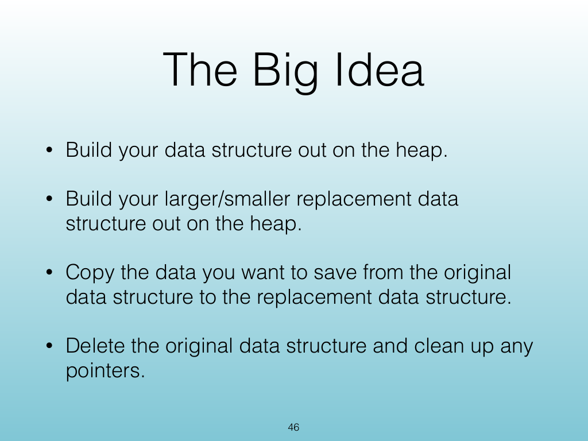
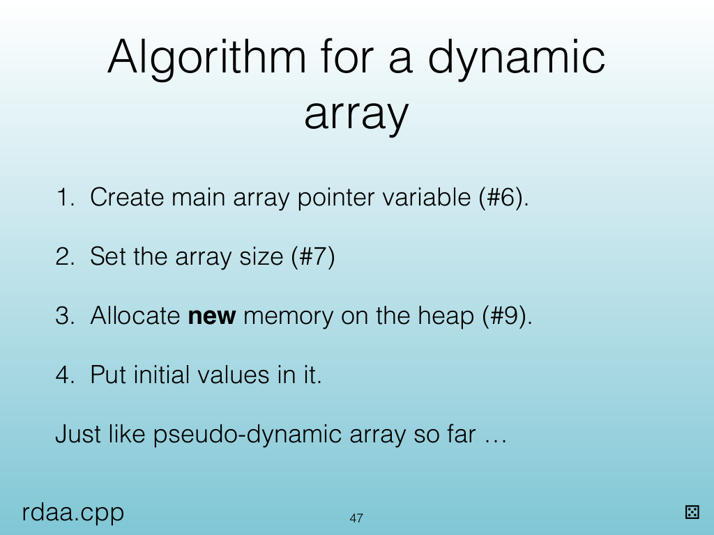
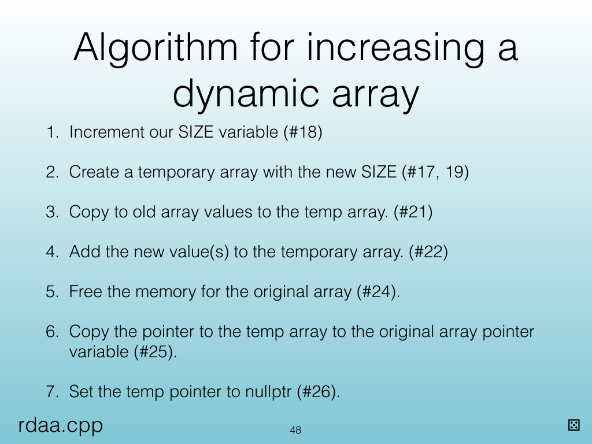
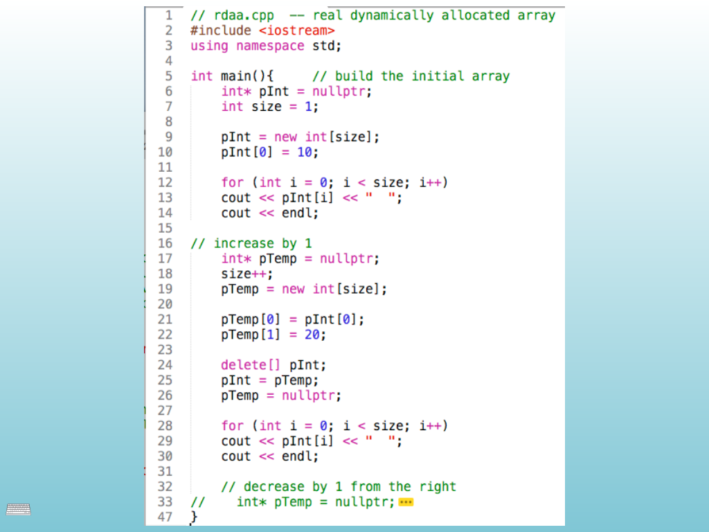
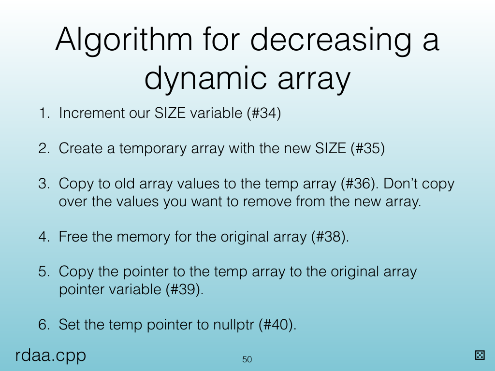
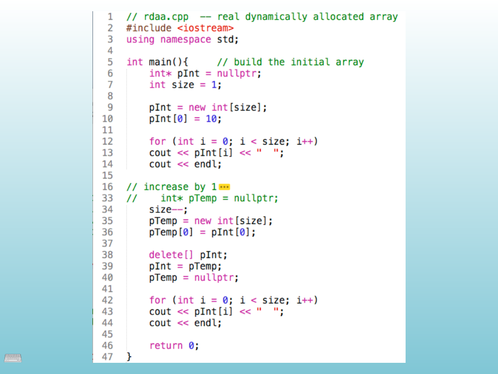

<!-- Topic: Real Dynamic Arrays -->
<!-- Slides 43–52 -->

# Real Dynamic Arrays

{width="100%" fig-alt="Real Dynamic Arrays"}

::: notes
Slides 43–52
Source slide 43 from the authoritative PDF.
:::

<!-- Slide 43 -->

---

## Source Slide 44

{width="100%" fig-alt="Source Slide 44"}

<!-- Slide 44 -->

---

## Source Slide 45

{width="100%" fig-alt="Source Slide 45"}

<!-- Slide 45 -->

---

## Source Slide 46

{width="100%" fig-alt="The Big Idea"}

<!-- Slide 46 -->

---

## Source Slide 47

{width="100%" fig-alt="Algorithm for a dynamic"}

<!-- Slide 47 -->

---

## Source Slide 48

{width="100%" fig-alt="Algorithm for increasing a"}

<!-- Slide 48 -->

---

## Source Slide 49

{width="100%" fig-alt="⌨"}

<!-- Slide 49 -->

---

## Source Slide 50

{width="100%" fig-alt="Algorithm for decreasing a"}

<!-- Slide 50 -->

---

## Source Slide 51

{width="100%" fig-alt="⌨"}

<!-- Slide 51 -->

---

## Source Slide 52

{width="100%" fig-alt="Program This"}

<!-- Slide 52 -->
