<!-- Topic: Lecture Wrap-Up -->
<!-- Slides 55–65 -->

# Lecture Wrap-Up

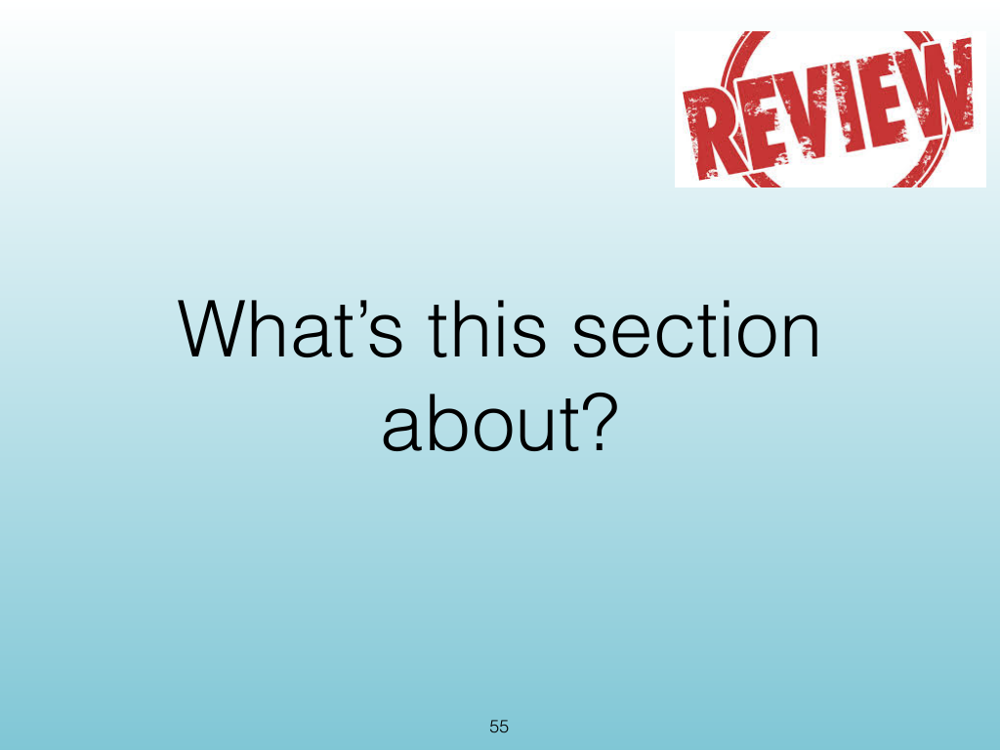{width="100%" fig-alt="Lecture Wrap-Up"}

::: notes
Slides 55–65
Source slide 55 from the authoritative PDF.
:::

<!-- Slide 55 -->

---

## Source Slide 56

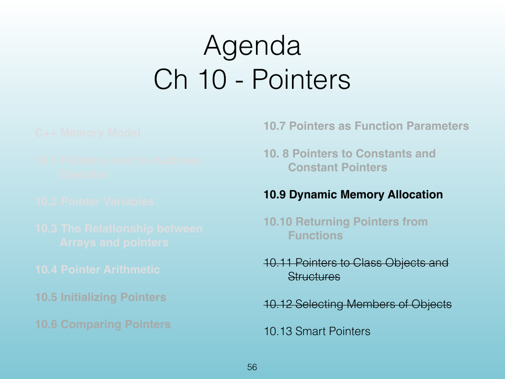{width="100%" fig-alt="Agenda"}

<!-- Slide 56 -->

---

## Source Slide 57

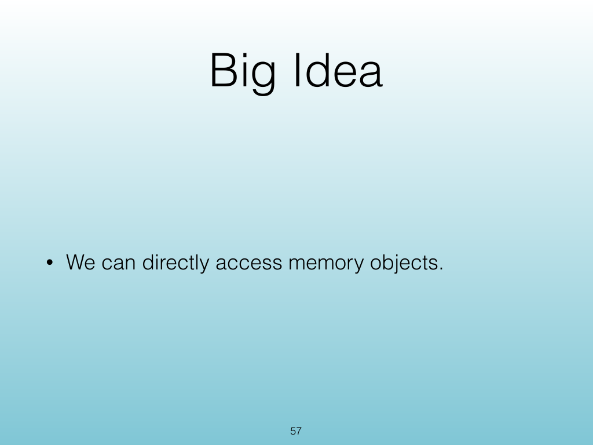{width="100%" fig-alt="Big Idea"}

<!-- Slide 57 -->

---

## Source Slide 58

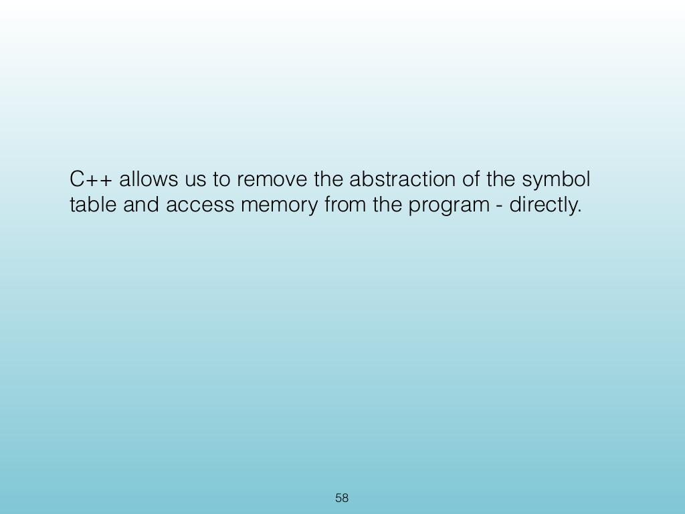{width="100%" fig-alt="C++ allows us to remove the abstraction of the symbol"}

<!-- Slide 58 -->

---

## Source Slide 59

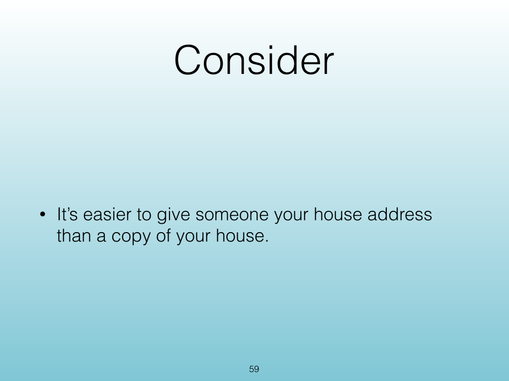{width="100%" fig-alt="Consider"}

<!-- Slide 59 -->

---

## Source Slide 60

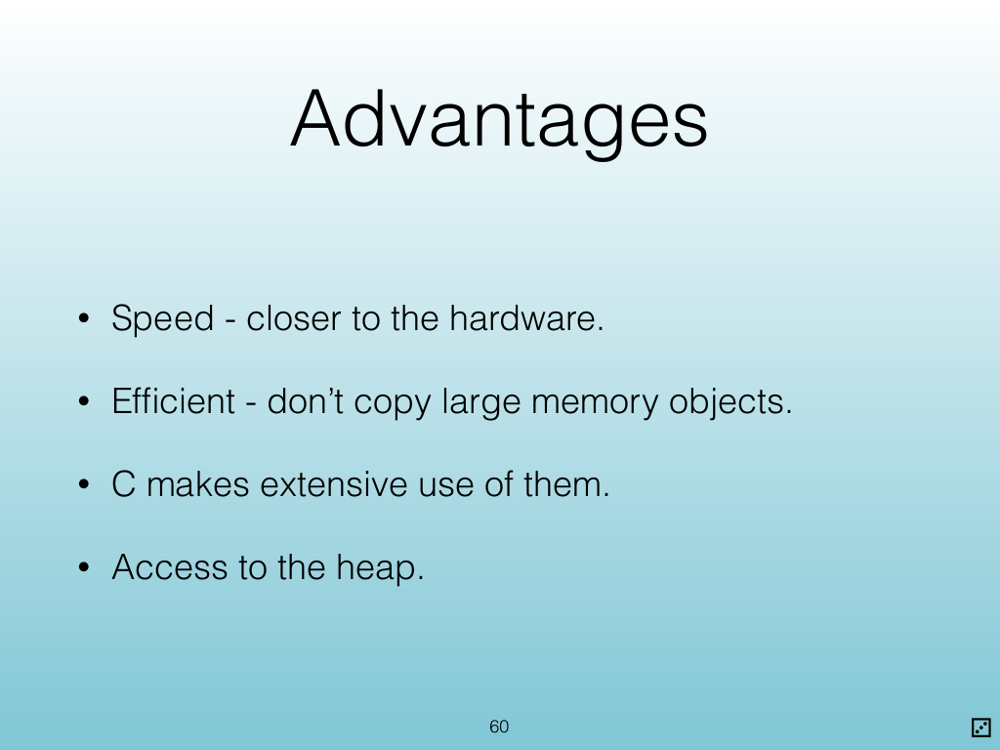{width="100%" fig-alt="Advantages"}

<!-- Slide 60 -->

---

## Source Slide 61

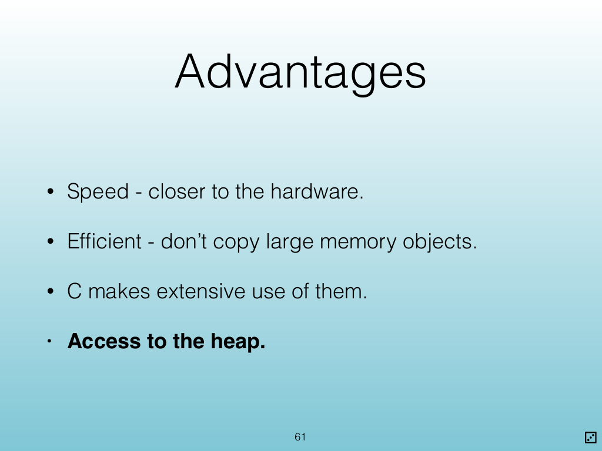{width="100%" fig-alt="Advantages"}

<!-- Slide 61 -->

---

## Source Slide 62

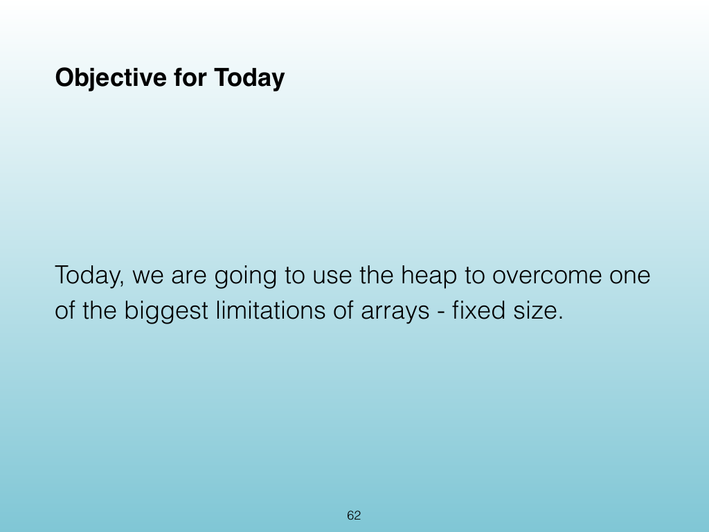{width="100%" fig-alt="Objective for Today"}

<!-- Slide 62 -->

---

## Source Slide 63

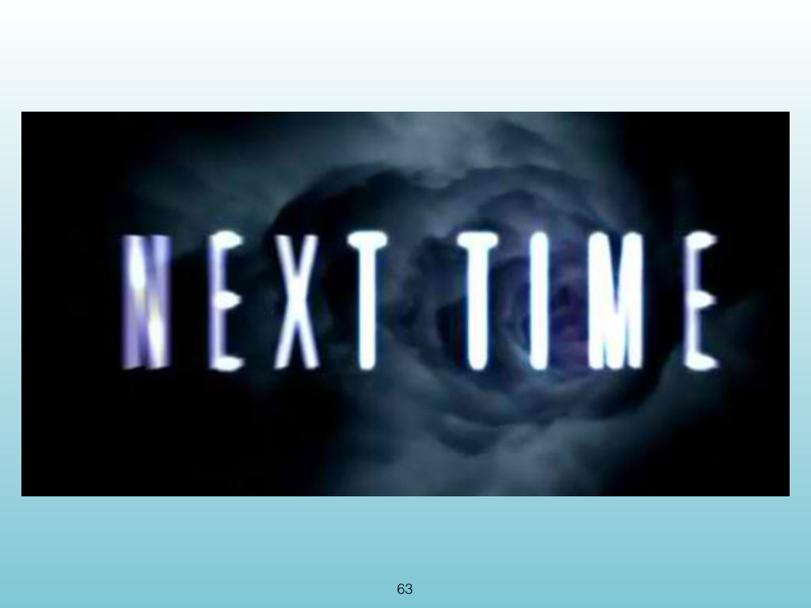{width="100%" fig-alt="63"}

<!-- Slide 63 -->

---

## Source Slide 64

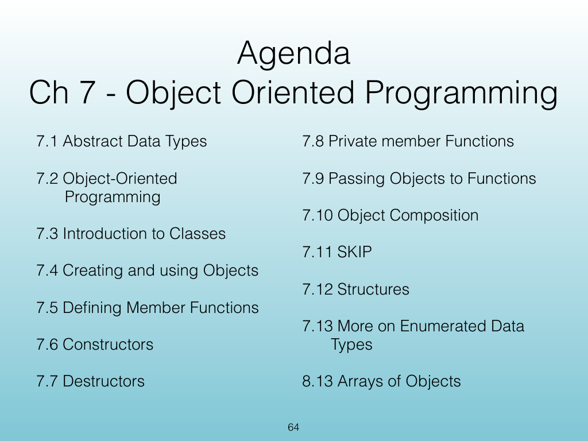{width="100%" fig-alt="Agenda"}

<!-- Slide 64 -->

---

## Source Slide 65

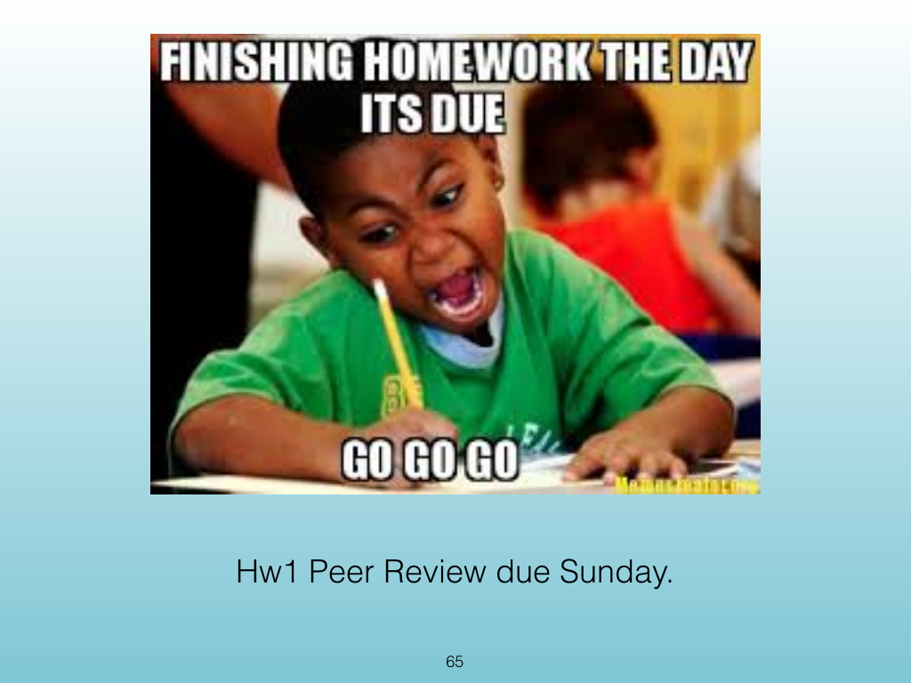{width="100%" fig-alt="Hw1 Peer Review due Sunday."}

<!-- Slide 65 -->
