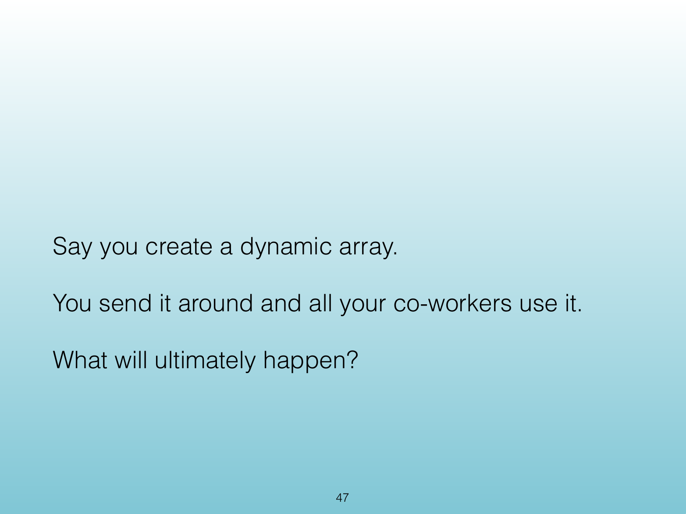
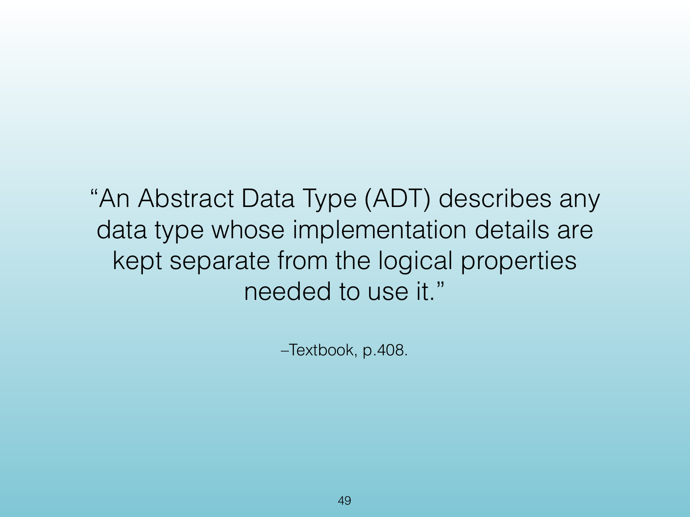
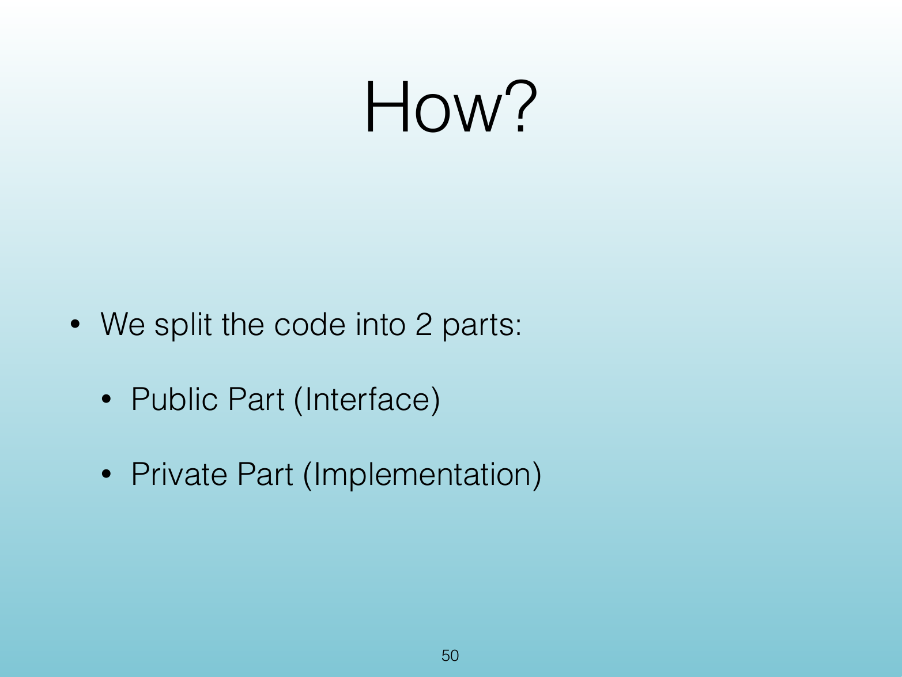
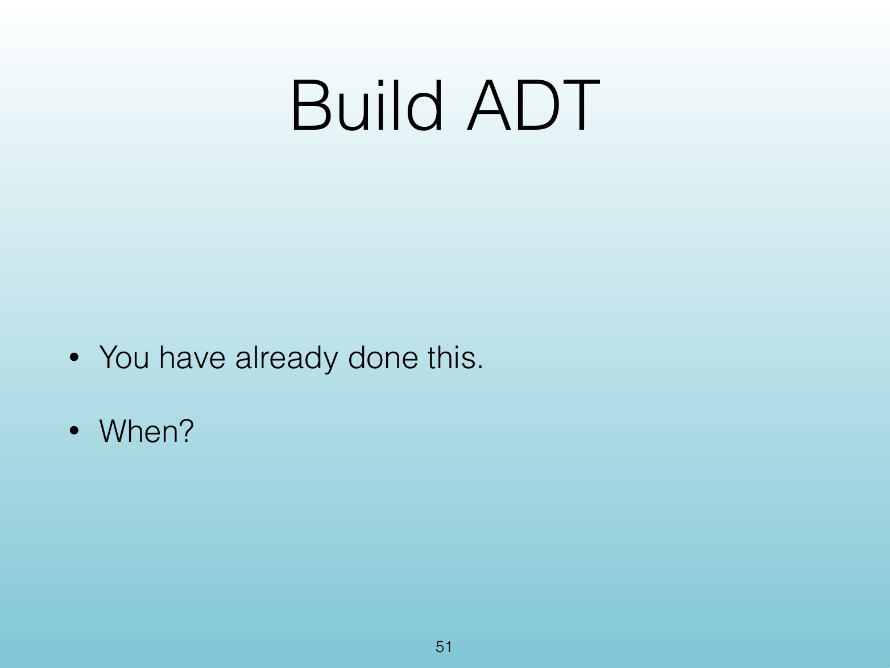
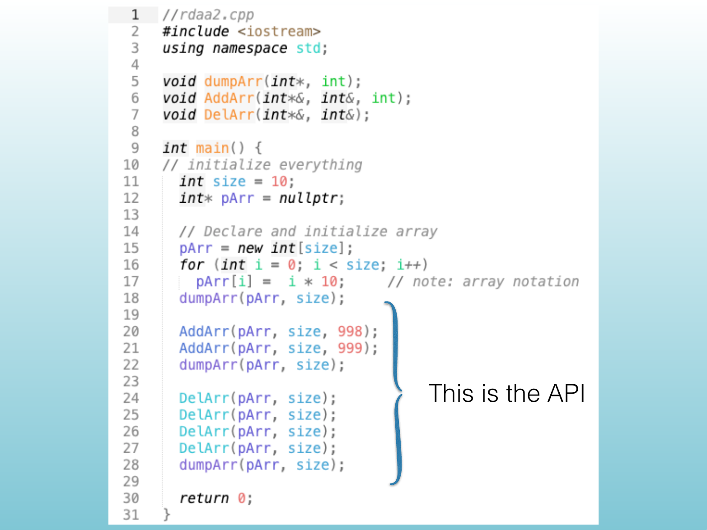
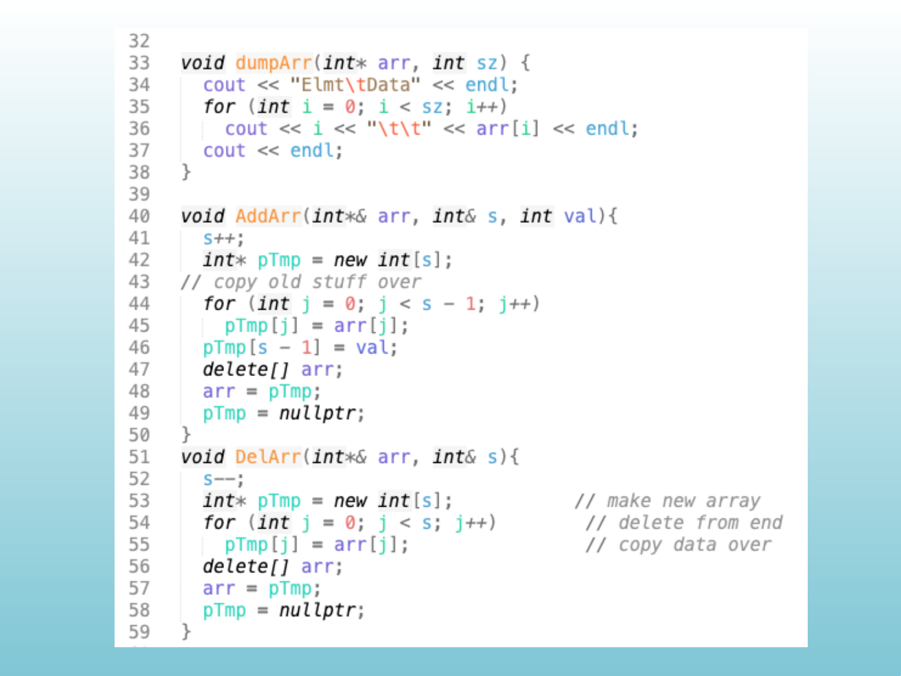
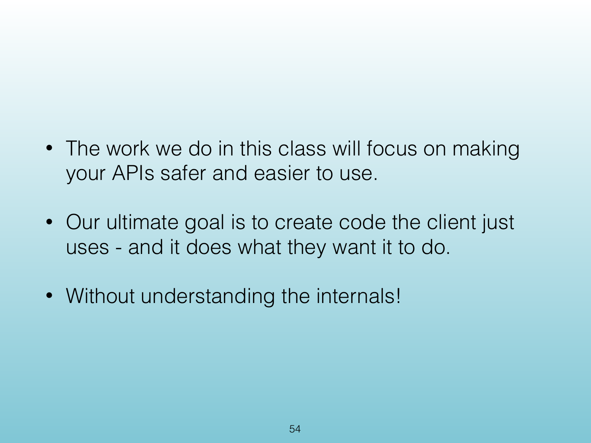

<!-- Topic: Abstract Data Types -->
<!-- Slides 47–54 -->
# Abstract Data Types

## 7.1 Abstract Data Type (ADT)

{width="100%" fig-alt="7.1 Abstract Data Type (ADT)"}

::: notes
Slides 47–54
:::

<!-- Slide 47 -->

---

## The Problem

{width="100%" fig-alt="The Problem"}

::: notes
Source PDF page 48.
:::

<!-- Slide 48 -->

---

## Someone Will Break It

{width="100%" fig-alt="Someone Will Break It"}

::: notes
Source PDF page 49.
:::

<!-- Slide 49 -->

---

## Abstract Data Type Definition

{width="100%" fig-alt="Abstract Data Type Definition"}

::: notes
Source PDF page 50.
:::

<!-- Slide 50 -->

---

## How?

{width="100%" fig-alt="How?"}

::: notes
Source PDF page 51.
:::

<!-- Slide 51 -->

---

## Build ADT

{width="100%" fig-alt="Build ADT"}

::: notes
Source PDF page 52.
:::

<!-- Slide 52 -->

---

## This Is the API

{width="100%" fig-alt="This Is the API"}

::: notes
Source PDF page 53.
:::

<!-- Slide 53 -->

---

## API Design Goal

{width="100%" fig-alt="API Design Goal"}

::: notes
Source PDF page 54.
:::

<!-- Slide 54 -->
