<!-- Topic: Classes and Objects -->
<!-- Slides 28–44 -->
# Classes and Objects

## 7.x Crash Course in Building Objects

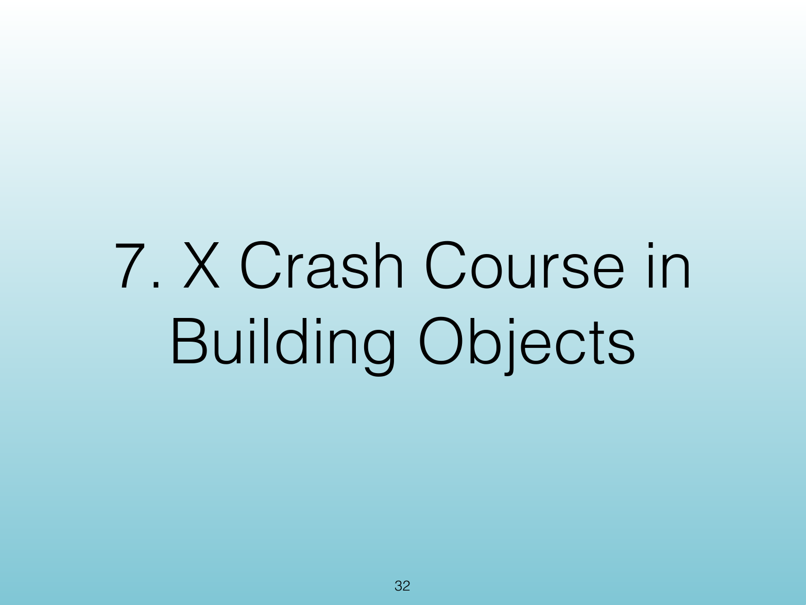{width="100%" fig-alt="7.x Crash Course in Building Objects"}

::: notes
Slides 30–44
:::

<!-- Slide 30 -->

---

## How to Construct an Object

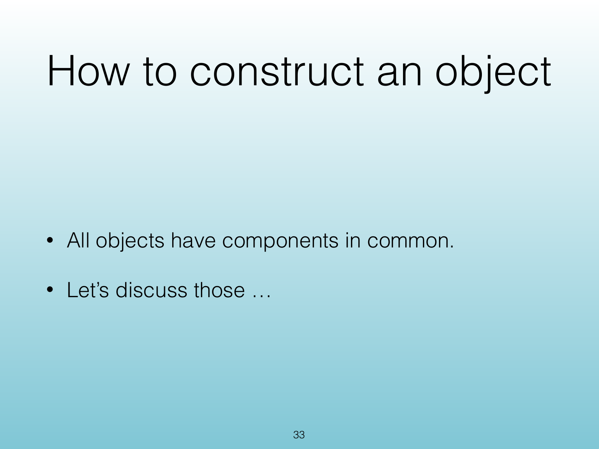{width="100%" fig-alt="How to Construct an Object"}

::: notes
Source PDF page 33.
:::

<!-- Slide 31 -->

---

## &lt;Object Construction&gt;

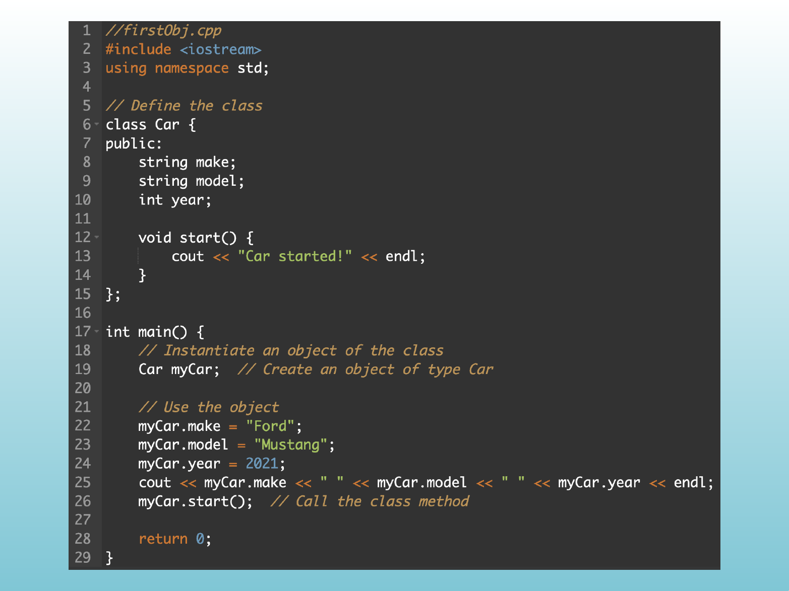{width="100%" fig-alt="<Object Construction>"}

::: notes
Source PDF page 34.
:::

<!-- Slide 32 -->

---

## &lt;Object Construction&gt;

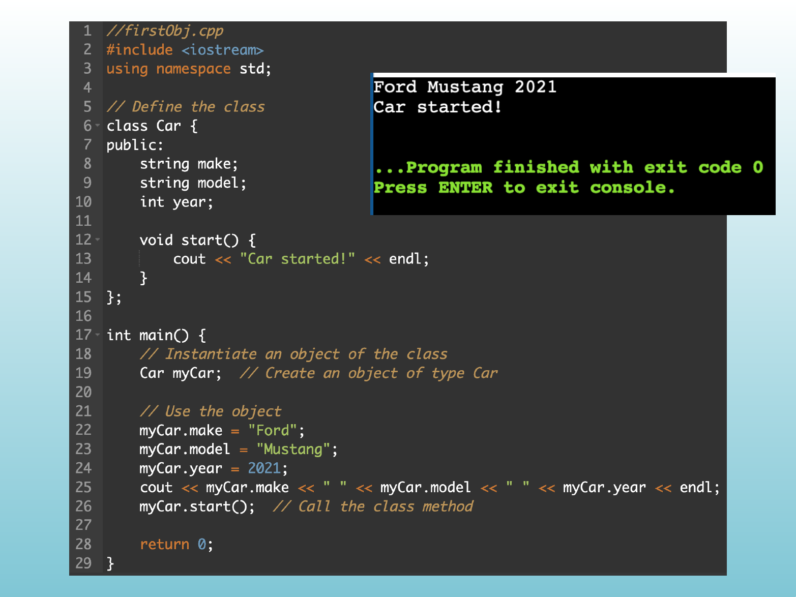{width="100%" fig-alt="<Object Construction>"}

::: notes
Source PDF page 35.
:::

<!-- Slide 33 -->

---

## Encapsulation

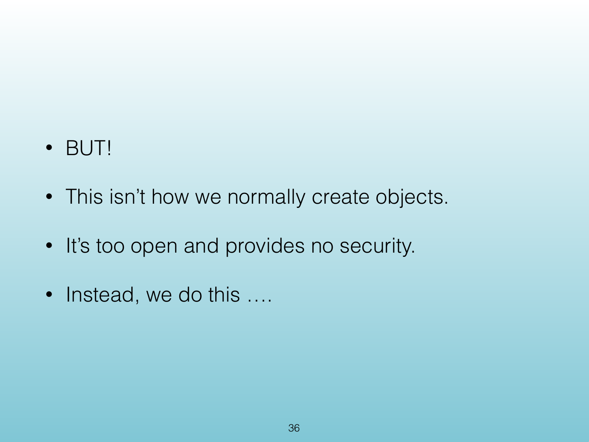{width="100%" fig-alt="Encapsulation"}

::: notes
Source PDF page 36.
:::

<!-- Slide 34 -->

---

## &lt;Encapsulation&gt;

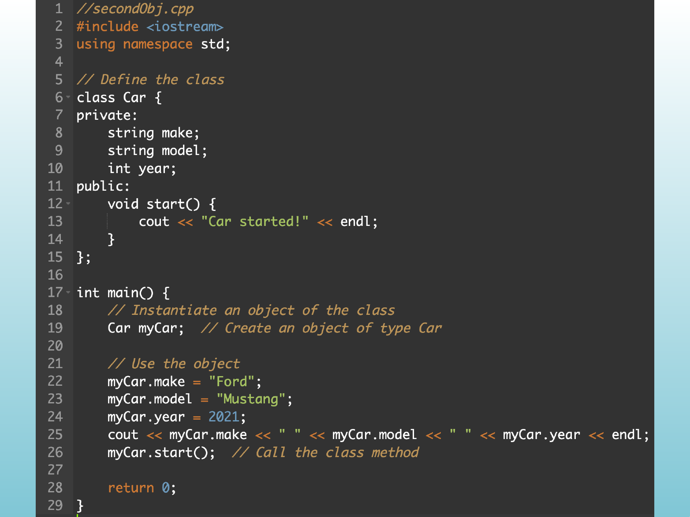{width="100%" fig-alt="<Encapsulation>"}

::: notes
Source PDF page 37.
:::

<!-- Slide 35 -->

---

## &lt;Encapsulation&gt;

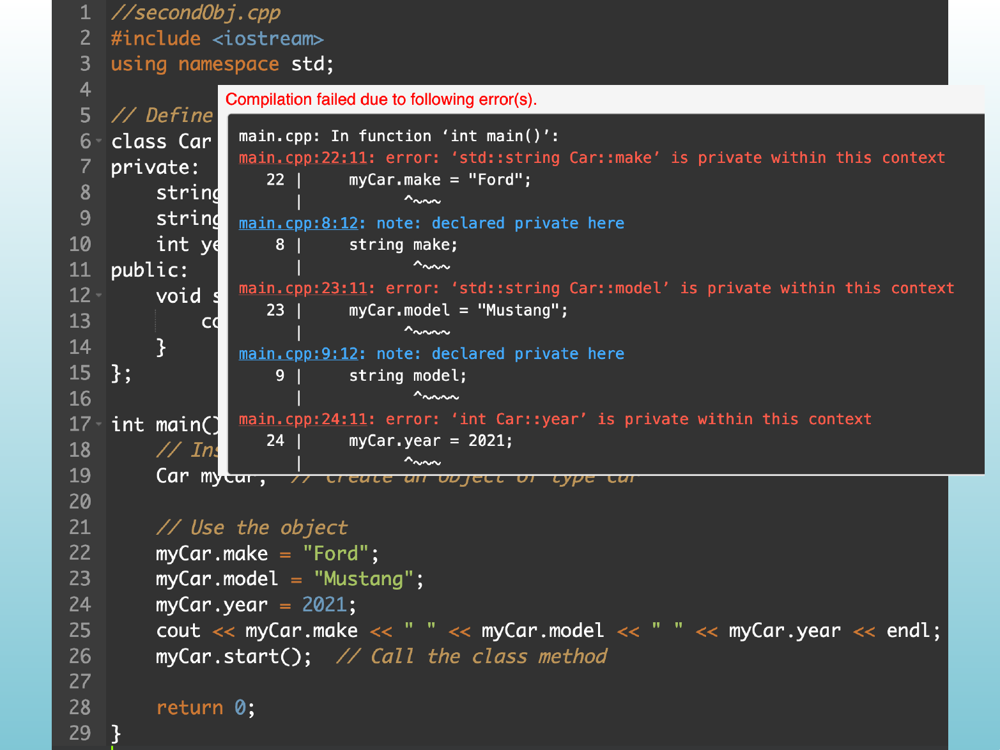{width="100%" fig-alt="<Encapsulation>"}

::: notes
Source PDF page 38.
:::

<!-- Slide 36 -->

---

## Setters and Getters

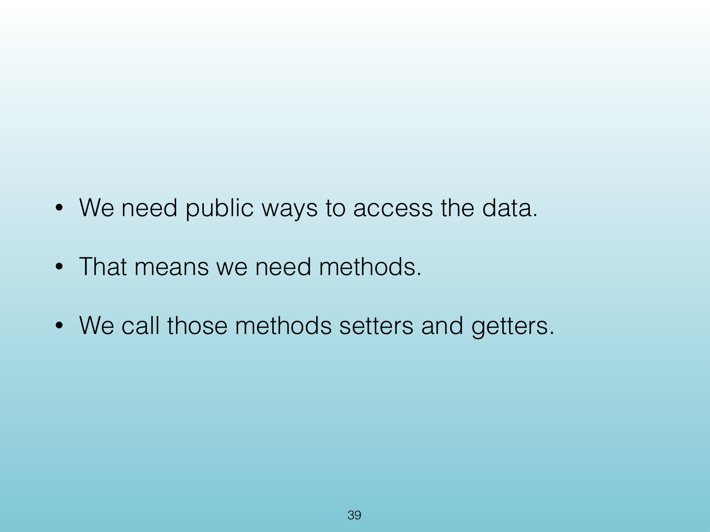{width="100%" fig-alt="Setters and Getters"}

::: notes
Source PDF page 39.
:::

<!-- Slide 37 -->

---

## &lt;Methods&gt;

{width="100%" fig-alt="<Methods>"}

::: notes
Source PDF page 40.
:::

<!-- Slide 38 -->

---

## &lt;Methods&gt;

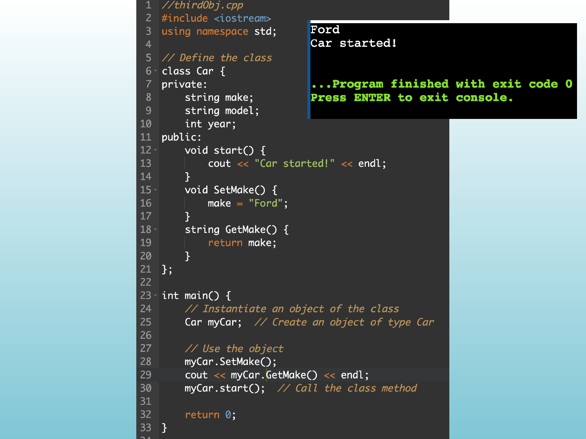{width="100%" fig-alt="<Methods>"}

::: notes
Source PDF page 41.
:::

<!-- Slide 39 -->

---

## &lt;Methods&gt;

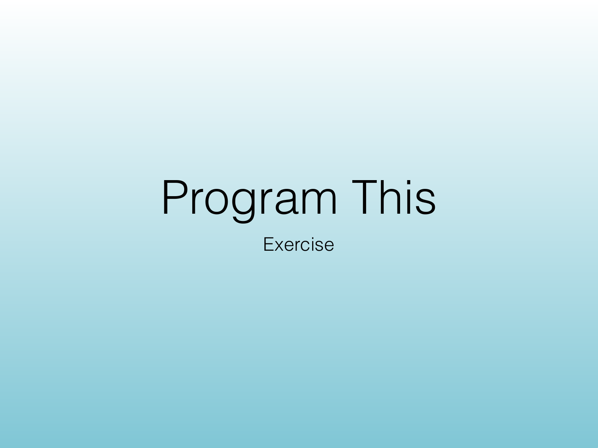{width="100%" fig-alt="<Methods>"}

::: notes
Source PDF page 42.
:::

<!-- Slide 40 -->

---

## Program This

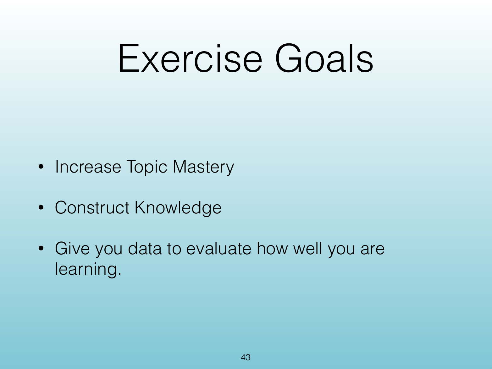{width="100%" fig-alt="Program This"}

::: notes
Source PDF page 43.
:::

<!-- Slide 41 -->

---

## Exercise Goals

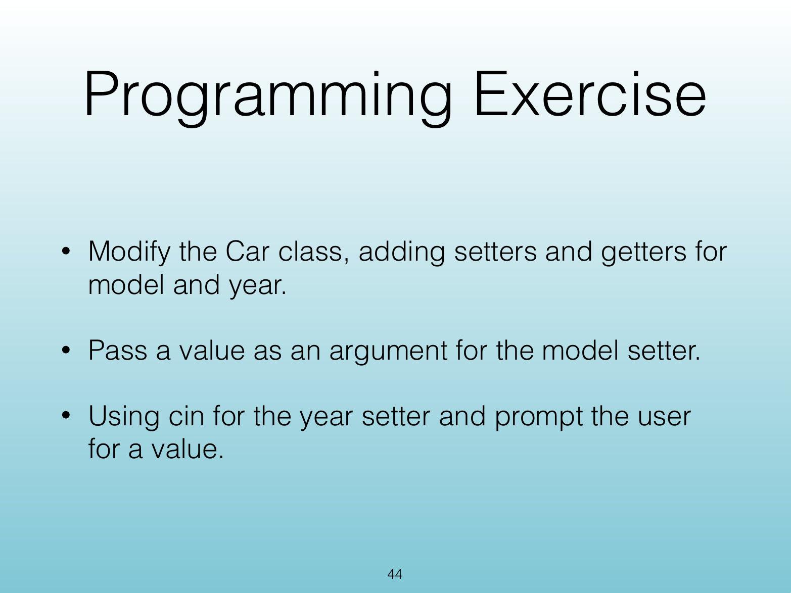{width="100%" fig-alt="Exercise Goals"}

::: notes
Source PDF page 44.
:::

<!-- Slide 42 -->

---

## Programming Exercise

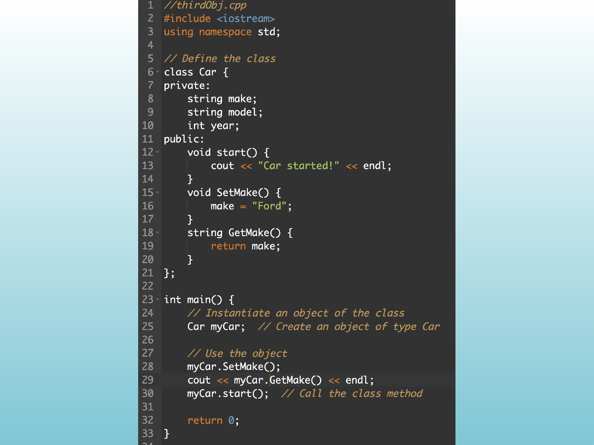{width="100%" fig-alt="Programming Exercise"}

::: notes
Source PDF page 45.
:::

<!-- Slide 43 -->

---

## &lt;Exercise Workspace&gt;

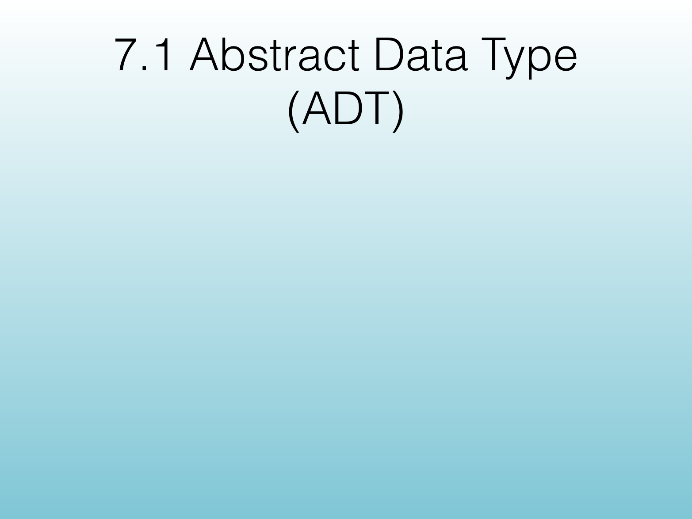{width="100%" fig-alt="<Exercise Workspace>"}

::: notes
Source PDF page 46.
:::

<!-- Slide 44 -->
