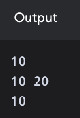
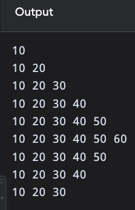

<!-- Topic: Course Framing -->
<!-- Slides 4–11 -->
# <span style="display:none">Course Framing</span>

## Class Exercise - Debrief

<!-- Slide 4 -->

---

```{.cpp}

```

<!-- Slide 5 -->

---

```{.cpp}

```

<!-- Slide 6 -->

---

{width="100%" fig-alt="Output from Xrdaa.cpp"}

<!-- Slide 7 -->

---

```{.cpp}

```

<!-- Slide 8 -->

---

{width="100%" fig-alt="Output from Xrdaa2.cpp"}

<!-- Slide 9 -->
