<!-- Topic: Course Framing -->
<!-- Slides 1–11 -->
# Course Framing

## CISP 400

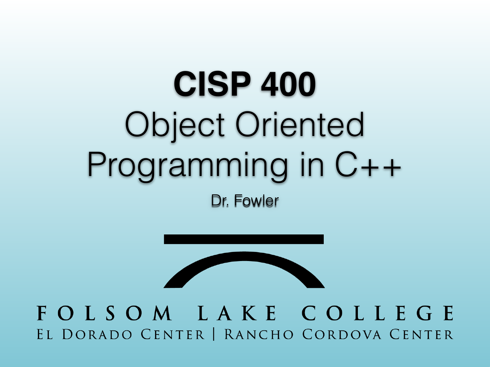{width="100%" fig-alt="CISP 400"}

::: notes
Slides 1–11
:::

<!-- Slide 1 -->

---

## Last Time

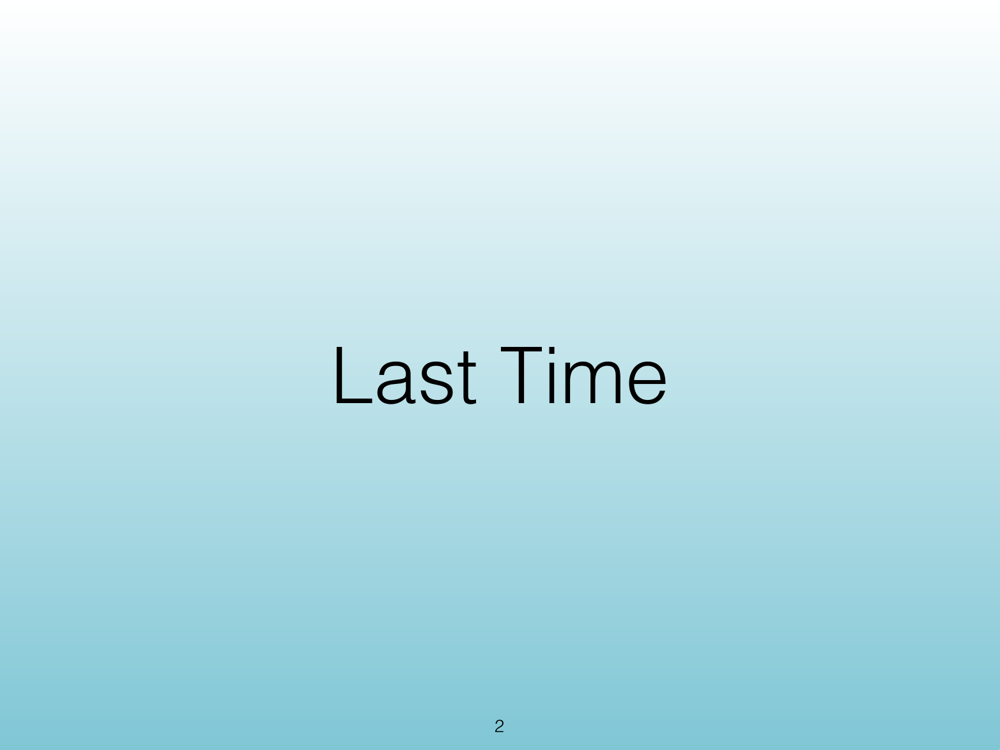{width="100%" fig-alt="Last Time"}

::: notes
Source PDF page 2.
:::

<!-- Slide 2 -->

---

## Agenda

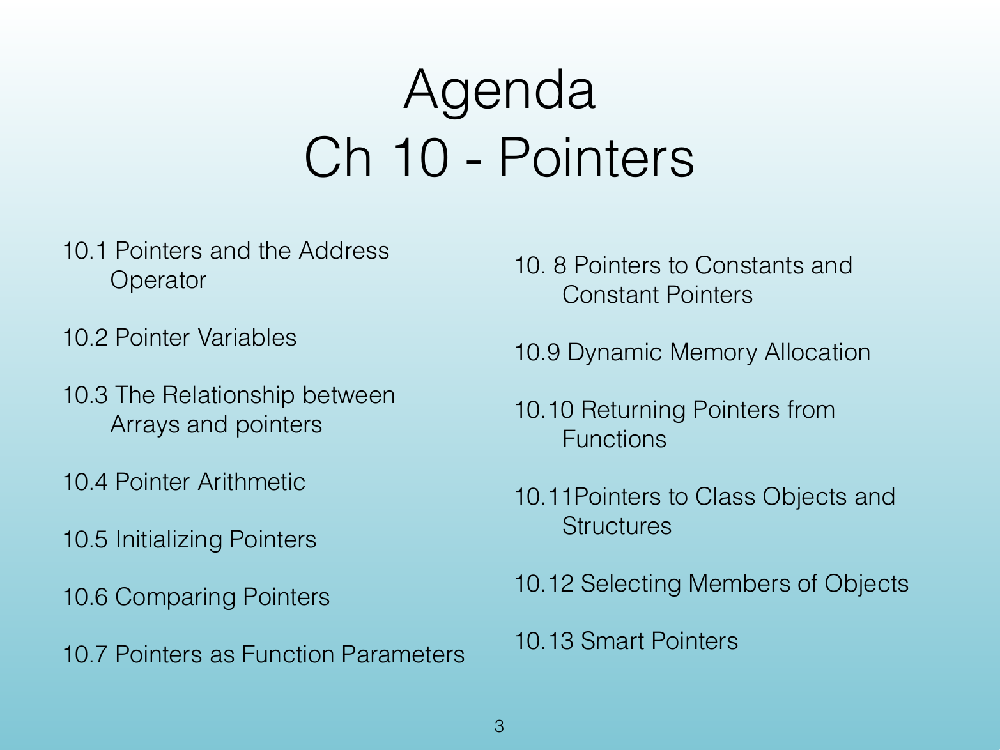{width="100%" fig-alt="Agenda"}

::: notes
Source PDF page 3.
:::

<!-- Slide 3 -->

---

## What's This Chapter About?

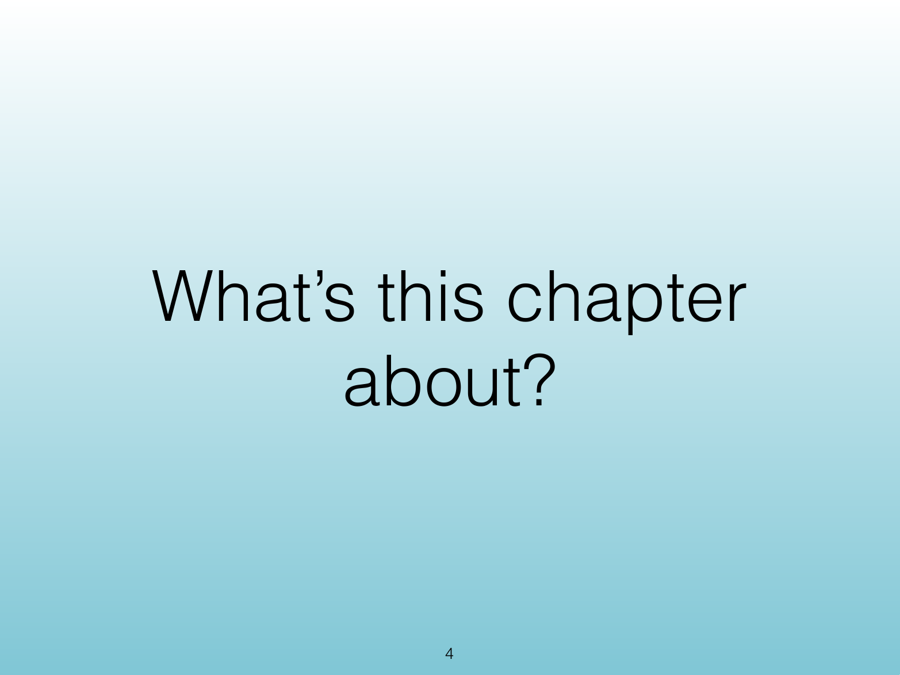{width="100%" fig-alt="What's This Chapter About?"}

::: notes
Source PDF page 4.
:::

<!-- Slide 4 -->

---

## Big Idea

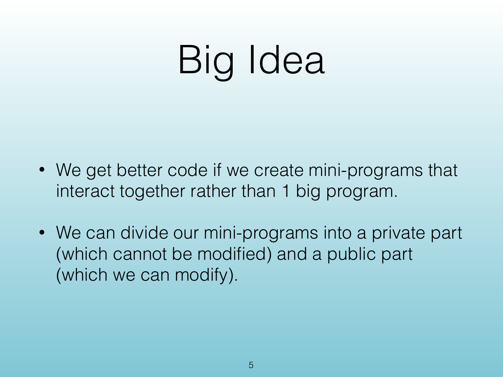{width="100%" fig-alt="Big Idea"}

::: notes
Source PDF page 5.
:::

<!-- Slide 5 -->

---

## Related to Previous Chapters

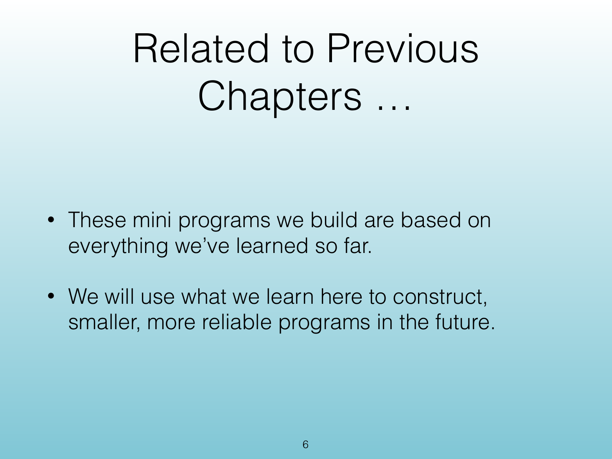{width="100%" fig-alt="Related to Previous Chapters"}

::: notes
Source PDF page 6.
:::

<!-- Slide 6 -->

---

## Chapter 7 Object-Oriented Programming

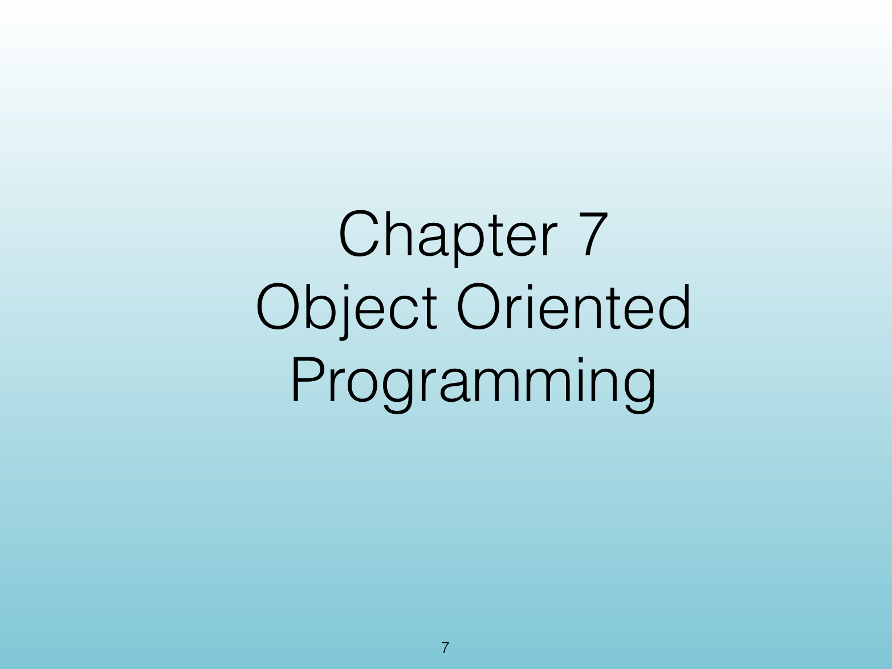{width="100%" fig-alt="Chapter 7 Object-Oriented Programming"}

::: notes
Source PDF page 7.
:::

<!-- Slide 7 -->

---

## Agenda

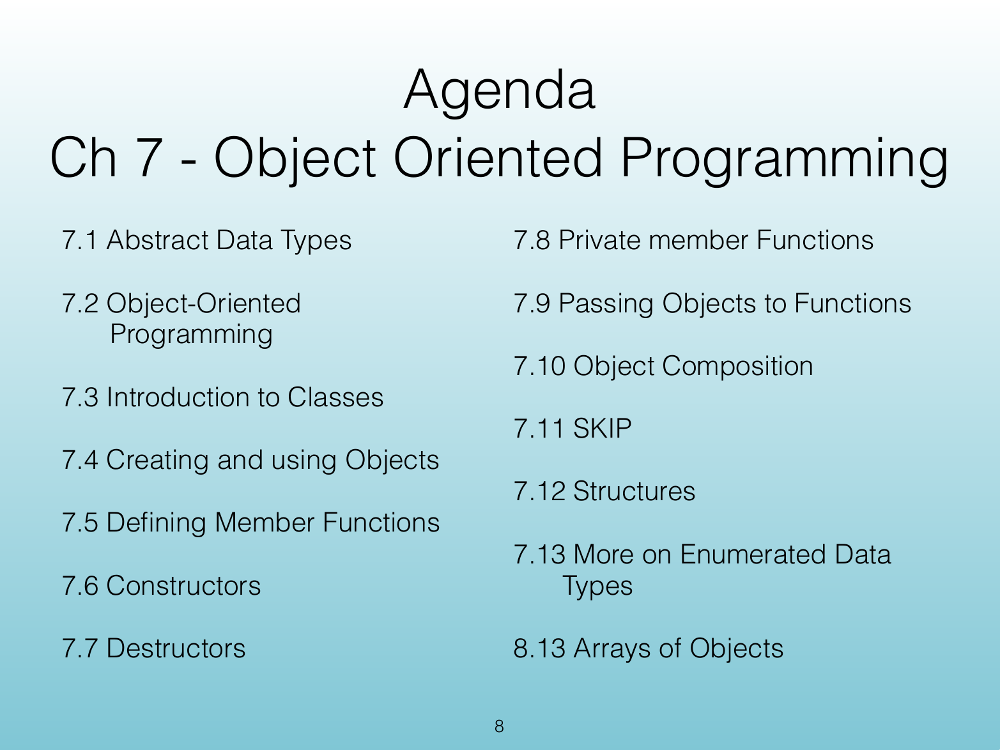{width="100%" fig-alt="Agenda"}

::: notes
Source PDF page 8.
:::

<!-- Slide 8 -->

---

## Agenda

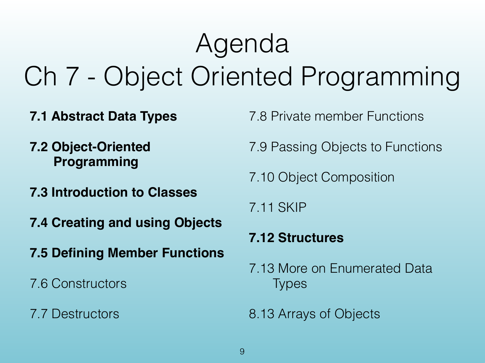{width="100%" fig-alt="Agenda"}

::: notes
Source PDF page 9.
:::

<!-- Slide 9 -->

---

## Where's This Fit in the Course?

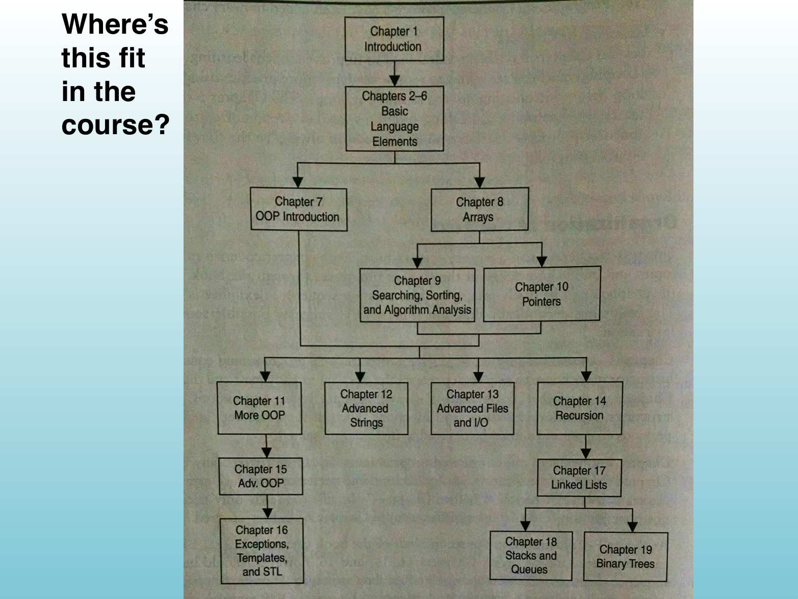{width="100%" fig-alt="Where's This Fit in the Course?"}

::: notes
Source PDF page 10.
:::

<!-- Slide 10 -->

---

## Course Progression

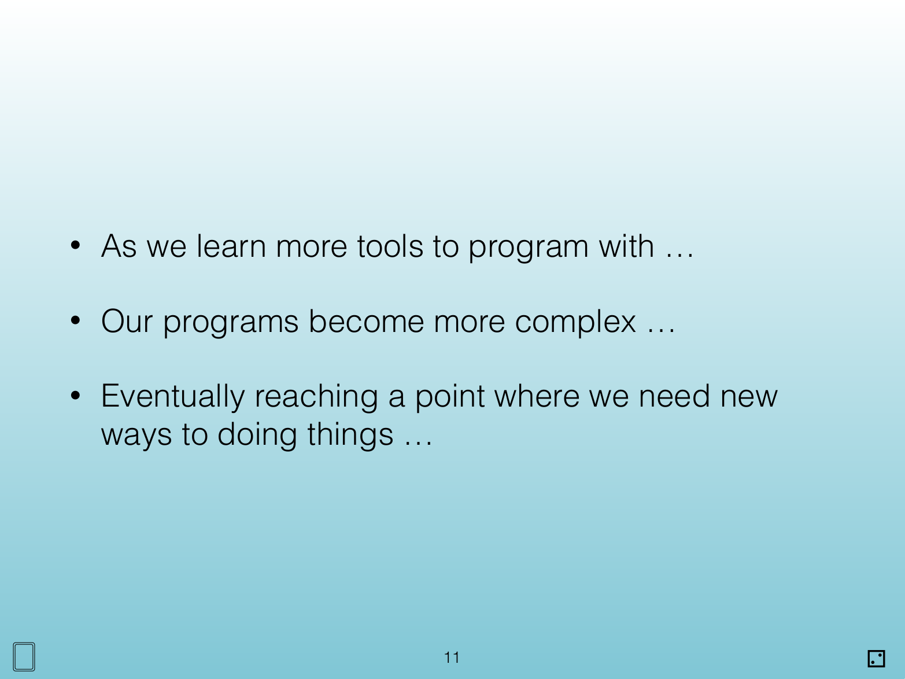{width="100%" fig-alt="Course Progression"}

::: notes
Source PDF page 11.
:::

<!-- Slide 11 -->
