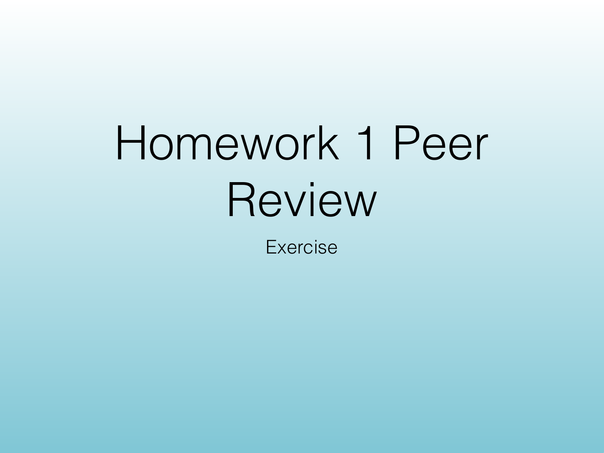
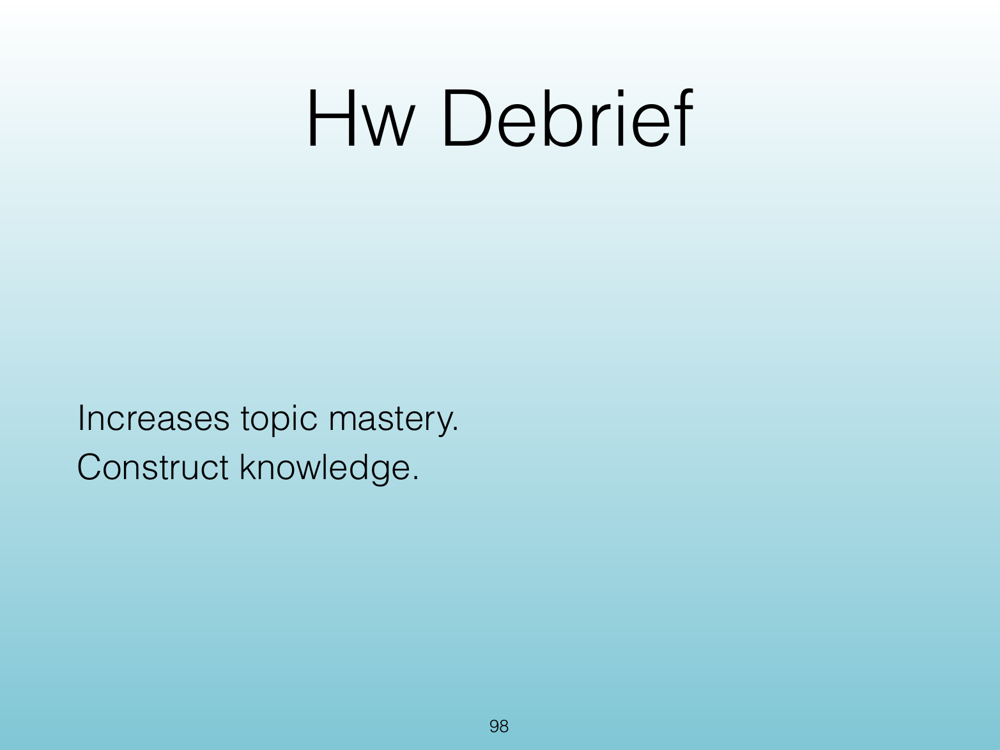
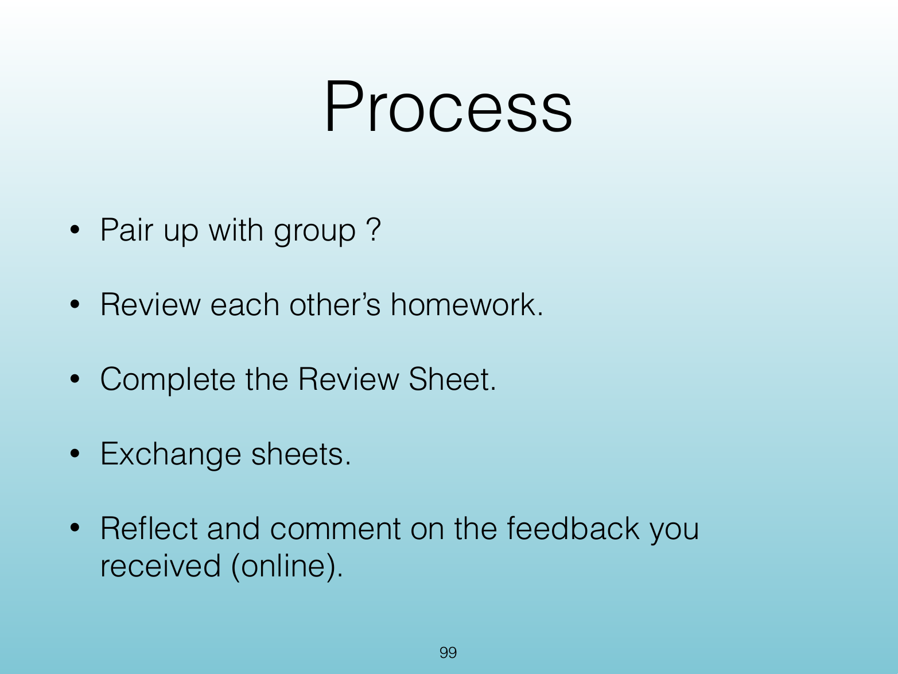
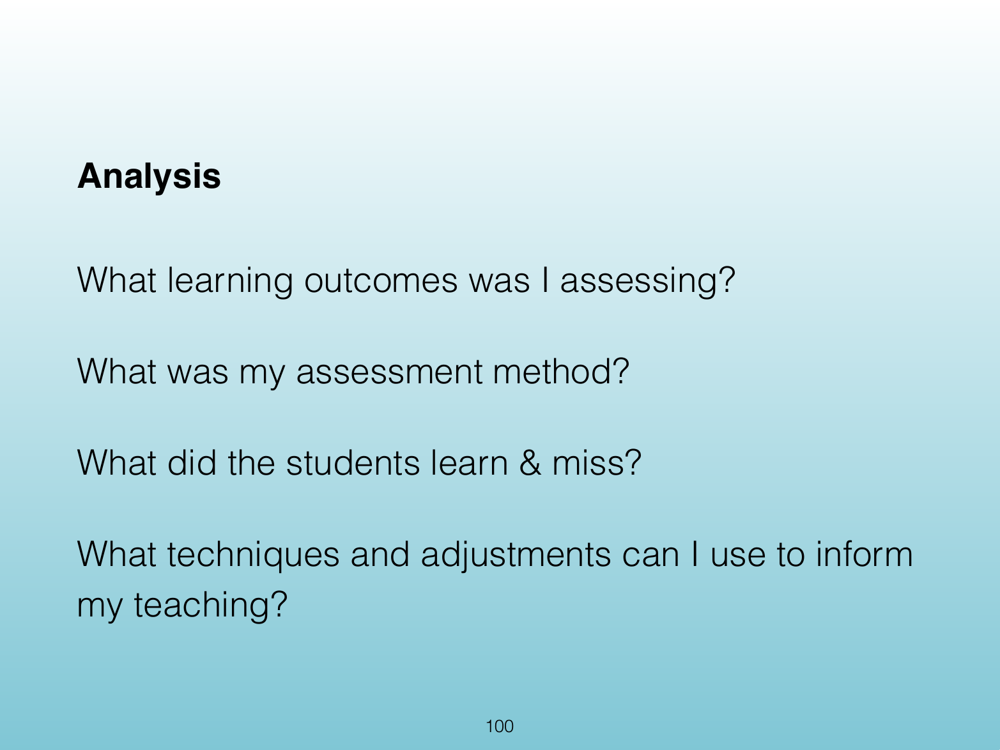
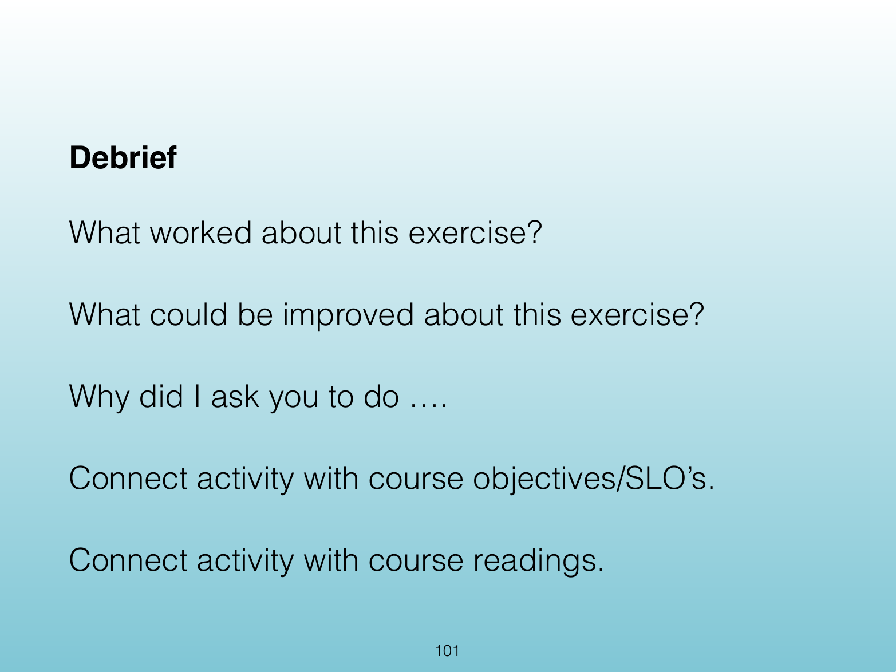

<!-- Topic: Homework Peer Review -->
<!-- Slides 92–99 -->
# Homework Peer Review

## Programming Exercise

{width="100%" fig-alt="Programming Exercise"}

::: notes
Slides 94–99
:::

<!-- Slide 94 -->

---

## Homework 1 Peer Review

{width="100%" fig-alt="Homework 1 Peer Review"}

::: notes
Source PDF page 97.
:::

<!-- Slide 95 -->

---

## Homework Debrief

{width="100%" fig-alt="Homework Debrief"}

::: notes
Source PDF page 98.
:::

<!-- Slide 96 -->

---

## Process

{width="100%" fig-alt="Process"}

::: notes
Source PDF page 99.
:::

<!-- Slide 97 -->

---

## Analysis

{width="100%" fig-alt="Analysis"}

::: notes
Source PDF page 100.
:::

<!-- Slide 98 -->

---

## Debrief

{width="100%" fig-alt="Debrief"}

::: notes
Source PDF page 101.
:::

<!-- Slide 99 -->
