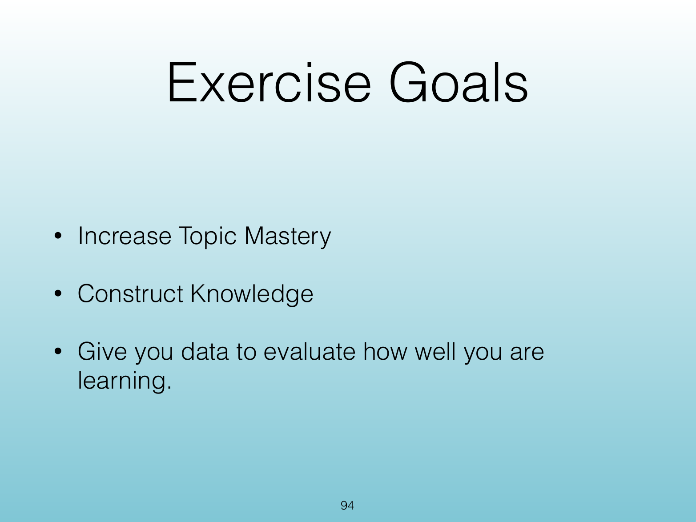
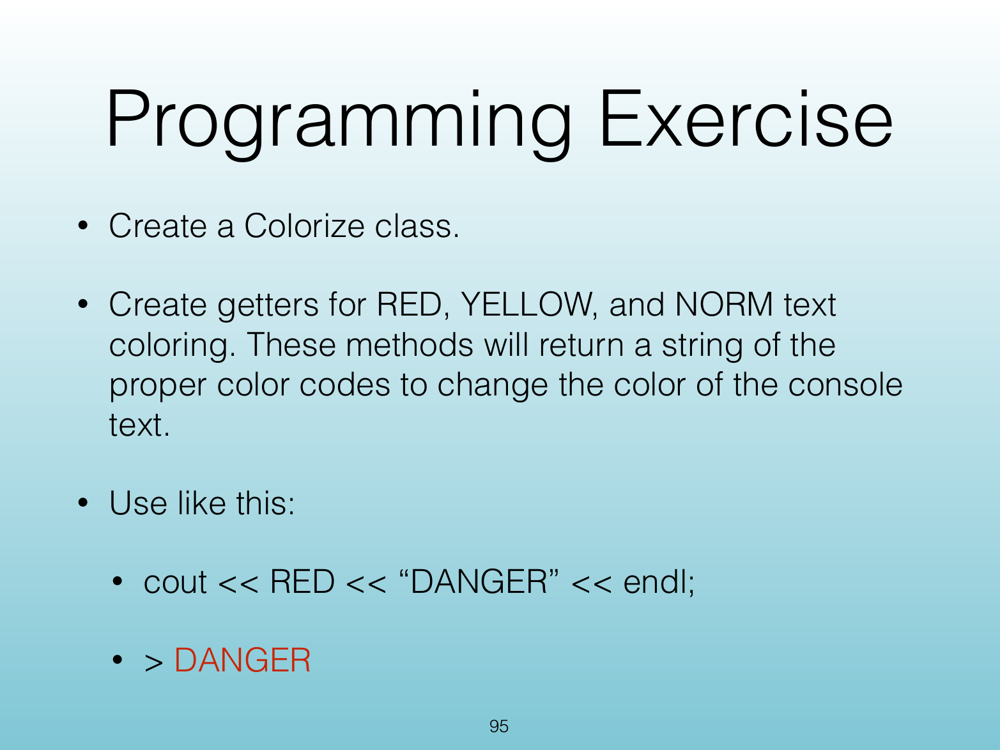

<!-- Topic: Programming Exercise: Colorize -->
<!-- Slides 94–95 -->
# Programming Exercise: Colorize

## Programming Exercise

{width="100%" fig-alt="Programming Exercise"}

::: notes
Slides 94–95
:::

<!-- Slide 94 -->

---

## Exercise Goals

{width="100%" fig-alt="Exercise Goals"}

::: notes
Source PDF page 95.
:::

<!-- Slide 95 -->
