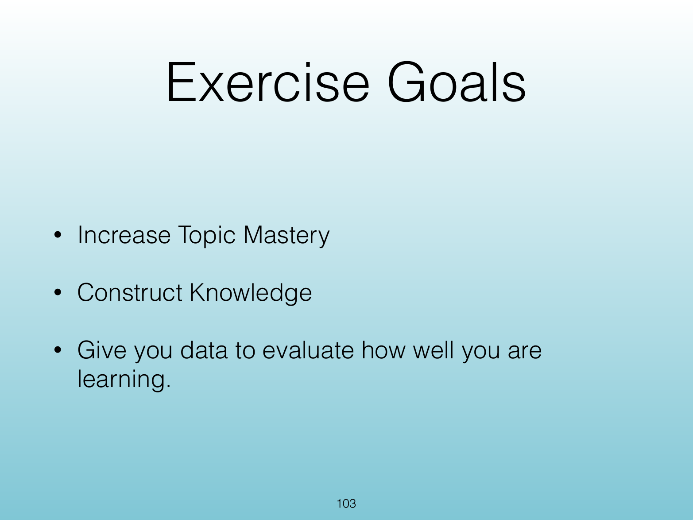
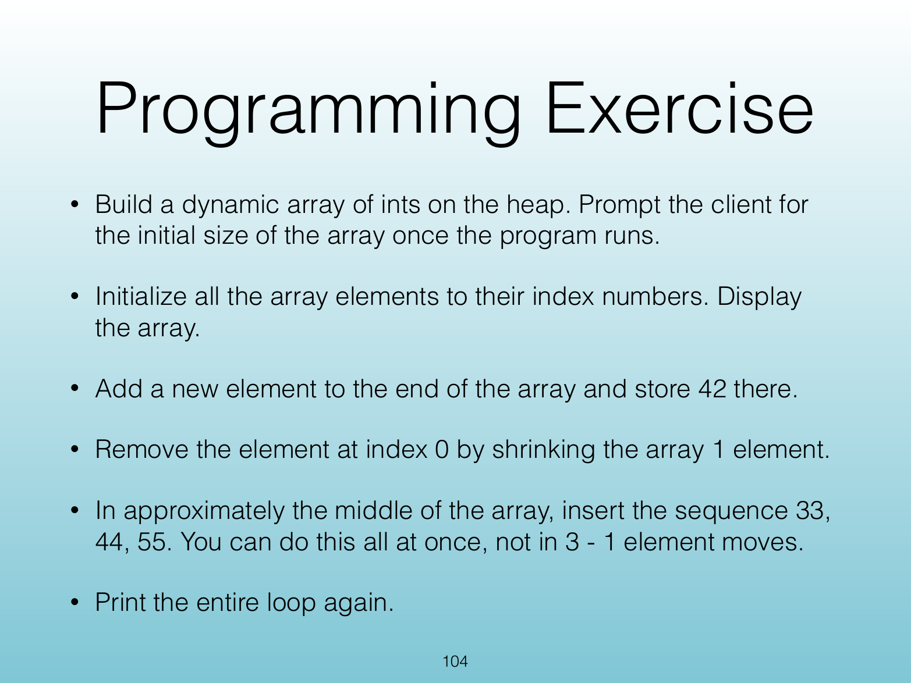

<!-- Topic: Programming Exercise: Dynamic Array Operations -->
<!-- Slides 98–102 -->
# Programming Exercise: Dynamic Array Operations

## Program This - Debrief

{width="100%" fig-alt="Program This - Debrief"}

::: notes
Slides 100–102
:::

<!-- Slide 100 -->

---

## Exercise Goals

{width="100%" fig-alt="Exercise Goals"}

::: notes
Source PDF page 103.
:::

<!-- Slide 101 -->

---

## Programming Exercise

{width="100%" fig-alt="Programming Exercise"}

::: notes
Source PDF page 104.
:::

<!-- Slide 102 -->
