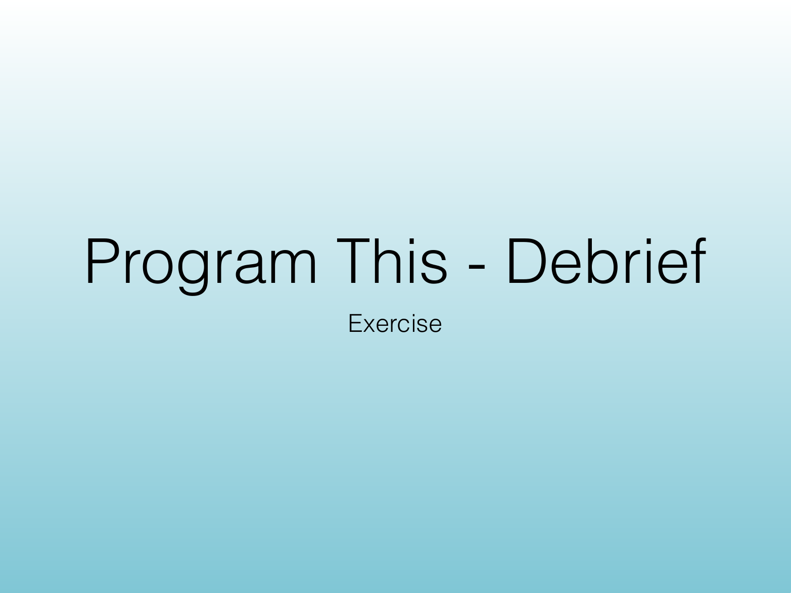
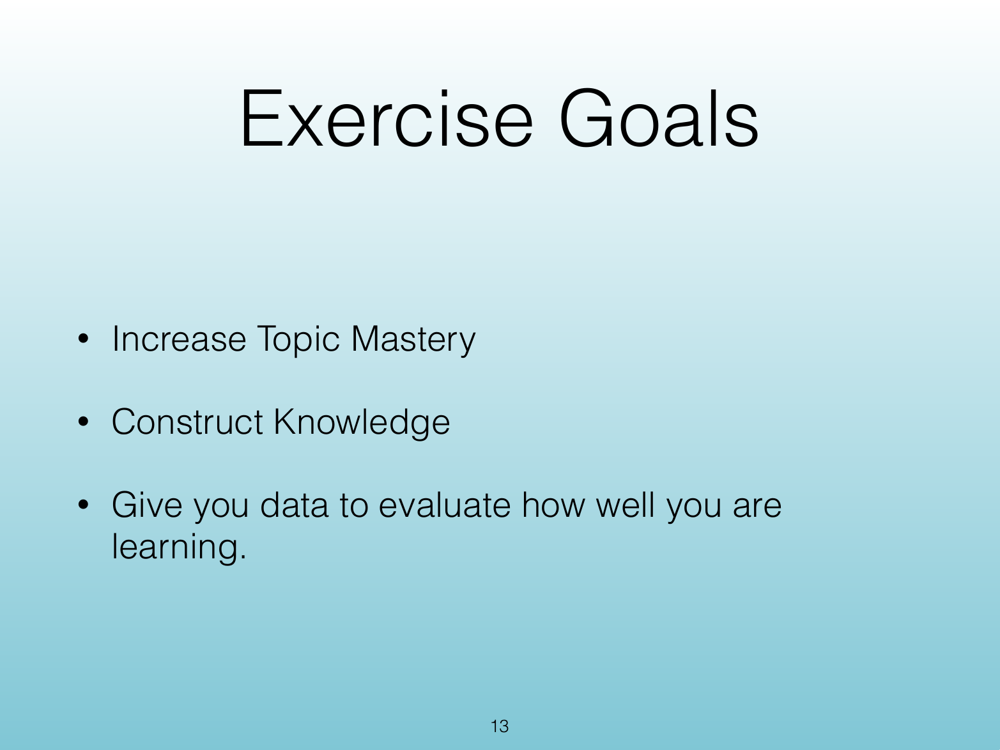
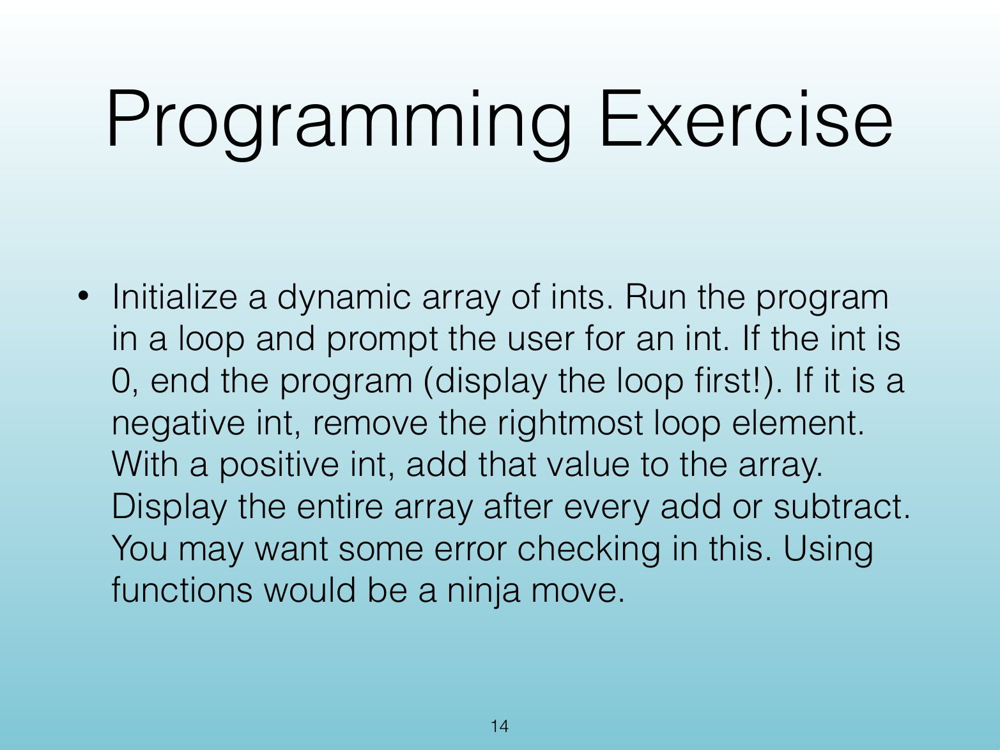
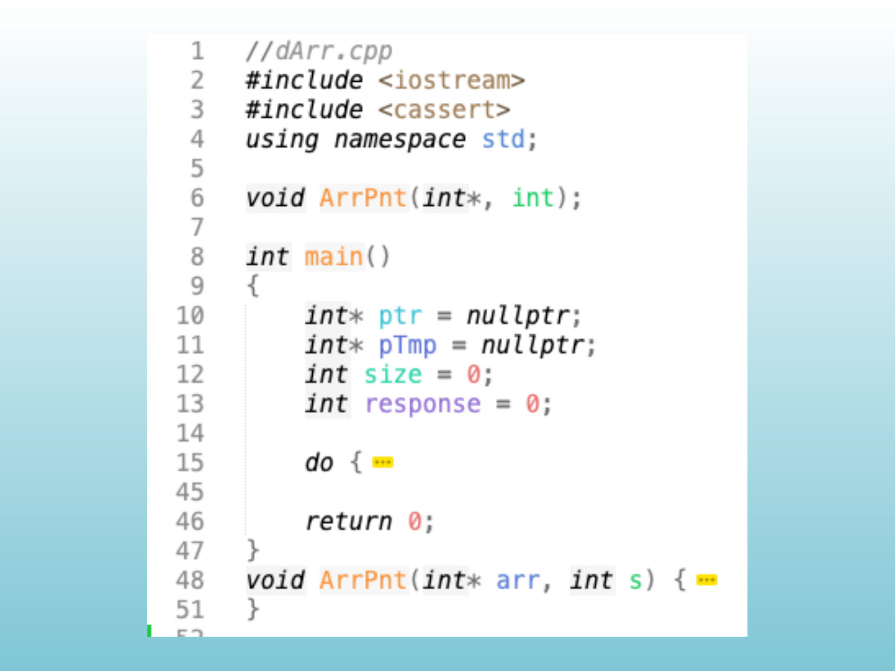
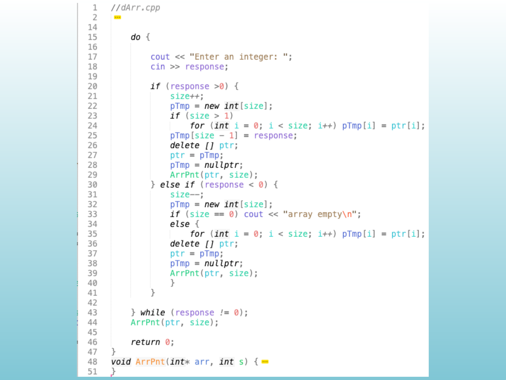
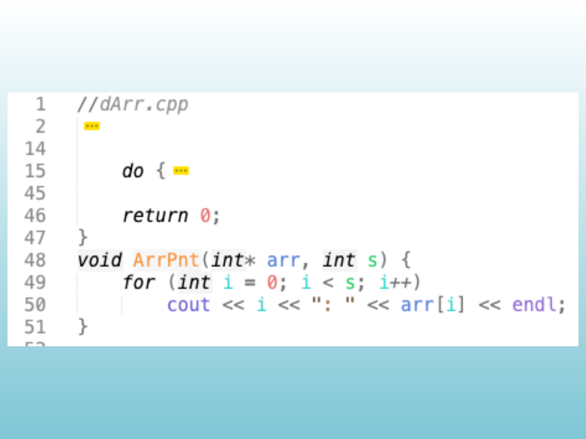
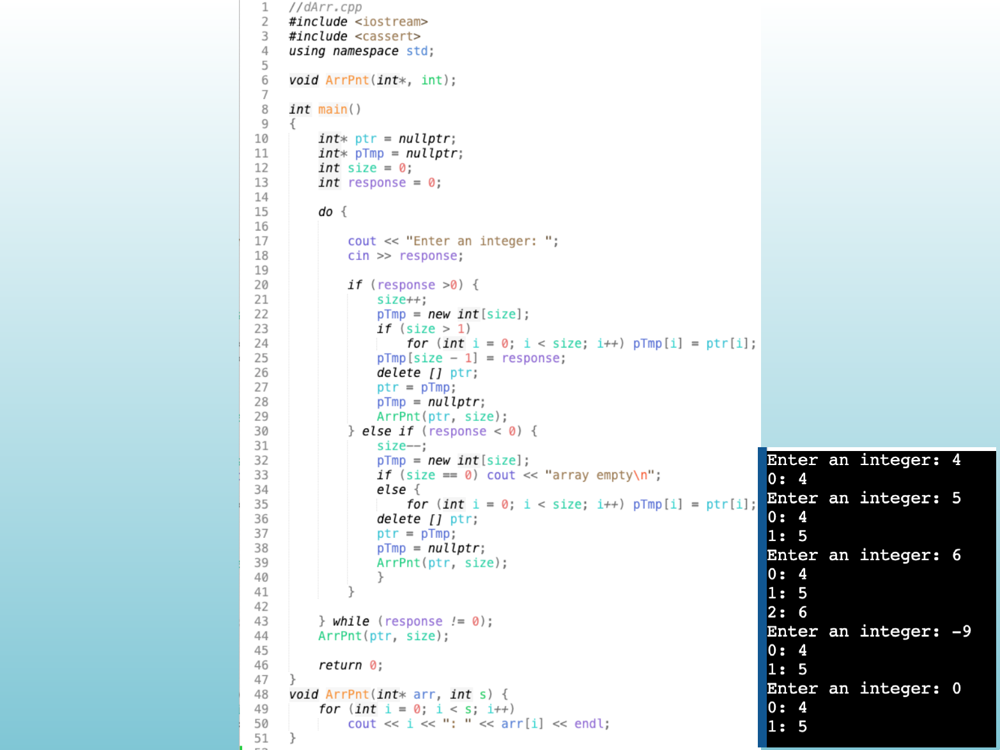

<!-- Topic: Programming Exercise: Dynamic Arrays -->
<!-- Slides 4–17 -->
# Programming Exercise: Dynamic Arrays

## Program This - Debrief

{width="100%" fig-alt="Program This - Debrief"}

::: notes
Slides 9–17
:::

<!-- Slide 10 -->

---

## Exercise Goals

{width="100%" fig-alt="Exercise Goals"}

::: notes
Source PDF page 13.
:::

<!-- Slide 11 -->

---

## Programming Exercise

{width="100%" fig-alt="Programming Exercise"}

::: notes
Source PDF page 14.
:::

<!-- Slide 12 -->

---

## &lt;Exercise Workspace&gt;

{width="100%" fig-alt="<Exercise Workspace>"}

::: notes
Source PDF page 15.
:::

<!-- Slide 13 -->

---

## &lt;Exercise Workspace&gt;

{width="100%" fig-alt="<Exercise Workspace>"}

::: notes
Source PDF page 16.
:::

<!-- Slide 14 -->

---

## &lt;Exercise Workspace&gt;

{width="100%" fig-alt="<Exercise Workspace>"}

::: notes
Source PDF page 17.
:::

<!-- Slide 15 -->

---

## &lt;Exercise Workspace&gt;

{width="100%" fig-alt="<Exercise Workspace>"}

::: notes
Source PDF page 18.
:::

<!-- Slide 16 -->

---

## &lt;Exercise Workspace&gt;

{width="100%" fig-alt="<Exercise Workspace>"}

::: notes
Source PDF page 19.
:::

<!-- Slide 17 -->
