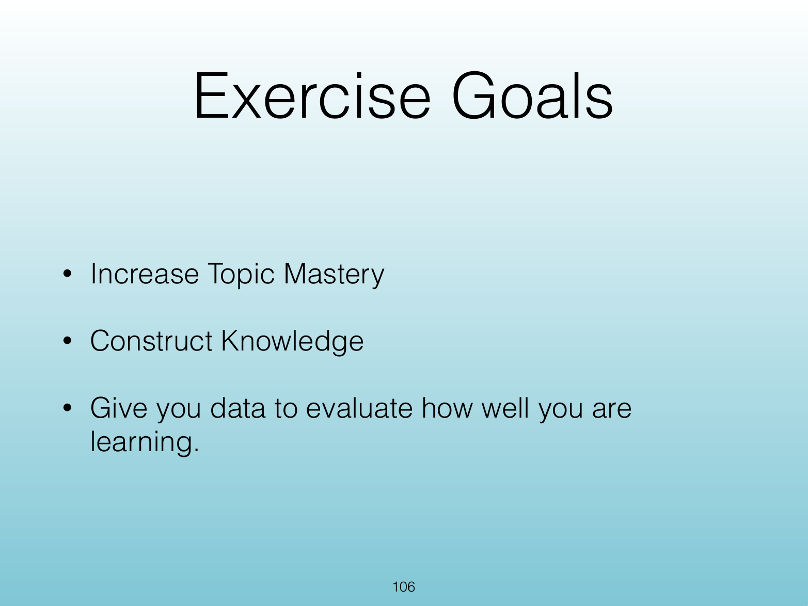
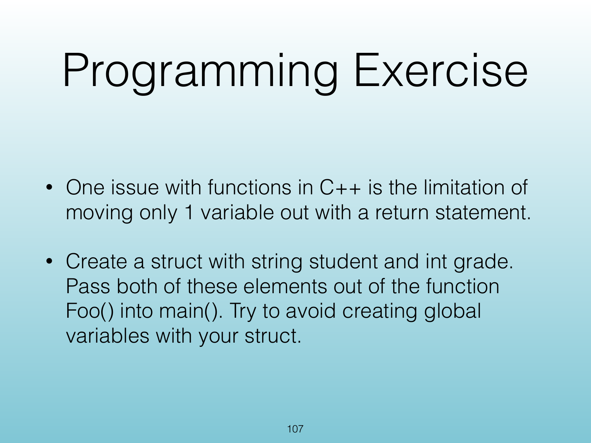
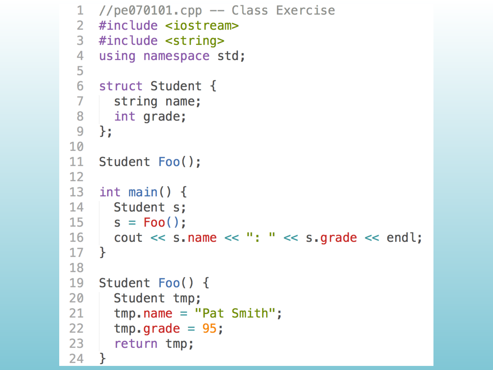

<!-- Topic: Programming Exercise: Returning a Struct -->
<!-- Slides 105–108 -->
# Programming Exercise: Returning a Struct

## Programming Exercise

{width="100%" fig-alt="Programming Exercise"}

::: notes
Slides 105–108
:::

<!-- Slide 105 -->

---

## Exercise Goals

{width="100%" fig-alt="Exercise Goals"}

::: notes
Source PDF page 106.
:::

<!-- Slide 106 -->

---

## Programming Exercise

{width="100%" fig-alt="Programming Exercise"}

::: notes
Source PDF page 107.
:::

<!-- Slide 107 -->

---

## <Exercise Workspace>

{width="100%" fig-alt="<Exercise Workspace>"}

::: notes
Source PDF page 108.
:::

<!-- Slide 108 -->
