<!-- Topic: Structures -->
<!-- Slides 16–29 -->
# Structures

## 7.12 Structures

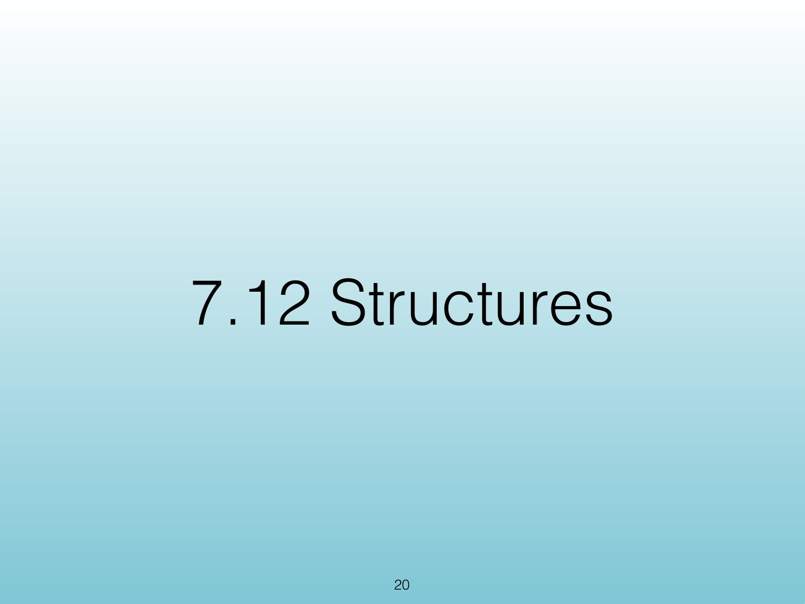{width="100%" fig-alt="7.12 Structures"}

::: notes
Slides 18–29
:::

<!-- Slide 18 -->

---

## The Problem

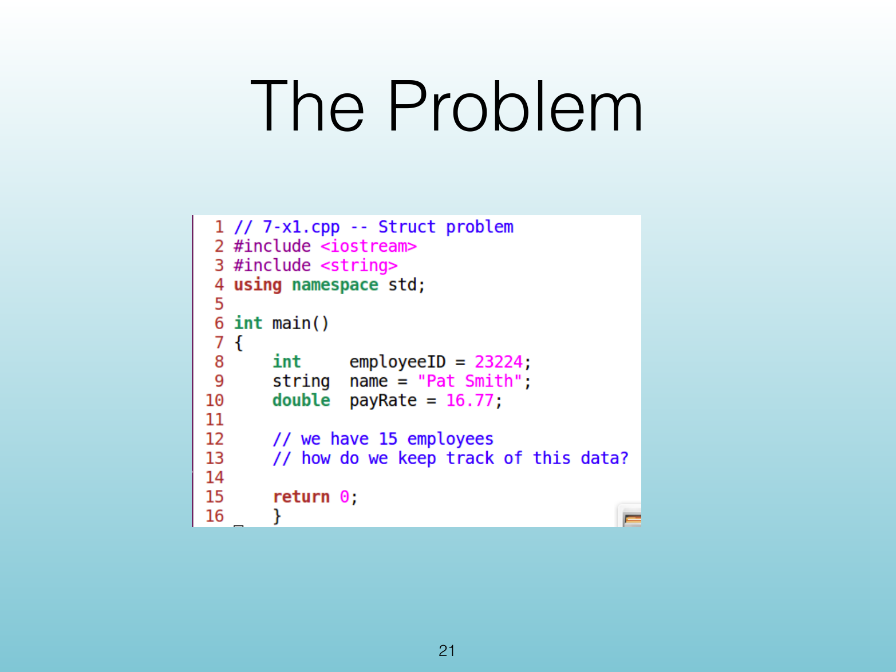{width="100%" fig-alt="The Problem"}

::: notes
Source PDF page 21.
:::

<!-- Slide 19 -->

---

## &lt;Problem Context&gt;

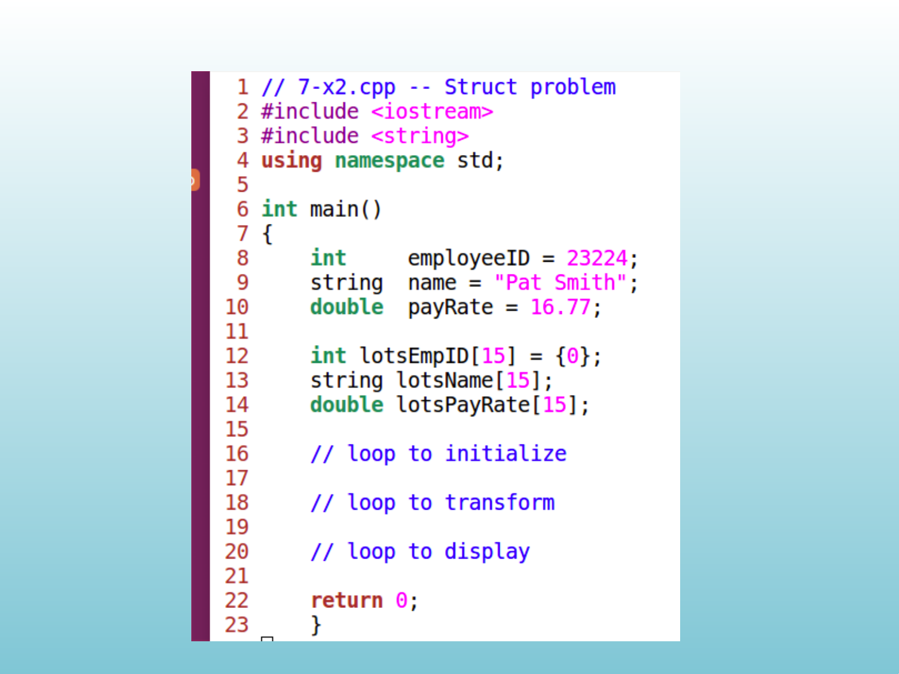{width="100%" fig-alt="<Problem Context>"}

::: notes
Source PDF page 22.
:::

<!-- Slide 20 -->

---

## Grouping Variables

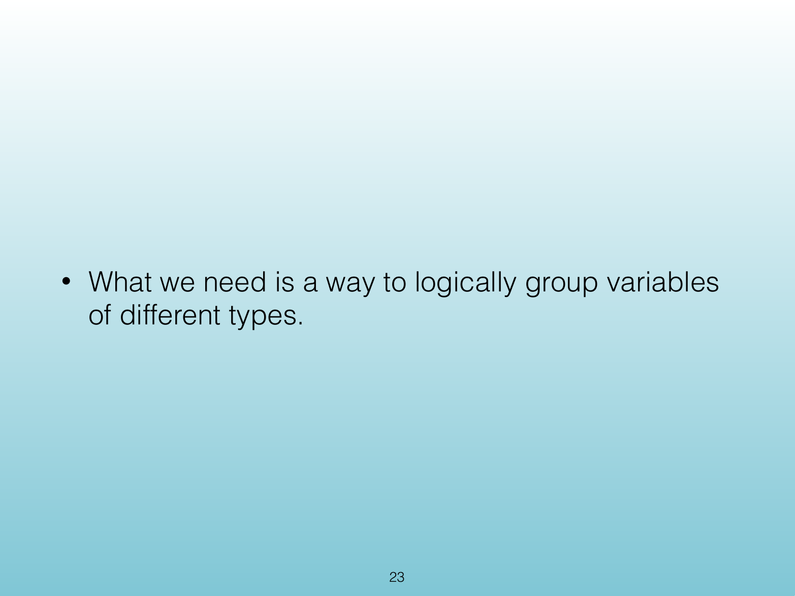{width="100%" fig-alt="Grouping Variables"}

::: notes
Source PDF page 23.
:::

<!-- Slide 21 -->

---

## Solution - Struct

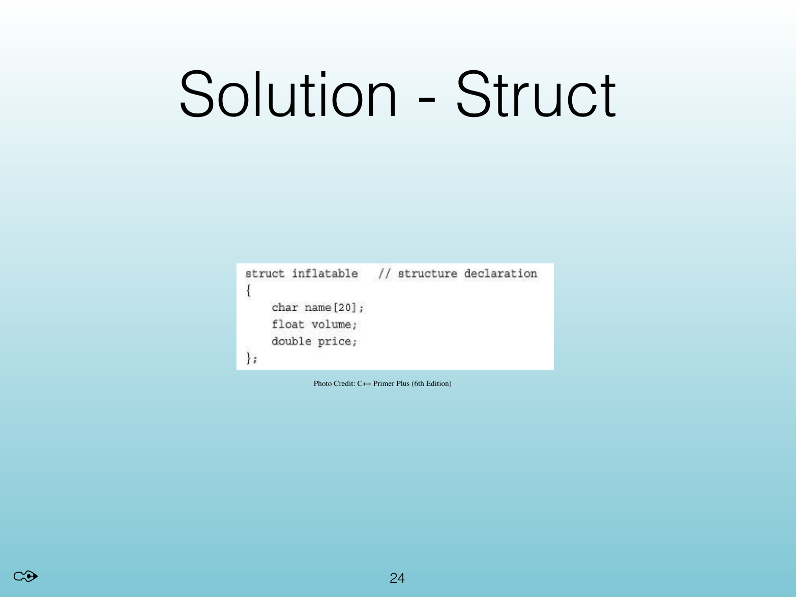{width="100%" fig-alt="Solution - Struct"}

::: notes
Source PDF page 24.
:::

<!-- Slide 22 -->

---

## &lt;Struct Example&gt;

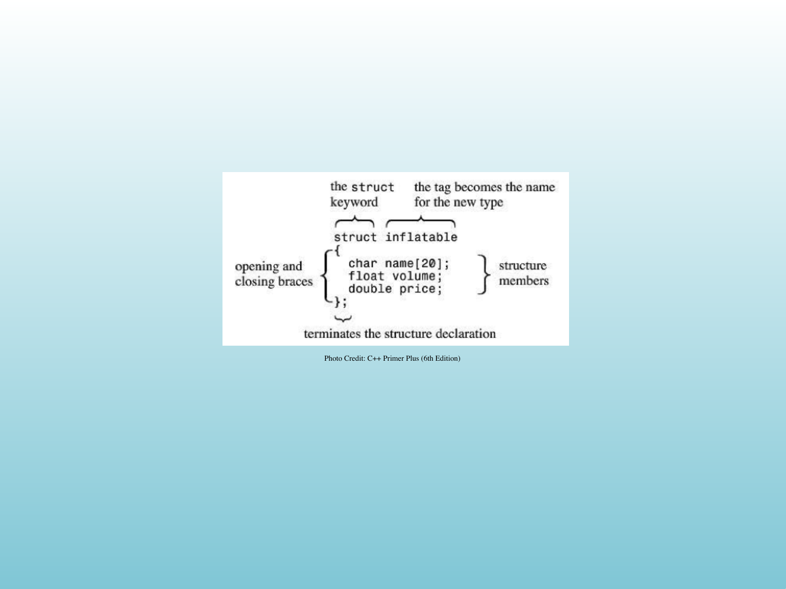{width="100%" fig-alt="<Struct Example>"}

::: notes
Source PDF page 25.
:::

<!-- Slide 23 -->

---

## &lt;Struct Example&gt;

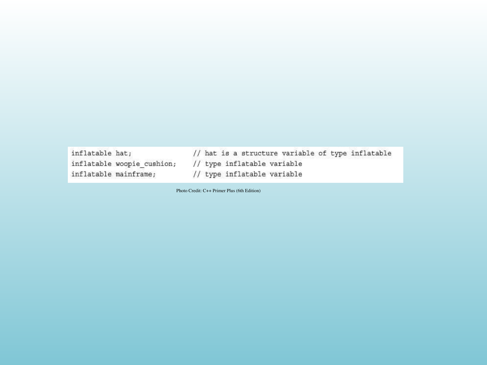{width="100%" fig-alt="<Struct Example>"}

::: notes
Source PDF page 26.
:::

<!-- Slide 24 -->

---

## Accessing a Struct

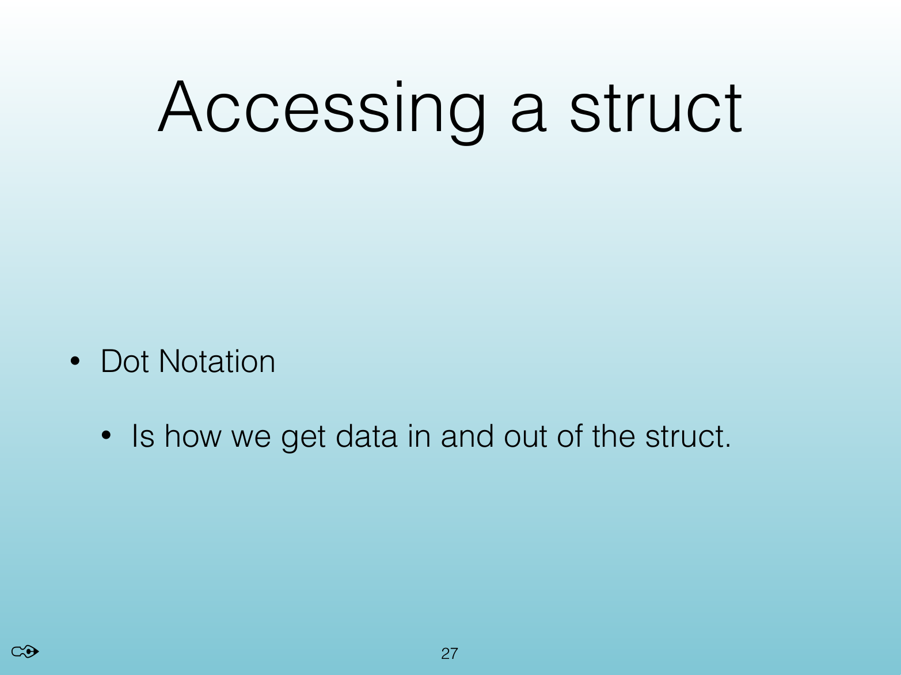{width="100%" fig-alt="Accessing a Struct"}

::: notes
Source PDF page 27.
:::

<!-- Slide 25 -->

---

## Initializing a Struct

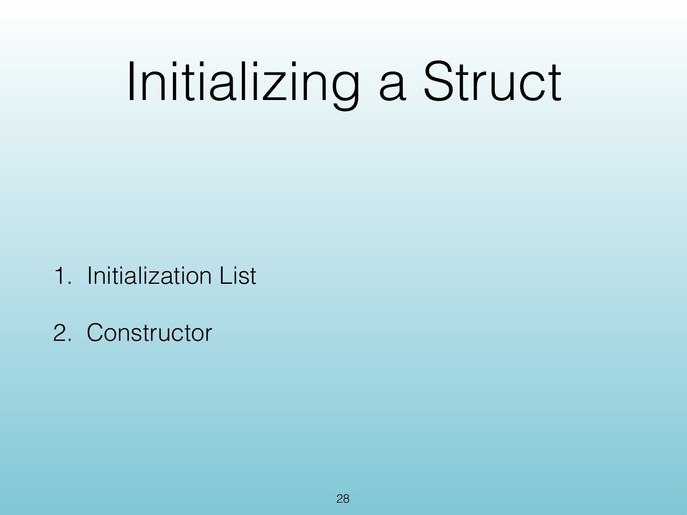{width="100%" fig-alt="Initializing a Struct"}

::: notes
Source PDF page 28.
:::

<!-- Slide 26 -->

---

## Initialization List

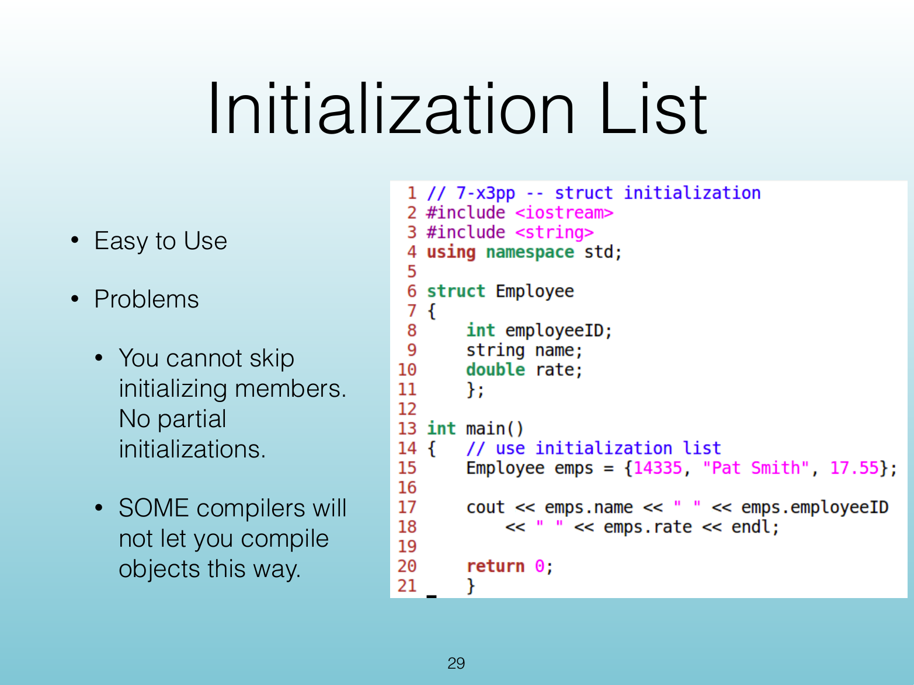{width="100%" fig-alt="Initialization List"}

::: notes
Source PDF page 29.
:::

<!-- Slide 27 -->

---

## Constructor

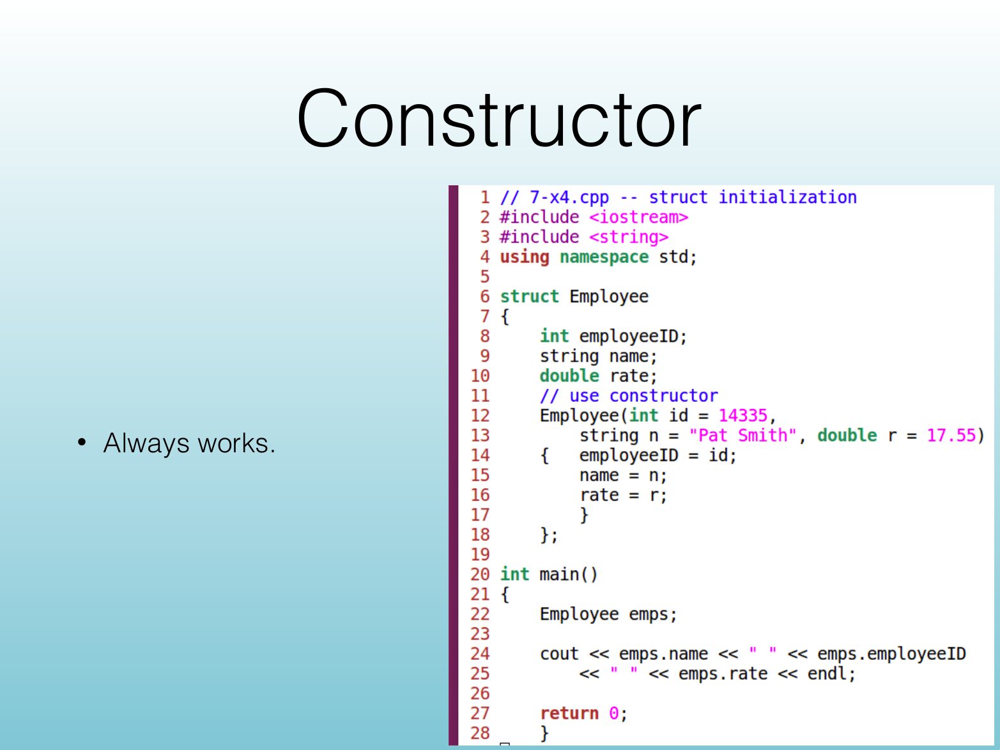{width="100%" fig-alt="Constructor"}

::: notes
Source PDF page 30.
:::

<!-- Slide 28 -->

---

## Questions

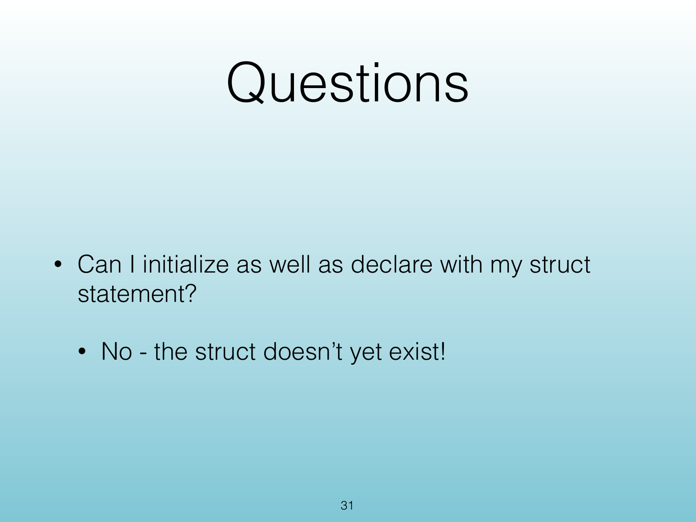{width="100%" fig-alt="Questions"}

::: notes
Source PDF page 31.
:::

<!-- Slide 29 -->
