<!-- Topic: Activities and Wrap-Up -->
<!-- Slides 94–108 -->

# Activities and Wrap-Up

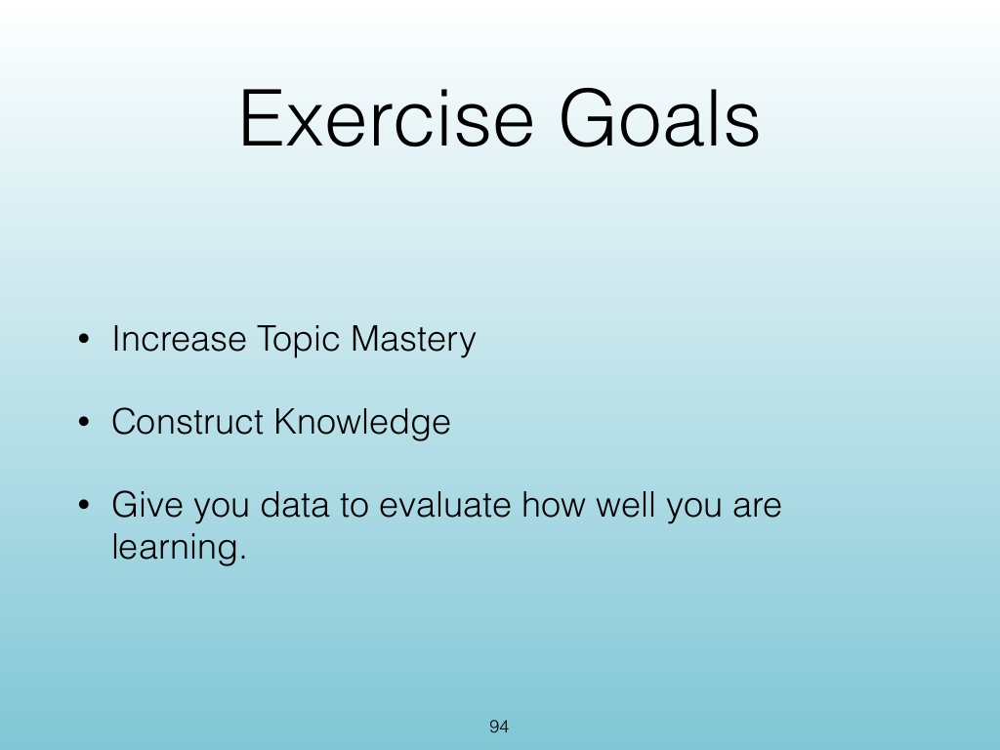{width="100%" fig-alt="Activities and Wrap-Up"}

::: notes
Slides 94–108
Source slide 94 from the authoritative PDF.
:::

<!-- Slide 94 -->

---

## Source Slide 95

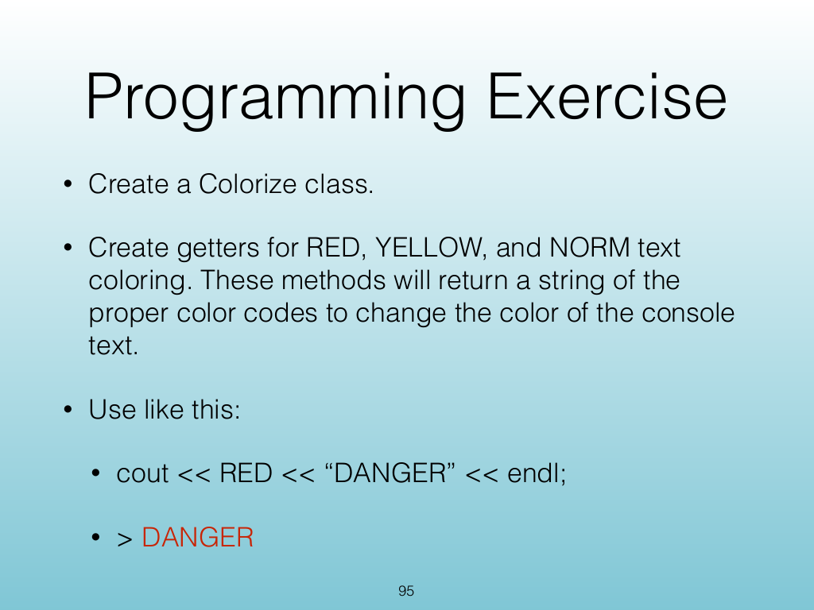{width="100%" fig-alt="Programming Exercise"}

<!-- Slide 95 -->

---

## Source Slide 96

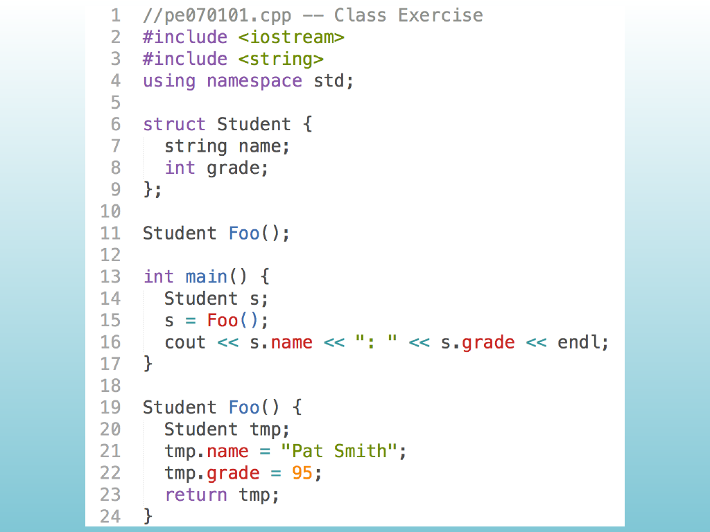{width="100%" fig-alt="Source Slide 96"}

<!-- Slide 96 -->

---

## Source Slide 97

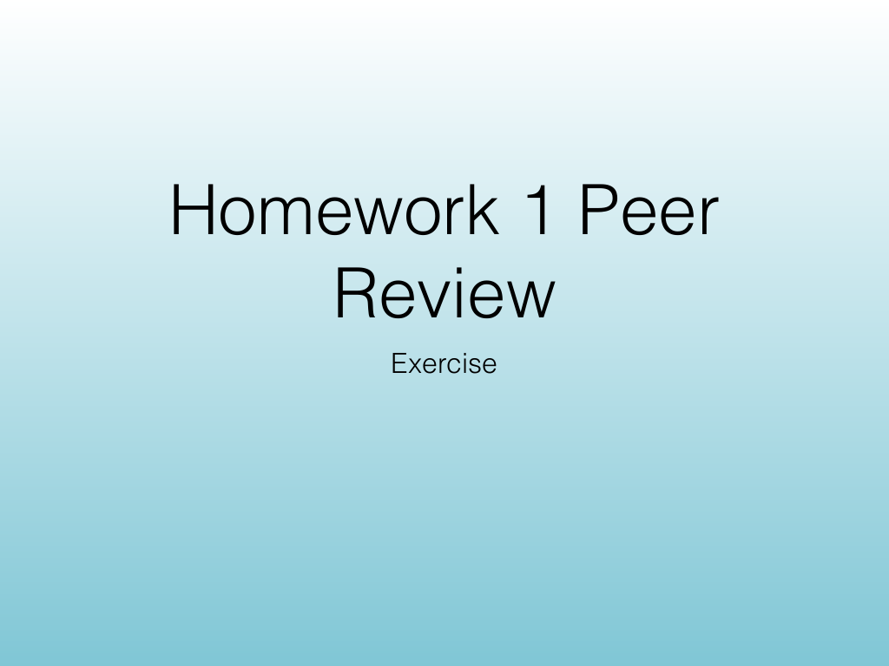{width="100%" fig-alt="Homework 1 Peer"}

<!-- Slide 97 -->

---

## Source Slide 98

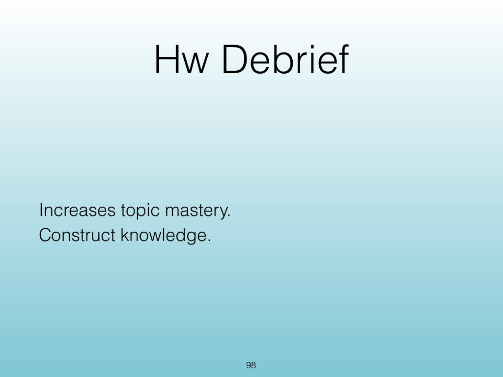{width="100%" fig-alt="Hw Debrief"}

<!-- Slide 98 -->

---

## Source Slide 99

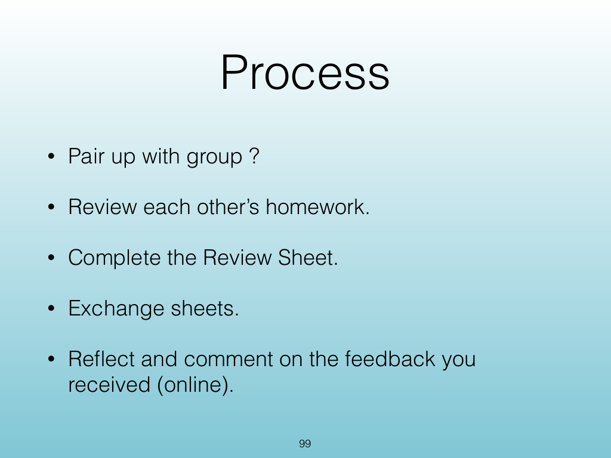{width="100%" fig-alt="Process"}

<!-- Slide 99 -->

---

## Source Slide 100

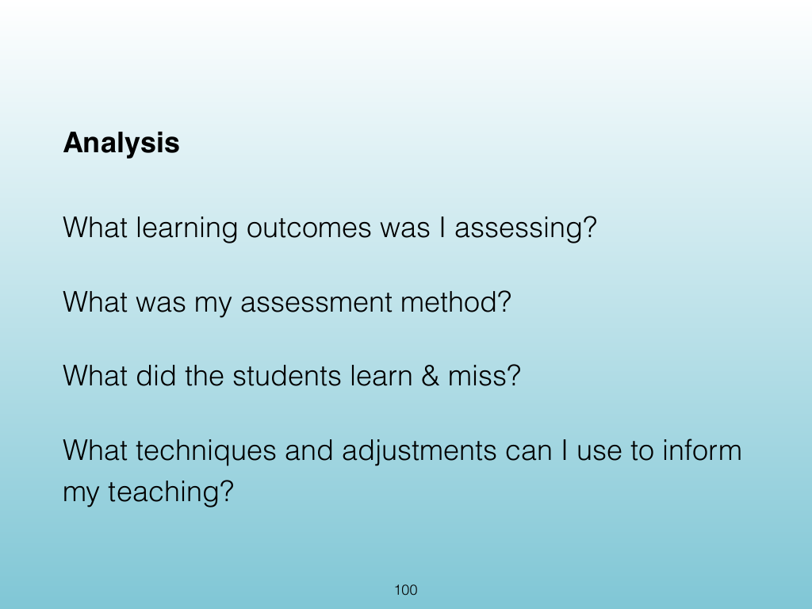{width="100%" fig-alt="Analysis"}

<!-- Slide 100 -->

---

## Source Slide 101

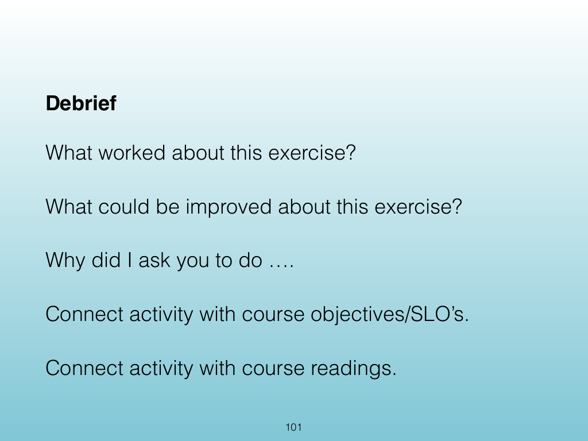{width="100%" fig-alt="Debrief"}

<!-- Slide 101 -->

---

## Source Slide 102

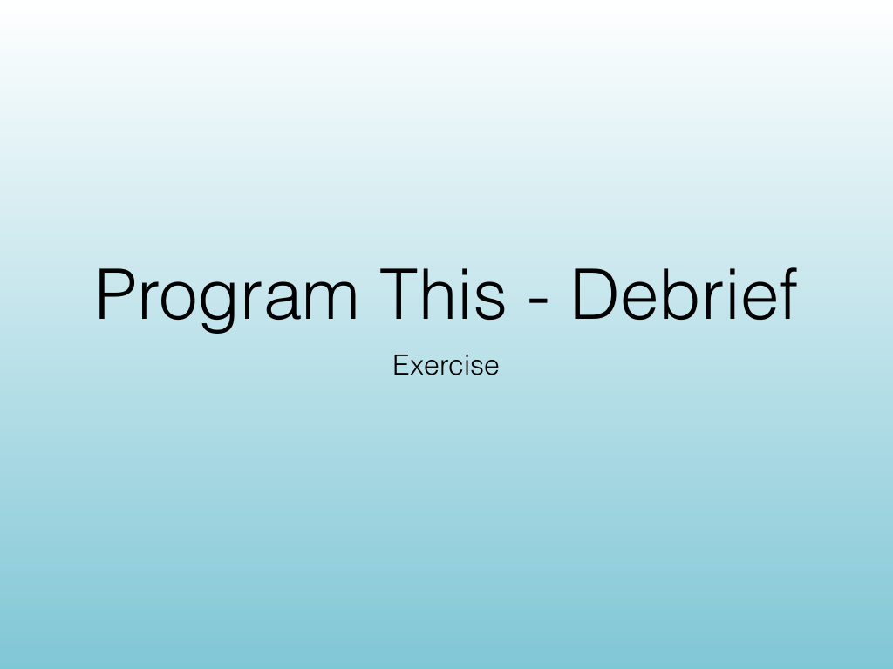{width="100%" fig-alt="Program This - Debrief"}

<!-- Slide 102 -->

---

## Source Slide 103

{width="100%" fig-alt="Exercise Goals"}

<!-- Slide 103 -->

---

## Source Slide 104

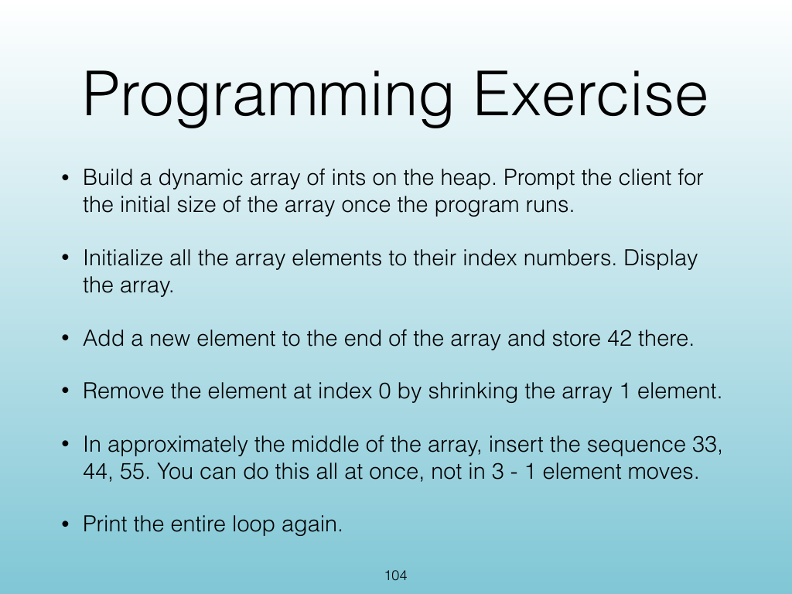{width="100%" fig-alt="Programming Exercise"}

<!-- Slide 104 -->

---

## Source Slide 105

{width="100%" fig-alt="Exercise"}

<!-- Slide 105 -->

---

## Source Slide 106

{width="100%" fig-alt="Exercise Goals"}

<!-- Slide 106 -->

---

## Source Slide 107

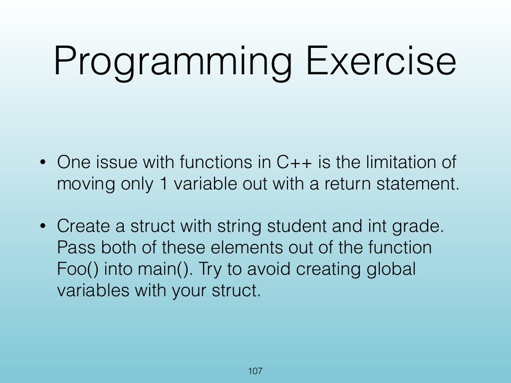{width="100%" fig-alt="Programming Exercise"}

<!-- Slide 107 -->

---

## Source Slide 108

{width="100%" fig-alt="Source Slide 108"}

<!-- Slide 108 -->
