<!-- Topic: Classes, Objects, and Encapsulation -->
<!-- Slides 32–46 -->

# Classes, Objects, and Encapsulation

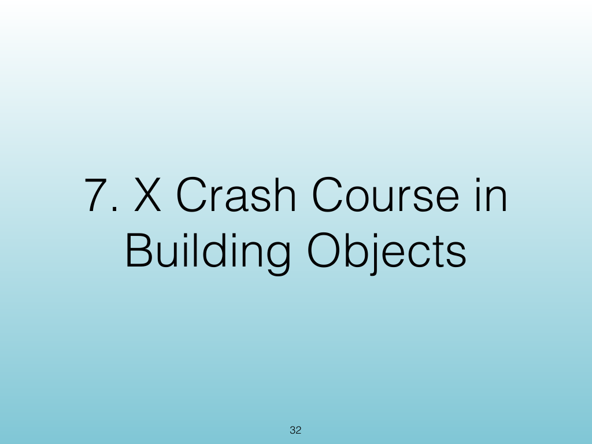{width="100%" fig-alt="Classes, Objects, and Encapsulation"}

::: notes
Slides 32–46
Source slide 32 from the authoritative PDF.
:::

<!-- Slide 32 -->

---

## Source Slide 33

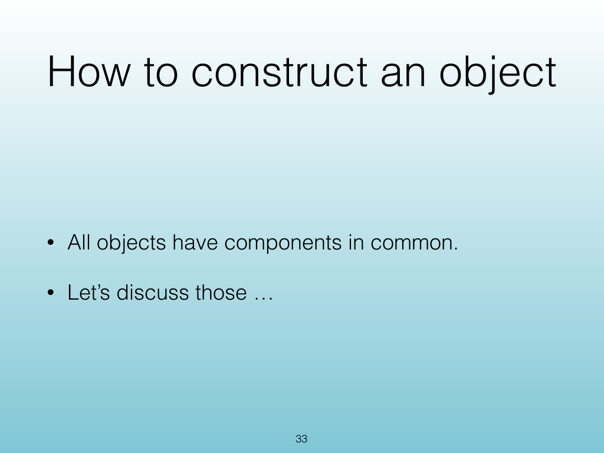{width="100%" fig-alt="How to construct an object"}

<!-- Slide 33 -->

---

## Source Slide 34

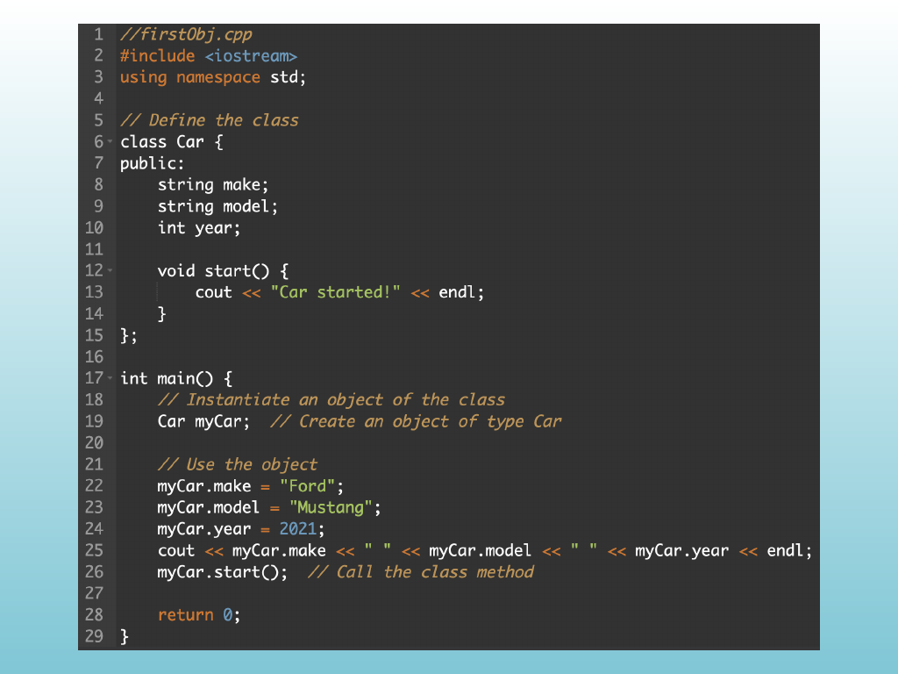{width="100%" fig-alt="Source Slide 34"}

<!-- Slide 34 -->

---

## Source Slide 35

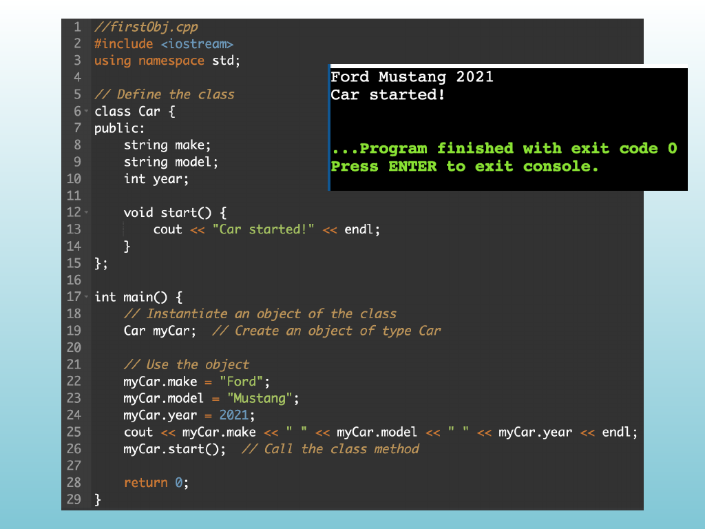{width="100%" fig-alt="Source Slide 35"}

<!-- Slide 35 -->

---

## Source Slide 36

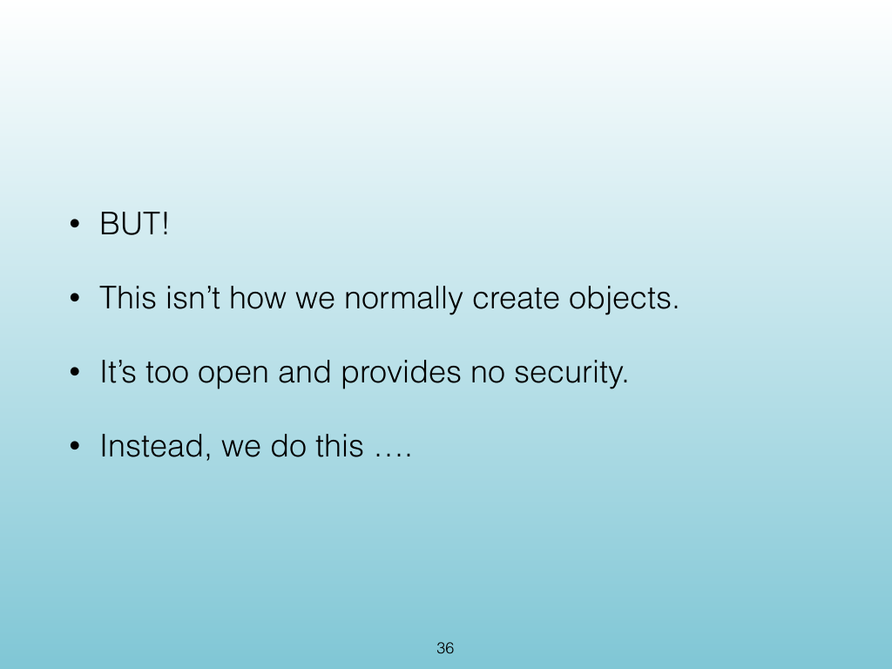{width="100%" fig-alt="• BUT!"}

<!-- Slide 36 -->

---

## Source Slide 37

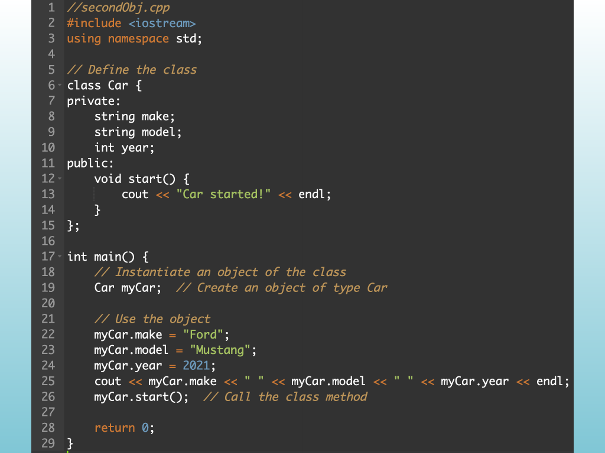{width="100%" fig-alt="Source Slide 37"}

<!-- Slide 37 -->

---

## Source Slide 38

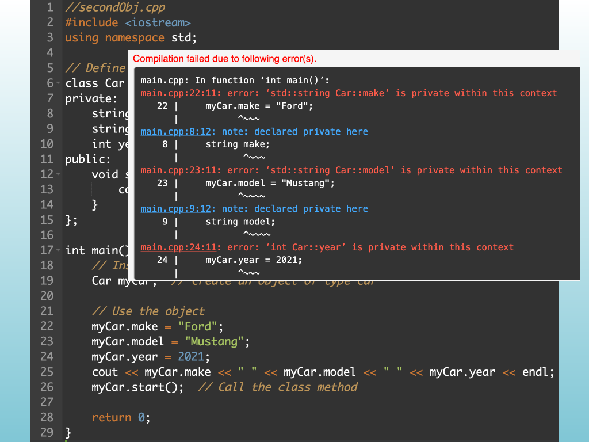{width="100%" fig-alt="Source Slide 38"}

<!-- Slide 38 -->

---

## Source Slide 39

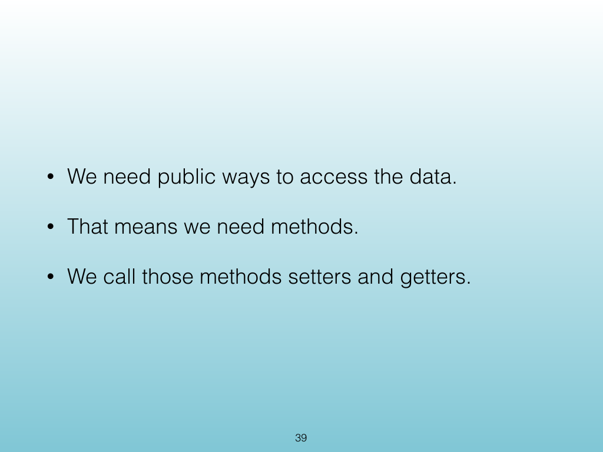{width="100%" fig-alt="• We need public ways to access the data."}

<!-- Slide 39 -->

---

## Source Slide 40

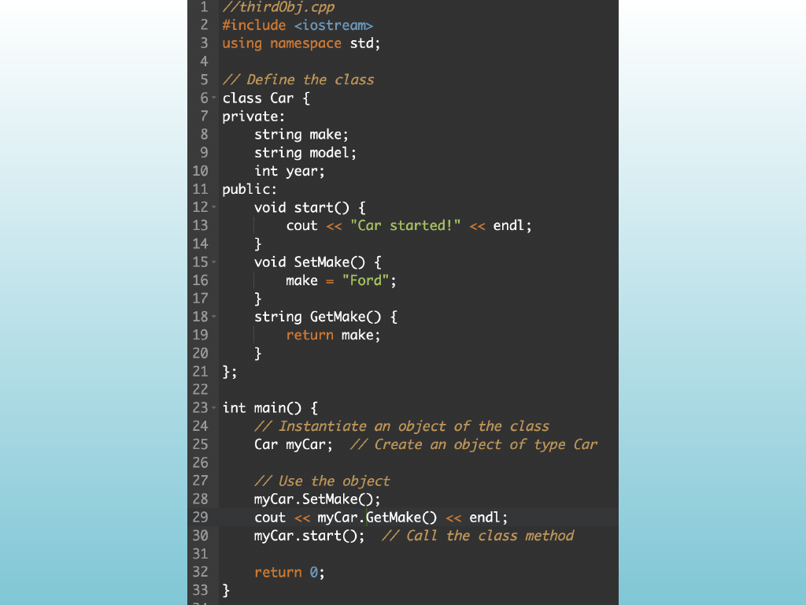{width="100%" fig-alt="Source Slide 40"}

<!-- Slide 40 -->

---

## Source Slide 41

{width="100%" fig-alt="Source Slide 41"}

<!-- Slide 41 -->

---

## Source Slide 42

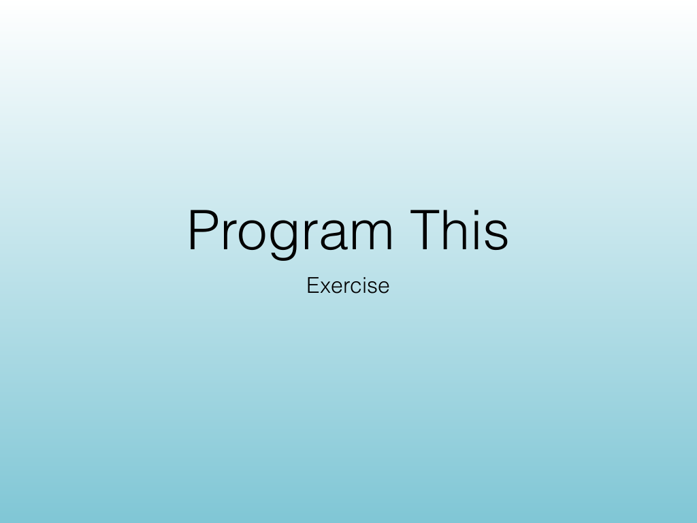{width="100%" fig-alt="Program This"}

<!-- Slide 42 -->

---

## Source Slide 43

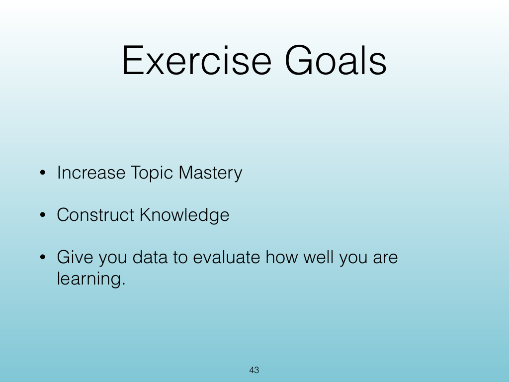{width="100%" fig-alt="Exercise Goals"}

<!-- Slide 43 -->

---

## Source Slide 44

{width="100%" fig-alt="Programming Exercise"}

<!-- Slide 44 -->

---

## Source Slide 45

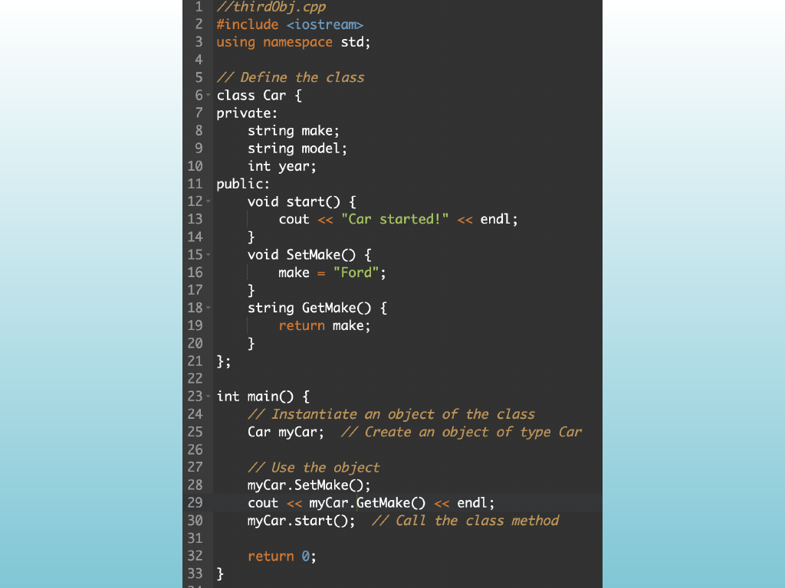{width="100%" fig-alt="Source Slide 45"}

<!-- Slide 45 -->

---

## Source Slide 46

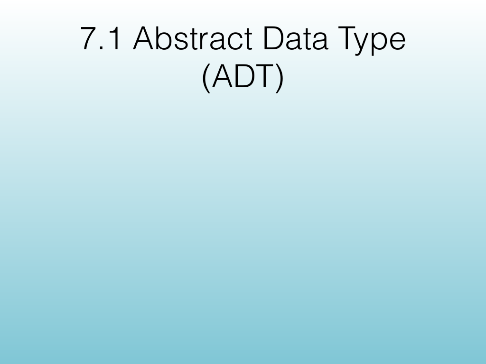{width="100%" fig-alt="7.1 Abstract Data Type"}

<!-- Slide 46 -->
