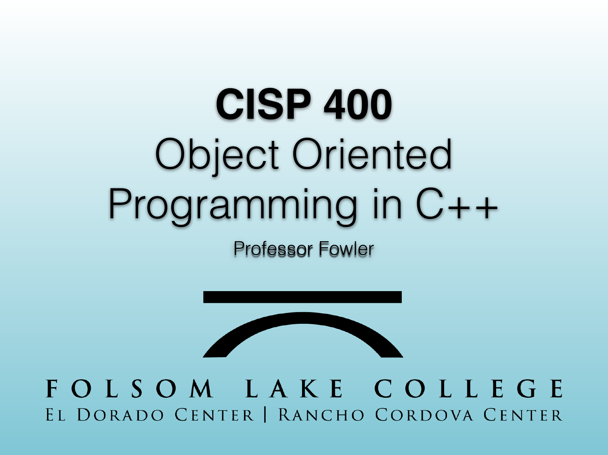
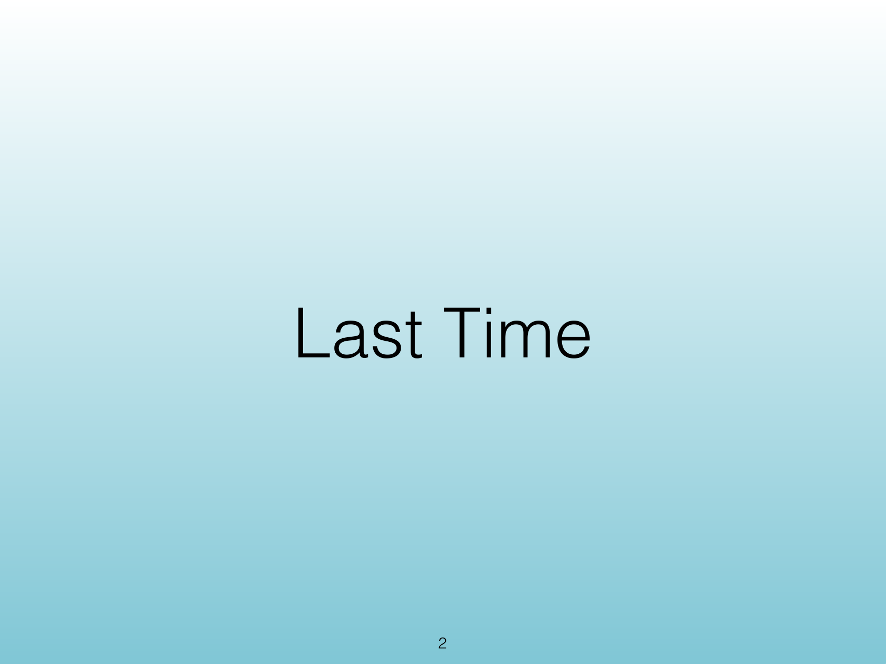
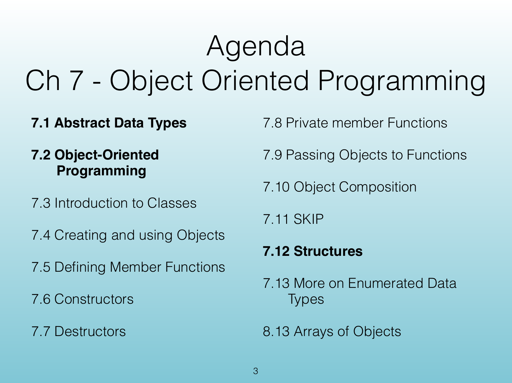

<!-- Topic: Course Framing -->
<!-- Slides 1–8 -->
# Course Framing

## CISP 400
{width="100%" fig-alt="CISP 400"}

::: notes
Slides 1–8
:::

<!-- Slide 1 -->

---

## Last Time
{width="100%" fig-alt="Last Time"}

<!-- Slide 2 -->

---

## Agenda
{width="100%" fig-alt="Agenda"}

<!-- Slide 3 -->

---

## Theme for Today
{width="100%" fig-alt="Theme for Today"}

<!-- Slide 4 -->

---

## Method
{width="100%" fig-alt="Method"}

<!-- Slide 5 -->

---

## Chapter 7 Object-Oriented Programming
{width="100%" fig-alt="Chapter 7 Object-Oriented Programming"}

<!-- Slide 6 -->

---

## Agenda
{width="100%" fig-alt="Agenda"}

<!-- Slide 7 -->

---

## Agenda
{width="100%" fig-alt="Agenda"}

<!-- Slide 8 -->
