<!-- Topic: Methods and Public Interfaces -->
<!-- Slides 78–93 -->

# Methods and Public Interfaces

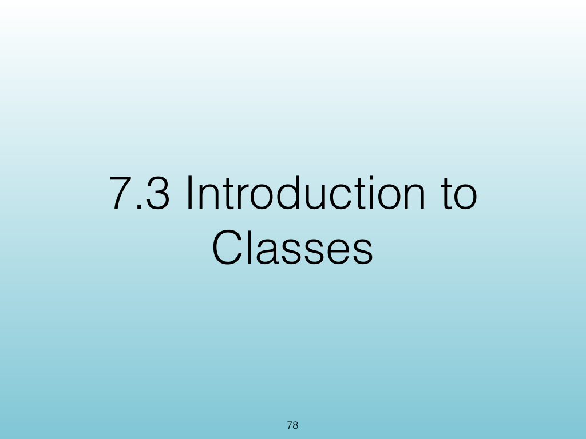{width="100%" fig-alt="Methods and Public Interfaces"}

::: notes
Slides 78–93
Source slide 78 from the authoritative PDF.
:::

<!-- Slide 78 -->

---

## Source Slide 79

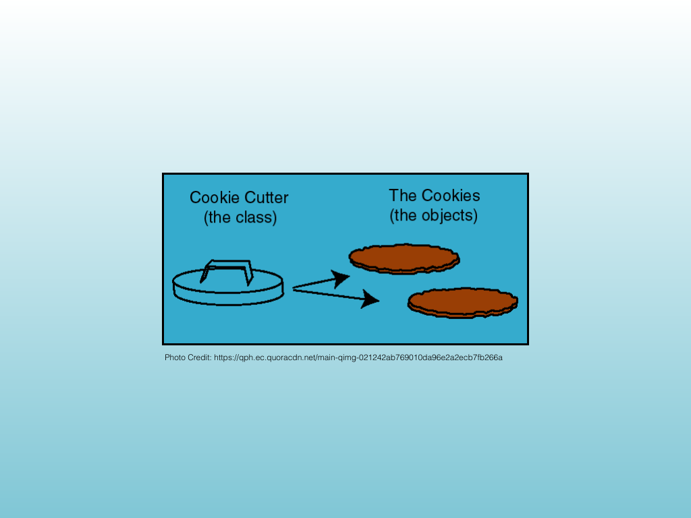{width="100%" fig-alt="Photo Credit: https://qph.ec.quoracdn.net/main-qimg-021242ab769010da96e2a2ecb7fb266a"}

<!-- Slide 79 -->

---

## Source Slide 80

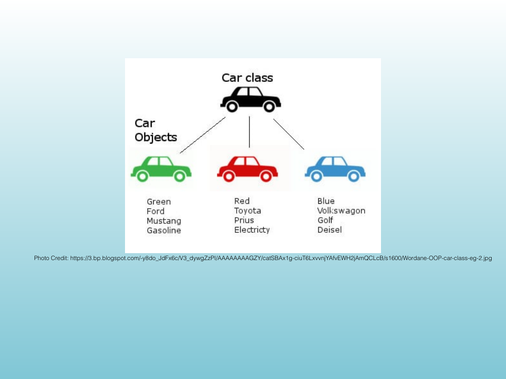{width="100%" fig-alt="Photo Credit: https://3.bp.blogspot.com/-y8do_JdFx6c/V3_dywgZzPI/AAAAAAAAGZY/catSBAx1g-ciuT6LxvvnjYAfvEWH2jAmQCLcB/s1600"}

<!-- Slide 80 -->

---

## Source Slide 81

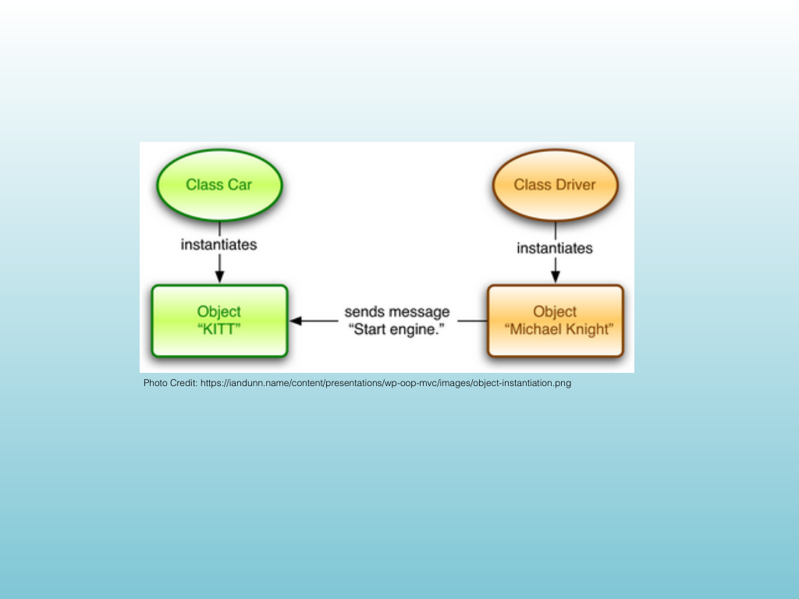{width="100%" fig-alt="Photo Credit: https://iandunn.name/content/presentations/wp-oop-mvc/images/object-instantiation.png"}

<!-- Slide 81 -->

---

## Source Slide 82

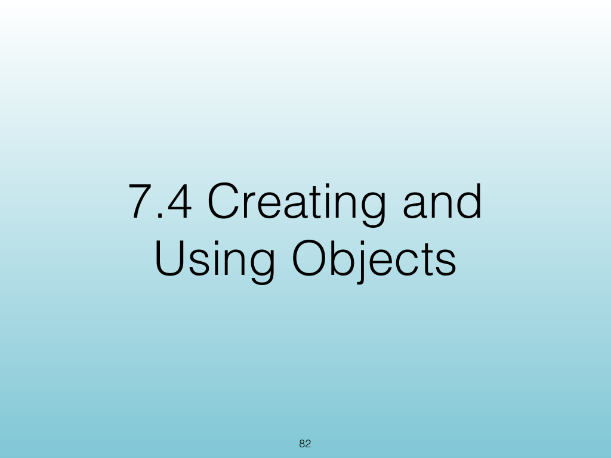{width="100%" fig-alt="7.4 Creating and"}

<!-- Slide 82 -->

---

## Source Slide 83

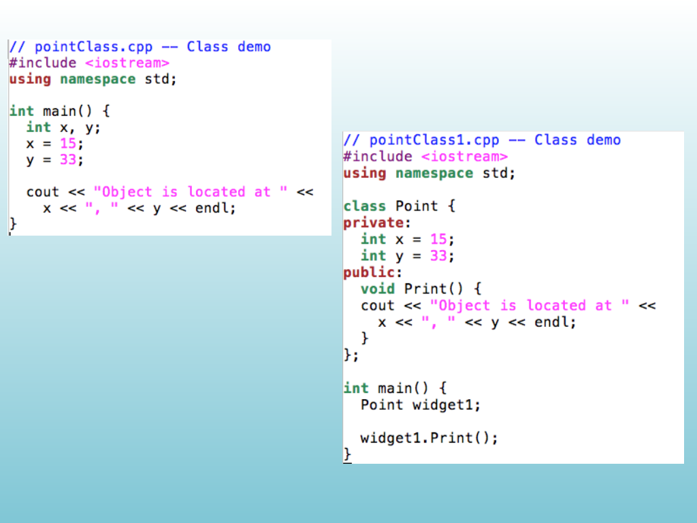{width="100%" fig-alt="Source Slide 83"}

<!-- Slide 83 -->

---

## Source Slide 84

{width="100%" fig-alt="7.5 De ning Member"}

<!-- Slide 84 -->

---

## Source Slide 85

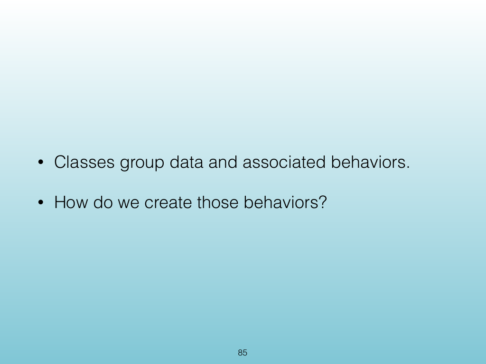{width="100%" fig-alt="• Classes group data and associated behaviors."}

<!-- Slide 85 -->

---

## Source Slide 86

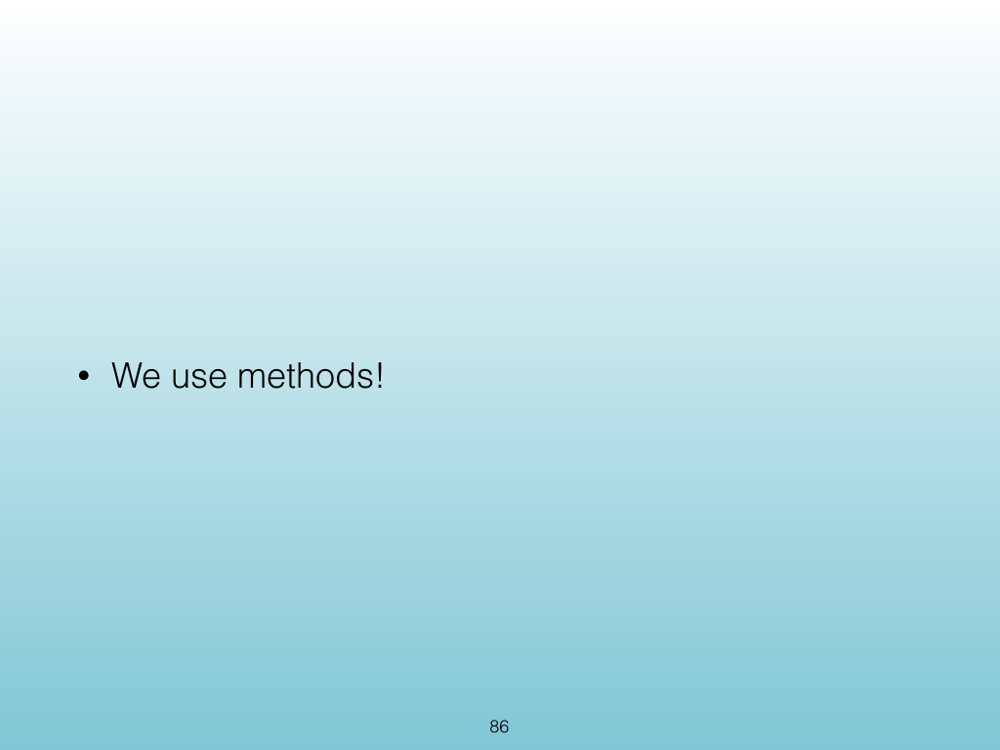{width="100%" fig-alt="• We use methods!"}

<!-- Slide 86 -->

---

## Source Slide 87

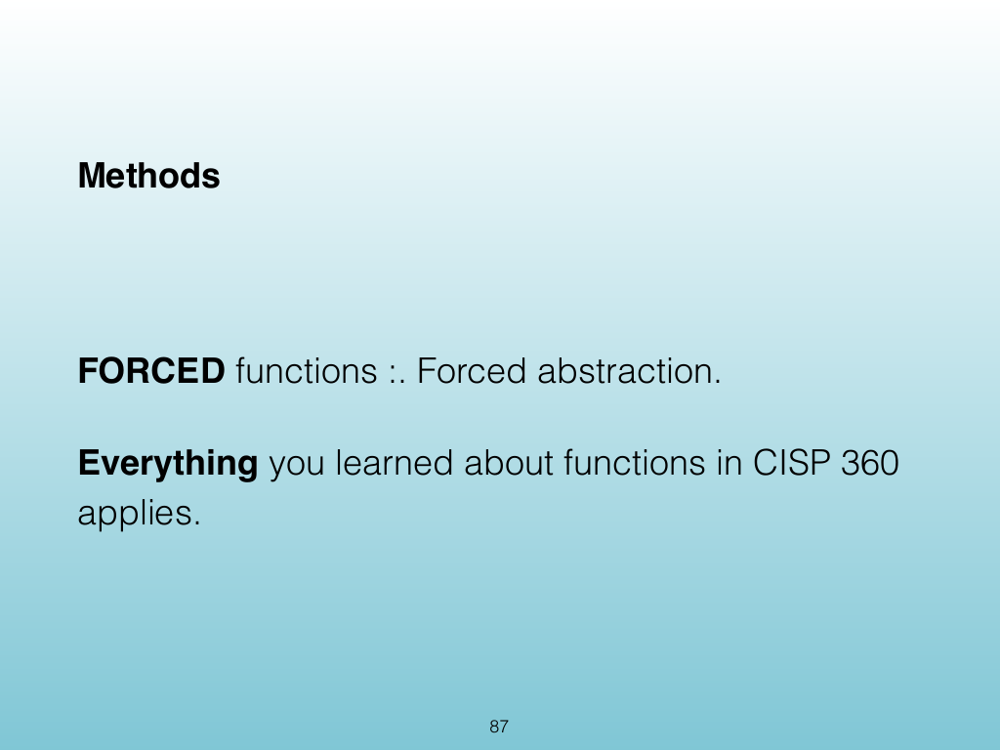{width="100%" fig-alt="Methods"}

<!-- Slide 87 -->

---

## Source Slide 88

{width="100%" fig-alt="Method"}

<!-- Slide 88 -->

---

## Source Slide 89

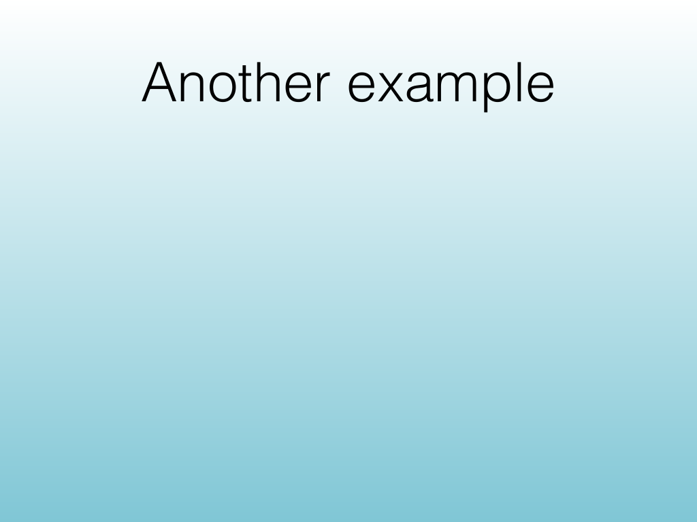{width="100%" fig-alt="Another example"}

<!-- Slide 89 -->

---

## Source Slide 90

{width="100%" fig-alt="Source Slide 90"}

<!-- Slide 90 -->

---

## Source Slide 91

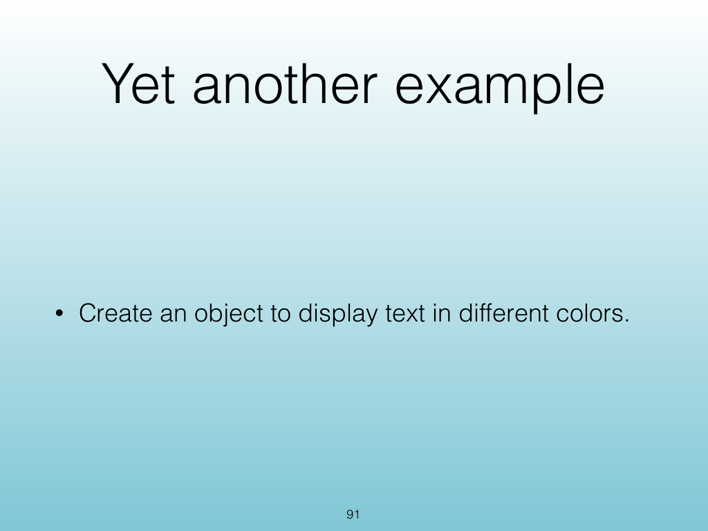{width="100%" fig-alt="Yet another example"}

<!-- Slide 91 -->

---

## Source Slide 92

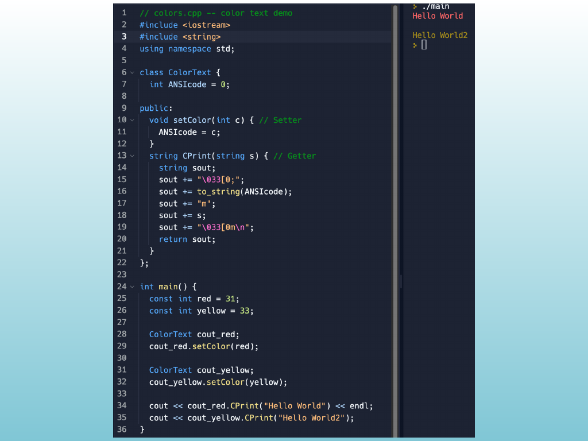{width="100%" fig-alt="Source Slide 92"}

<!-- Slide 92 -->

---

## Source Slide 93

{width="100%" fig-alt="Exercise"}

<!-- Slide 93 -->
