<!-- Topic: Structures -->
<!-- Slides 20–31 -->

# Structures

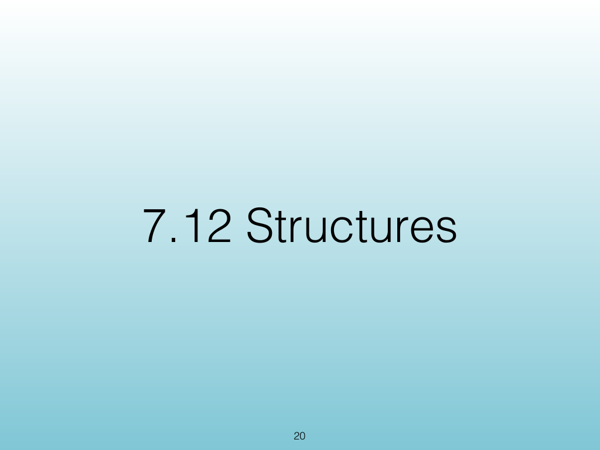{width="100%" fig-alt="Structures"}

::: notes
Slides 20–31
Source slide 20 from the authoritative PDF.
:::

<!-- Slide 20 -->

---

## Source Slide 21

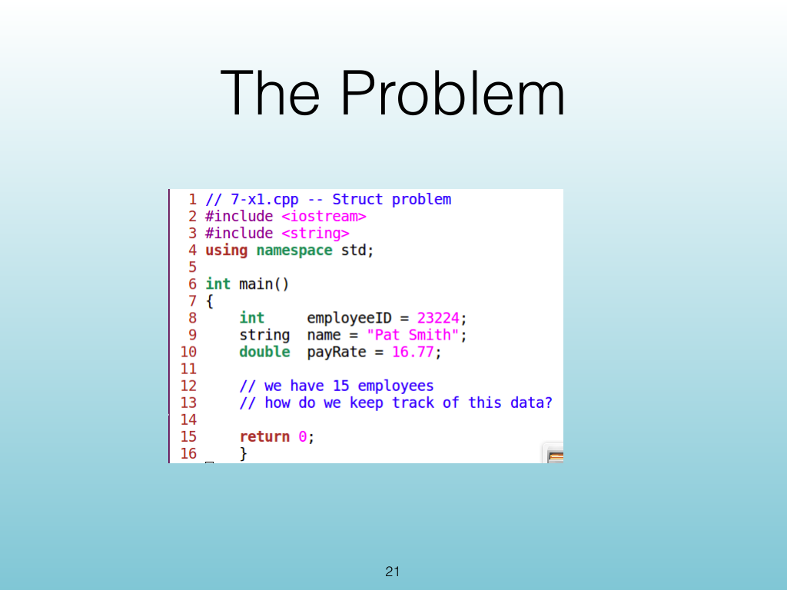{width="100%" fig-alt="The Problem"}

<!-- Slide 21 -->

---

## Source Slide 22

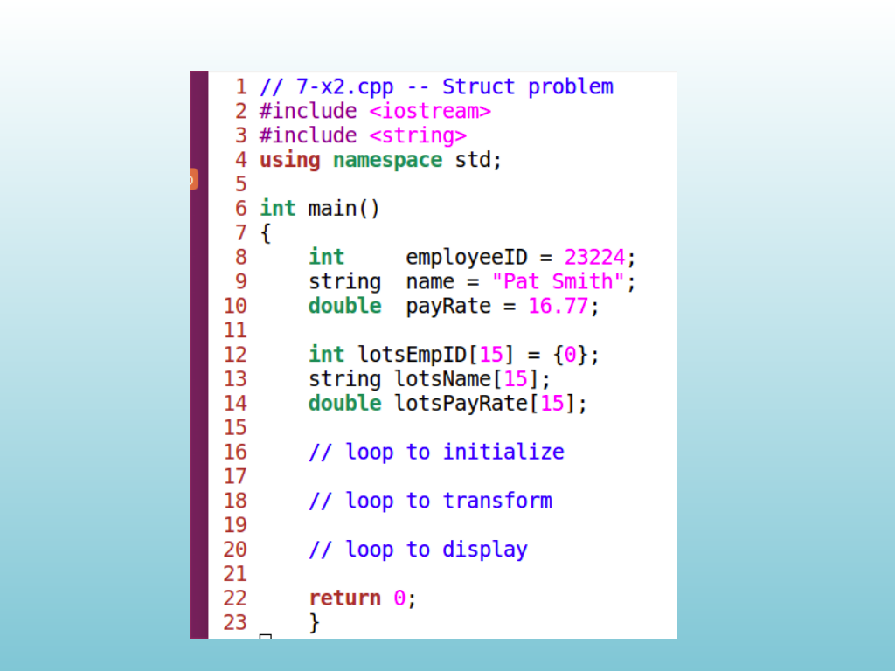{width="100%" fig-alt="Source Slide 22"}

<!-- Slide 22 -->

---

## Source Slide 23

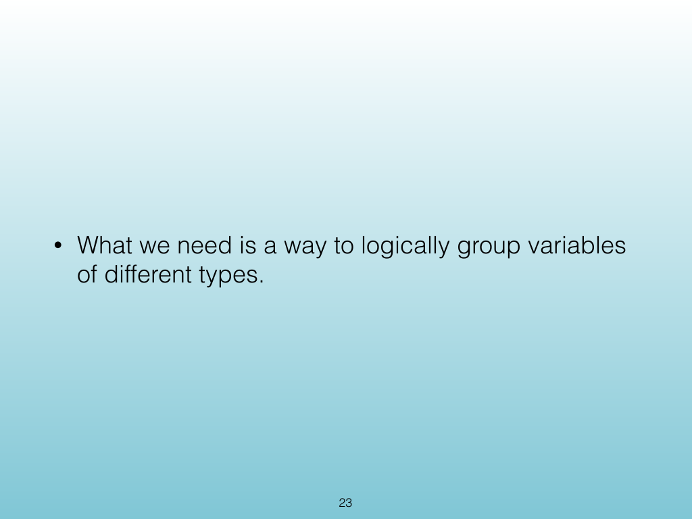{width="100%" fig-alt="• What we need is a way to logically group variables"}

<!-- Slide 23 -->

---

## Source Slide 24

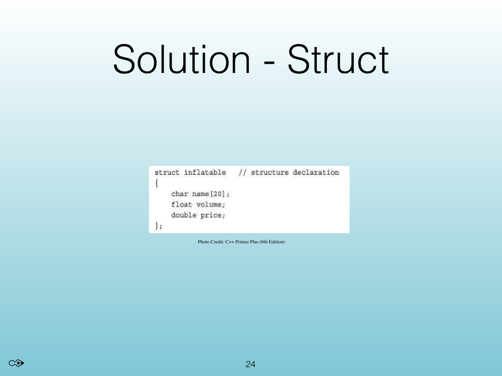{width="100%" fig-alt="Solution - Struct"}

<!-- Slide 24 -->

---

## Source Slide 25

{width="100%" fig-alt="Photo Credit: C++ Primer Plus (6th Edition)"}

<!-- Slide 25 -->

---

## Source Slide 26

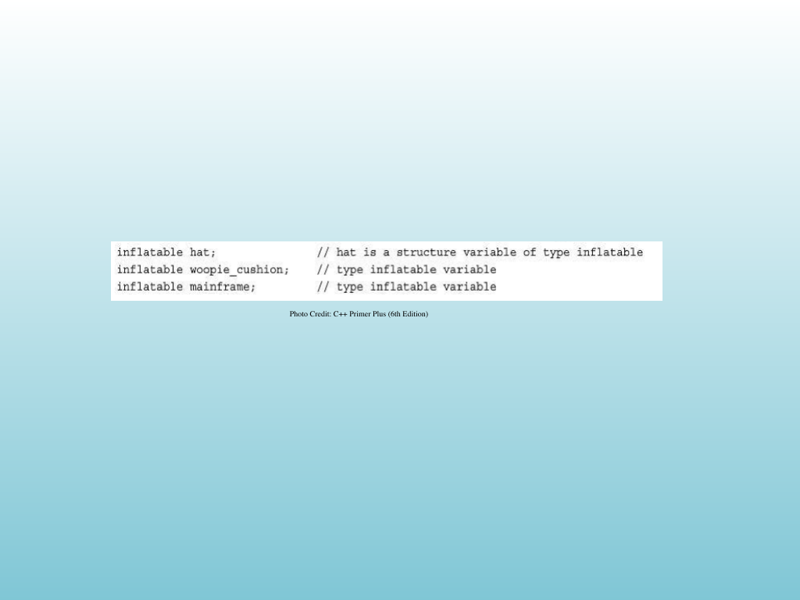{width="100%" fig-alt="Photo Credit: C++ Primer Plus (6th Edition)"}

<!-- Slide 26 -->

---

## Source Slide 27

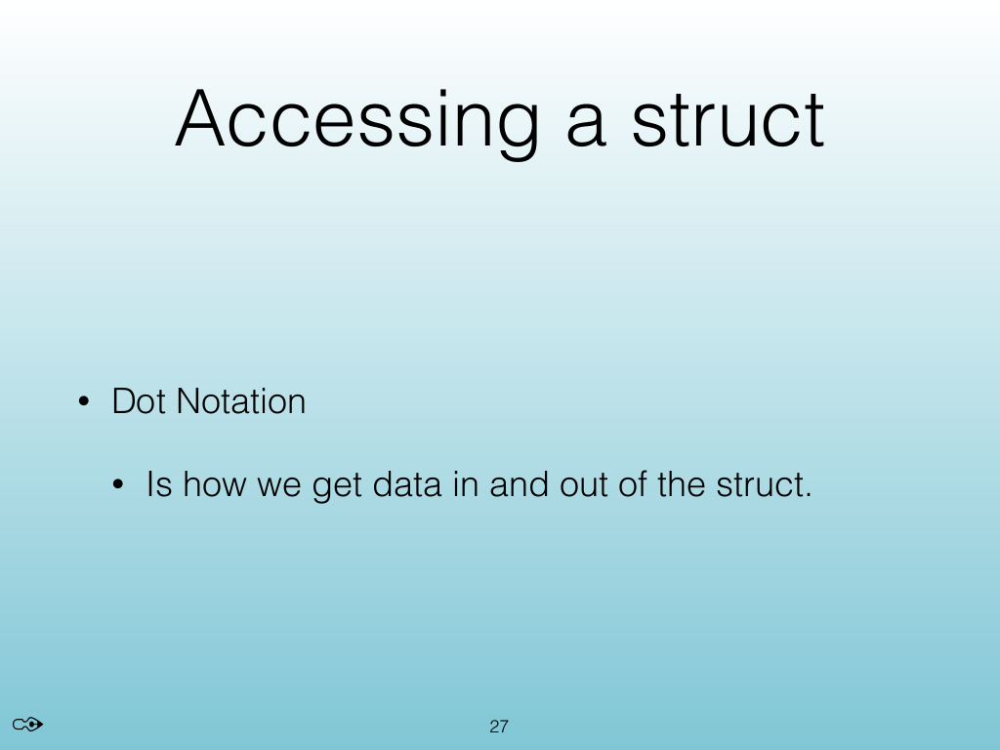{width="100%" fig-alt="Accessing a struct"}

<!-- Slide 27 -->

---

## Source Slide 28

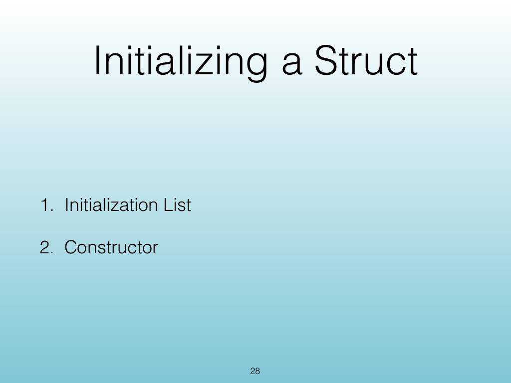{width="100%" fig-alt="Initializing a Struct"}

<!-- Slide 28 -->

---

## Source Slide 29

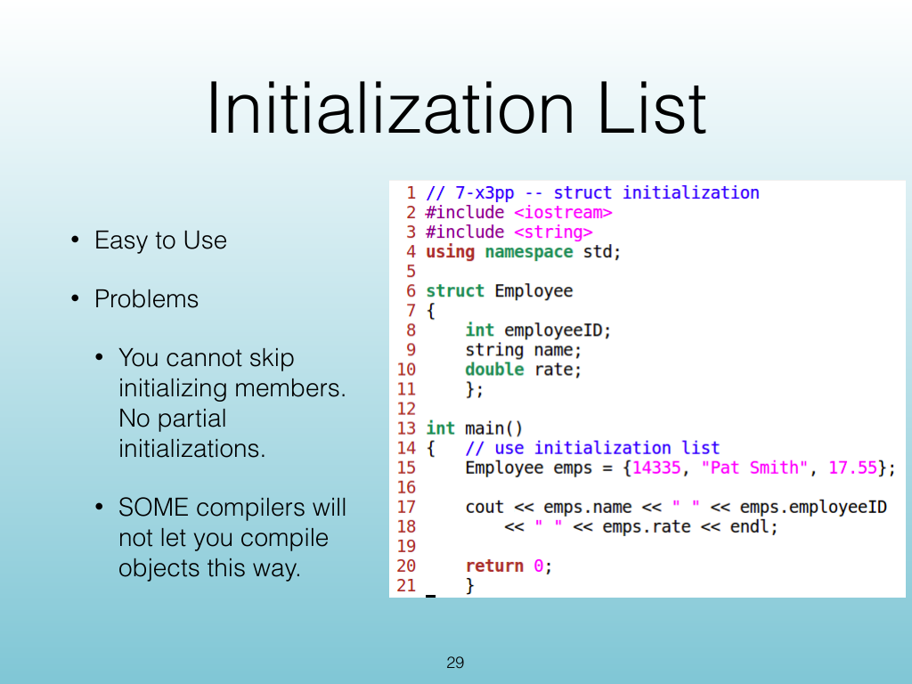{width="100%" fig-alt="Initialization List"}

<!-- Slide 29 -->

---

## Source Slide 30

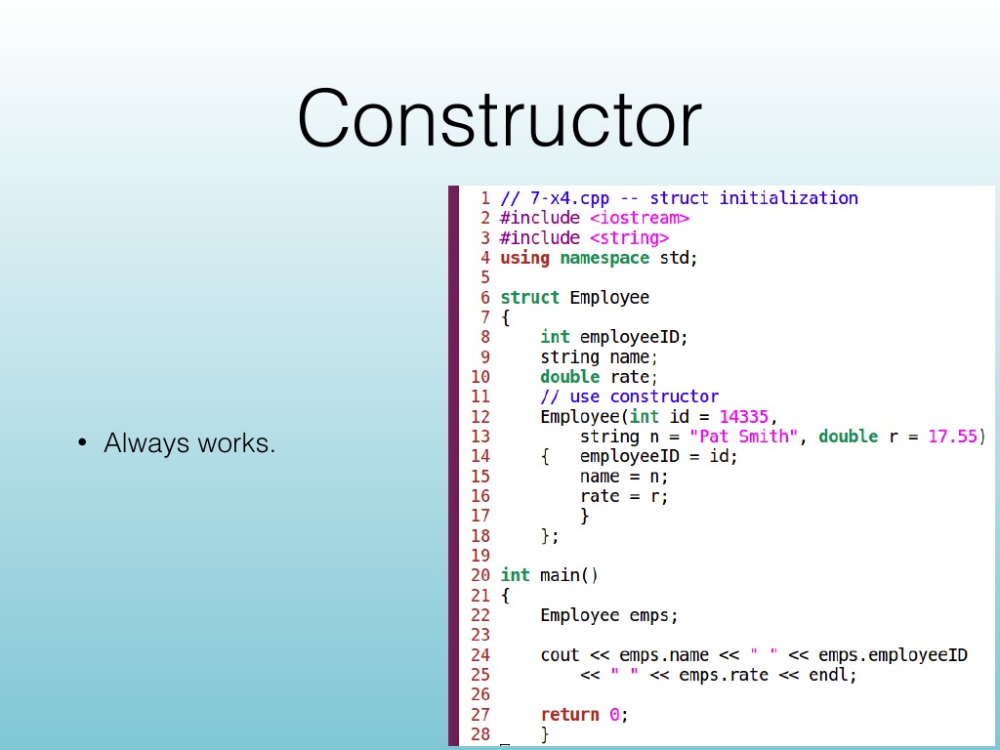{width="100%" fig-alt="Constructor"}

<!-- Slide 30 -->

---

## Source Slide 31

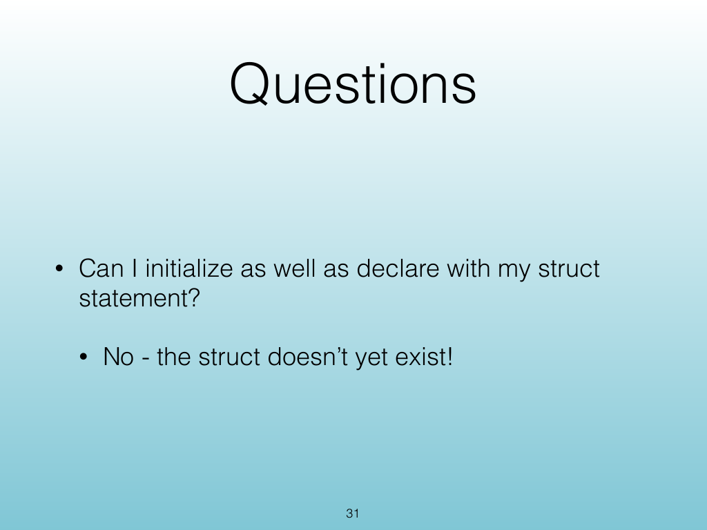{width="100%" fig-alt="Questions"}

<!-- Slide 31 -->
