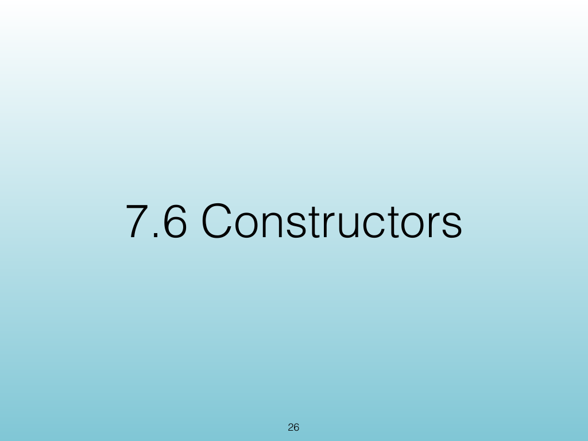
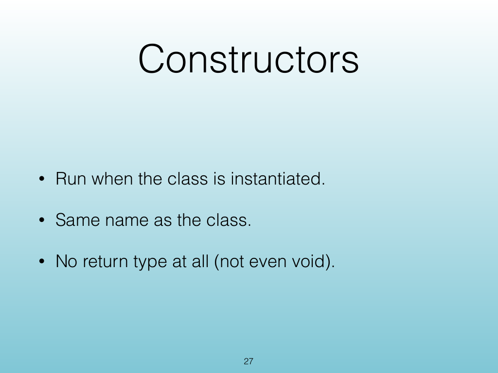
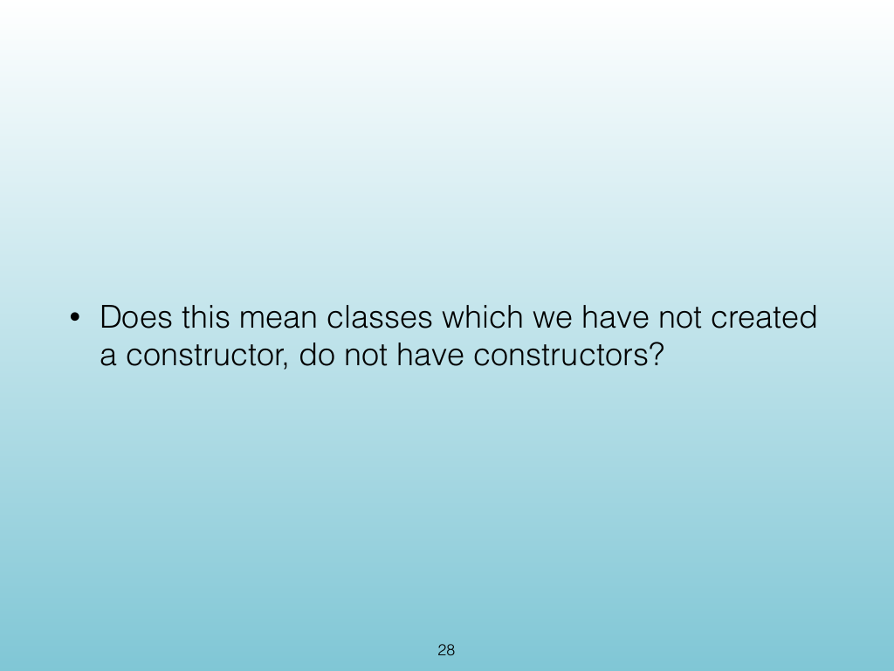
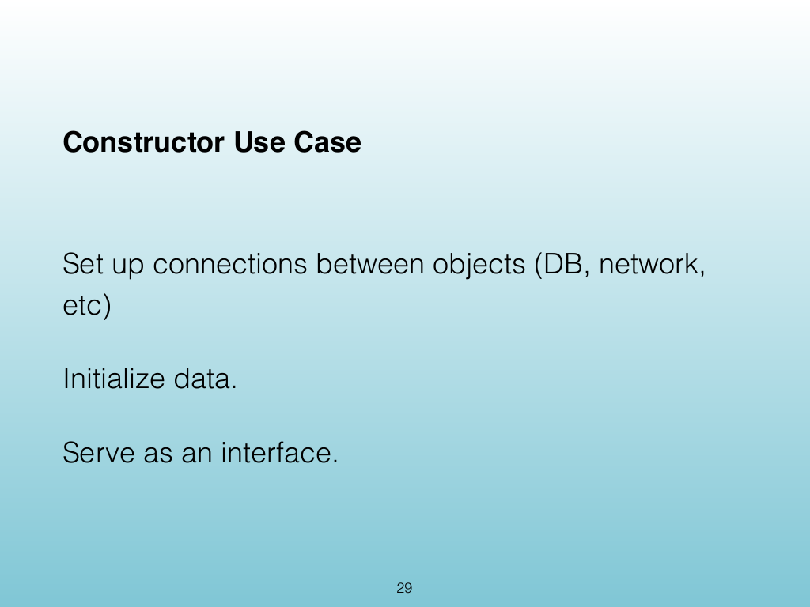
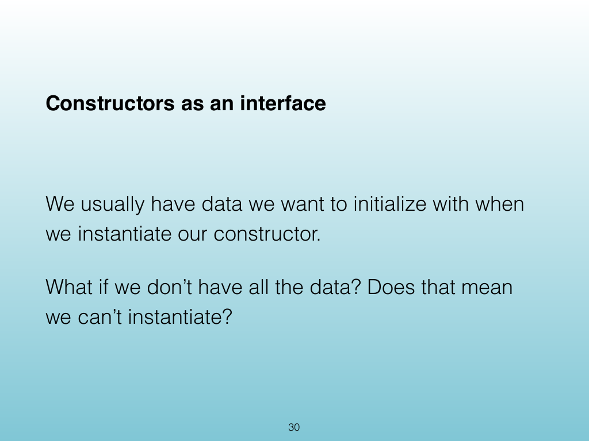
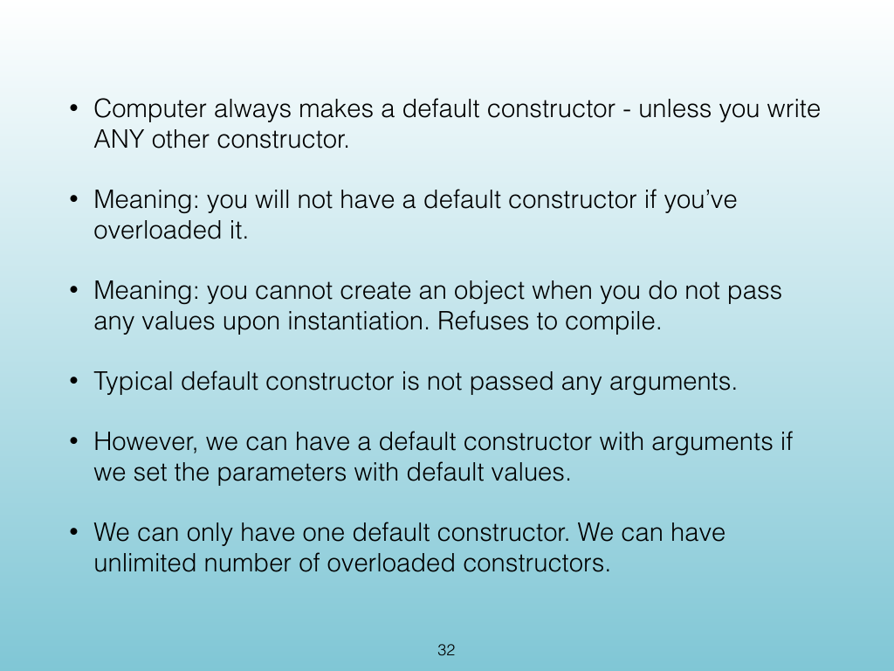
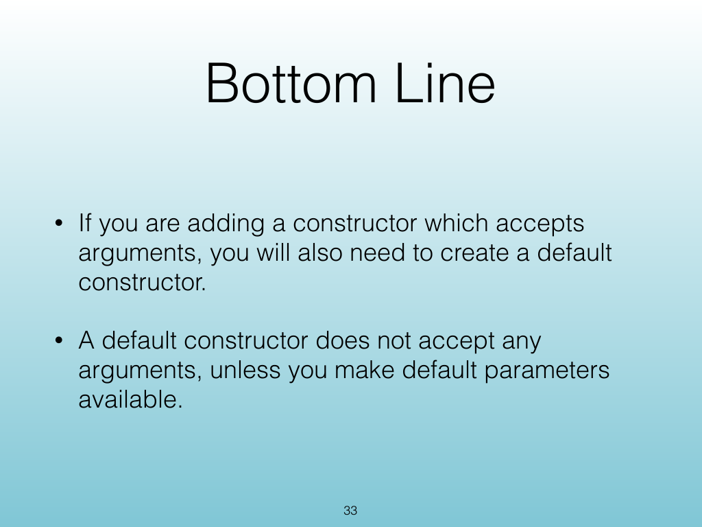
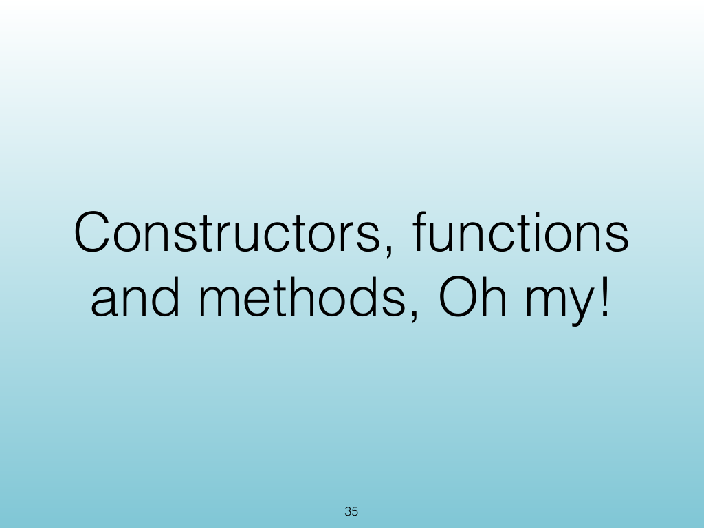
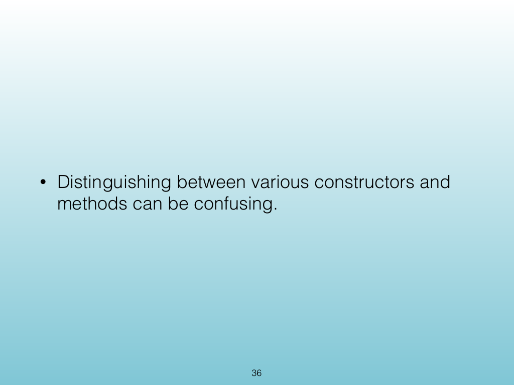
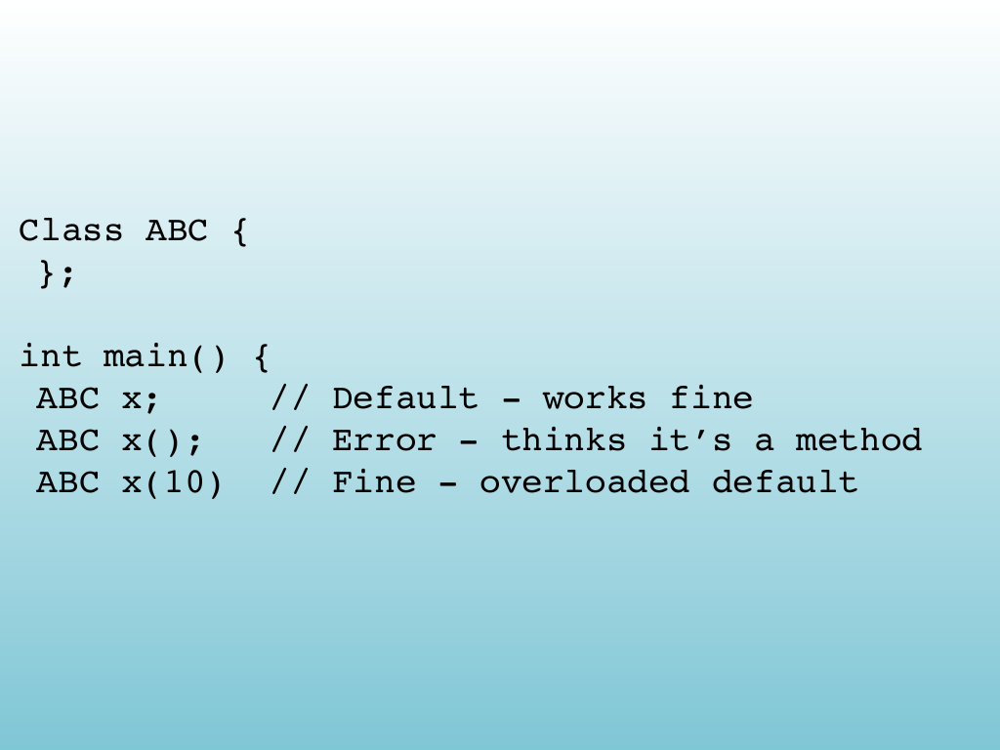

<!-- Topic: Constructors and Constructor Overloading -->
<!-- Slides 26–37 -->

# Constructors and Constructor Overloading

{width="100%" fig-alt="Constructors and Constructor Overloading"}

::: notes
Slides 26–37
Source slide 26 from the authoritative PDF.
:::

<!-- Slide 26 -->

---

## Source Slide 27

{width="100%" fig-alt="Constructors"}

<!-- Slide 27 -->

---

## Source Slide 28

{width="100%" fig-alt="• Does this mean classes which we have not created"}

<!-- Slide 28 -->

---

## Source Slide 29

{width="100%" fig-alt="Constructor Use Case"}

<!-- Slide 29 -->

---

## Source Slide 30

{width="100%" fig-alt="Constructors as an interface"}

<!-- Slide 30 -->

---

## Source Slide 31

{width="100%" fig-alt="Overloading Constructors"}

<!-- Slide 31 -->

---

## Source Slide 32

{width="100%" fig-alt="• Computer always makes a default constructor - unless you write"}

<!-- Slide 32 -->

---

## Source Slide 33

{width="100%" fig-alt="Bottom Line"}

<!-- Slide 33 -->

---

## Source Slide 34

{width="100%" fig-alt="Source Slide 34"}

<!-- Slide 34 -->

---

## Source Slide 35

{width="100%" fig-alt="Constructors, functions"}

<!-- Slide 35 -->

---

## Source Slide 36

{width="100%" fig-alt="• Distinguishing between various constructors and"}

<!-- Slide 36 -->

---

## Source Slide 37

{width="100%" fig-alt="Class ABC {"}

<!-- Slide 37 -->
