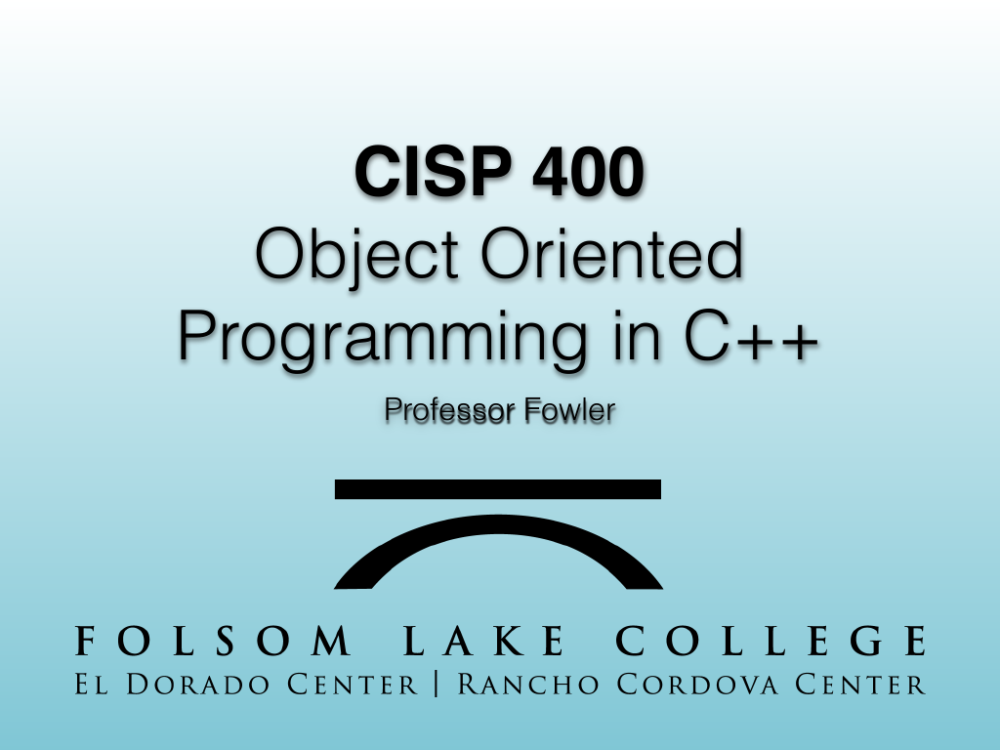
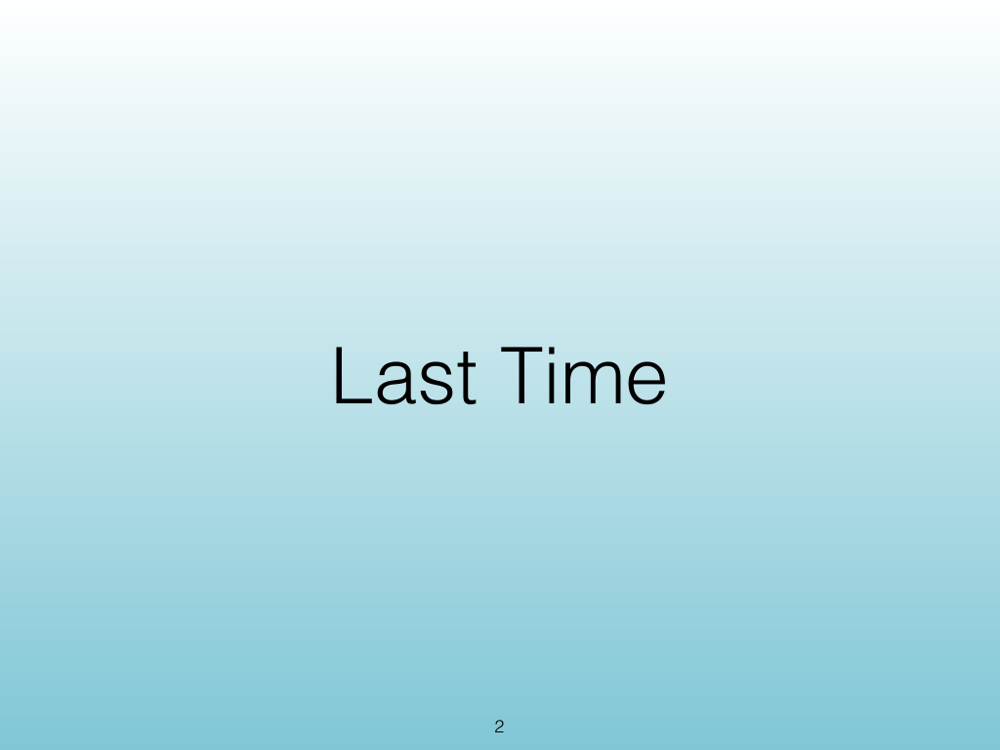
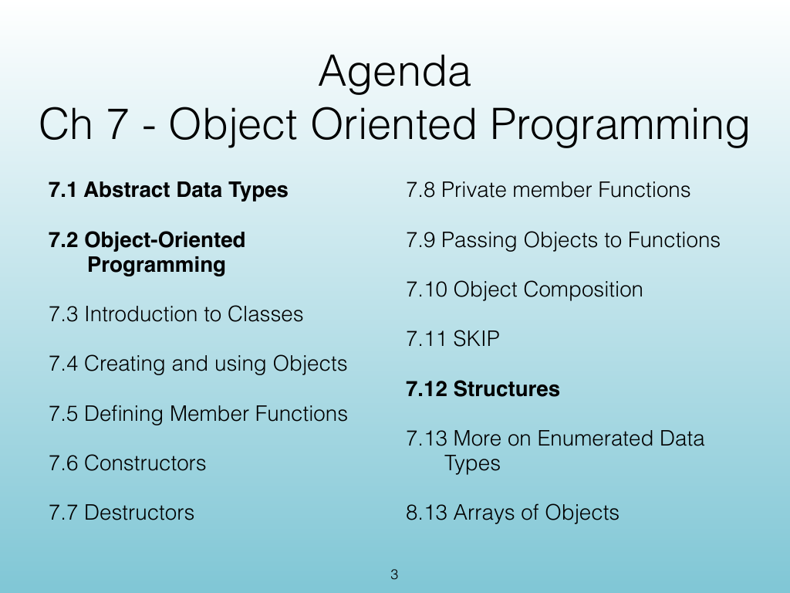
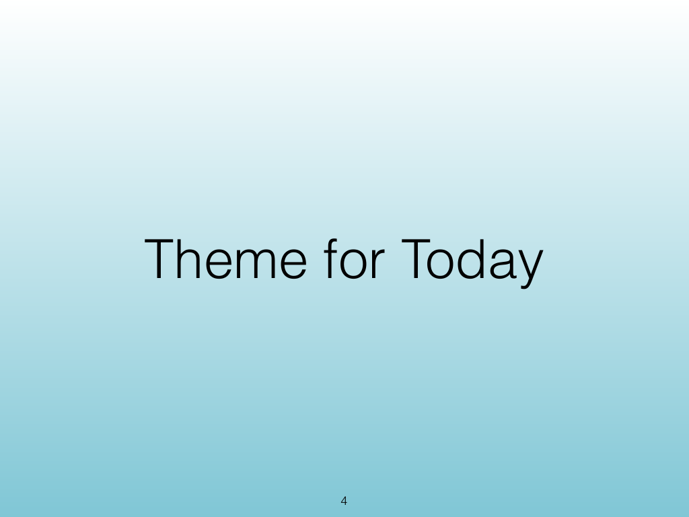
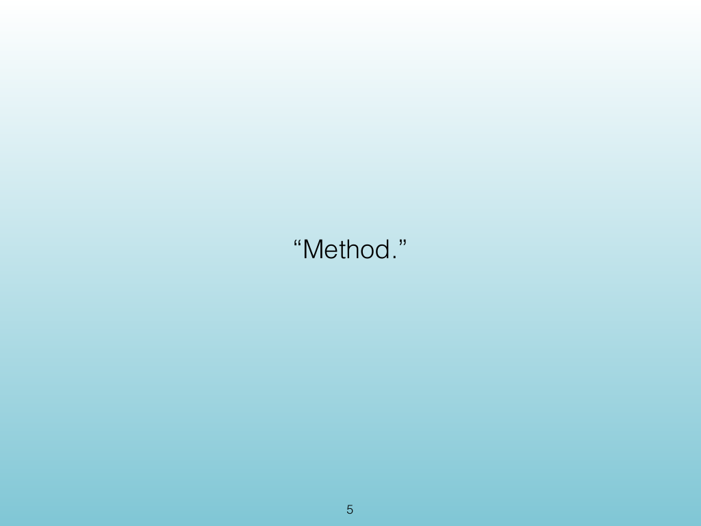
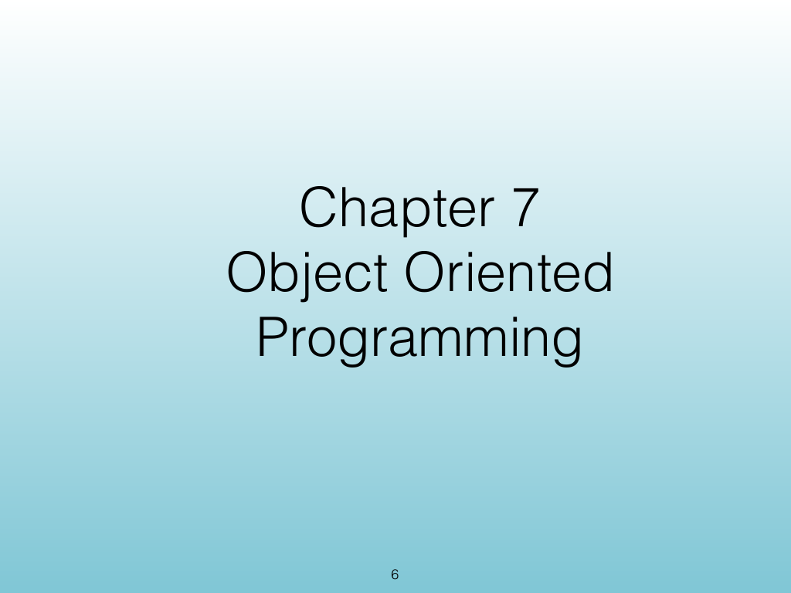
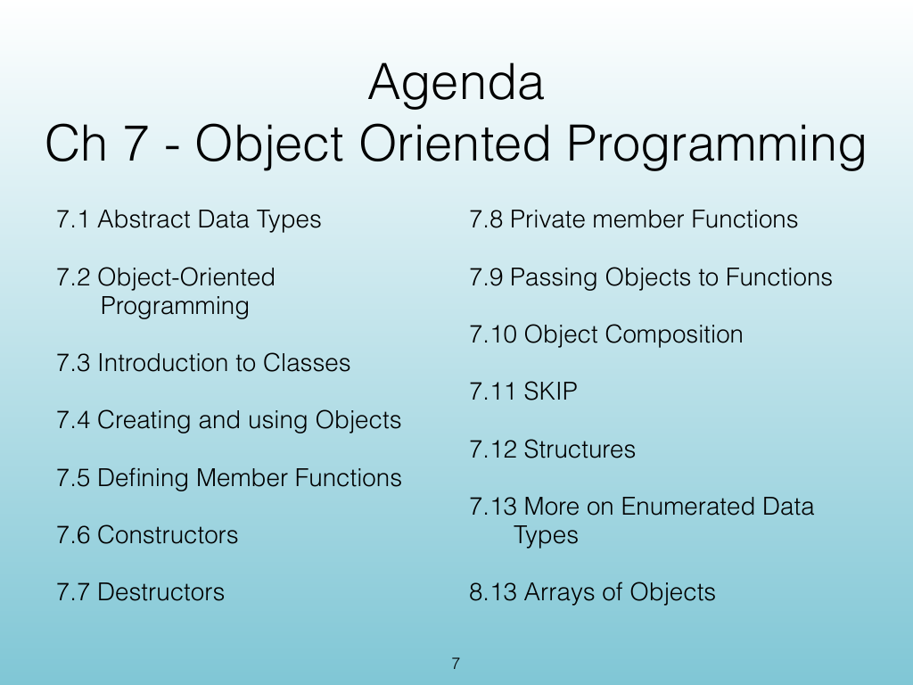
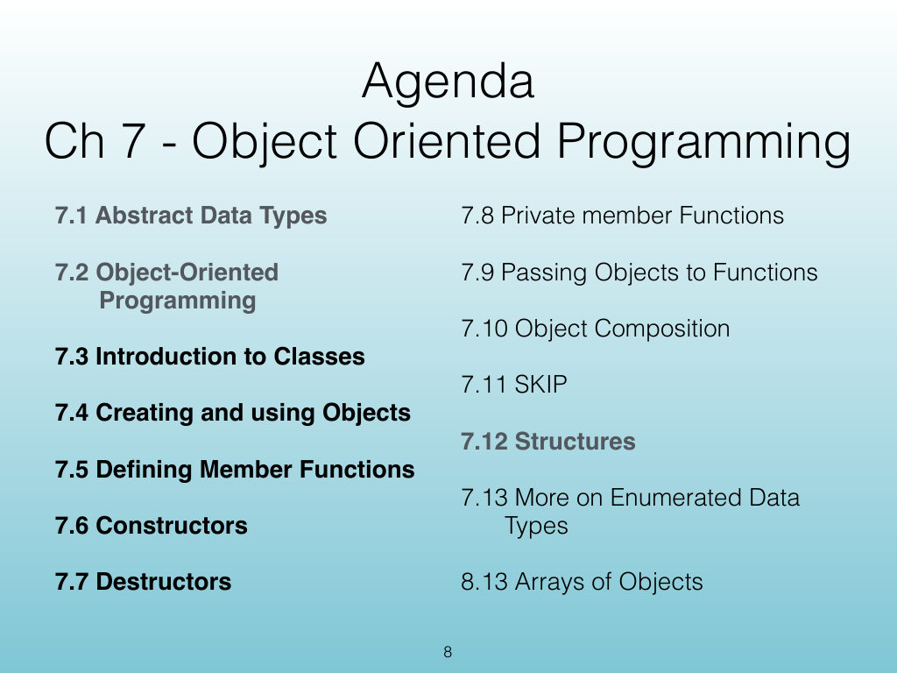

<!-- Topic: Course Framing -->
<!-- Slides 1–8 -->

# Course Framing

{width="100%" fig-alt="Course Framing"}

::: notes
Slides 1–8
Source slide 1 from the authoritative PDF.
:::

<!-- Slide 1 -->

---

## Source Slide 2

{width="100%" fig-alt="Last Time"}

<!-- Slide 2 -->

---

## Source Slide 3

{width="100%" fig-alt="Agenda"}

<!-- Slide 3 -->

---

## Source Slide 4

{width="100%" fig-alt="Theme for Today"}

<!-- Slide 4 -->

---

## Source Slide 5

{width="100%" fig-alt="“Method.”"}

<!-- Slide 5 -->

---

## Source Slide 6

{width="100%" fig-alt="Chapter 7"}

<!-- Slide 6 -->

---

## Source Slide 7

{width="100%" fig-alt="Agenda"}

<!-- Slide 7 -->

---

## Source Slide 8

{width="100%" fig-alt="Agenda"}

<!-- Slide 8 -->
