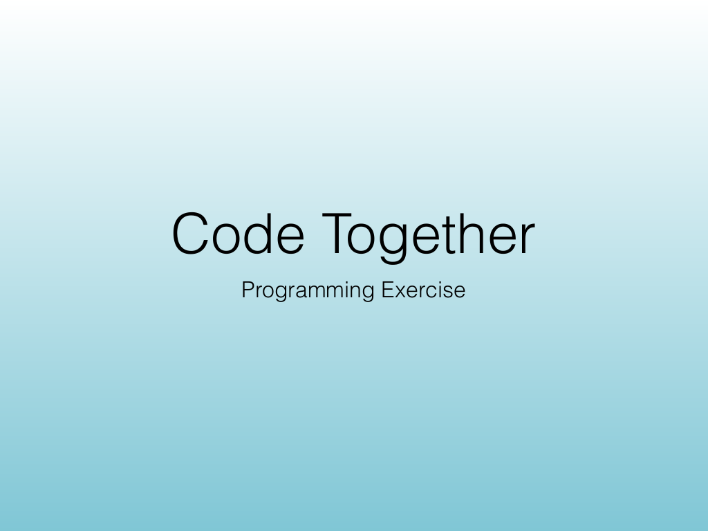
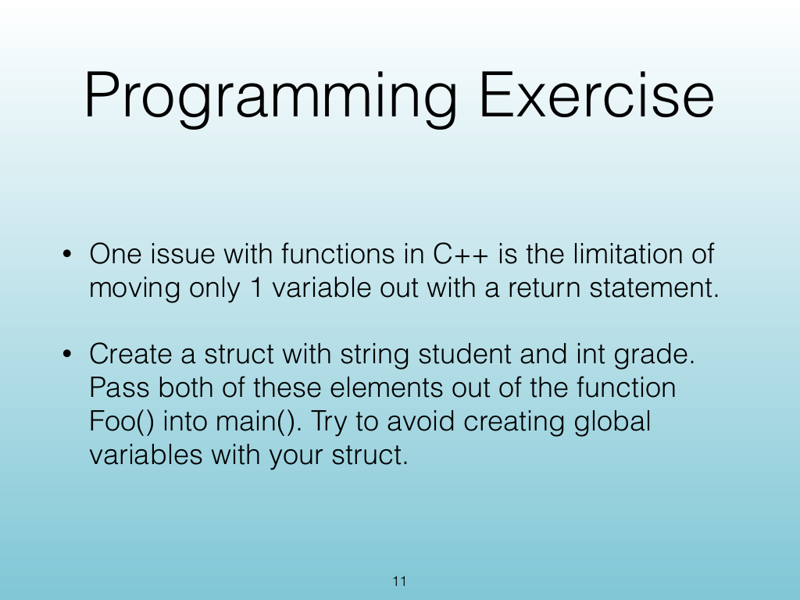
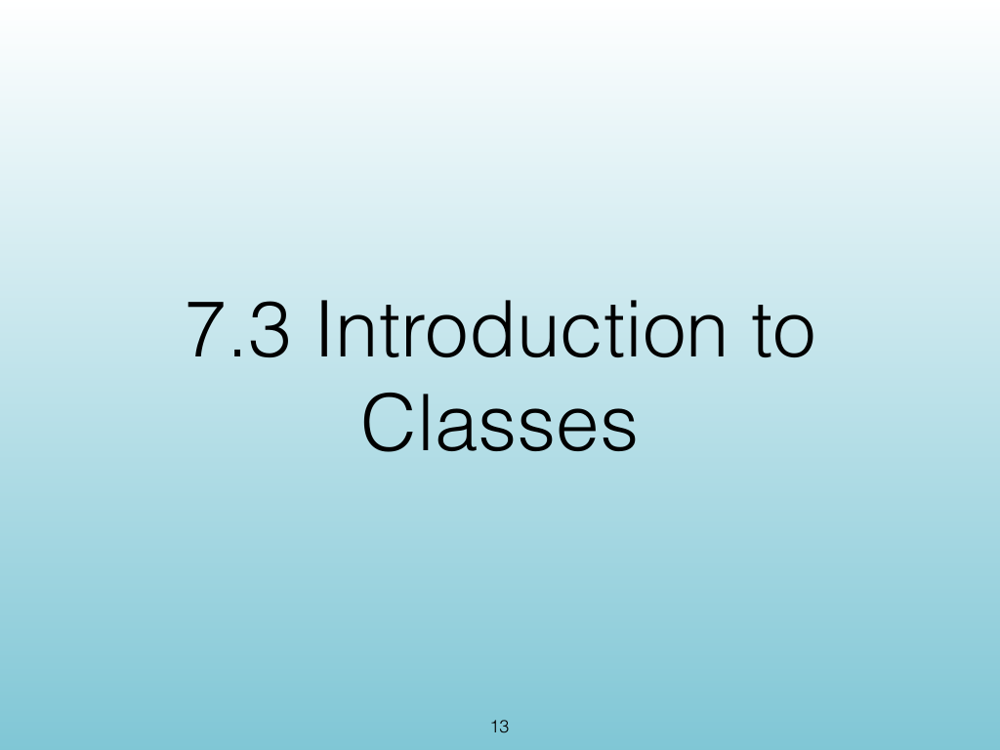
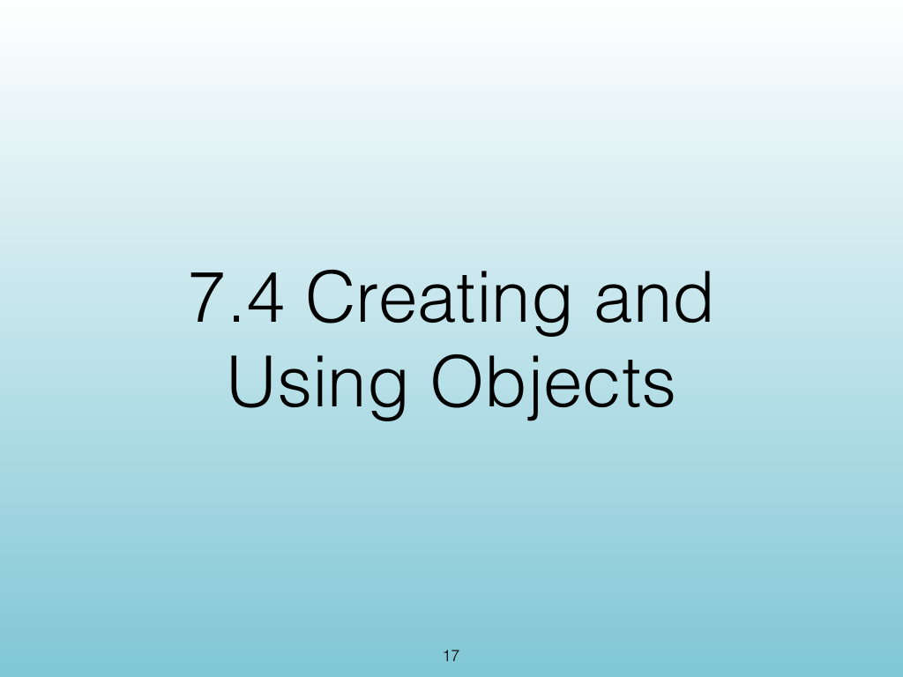
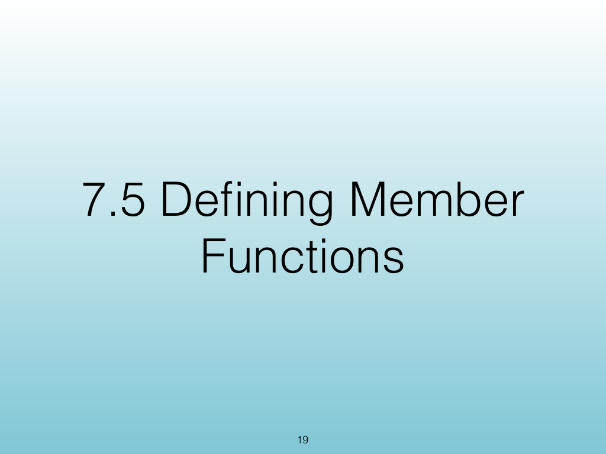
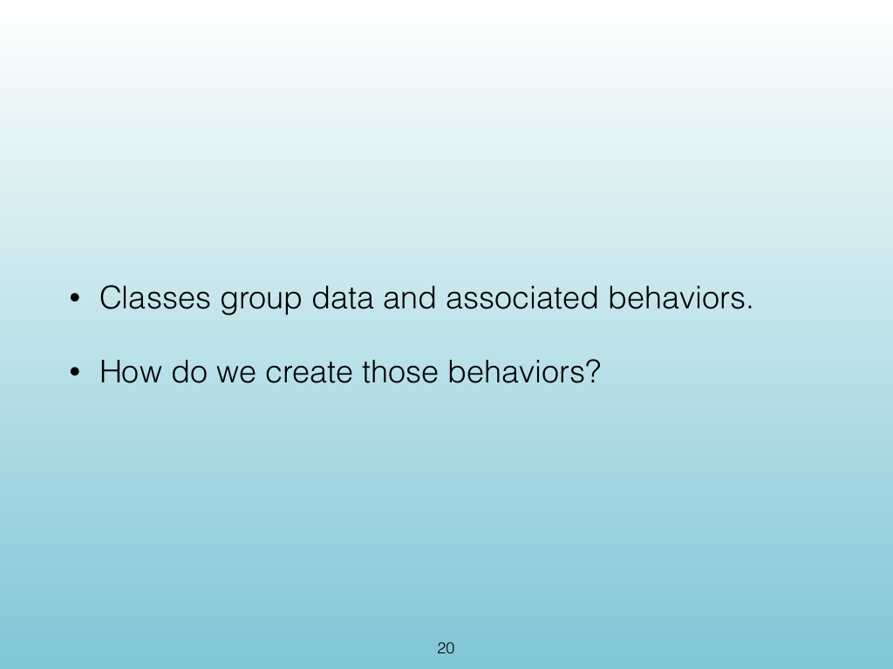
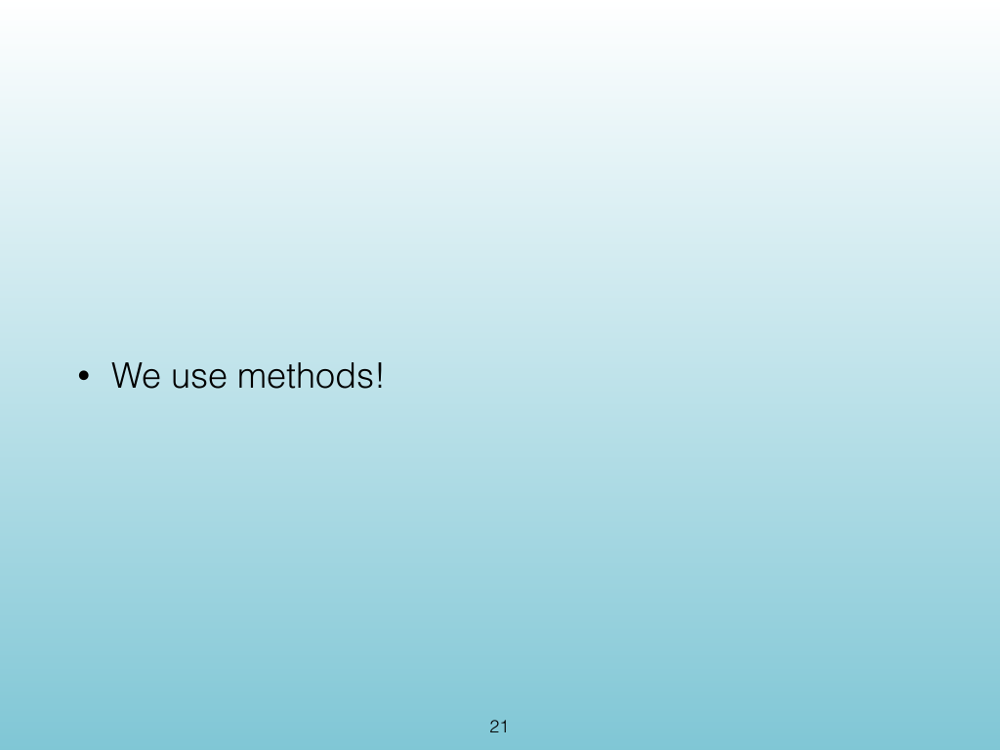
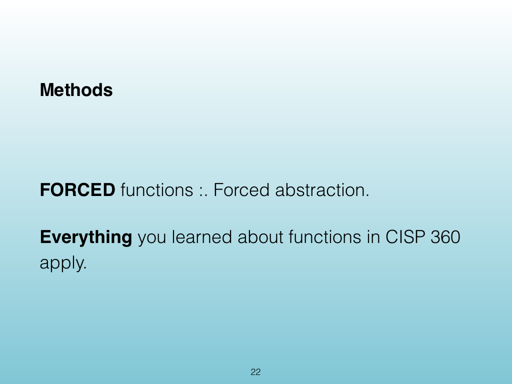
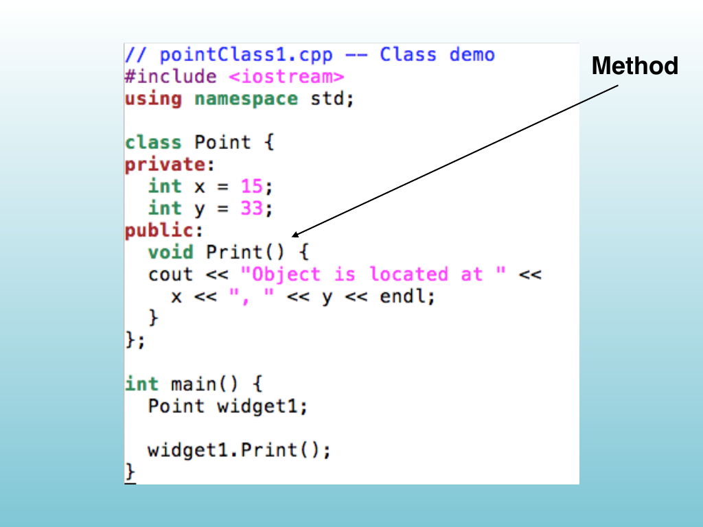

<!-- Topic: Methods -->
<!-- Slides 9–25 -->

# Methods

{width="100%" fig-alt="Methods"}

::: notes
Slides 9–25
Source slide 9 from the authoritative PDF.
:::

<!-- Slide 9 -->

---

## Source Slide 10

{width="100%" fig-alt="Exercise Goals"}

<!-- Slide 10 -->

---

## Source Slide 11

{width="100%" fig-alt="Programming Exercise"}

<!-- Slide 11 -->

---

## Source Slide 12

{width="100%" fig-alt="Source Slide 12"}

<!-- Slide 12 -->

---

## Source Slide 13

{width="100%" fig-alt="7.3 Introduction to"}

<!-- Slide 13 -->

---

## Source Slide 14

{width="100%" fig-alt="Photo Credit: https://qph.ec.quoracdn.net/main-qimg-021242ab769010da96e2a2ecb7fb266a"}

<!-- Slide 14 -->

---

## Source Slide 15

{width="100%" fig-alt="Photo Credit: https://3.bp.blogspot.com/-y8do_JdFx6c/V3_dywgZzPI/AAAAAAAAGZY/catSBAx1g-ciuT6LxvvnjYAfvEWH2jAmQCLcB/s1600"}

<!-- Slide 15 -->

---

## Source Slide 16

{width="100%" fig-alt="Photo Credit: https://iandunn.name/content/presentations/wp-oop-mvc/images/object-instantiation.png"}

<!-- Slide 16 -->

---

## Source Slide 17

{width="100%" fig-alt="7.4 Creating and"}

<!-- Slide 17 -->

---

## Source Slide 18

{width="100%" fig-alt="Source Slide 18"}

<!-- Slide 18 -->

---

## Source Slide 19

{width="100%" fig-alt="7.5 De ning Member"}

<!-- Slide 19 -->

---

## Source Slide 20

{width="100%" fig-alt="• Classes group data and associated behaviors."}

<!-- Slide 20 -->

---

## Source Slide 21

{width="100%" fig-alt="• We use methods!"}

<!-- Slide 21 -->

---

## Source Slide 22

{width="100%" fig-alt="Methods"}

<!-- Slide 22 -->

---

## Source Slide 23

{width="100%" fig-alt="Method"}

<!-- Slide 23 -->

---

## Source Slide 24

{width="100%" fig-alt="Another example"}

<!-- Slide 24 -->

---

## Source Slide 25

{width="100%" fig-alt="Source Slide 25"}

<!-- Slide 25 -->
