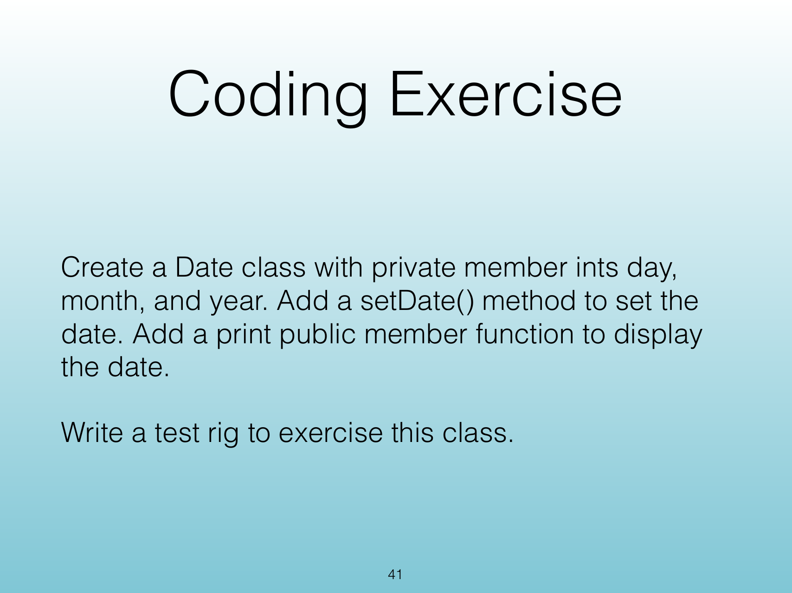

<!-- Topic: Review and Coding Exercise -->
<!-- Slides 4–10 -->
# <span style="display:none">Review and Coding Exercise</span>

## Coding Exercise - Review

<!-- Slide 4 -->

---

## <span style="display:none">The Problem</span>

{width="100%" fig-alt="Coding Exercise"}

<!-- Slide 5 -->

---

## <span style="display:none">&lt;no title&gt;</span>

```{.cpp}

```

<!-- Slide 6 -->

---

## <span style="display:none">&lt;no title&gt;</span>

```{.cpp}

```

<!-- Slide 7 -->

---

## Programming Exercise

<!-- Slide 8 -->

---

## Problem

One issue with functions in C++ is the limitation of moving only one variable out with a return statement.

Create a program that uses a `struct` with `string student` and `int grade`. Pass both of these elements out of the function `foo` into `main`. Try to avoid creating global variables with your struct.

<!-- Slide 9 -->

---

## <span style="display:none">Source Slide 12</span>

{width="100%" fig-alt="Source Slide 12"}

<!-- Slide 10 -->
