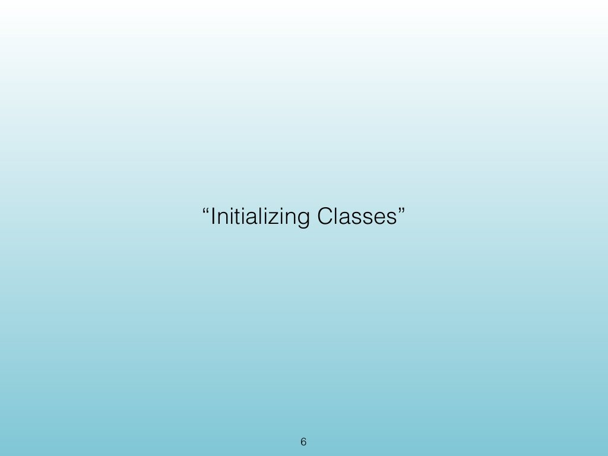
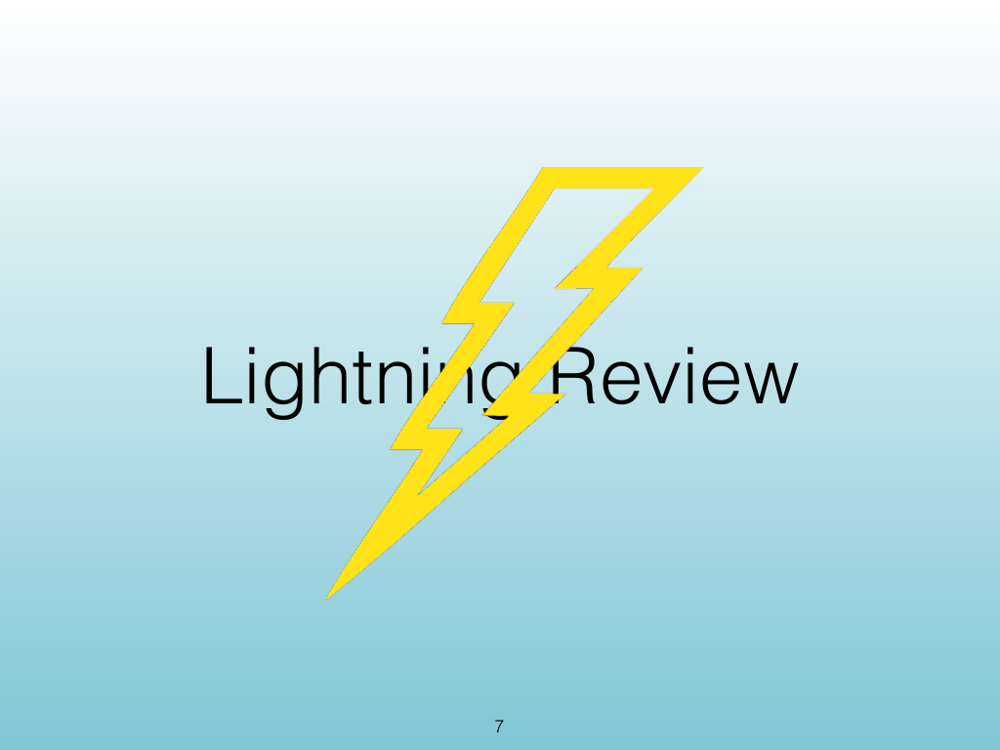
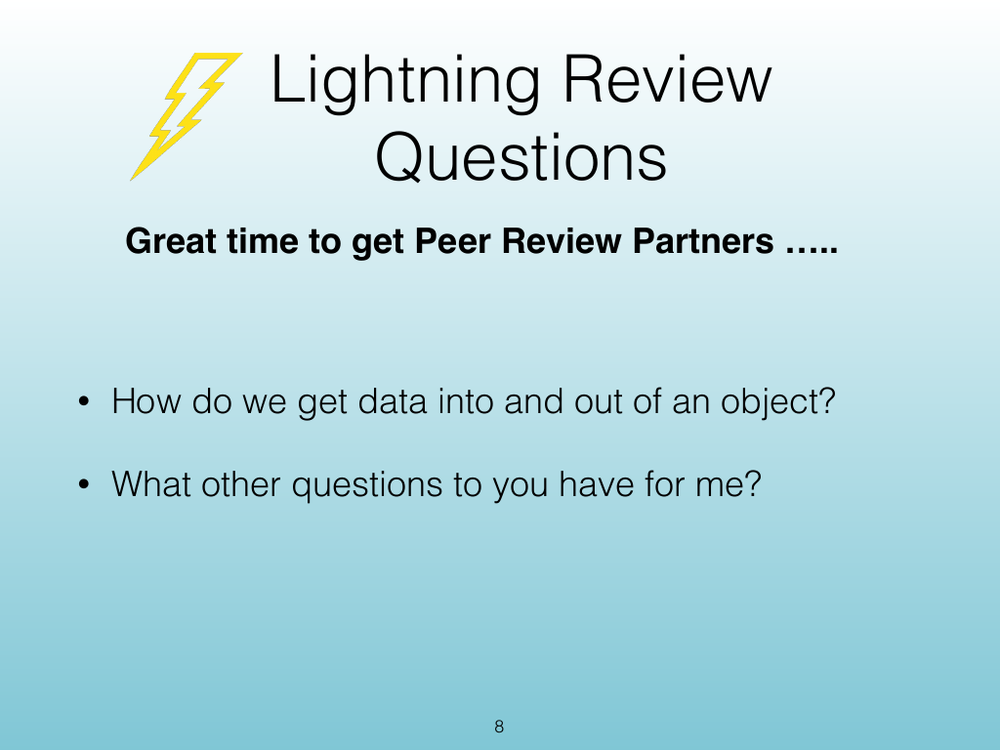
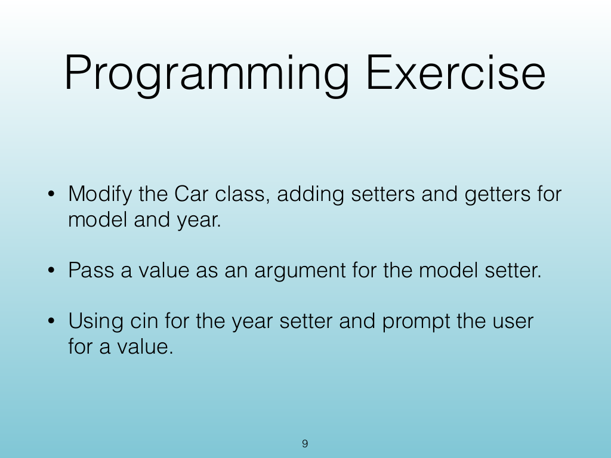
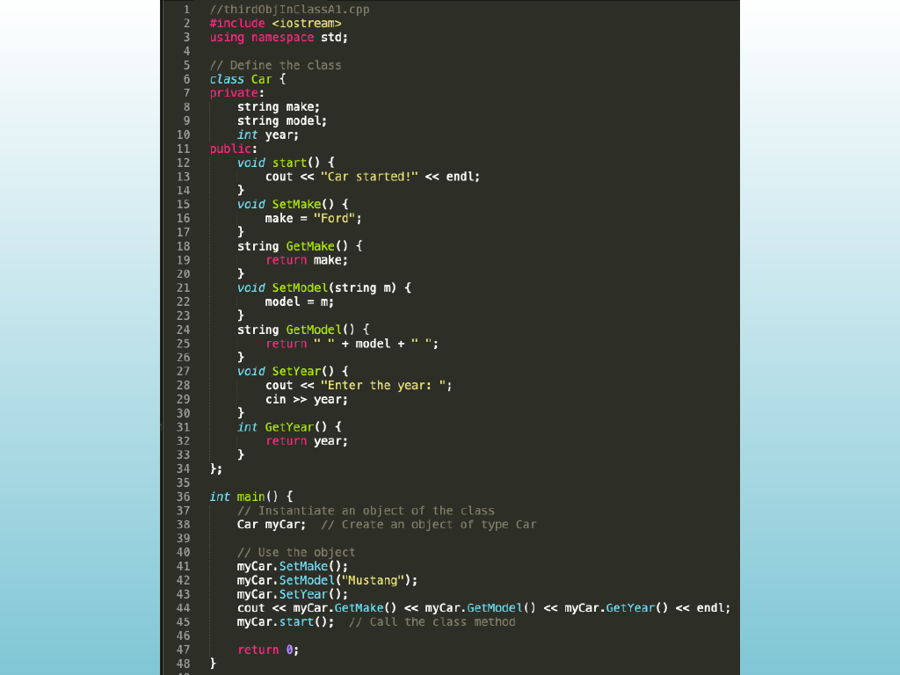
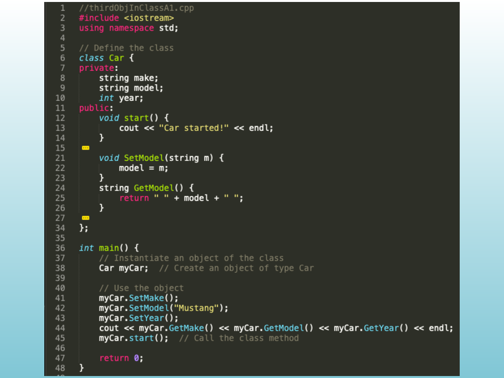
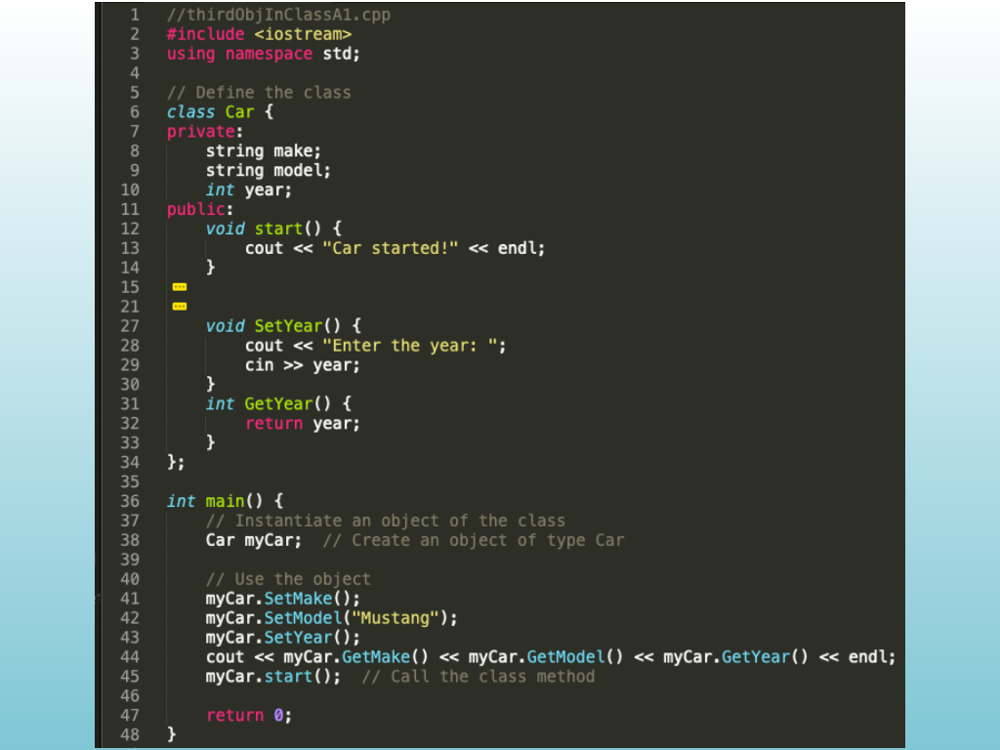
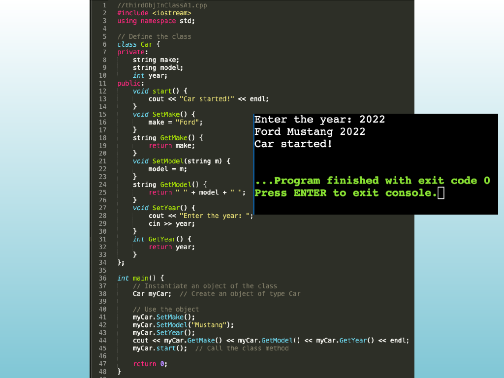

<!-- Topic: Class Initialization and Relationships -->
<!-- Slides 5–13 -->

# Class Initialization and Relationships

{width="100%" fig-alt="Class Initialization and Relationships"}

::: notes
Slides 5–13
Source slide 5 from the authoritative PDF.
:::

<!-- Slide 5 -->

---

## Source Slide 6

{width="100%" fig-alt="“Initializing Classes”"}

<!-- Slide 6 -->

---

## Source Slide 7

{width="100%" fig-alt="Lightning Review"}

<!-- Slide 7 -->

---

## Source Slide 8

{width="100%" fig-alt="Lightning Review"}

<!-- Slide 8 -->

---

## Source Slide 9

{width="100%" fig-alt="Programming Exercise"}

<!-- Slide 9 -->

---

## Source Slide 10

{width="100%" fig-alt="Source Slide 10"}

<!-- Slide 10 -->

---

## Source Slide 11

{width="100%" fig-alt="Source Slide 11"}

<!-- Slide 11 -->

---

## Source Slide 12

{width="100%" fig-alt="Source Slide 12"}

<!-- Slide 12 -->

---

## Source Slide 13

{width="100%" fig-alt="Source Slide 13"}

<!-- Slide 13 -->
